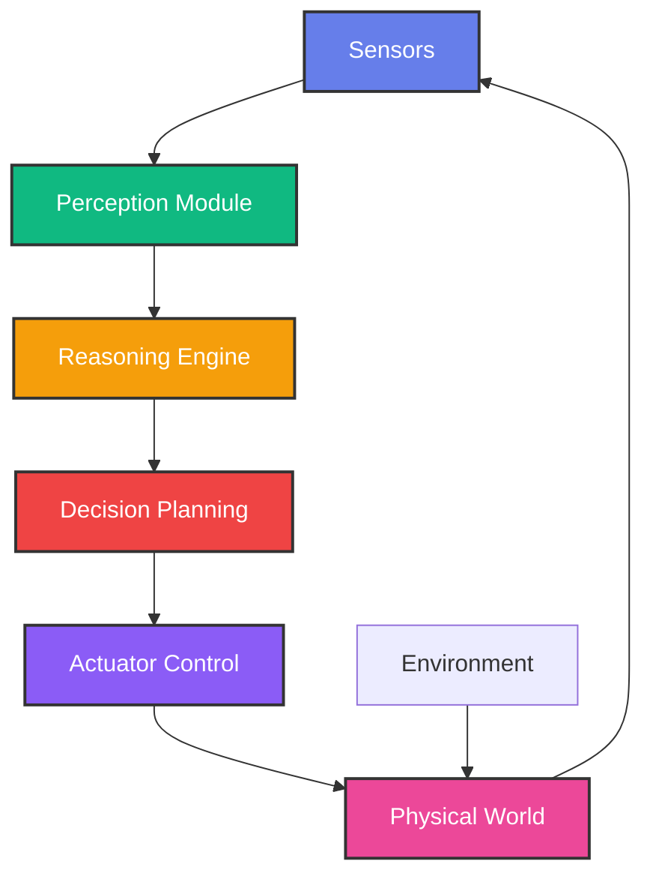
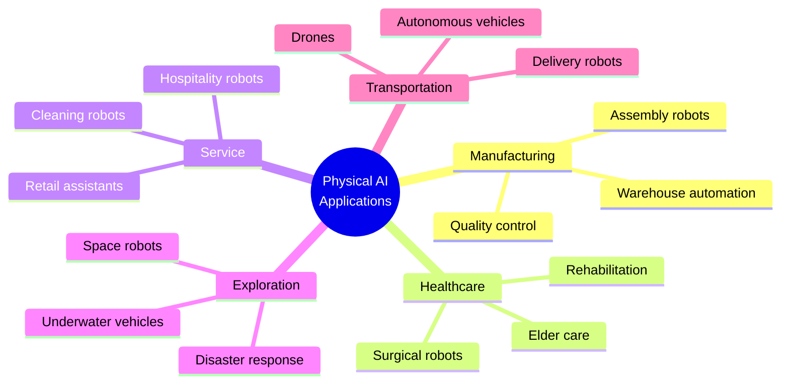
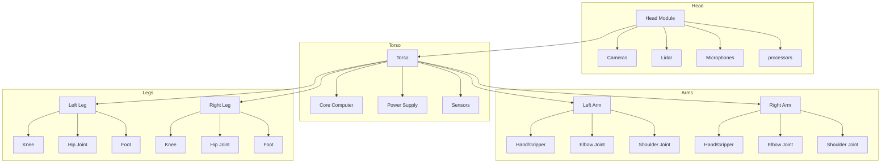
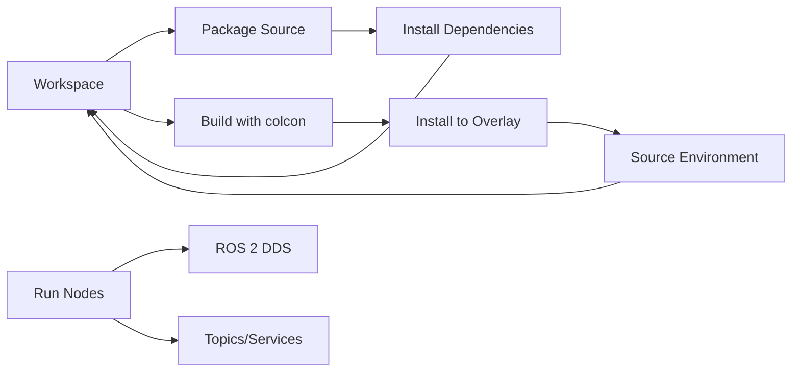
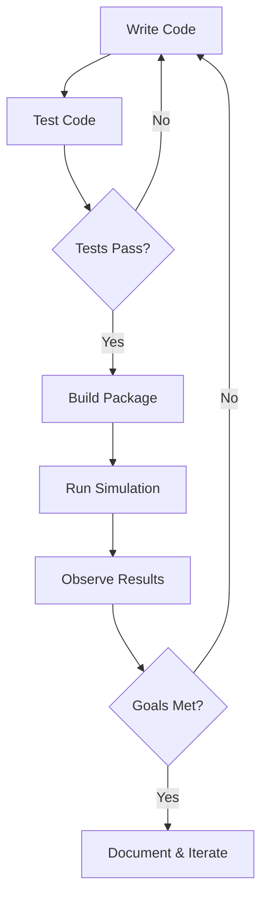

import PersonalizeButton from '@site/src/components/PersonalizeButton';
import TranslateButton from '@site/src/components/TranslateButton';
import CollapsibleCode from '@site/src/components/CollapsibleCode';
import InteractiveDiagram from '@site/src/components/InteractiveDiagram';
import SelfAssessment from '@site/src/components/SelfAssessment';

<div className="learning-objectives">
  <h4>Learning Objectives</h4>
  <ul>
    <li>Define Physical AI and distinguish it from software-only AI systems</li>
    <li>Identify key components of humanoid robots (sensors, actuators, processors)</li>
    <li>Set up a development environment with Python, ROS 2, and simulation tools</li>
    <li>Create and run your first robot simulation</li>
    <li>Understand the architecture of modern robotics systems</li>
  </ul>
</div>

## Prerequisites

Before starting this chapter, ensure you have:

- **Programming experience**: Intermediate Python or similar language
- **Basic mathematics**: Linear algebra, basic physics concepts
- **Operating system**: Ubuntu 22.04 or Windows with WSL2 (recommended)
- **Hardware**: For full experience: 8GB+ RAM, NVIDIA GPU (optional)

<PersonalizeButton />

<TranslateButton />

---

## 1. Introduction to Physical AI

### What is Physical AI?

**Physical AI** refers to artificial intelligence systems that interact with the physical world through sensors and actuators. Unlike software-only AI (like chatbots or image classifiers), Physical AI must perceive, reason about, and act in real-world environments.

<InteractiveDiagram
  title="Physical AI System Architecture"
  description="Components of a Physical AI system and their interactions"
  diagramId="physical-ai-arch"
>

</InteractiveDiagram>

### Physical AI vs Software AI

| Aspect | Software AI | Physical AI |
|--------|-------------|-------------|
| **Output** | Digital (text, images, predictions) | Physical actions (movement, manipulation) |
| **Feedback Loop** | Usually batch processing | Real-time closed-loop |
| **Latency Requirements** | Seconds acceptable | Milliseconds critical |
| **Safety Concerns** | Data privacy, bias | Physical harm, equipment damage |
| **Hardware Dependency** | Minimal | Sensors, actuators, compute |

### Brief History

<CollapsibleCode
  title="Timeline of Physical AI Milestones"
  language="text"
>
1940s-1960s: Early robotics (industrial arms)
1970s-1980s: First mobile robots (Shakey, Stanford Cart)
1990s: Pioneer robots, domestic robots (Robosapien)
2000s: Roomba, autonomous vehicles research
2010s: Deep learning + robotics (DeepMind, Boston Dynamics)
2020s: Large models + humanoid robots (Optimus, Figure)
</CollapsibleCode>

### Applications of Physical AI

<InteractiveDiagram
  title="Physical AI Application Domains"
  description="Major domains where Physical AI is making an impact"
  diagramId="application-domains"
>


</InteractiveDiagram>

---

## 2. Humanoid Robots: An Overview

### Anatomy of a Humanoid Robot

Humanoid robots are designed to mimic human physical structure. Key components include:

<InteractiveDiagram
  title="Humanoid Robot Anatomy"
  description="Key anatomical components of a humanoid robot"
  diagramId="humanoid-anatomy"
>

</InteractiveDiagram>

### Key Components

#### Sensors
- **Vision**: RGB cameras, depth sensors, lidar
- **Touch**: Force/torque sensors, tactile sensors
- **Proprioception**: Joint encoders, IMUs
- **Audio**: Microphone arrays

#### Actuators
- **Servo motors**: Precise angular control
- **Hydraulic actuators**: High force applications
- **Artificial muscles**: Soft robotics approaches

#### Processors
- **Edge computing**: Local processing (NVIDIA Jetson, Google Coral)
- **Cloud integration**: Heavy computation offloading
- **Real-time controllers**: Low-latency motor control

### Famous Humanoid Robots

<CollapsibleCode
  title="Notable Humanoid Robots"
  language="text"
>
Boston Dynamics Atlas
- Purpose: Research platform for dynamic locomotion
- Height: 5 feet
- Notable: Parkour, backflips

Tesla Optimus (擎天柱)
- Purpose: General-purpose humanoid
- Height: 5'8"
- Notable: Mass production focus

Engineered Arts Ameca
- Purpose: Human-robot interaction research
- Notable: Extremely realistic facial expressions

Agility Robotics Cassie
- Purpose: Bipedal locomotion research
- Notable: Dynamic running gaits
</CollapsibleCode>

---

## 3. Setting Up Your Development Environment

### Python 3.10+ Installation

<CollapsibleCode
  title="Install Python on Ubuntu 22.04"
  language="bash"
>
```bash
# Update package list
sudo apt update && sudo apt upgrade -y

# Install Python and pip
sudo apt install -y python3.10 python3.10-venv python3-pip

# Verify installation
python3.10 --version

# Output: Python 3.10.x

# Create a virtual environment
python3.10 -m venv ~/physical-ai-env
source ~/physical-ai-env/bin/activate

# Upgrade pip
pip install --upgrade pip
```
</CollapsibleCode>

### ROS 2 Humble Installation

<InteractiveDiagram
  title="ROS 2 Development Flow"
  description="How ROS 2 components work together in development"
  diagramId="ros2-flow"
>

</InteractiveDiagram>

<CollapsibleCode
  title="Install ROS 2 Humble on Ubuntu 22.04"
  language="bash"
>
```bash
# Set locale
sudo locale-gen en_US en_US.UTF-8
sudo update-locale LC_ALL=en_US.UTF-8 LANG=en_US.UTF-8
export LANG=en_US.UTF-8

# Setup sources
sudo apt update && sudo apt install -y software-properties-common
sudo add-apt-repository universe

# Add ROS 2 GPG key
sudo curl -sSL https://raw.githubusercontent.com/ros/rosdistro/master/ros.key -o /usr/share/keyrings/ros-archive-keyring.gpg

# Add repository
echo "deb [arch=$(dpkg --print-architecture) signed-by=/usr/share/keyrings/ros-archive-keyring.gpg] http://packages.ros.org/ros2/ubuntu $(. /etc/osd && echo $UBUNTU_CODENAME) main" | sudo tee /etc/apt/sources.list.d/ros2.list > /dev/null

# Install ROS 2
sudo apt update
sudo apt install -y ros-humble-desktop

# Source ROS 2 in your shell
source /opt/ros/humble/setup.bash

# Add to .bashrc for persistence
echo "source /opt/ros/humble/setup.bash" >> ~/.bashrc

# Install additional tools
sudo apt install -y python3-colcon-common-extensions
```
</CollapsibleCode>

### Verifying Your ROS 2 Installation

<CollapsibleCode
  title="Verify ROS 2 Installation"
  language="bash"
>
```bash
# Check ROS 2 version
ros2 --version

# Expected output: ros2 command line tool

# List available commands
ros2 --help

# Run the demo talker
source /opt/ros/humble/setup.bash
ros2 run demo_nodes_cpp talker

# In another terminal, run the listener
source /opt/ros/humble/setup.bash
ros2 run demo_nodes_cpp listener

# You should see "I heard: [timestamp]" messages
```
</CollapsibleCode>

### Your First ROS 2 Node

<CollapsibleCode
  title="Create Your First ROS 2 Node"
  language="python"
>
```python
#!/usr/bin/env python3
"""
Simple ROS 2 node that publishes greeting messages.
This is your first step into Physical AI programming!
"""

import rclpy
from rclpy.node import Node
from std_msgs.msg import String


class GreetingNode(Node):
    """A simple ROS 2 node that publishes greetings."""

    def __init__(self):
        super().__init__('greeting_node')
        self.counter = 0

        # Create a publisher for String messages
        self.publisher = self.create_publisher(
            String,
            'greetings',
            10  # QoS history depth
        )

        # Create a timer to publish every second
        self.timer = self.create_timer(1.0, self.publish_greeting)

        self.get_logger().info('Greeting Node has been initialized!')

    def publish_greeting(self):
        """Publish a greeting message."""
        self.counter += 1
        msg = String()
        msg.data = f'Hello from ROS 2! Message #{self.counter}'

        self.publisher.publish(msg)
        self.get_logger().info(f'Publishing: "{msg.data}"')


def main(args=None):
    """Main entry point for the node."""
    rclpy.init(args=args)

    node = GreetingNode()

    try:
        rclpy.spin(node)
    except KeyboardInterrupt:
        pass
    finally:
        node.destroy_node()
        rclpy.shutdown()


if __name__ == '__main__':
    main()
```
</CollapsibleCode>

### Gazebo Fortress Setup

<CollapsibleCode
  title="Install Gazebo Fortress on Ubuntu 22.04"
  language="bash"
>
```bash
# Add OSRF repository
sudo apt update
sudo apt install -y wget gnupg
wget https://packages.osrfoundation.org/gazebo.pub.key -O - | sudo gpg --dearmor -o /usr/share/keyrings/gazebo-archive-keyring.gpg

echo "deb [arch=$(dpkg --print-architecture) signed-by=/usr/share/keyrings/gazebo-archive-keyring.gpg] http://packages.osrfoundation.org/gazebo/ubuntu $(. /etc/osd && echo $UBUNTU_CODENAME) main" | sudo tee /etc/apt/sources.list.d/gazebo.list > /dev/null

# Install Gazebo Fortress
sudo apt update
sudo apt install -y gz-fortress

# Verify installation
gz physics --version
gz sim --version
```
</CollapsibleCode>

### Create a Simple Robot in Gazebo

<CollapsibleCode
  title="Create a Simple Robot Model"
  language="xml"
>
```xml
<?xml version="1.0" ?>
<sdf version="1.11">
  <model name="simple_robot">
    <!-- Robot chassis -->
    <link name="chassis">
      <pose>0 0 0.1 0 0 0</pose>
      <collision name="collision">
        <geometry>
          <box>
            <size>0.5 0.3 0.1</size>
          </box>
        </geometry>
      </collision>
      <visual name="visual">
        <geometry>
          <box>
            <size>0.5 0.3 0.1</size>
          </box>
        </geometry>
        <material>
          <ambient>0.4 0.4 0.4 1</ambient>
          <diffuse>0.6 0.6 0.6 1</diffuse>
        </material>
      </visual>
    </link>

    <!-- Front wheel -->
    <link name="front_wheel">
      <pose>0.2 0 0.05 0 0 0</pose>
      <collision name="collision">
        <geometry>
          <cylinder>
            <radius>0.05</radius>
            <length>0.05</length>
          </cylinder>
        </geometry>
      </collision>
      <visual name="visual">
        <geometry>
          <cylinder>
            <radius>0.05</radius>
            <length>0.05</length>
          </cylinder>
        </geometry>
        <material>
          <ambient>0.2 0.2 0.2 1</ambient>
          <diffuse>0.3 0.3 0.3 1</diffuse>
        </material>
      </visual>
    </link>

    <!-- Rear wheel -->
    <link name="rear_wheel">
      <pose>-0.2 0 0.05 0 0 0</pose>
      <collision name="collision">
        <geometry>
          <cylinder>
            <radius>0.05</radius>
            <length>0.05</length>
          </cylinder>
        </geometry>
      </collision>
      <visual name="visual">
        <geometry>
          <cylinder>
            <radius>0.05</radius>
            <length>0.05</length>
          </cylinder>
        </geometry>
        <material>
          <ambient>0.2 0.2 0.2 1</ambient>
          <diffuse>0.3 0.3 0.3 1</diffuse>
        </material>
      </visual>
    </link>

    <!-- Joints -->
    <joint name="front_wheel_joint" type="revolute">
      <parent>chassis</parent>
      <child>front_wheel</child>
      <pose>0.2 0 0 0 0 0</pose>
      <axis>
        <xyz>0 1 0</xyz>
      </axis>
    </joint>

    <joint name="rear_wheel_joint" type="revolute">
      <parent>chassis</parent>
      <child>rear_wheel</child>
      <pose>-0.2 0 0 0 0 0</pose>
      <axis>
        <xyz>0 1 0</xyz>
      </axis>
    </joint>
  </model>
</sdf>
```
</CollapsibleCode>

---

## 4. Your First Robot Simulation

### Running a Complete Simulation

<InteractiveDiagram
  title="Development Workflow"
  description="From code to simulation execution"
  diagramId="dev-workflow"
>

</InteractiveDiagram>

<CollapsibleCode
  title="Run Your First Simulation"
  language="bash"
>
```bash
# Create a workspace
mkdir -p ~/ros2_ws/src
cd ~/ros2_ws

# Create a package
ros2 pkg create my_robot_pkg --dependencies rclpy std_msgs

# Create the node
cat > src/my_robot_pkg/my_robot_pkg/greeting_node.py << 'EOF'
# (Paste the greeting node code from above)
EOF

# Make executable
chmod +x src/my_robot_pkg/my_robot_pkg/greeting_node.py

# Build the workspace
colcon build

# Source the workspace
source install/setup.bash

# Run the node
ros2 run my_robot_pkg greeting_node
```
</CollapsibleCode>

---

## 5. Glossary

| Term | Definition |
|------|------------|
| **Actuator** | A component that converts energy into physical movement |
| **DDS** | Data Distribution Service - the communication middleware in ROS 2 |
| **Humanoid Robot** | A robot with human-like physical structure |
| **Inverse Kinematics** | Computing joint angles to reach a desired position |
| **Lidar** | Light Detection and Ranging - 3D sensing technology |
| **Node** | A process that performs computation in ROS 2 |
| **Physical AI** | AI systems that interact with the physical world |
| **QoS** | Quality of Service - controls message delivery in ROS 2 |
| **ROS 2** | Robot Operating System 2 - robotics software framework |
| **Sensor** | A device that detects physical properties |
| **Topic** | A named bus for message publication/subscription |

---

## 6. Self-Assessment Questions

<SelfAssessment
  title="Chapter 1 Knowledge Check"
  questions={[
    {
      id: 'q1',
      text: 'What is the primary characteristic that distinguishes Physical AI from software-only AI?',
      options: [
        'Physical AI uses deep learning',
        'Physical AI interacts with the physical world',
        'Physical AI runs on GPUs',
        'Physical AI is always humanoid'
      ],
      correctAnswer: 1,
      explanation: 'Physical AI is defined by its ability to perceive, reason about, and act in real-world environments through sensors and actuators.'
    },
    {
      id: 'q2',
      text: 'Which component of a humanoid robot converts electrical signals into physical movement?',
      options: [
        'Sensor',
        'Actuator',
        'Processor',
        'Lidar'
      ],
      correctAnswer: 1,
      explanation: 'Actuators convert energy (typically electrical) into physical movement, enabling the robot to act on its environment.'
    },
    {
      id: 'q3',
      text: 'What is the purpose of the DDS in ROS 2?',
      options: [
        'To compile C++ code',
        'Data distribution and communication',
        'To create 3D models',
        'To simulate physics'
      ],
      correctAnswer: 1,
      explanation: 'DDS (Data Distribution Service) is the communication middleware that handles message passing between ROS 2 nodes.'
    },
    {
      id: 'q4',
      text: 'What is a ROS 2 "node"?',
      options: [
        'A physical robot component',
        'A process that performs computation',
        'A type of sensor',
        'A programming language'
      ],
      correctAnswer: 1,
      explanation: 'In ROS 2, a node is a process that performs computation. Nodes communicate with each other through topics, services, and actions.'
    },
    {
      id: 'q5',
      text: 'Which tool is used to build ROS 2 packages?',
      options: [
        'CMake',
        'Make',
        'Colcon',
        'Bazel'
      ],
      correctAnswer: 2,
      explanation: 'Colcon (COLlection CONstruction) is the primary build tool for ROS 2 packages.'
    }
  ]}
/>

---

## 7. Further Reading

- [ROS 2 Documentation](https://docs.ros.org/en/humble/)
- [Gazebo Simulation](https://gazebosim.org/)
- [Boston Dynamics Atlas](https://www.bostondynamics.com/atlas)
- [ROS 2 Design Patterns](https://design.ros2.org/)

---

## 8. Chapter Summary

In this chapter, you learned:

1. **Physical AI** refers to AI systems that interact with the physical world through sensors and actuators
2. **Humanoid robots** have key components: sensors (perception), processors (reasoning), and actuators (action)
3. **ROS 2** is a flexible framework for writing robot software with nodes, topics, and services
4. **Gazebo** provides realistic 3D robot simulation
5. **Setting up your environment** is the first step to building Physical AI systems

You now have the foundation to explore more advanced topics in Physical AI and humanoid robotics!

---

*This chapter is part of the "Physical AI & Humanoid Robotics" book. Next: Chapter 2 - Robot Perception and Computer Vision*
