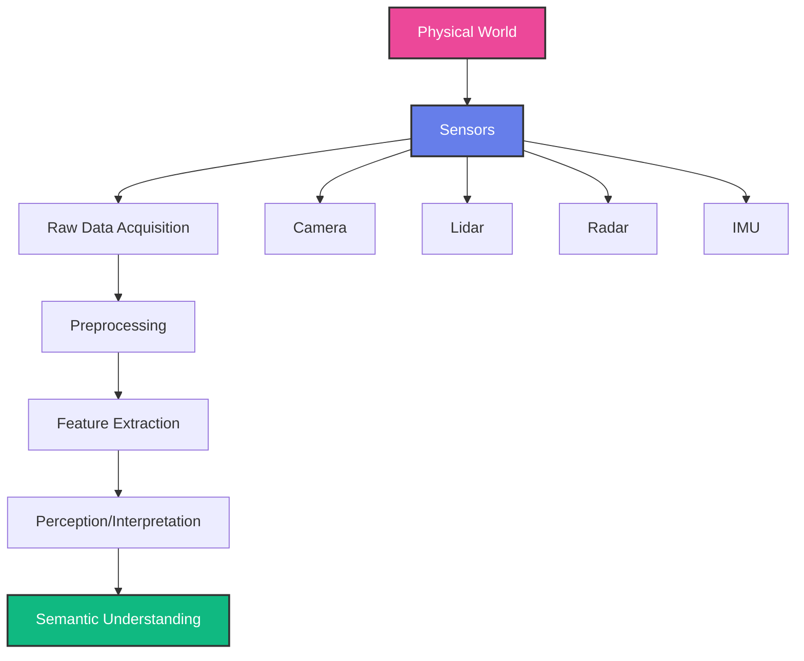
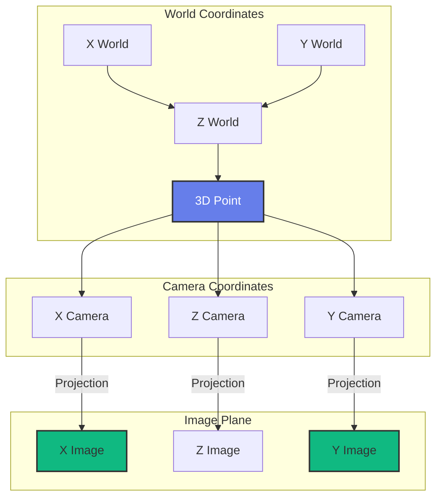
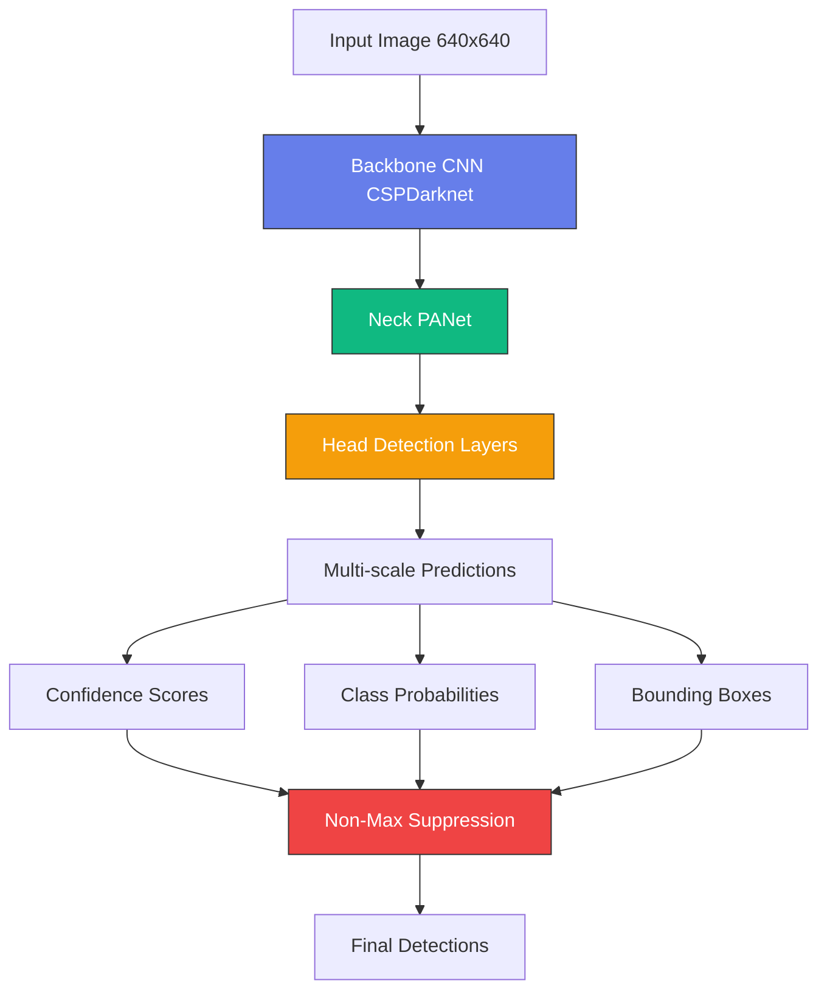
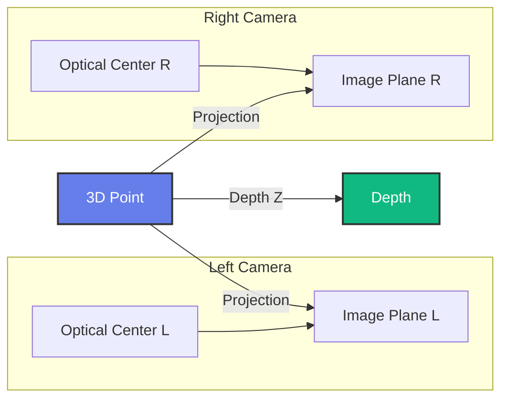
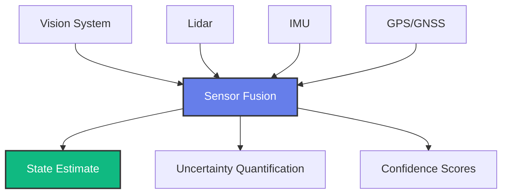

import PersonalizeButton from '@site/src/components/PersonalizeButton';
import TranslateButton from '@site/src/components/TranslateButton';
import CollapsibleCode from '@site/src/components/CollapsibleCode';
import InteractiveDiagram from '@site/src/components/InteractiveDiagram';
import SelfAssessment from '@site/src/components/SelfAssessment';

<div className="learning-objectives">
  <h4>Learning Objectives</h4>
  <ul>
    <li>Understand the robot perception pipeline from sensing to interpretation</li>
    <li>Master camera models, calibration, and geometric vision</li>
    <li>Implement basic image processing with OpenCV (filtering, edges, contours)</li>
    <li>Apply deep learning for real-time object detection (YOLO)</li>
    <li>Understand depth perception (stereo vision, RGB-D sensors)</li>
    <li>Implement hands-on vision projects for robotics applications</li>
  </ul>
</div>

## Prerequisites

- Chapter 1: Foundations of Physical AI & Humanoid Robotics
- Basic Python programming experience
- Understanding of linear algebra (matrices, vectors)
- Optional: Webcam for real-time exercises

<PersonalizeButton />
<TranslateButton />

---

## 1. Introduction to Robot Perception

### What is Robot Perception?

Robot perception is the process by which robots acquire, interpret, and understand information about their environment through sensors. Unlike humans who primarily use vision, robots can employ multiple sensing modalities including cameras, lidar, radar, and tactile sensors.

<InteractiveDiagram
  title="Robot Perception Pipeline"
  description="The complete pipeline from physical sensing to semantic understanding"
  diagramId="perception-pipeline"
>

</InteractiveDiagram>

### The Perception-Action Loop

Perception is not a standalone function - it's tightly coupled with action in a continuous loop:

<CollapsibleCode
  title="Perception-Action Cycle"
  language="text"
>
1. Sense: Robot acquires sensor data (images, point clouds, etc.)
2. Process: Raw data is cleaned, filtered, and transformed
3. Interpret: Features are matched against known concepts
4. Understand: Scene is reconstructed semantically
5. Decide: Action is planned based on understanding
6. Act: Robot executes the action
7. Observe: Effects are monitored through perception
8. Loop: Back to step 1
</CollapsibleCode>

### Sensor Types Overview

| Sensor | Data Type | Strengths | Weaknesses | Robotics Use |
|--------|-----------|-----------|------------|--------------|
| RGB Camera | 2D color images | Rich detail, low cost | No depth, lighting sensitive | Object recognition, navigation |
| Stereo Camera | 2D + depth | 3D at low cost | Calibration sensitive | Obstacle avoidance, SLAM |
| RGB-D (Kinect) | Color + depth | Direct 3D, fast | Indoor only, range limit | Manipulation, gesture recognition |
| Lidar | 3D point clouds | Long range, precise | Expensive, no color | Autonomous navigation |
| Event Camera | Temporal events | High speed, low latency | New, complex to process | High-speed tracking |

---

## 2. Camera Models and Calibration

### The Pinhole Camera Model

The pinhole camera model is the foundation of computer vision. It describes how 3D points in the world are projected onto a 2D image plane.

<InteractiveDiagram
  title="Pinhole Camera Geometry"
  description="Key parameters in the pinhole camera model"
  diagramId="camera-geometry"
>

</InteractiveDiagram>

### Key Parameters

<CollapsibleCode
  title="Camera Parameters"
  language="text"
>
INTRINSIC PARAMETERS (Internal to camera):
- Focal length (fx, fy): Distance from optical center to image plane
- Principal point (cx, cy): Optical center position on image plane
- Skew factor (s): Image plane shear (usually 0)

EXTRINSIC PARAMETERS (Camera pose in world):
- Rotation matrix (3x3): Camera orientation
- Translation vector (3x1): Camera position

These 9 parameters (4 intrinsic + 5 extrinsic) fully describe a calibrated camera.
</CollapsibleCode>

### Camera Calibration with OpenCV

<CollapsibleCode
  title="Camera Calibration with OpenCV"
  language="python"
>
```python
#!/usr/bin/env python3
"""
Camera calibration using OpenCV and a chessboard pattern.
Run this script to calibrate your camera.
"""

import cv2
import numpy as np
import glob

# Chessboard dimensions (inner corners)
CHECKERBOARD = (9, 6)  # 9x6 = 54 intersection points

# Prepare object points (0,0,0), (1,0,0), (2,0,0), ..., (8,5,0)
objp = np.zeros((CHECKERBOARD[0] * CHECKERBOARD[1], 3), np.float32)
objp[:, :2] = np.mgrid[0:CHECKERBOARD[0], 0:CHECKERBOARD[1]].T.reshape(-1, 2)

# Arrays to store object points and image points
obj_points = []  # 3D points in real world
img_points = []  # 2D points in image plane

# Get calibration images
images = glob.glob('calibration_images/*.jpg')

for fname in images:
    img = cv2.imread(fname)
    gray = cv2.cvtColor(img, cv2.COLOR_BGR2GRAY)

    # Find chessboard corners
    ret, corners = cv2.findChessboardCorners(gray, CHECKERBOARD, None)

    if ret:
        obj_points.append(objp)
        img_points.append(corners)

        # Draw and display corners
        cv2.drawChessboardCorners(img, CHECKERBOARD, corners, ret)
        cv2.imshow('Corners', img)
        cv2.waitKey(500)

cv2.destroyAllWindows()

# Calibrate camera
ret, mtx, dist, rvecs, tvecs = cv2.calibrateCamera(
    obj_points, img_points, gray.shape[::-1], None, None
)

print("Camera Matrix:")
print(mtx)
print("\nDistortion Coefficients:")
print(dist)
print("\nCalibration complete!")
print(f"Reprojection error: {ret:.4f}")
```
</CollapsibleCode>

### Using Calibration Results

<CollapsibleCode
  title="Undistort Images"
  language="python"
>
```python
#!/usr/bin/env python3
"""
Undistort images using calibration results.
"""

import cv2
import numpy as np

# Load calibration results (from previous script)
camera_matrix = np.array([[fx, 0, cx], [0, fy, cy], [0, 0, 1]], dtype=float)
distortion_coeffs = np.array([k1, k2, p1, p2, k3])

# Load an image
img = cv2.imread('calibrated_image.jpg')
h, w = img.shape[:2]

# Get optimal camera matrix
new_camera_matrix, roi = cv2.getOptimalNewCameraMatrix(
    camera_matrix, distortion_coeffs, (w, h), 1, (w, h)
)

# Undistort
undistorted = cv2.undistort(img, camera_matrix, distortion_coeffs, None, new_camera_matrix)

# Crop to ROI
x, y, w, h = roi
undistorted = undistorted[y:y+h, x:x+w]

cv2.imshow('Original', img)
cv2.imshow('Undistorted', undistorted)
cv2.waitKey(0)
```
</CollapsibleCode>

---

## 3. Image Processing Fundamentals

### Color Spaces

Different color spaces serve different purposes in robotics:

<CollapsibleCode
  title="Color Space Conversions"
  language="python"
>
```python
#!/usr/bin/env python3
"""
Color space conversions for robotics applications.
"""

import cv2
import numpy as np

# Load image
image = cv2.imread('robot_scene.jpg')

# Convert between color spaces
gray = cv2.cvtColor(image, cv2.COLOR_BGR2GRAY)
hsv = cv2.cvtColor(image, cv2.COLOR_BGR2HSV)
lab = cv2.cvtColor(image, cv2.COLOR_BGR2LAB)

# Color-based segmentation in HSV
# Find orange objects
lower_orange = np.array([5, 100, 100])
upper_orange = np.array([15, 255, 255])
mask = cv2.inRange(hsv, lower_orange, upper_orange)

# Find green objects (for robot grass field)
lower_green = np.array([40, 50, 50])
upper_green = np.array([80, 255, 255])
green_mask = cv2.inRange(hsv, lower_green, upper_green)

# Convert to grayscale for processing
gray = cv2.cvtColor(image, cv2.COLOR_BGR2GRAY)

# Apply CLAHE for better contrast
clahe = cv2.createCLAHE(clipLimit=2.0, tileGridSize=(8, 8))
enhanced = clahe.apply(gray)

print("Color spaces available in OpenCV:")
print("- GRAY, BGR, HSV, Lab, Luv, YCrCb, XYZ, HSV_FULL, HLS")
print(f"Original shape: {image.shape}")
print(f"Gray shape: {gray.shape}")
```
</CollapsibleCode>

### Image Filtering

Filtering removes noise and extracts features:

<CollapsibleCode
  title="Image Filtering Operations"
  language="python"
>
```python
#!/usr/bin/env python3
"""
Image filtering for robot vision.
"""

import cv2
import numpy as np

# Load image
image = cv2.imread('noisy_robot_image.jpg')
gray = cv2.cvtColor(image, cv2.COLOR_BGR2GRAY)

# 1. Gaussian Blur (removes high-frequency noise)
blurred = cv2.GaussianBlur(gray, (5, 5), 0)

# 2. Median Filter (good for salt-and-pepper noise)
median = cv2.medianBlur(gray, 5)

# 3. Bilateral Filter (preserves edges while smoothing)
bilateral = cv2.bilateralFilter(gray, 9, 75, 75)

# 4. Sharpening (enhance edges)
kernel_sharpen = np.array([
    [-1, -1, -1],
    [-1,  9, -1],
    [-1, -1, -1]
])
sharpened = cv2.filter2D(gray, -1, kernel_sharpen)

# 5. Morphological operations (shape processing)
kernel = np.ones((5, 5), np.uint8)
erosion = cv2.erode(gray, kernel, iterations=1)
dilation = cv2.dilate(gray, kernel, iterations=1)
opening = cv2.morphologyEx(gray, cv2.MORPH_OPEN, kernel)
closing = cv2.morphologyEx(gray, cv2.MORPH_CLOSE, kernel)

print("Filtering complete!")
print(f"Original: {gray.dtype}, Range: [{gray.min()}, {gray.max()}]")
print(f"Blurred: {blurred.dtype}, Range: [{blurred.min()}, {blurred.max()}]")
```
</CollapsibleCode>

### Edge Detection

Edges are fundamental for robot navigation and object recognition:

<CollapsibleCode
  title="Edge Detection Methods"
  language="python"
>
```python
#!/usr/bin/env python3
"""
Edge detection for robot vision.
"""

import cv2
import numpy as np

# Load image
image = cv2.imread('robot_environment.jpg')
gray = cv2.cvtColor(image, cv2.COLOR_BGR2GRAY)

# 1. Sobel Edge Detection
sobel_x = cv2.Sobel(gray, cv2.CV_64F, 1, 0, ksize=3)
sobel_y = cv2.Sobel(gray, cv2.CV_64F, 0, 1, ksize=3)
sobel_magnitude = np.sqrt(sobel_x**2 + sobel_y**2)
sobel_direction = np.arctan2(sobel_y, sobel_x)

# 2. Laplacian (second derivative)
laplacian = cv2.Laplacian(gray, cv2.CV_64F)

# 3. Canny Edge Detection (multi-stage)
edges_canny = cv2.Canny(gray, 50, 150)  # low_threshold, high_threshold

# 4. Canny with automatic threshold (Otsu's method)
_, thresh = cv2.threshold(gray, 0, 255, cv2.THRESH_BINARY + cv2.THRESH_OTSU)
edges_canny_auto = cv2.Canny(thresh, 0.5 * _, _)

# Find contours in Canny output
contours, hierarchy = cv2.findContours(edges_canny, cv2.RETR_TREE, cv2.CHAIN_APPROX_SIMPLE)

# Draw contours
contour_image = image.copy()
cv2.drawContours(contour_image, contours, -1, (0, 255, 0), 2)

print("Edge detection complete!")
print(f"Canny found {len(contours)} contours")
print(f"Largest contour area: {cv2.contourArea(max(contours, key=cv2.contourArea))}")

# Save results
cv2.imwrite('edges_canny.jpg', edges_canny)
cv2.imwrite('contours.jpg', contour_image)
```
</CollapsibleCode>

---

## 4. Object Detection and Recognition

### From Traditional to Deep Learning

<InteractiveDiagram
  title="YOLO Object Detection Architecture"
  description="Key components of the YOLO detection pipeline"
  diagramId="yolo-architecture"
>

</InteractiveDiagram>

### Real-time Object Detection with YOLO

<CollapsibleCode
  title="YOLO Object Detection"
  language="python"
>
```python
#!/usr/bin/env python3
"""
Real-time object detection using YOLOv8 for robotics.
"""

import cv2
from ultralytics import YOLO
import numpy as np

# Load pre-trained YOLOv8 model
model = YOLO('yolov8n.pt')  # 'n' for nano, also available: s, m, l, x

# Run inference on an image
results = model('robot_scene.jpg')

# Process results
for result in results:
    # Get annotated image
    annotated_frame = result.plot()

    # Access detections
    boxes = result.boxes
    for box in boxes:
        # Bounding box coordinates
        x1, y1, x2, y2 = box.xyxy[0].cpu().numpy()
        confidence = box.conf[0].cpu().numpy()
        class_id = box.cls[0].cpu().numpy()

        # Get class name
        class_name = model.names[int(class_id)]

        # Draw bounding box
        cv2.rectangle(annotated_frame,
                      (int(x1), int(y1)),
                      (int(x2), int(y2)),
                      (0, 255, 0), 2)

        # Add label
        label = f'{class_name}: {confidence:.2f}'
        cv2.putText(annotated_frame, label,
                    (int(x1), int(y1) - 10),
                    cv2.FONT_HERSHEY_SIMPLEX, 0.5, (0, 255, 0), 2)

    # Save result
    cv2.imwrite('detection_result.jpg', annotated_frame)

# Real-time detection from webcam
def detect_from_webcam():
    cap = cv2.VideoCapture(0)

    while cap.isOpened():
        ret, frame = cap.read()
        if not ret:
            break

        # Run detection
        results = model(frame, conf=0.5)

        # Plot results
        annotated_frame = results[0].plot()

        cv2.imshow('Robot Vision - Object Detection', annotated_frame)

        if cv2.waitKey(1) & 0xFF == ord('q'):
            break

    cap.release()
    cv2.destroyAllWindows()

# For robotics: Detect only relevant classes
ROBOT_RELEVANT_CLASSES = ['person', 'chair', 'bottle', 'cup', 'keyboard', 'mouse', 'cell phone']

def detect_for_robot(frame):
    """Detect objects relevant to robot manipulation."""
    results = model(frame, conf=0.5)

    detections = []
    for box in results[0].boxes:
        class_id = int(box.cls[0].cpu().numpy())
        class_name = model.names[class_id]

        if class_name in ROBOT_RELEVANT_CLASSES:
            detections.append({
                'class': class_name,
                'confidence': float(box.conf[0].cpu().numpy()),
                'bbox': box.xyxy[0].cpu().numpy().tolist()
            })

    return detections
```
</CollapsibleCode>

### Color-based Object Tracking

For simple robotics applications, color tracking can be very effective:

<CollapsibleCode
  title="Color-based Object Tracking"
  language="python"
>
```python
#!/usr/bin/env python3
"""
Color-based object tracking for robot vision.
Useful for simple manipulation tasks.
"""

import cv2
import numpy as np

class ColorTracker:
    """Track objects by color in real-time."""

    def __init__(self, hue_range, saturation_range, value_range):
        """
        Initialize with HSV color ranges.

        Args:
            hue_range: (min_hue, max_hue) - e.g., (0, 180) for full spectrum
            saturation_range: (min_sat, max_sat)
            value_range: (min_val, max_val)
        """
        self.lower_hsv = np.array([hue_range[0], saturation_range[0], value_range[0]])
        self.upper_hsv = np.array([hue_range[1], saturation_range[1], value_range[1]])

    def track(self, frame):
        """
        Track objects of the target color.

        Args:
            frame: BGR image from camera

        Returns:
            (x, y) center of tracked object, or None if not found
        """
        # Convert to HSV
        hsv = cv2.cvtColor(frame, cv2.COLOR_BGR2HSV)

        # Create mask for target color
        mask = cv2.inRange(hsv, self.lower_hsv, self.upper_hsv)

        # Apply morphological operations to clean up
        kernel = np.ones((5, 5), np.uint8)
        mask = cv2.morphologyEx(mask, cv2.MORPH_OPEN, kernel)
        mask = cv2.morphologyEx(mask, cv2.MORPH_CLOSE, kernel)

        # Find contours
        contours, _ = cv2.findContours(mask, cv2.RETR_EXTERNAL, cv2.CHAIN_APPROX_SIMPLE)

        if len(contours) == 0:
            return None, None, None

        # Find largest contour
        largest = max(contours, key=cv2.contourArea)
        area = cv2.contourArea(largest)

        if area < 500:  # Minimum area threshold
            return None, None, None

        # Get bounding box
        x, y, w, h = cv2.boundingRect(largest)
        center_x = x + w // 2
        center_y = y + h // 2

        return (center_x, center_y), (w, h), mask

    def draw_tracking(self, frame, center, size, mask):
        """Draw tracking visualization."""
        if center is None:
            return frame

        x, y = center
        w, h = size

        # Draw bounding box
        cv2.rectangle(frame, (x - w//2, y - h//2), (x + w//2, y + h//2),
                     (0, 255, 0), 2)

        # Draw center point
        cv2.circle(frame, (x, y), 5, (0, 0, 255), -1)

        return frame


# Example: Track a red ball
if __name__ == "__main__":
    tracker = ColorTracker(
        hue_range=(0, 10),      # Red color in HSV wraps around 0/180
        saturation_range=(100, 255),
        value_range=(100, 255)
    )

    cap = cv2.VideoCapture(0)

    while cap.isOpened():
        ret, frame = cap.read()
        if not ret:
            break

        center, size, mask = tracker.track(frame)
        frame = tracker.draw_tracking(frame, center, size, mask)

        cv2.imshow('Color Tracking', frame)

        if cv2.waitKey(1) & 0xFF == ord('q'):
            break

    cap.release()
    cv2.destroyAllWindows()
```
</CollapsibleCode>

---

## 5. Depth Perception

### Stereo Vision Principles

<InteractiveDiagram
  title="Stereo Vision Geometry"
  description="How disparity relates to depth in stereo vision"
  diagramId="stereo-geometry"
>

</InteractiveDiagram>

<CollapsibleCode
  title="Stereo Depth Estimation"
  language="python"
>
```python
#!/usr/bin/env python3
"""
Stereo depth estimation using OpenCV.
"""

import cv2
import numpy as np

def compute_disparity(left_img, right_img, num_disparities=64, block_size=11):
    """
    Compute disparity map from stereo images.

    Args:
        left_img: Left grayscale image
        right_img: Right grayscale image
        num_disparities: Number of disparity values (must be divisible by 16)
        block_size: Matched block size (odd)

    Returns:
        disparity: Disparity map
        depth: Approximate depth map
    """
    # Create stereo matcher
    stereo = cv2.StereoBM_create(
        numDisparities=num_disparities,
        blockSize=block_size
    )

    # Compute disparity
    disparity = stereo.compute(left_img, right_img)

    # Normalize for display
    disparity_normalized = cv2.normalize(disparity, None, 0, 255,
                                         cv2.NORM_MINMAX, cv2.CV_8U)

    # Convert to depth (approximate)
    # Depth = focal_length * baseline / disparity
    focal_length = 700  # pixels (depends on camera calibration)
    baseline = 0.06  # meters (distance between cameras)
    depth = (focal_length * baseline) / (disparity + 0.0001)

    return disparity, depth, disparity_normalized


def create_depth_colormap(depth):
    """Create color-coded depth map."""
    # Normalize depth
    depth_normalized = cv2.normalize(depth, None, 0, 255,
                                     cv2.NORM_MINMAX, cv2.CV_8U)

    # Apply colormap (JET colormap shows close=blue, far=red)
    depth_colored = cv2.applyColorMap(depth_normalized, cv2.COLORMAP_JET)

    return depth_colored


# Example usage with synthetic images
if __name__ == "__main__":
    # In real usage, load calibrated stereo images
    # left_img = cv2.imread('stereo_left.jpg', 0)
    # right_img = cv2.imread('stereo_right.jpg', 0)

    # For demo, create synthetic images
    left_img = np.random.randint(0, 256, (480, 640), dtype=np.uint8)
    right_img = np.random.randint(0, 256, (480, 640), dtype=np.uint8)

    disparity, depth, disparity_vis = compute_disparity(left_img, right_img)
    depth_colored = create_depth_colormap(depth)

    print("Stereo processing complete!")
    print(f"Disparity range: [{disparity.min()}, {disparity.max()}]")
    print(f"Depth range: [{depth.min():.2f}, {depth.max():.2f}] meters")

    cv2.imwrite('disparity.jpg', disparity_vis)
    cv2.imwrite('depth_colored.jpg', depth_colored)
```
</CollapsibleCode>

### RGB-D Sensors

For many robotics applications, RGB-D sensors like Intel RealSense or Microsoft Kinect are preferred:

<CollapsibleCode
  title="RGB-D Point Cloud Processing"
  language="python"
>
```python
#!/usr/bin/env python3
"""
Process RGB-D data from sensors like RealSense or Kinect.
"""

import cv2
import numpy as np

class RGBDProcessor:
    """Process RGB-D images for robotics."""

    def __init__(self, camera_matrix):
        """
        Initialize with camera intrinsics.

        Args:
            camera_matrix: 3x3 camera matrix from calibration
        """
        self.K = camera_matrix
        self.fx = camera_matrix[0, 0]
        self.fy = camera_matrix[1, 1]
        self.cx = camera_matrix[0, 2]
        self.cy = camera_matrix[1, 2]

    def depth_to_pointcloud(self, depth_image):
        """
        Convert depth image to point cloud.

        Args:
            depth_image: H x W depth map in meters

        Returns:
            points: N x 3 array of 3D points
        """
        h, w = depth_image.shape
        x, y = np.meshgrid(np.arange(w), np.arange(h))

        # Normalize to camera coordinates
        x_norm = (x - self.cx) / self.fx
        y_norm = (y - self.cy) / self.fy

        # Compute 3D coordinates
        X = x_norm * depth_image
        Y = y_norm * depth_image
        Z = depth_image

        # Stack into point cloud
        points = np.column_stack([X.flatten(), Y.flatten(), Z.flatten()])

        # Remove invalid points (zero depth)
        valid = Z.flatten() > 0
        points = points[valid]

        return points

    def filter_pointcloud(self, points, x_range, y_range, z_range):
        """Filter point cloud by axis-aligned bounding box."""
        x_valid = (points[:, 0] >= x_range[0]) & (points[:, 0] <= x_range[1])
        y_valid = (points[:, 1] >= y_range[0]) & (points[:, 1] <= y_range[1])
        z_valid = (points[:, 2] >= z_range[0]) & (points[:, 2] <= z_range[1])

        return points[x_valid & y_valid & z_valid]

    def get_plane_coefficients(self, points):
        """Fit a plane to point cloud (for floor detection)."""
        # Use RANSAC for robust fitting
        from scipy import optimize

        def plane_error(coeffs, xyz):
            a, b, c, d = coeffs
            x, y, z = xyz.T
            return (a*x + b*y + c*z + d) / np.sqrt(a**2 + b**2 + c**2)

        # Initial guess
        coeffs0 = [0, 0, 1, 0]

        # Optimize
        result = optimize.least_squares(
            plane_error, coeffs0, args=(points,)
        )

        return result.x

    def segment_table_top(self, depth_image, color_image):
        """
        Segment objects on a table surface.

        Returns:
            masks, bounding_boxes for each object
        """
        # Get point cloud
        points = self.depth_to_pointcloud(depth_image)

        # Filter to table region (approximate)
        # This is simplified - real implementation would use RANSAC plane fitting
        table_points = self.filter_pointcloud(
            points, [-1, 1], [-1, 1], [0.3, 0.8]
        )

        # Find clusters (simplified)
        # Real implementation would use DBSCAN or Euclidean clustering
        print(f"Table region has {len(table_points)} points")

        return table_points


# Example: Process RealSense data
if __name__ == "__main__":
    # Camera matrix from calibration
    K = np.array([[616.0, 0, 325.0],
                  [0, 616.0, 365.0],
                  [0, 0, 1.0]])

    processor = RGBDProcessor(K)

    # In real usage:
    # depth = cv2.imread('depth.png', -1) / 1000.0  # Convert mm to meters
    # color = cv2.imread('color.jpg')

    print("RGB-D processor initialized!")
```
</CollapsibleCode>

---

## 6. Sensor Fusion

### Combining Multiple Perception Sources

<InteractiveDiagram
  title="Sensor Fusion Architecture"
  description="How multiple sensors are combined for robust perception"
  diagramId="sensor-fusion"
>

</InteractiveDiagram>

<CollapsibleCode
  title="Simple Kalman Filter for Sensor Fusion"
  language="python"
>
```python
#!/usr/bin/env python3
"""
Simple Kalman filter for sensor fusion in robotics.
Fuses vision and IMU measurements for better tracking.
"""

import numpy as np

class KalmanFilter:
    """Simple Kalman filter for 1D tracking."""

    def __init__(self, process_noise=0.1, measurement_noise=1.0):
        """
        Initialize Kalman filter.

        Args:
            process_noise: Process noise variance (Q)
            measurement_noise: Measurement noise variance (R)
        """
        # State: [position, velocity]
        self.state = np.zeros(2)
        self.P = np.eye(2)  # State covariance

        # Process model: x_k = x_{k-1} + v * dt
        self.F = np.array([[1, 1],   # position = prev_position + velocity
                          [0, 1]])  # velocity = prev_velocity

        # Measurement model: z_k = position
        self.H = np.array([[1, 0]])

        # Noise covariances
        self.Q = np.array([[process_noise/3, process_noise/2],
                          [process_noise/2, process_noise]]) * 0.01
        self.R = measurement_noise

    def predict(self, dt=1.0):
        """Predict next state."""
        # Update F with time step
        self.F[0, 1] = dt

        # Predict
        self.state = self.F @ self.state
        self.P = self.F @ self.P @ self.F.T + self.Q

        return self.state[0], self.state[1]

    def update(self, measurement):
        """
        Update with new measurement.

        Args:
            measurement: Observed position
        """
        # Innovation
        y = measurement - self.H @ self.state
        S = self.H @ self.P @ self.H.T + self.R

        # Kalman gain
        K = self.P @ self.H.T @ np.linalg.inv(S)

        # Update state
        self.state = self.state + K @ y
        self.P = (np.eye(2) - K @ self.H) @ self.P

        return self.state[0]


class SensorFusion:
    """Fuse multiple sensor measurements using Kalman filters."""

    def __init__(self):
        self.kalman = KalmanFilter(process_noise=0.1, measurement_noise=1.0)

        # Sensor weights (based on confidence)
        self.weights = {
            'vision': 0.6,
            'imu': 0.3,
            'gps': 0.1
        }

    def fuse_sensors(self, vision_pos=None, imu_vel=None, gps_pos=None):
        """
        Fuse measurements from multiple sensors.

        Returns:
            Fused state estimate
        """
        # Predict
        pos, vel = self.kalman.predict()

        # Weighted update based on available measurements
        measurements = []
        if vision_pos is not None:
            measurements.append(('vision', vision_pos, self.weights['vision']))
        if gps_pos is not None:
            measurements.append(('gps', gps_pos, self.weights['gps']))

        if measurements:
            # Weighted average of measurements
            fused_measurement = sum(
                m[1] * m[2] for m in measurements
            ) / sum(m[2] for m in measurements)

            # Update Kalman filter
            pos = self.kalman.update(fused_measurement)

        # Apply IMU velocity if available
        if imu_vel is not None:
            pos += imu_vel * 0.1  # Assume 100ms time step

        return pos, vel


# Example usage
if __name__ == "__main__":
    fusion = SensorFusion()

    # Simulate noisy measurements
    true_position = 0
    for t in range(100):
        true_position += 1  # Object moving

        # Noisy vision measurement
        vision_measurement = true_position + np.random.normal(0, 2.0)

        # IMU velocity estimate
        imu_velocity = 1.0 + np.random.normal(0, 0.1)

        # Update sensor fusion
        pos, vel = fusion.fuse_sensors(
            vision_pos=vision_measurement,
            imu_vel=imu_velocity
        )

        if t % 10 == 0:
            print(f"Time {t}: True={true_position:.1f}, "
                  f"Vision={vision_measurement:.1f}, Fused={pos:.1f}")

    print("\nSensor fusion complete!")
```
</CollapsibleCode>

---

## 7. Hands-on Projects

### Project 1: Color-based Robot Navigation

<CollapsibleCode
  title="Robot Navigation by Color"
  language="python"
>
```python
#!/usr/bin/env python3
"""
Robot navigation using color detection.
The robot follows a colored path or avoids obstacles of a certain color.
"""

import cv2
import numpy as np

class ColorNavigator:
    """Navigate robot based on color detection."""

    def __init__(self, target_hsv_range, camera_index=0):
        self.cap = cv2.VideoCapture(camera_index)
        self.target_range = target_hsv_range
        self.frame_width = 640
        self.frame_height = 480
        self.cap.set(cv2.CAP_PROP_FRAME_WIDTH, self.frame_width)
        self.cap.set(cv2.CAP_PROP_FRAME_HEIGHT, self.frame_height)

    def detect_target(self, frame):
        """Detect target color region."""
        hsv = cv2.cvtColor(frame, cv2.COLOR_BGR2HSV)
        mask = cv2.inRange(hsv, *self.target_range)

        # Clean up mask
        kernel = np.ones((5, 5), np.uint8)
        mask = cv2.morphologyEx(mask, cv2.MORPH_OPEN, kernel)
        mask = cv2.morphologyEx(mask, cv2.MORPH_CLOSE, kernel)

        # Find contours
        contours, _ = cv2.findContours(mask, cv2.RETR_EXTERNAL, cv2.CHAIN_APPROX_SIMPLE)

        if not contours:
            return None, None, None

        # Get largest contour
        largest = max(contours, key=cv2.contourArea)
        if cv2.contourArea(largest) < 500:
            return None, None, None

        # Get centroid
        M = cv2.moments(largest)
        if M['m00'] == 0:
            return None, None, None

        cx = int(M['m10'] / M['m00'])
        cy = int(M['m01'] / M['m00'])

        return (cx, cy), mask, largest

    def get_navigation_command(self, target_center):
        """Convert target position to navigation command."""
        if target_center is None:
            return 'STOP', 0

        cx, cy = target_center
        frame_center = self.frame_width // 2

        # Horizontal steering
        error = cx - frame_center
        turn_rate = error / frame_center  # -1 to 1

        # Movement based on vertical position
        if cy < self.frame_height * 0.3:
            command = 'FORWARD'
            speed = 0.5
        elif cy > self.frame_height * 0.7:
            command = 'BACKWARD'
            speed = 0.3
        else:
            command = 'STOP'
            speed = 0

        # Turning
        if turn_rate < -0.1:
            turn = 'LEFT'
        elif turn_rate > 0.1:
            turn = 'RIGHT'
        else:
            turn = 'STRAIGHT'

        return f"{command} + {turn}", speed

    def run(self):
        """Main loop for navigation."""
        while True:
            ret, frame = self.cap.read()
            if not ret:
                break

            target_center, mask, contour = self.detect_target(frame)

            # Draw visualization
            vis = frame.copy()
            if target_center:
                cv2.circle(vis, target_center, 10, (0, 255, 0), -1)
                cv2.drawContours(vis, [contour], -1, (255, 0, 0), 2)

            # Get navigation command
            cmd, speed = self.get_navigation_command(target_center)

            # Display info
            cv2.putText(vis, f"Target: {target_center}", (10, 30),
                       cv2.FONT_HERSHEY_SIMPLEX, 0.7, (0, 255, 0), 2)
            cv2.putText(vis, f"Command: {cmd} (speed={speed})", (10, 60),
                       cv2.FONT_HERSHEY_SIMPLEX, 0.7, (0, 255, 0), 2)

            cv2.imshow('Robot Navigation', vis)

            if cv2.waitKey(1) & 0xFF == ord('q'):
                break

        self.cap.release()
        cv2.destroyAllWindows()


# Example: Follow green objects (for following a green line)
if __name__ == "__main__":
    navigator = ColorNavigator(
        target_hsv_range=(np.array([40, 50, 50]), np.array([80, 255, 255]))
    )
    print("Starting color-based navigation...")
    print("Press 'q' to quit")
    navigator.run()
```
</CollapsibleCode>

---

## 8. Glossary

| Term | Definition |
|------|------------|
| **Camera Calibration** | Process of determining camera parameters (intrinsics/extrinsics) |
| **CNN** | Convolutional Neural Network - deep learning architecture for images |
| **Depth Map** | 2D image where each pixel value represents distance to surface |
| **Disparity** | Horizontal offset between corresponding points in stereo images |
| **Intrinsics** | Camera parameters describing internal geometry (focal length, principal point) |
| **Extrinsics** | Camera pose (rotation, translation) in world coordinates |
| **YOLO** | You Only Look Once - real-time object detection algorithm |
| **Point Cloud** | Set of 3D points in space, often from depth sensors |
| **Sensor Fusion** | Combining data from multiple sensors for improved perception |
| **Kalman Filter** | Recursive estimator for fusing noisy measurements |

---

## 9. Self-Assessment Questions

<SelfAssessment
  title="Chapter 2 Knowledge Check"
  questions={[
    {
      id: 'q1',
      text: 'What are the three main stages of the robot perception pipeline?',
      options: [
        'Sensing, Processing, Action',
        'Sensing, Processing, Interpretation',
        'Input, Output, Feedback',
        'Detection, Classification, Localization'
      ],
      correctAnswer: 1,
      explanation: 'The perception pipeline is: Sensing (acquire data), Processing (clean & transform), Interpretation (understand scene).'
    },
    {
      id: 'q2',
      text: 'What does the camera matrix contain?',
      options: [
        'Camera position and orientation',
        'Focal length and principal point',
        'Distortion coefficients',
        'All of the above'
      ],
      correctAnswer: 1,
      explanation: 'The 3x3 camera matrix contains focal lengths (fx, fy) and principal point (cx, cy) - the intrinsic parameters.'
    },
    {
      id: 'q3',
      text: 'Why do we use Canny edge detection instead of just thresholding?',
      options: [
        'Canny is faster',
        'Canny produces thinned, connected edges',
        'Canny works only with color images',
        'Canny requires less memory'
      ],
      correctAnswer: 1,
      explanation: 'Canny edge detection produces thin, connected edges through non-maximum suppression, unlike simple thresholding.'
    },
    {
      id: 'q4',
      text: 'In stereo vision, what is the relationship between disparity and depth?',
      options: [
        'Disparity is proportional to depth',
        'Disparity is inversely proportional to depth',
        'They are unrelated',
        'Disparity equals depth'
      ],
      correctAnswer: 1,
      explanation: 'Depth = (focal_length * baseline) / disparity. Higher disparity means closer objects.'
    },
    {
      id: 'q5',
      text: 'What is the main advantage of sensor fusion?',
      options: [
        'Lower cost',
        'Improved robustness and accuracy',
        'Simpler algorithms',
        'Faster processing'
      ],
      correctAnswer: 1,
      explanation: 'Sensor fusion combines strengths of multiple sensors to overcome individual weaknesses, improving overall perception.'
    }
  ]}
/>

---

## 10. Further Reading

- [OpenCV Python Tutorials](https://docs.opencv.org/master/d6/d00/tutorial_py_root.html)
- [Ultralytics YOLOv8 Documentation](https://docs.ultralytics.com/)
- [PyTorch Computer Vision Tutorials](https://pytorch.org/tutorials/)
- [Intel RealSense SDK Documentation](https://www.intel.com/content/www/us/en/developer/articles/technical/realsense-sdk.html)

---

## 11. Chapter Summary

In this chapter, you learned:

1. **Robot Perception Pipeline**: From physical sensing to semantic understanding
2. **Camera Models**: Pinhole camera geometry, calibration, and intrinsics
3. **Image Processing**: Filtering, edge detection, and morphological operations
4. **Object Detection**: From traditional methods to YOLO deep learning
5. **Depth Perception**: Stereo vision, RGB-D sensors, and point clouds
6. **Sensor Fusion**: Kalman filtering for robust state estimation

You now have the foundation to build perception systems for your robots!

---

*This chapter is part of the "Physical AI & Humanoid Robotics" book. Next: Chapter 3 - Robot Motion and Control*
