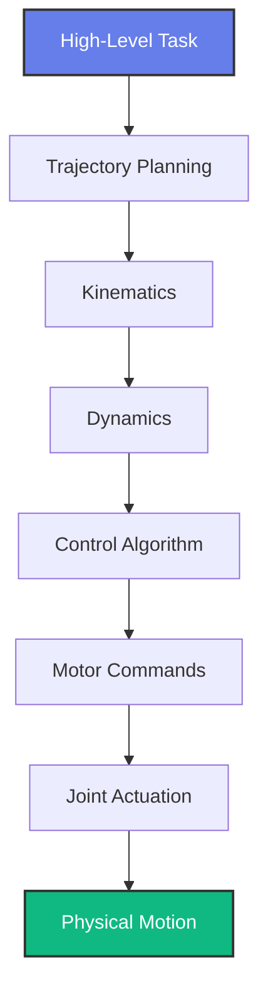
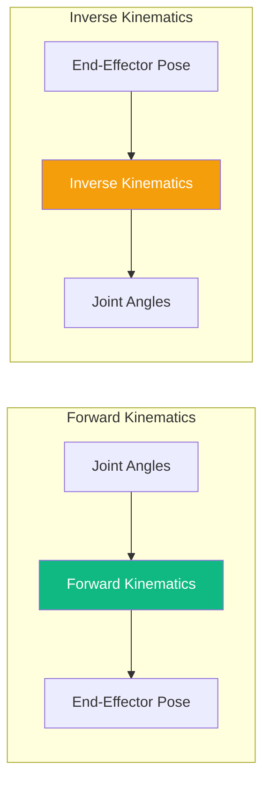
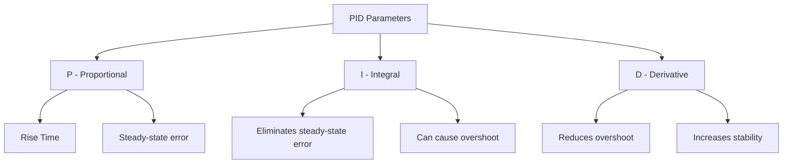

import PersonalizeButton from '@site/src/components/PersonalizeButton';
import TranslateButton from '@site/src/components/TranslateButton';
import CollapsibleCode from '@site/src/components/CollapsibleCode';
import InteractiveDiagram from '@site/src/components/InteractiveDiagram';
import SelfAssessment from '@site/src/components/SelfAssessment';

<div className="learning-objectives">
  <h4>Learning Objectives</h4>
  <ul>
    <li>Understand forward and inverse kinematics using DH parameters</li>
    <li>Implement PID controllers for motor regulation</li>
    <li>Generate smooth trajectories for robot motion</li>
    <li>Apply dynamics concepts to robot control</li>
    <li>Integrate motion control with ROS 2</li>
  </ul>
</div>

## Prerequisites

- Chapters 1-2 (Physical AI foundations, Perception)
- Basic calculus and linear algebra
- Understanding of mechanical systems

<PersonalizeButton />
<TranslateButton />

---

## 1. Introduction to Robot Motion

### The Importance of Motion Control

Robot motion control is the heart of physical intelligence. After perception tells the robot what's in the environment, motion control determines how to move through it.

<InteractiveDiagram
  title="Robot Motion Control Pipeline"
  description="From high-level goals to low-level motor commands"
  diagramId="motion-pipeline"
>

</InteractiveDiagram>

### Types of Robot Motion

| Type | Description | Examples |
|------|-------------|----------|
| **Point-to-Point** | Move between two configurations | Pick and place |
| **Continuous Path** | Follow a precise path | Arc welding, painting |
| **Coordinated** | Multiple joints move together | Walking, manipulation |
| **Adaptive** | Reacts to environment | Walking on uneven terrain |

---

## 2. Robot Kinematics

### Forward Kinematics

Forward kinematics answers: "Where is the end-effector given joint positions?"

<CollapsibleCode
  title="Forward Kinematics with DH Parameters"
  language="python"
>
```python
#!/usr/bin/env python3
"""
Forward Kinematics using Denavit-Hartenberg parameters.
"""

import numpy as np
import math

class ForwardKinematics:
    """Compute forward kinematics for robotic arms."""

    def __init__(self, dh_params):
        """
        Initialize with DH parameters.

        Args:
            dh_params: List of [theta, d, a, alpha] for each joint
        """
        self.dh_params = dh_params  # [theta, d, a, alpha]
        self.n_joints = len(dh_params)

    def transform_matrix(self, theta, d, a, alpha):
        """
        Create DH transformation matrix.

        Returns 4x4 homogeneous transformation matrix.
        """
        c = math.cos(theta)
        s = math.sin(theta)
        ca = math.cos(alpha)
        sa = math.sin(alpha)

        T = np.array([
            [c, -s * ca,  s * sa, a * c],
            [s,  c * ca, -c * sa, a * s],
            [0,     sa,     ca,      d],
            [0,      0,      0,      1]
        ])
        return T

    def compute_fk(self, joint_positions):
        """
        Compute forward kinematics.

        Args:
            joint_positions: List of joint angles (radians)

        Returns:
            4x4 transformation matrix of end-effector
        """
        T_total = np.eye(4)

        for i, theta in enumerate(joint_positions):
            # Get DH parameters (theta is modified by joint position)
            theta_i, d_i, a_i, alpha_i = self.dh_params[i]

            # Apply joint offset to theta
            theta_actual = theta_i + theta

            # Compute transformation
            T_i = self.transform_matrix(theta_actual, d_i, a_i, alpha_i)
            T_total = T_total @ T_i

        return T_total

    def get_position(self, joint_positions):
        """Extract 3D position from FK result."""
        T = self.compute_fk(joint_positions)
        return T[0:3, 3]  # Extract translation

    def get_orientation(self, joint_positions):
        """Extract orientation (rotation matrix) from FK result."""
        T = self.compute_fk(joint_positions)
        return T[0:3, 0:3]  # Extract rotation


# Example: 2-Link Planar Arm
if __name__ == "__main__":
    # DH parameters for 2-link arm
    # [theta_offset, d, a, alpha]
    dh_params = [
        [0, 0,     0.3, 0],      # Joint 1
        [0, 0,     0.25, 0],     # Joint 2
    ]

    fk = ForwardKinematics(dh_params)

    # Test with some joint positions
    test_angles = [math.pi/4, math.pi/6]  # 45° and 30°

    position = fk.get_position(test_angles)
    orientation = fk.get_orientation(test_angles)
    T = fk.compute_fk(test_angles)

    print("2-Link Arm Forward Kinematics")
    print("=" * 40)
    print(f"Joint angles: {test_angles}")
    print(f"End-effector position: {position}")
    print(f"\nTransformation matrix:\n{T}")
```
</CollapsibleCode>

### Inverse Kinematics

Inverse kinematics answers: "What joint angles put the end-effector at a desired pose?"

<CollapsibleCode
  title="Inverse Kinematics for 2-Link Arm"
  language="python"
>
```python
#!/usr/bin/env python3
"""
Inverse Kinematics using geometric approach.
For 2-link planar arm with analytical solution.
"""

import numpy as np
import math


class InverseKinematics:
    """Solve inverse kinematics for 2-link planar arm."""

    def __init__(self, link1_length, link2_length):
        self.l1 = link1_length
        self.l2 = link2_length
        self.reach = self.l1 + self.l2

    def solve(self, x, y, elbow_up=True):
        """
        Solve IK for 2-link arm.

        Args:
            x, y: Desired end-effector position
            elbow_up: Choose elbow-up or elbow-down solution

        Returns:
            (theta1, theta2) joint angles in radians
            or None if position unreachable
        """
        # Distance to target
        dist = math.sqrt(x**2 + y**2)

        # Check reachability
        if dist > self.reach or dist < abs(self.l1 - self.l2):
            return None  # Unreachable

        # Law of cosines for elbow angle
        cos_theta2 = (x**2 + y**2 - self.l1**2 - self.l2**2) / (2 * self.l1 * self.l2)

        # Clamp for numerical stability
        cos_theta2 = max(-1.0, min(1.0, cos_theta2))

        # Two solutions for elbow
        theta2_elbow_up = math.acos(cos_theta2)
        theta2_elbow_down = -theta2_elbow_up

        # Choose solution
        theta2 = theta2_elbow_up if elbow_up else theta2_elbow_down

        # Compute theta1
        k1 = self.l1 + self.l2 * math.cos(theta2)
        k2 = self.l2 * math.sin(theta2)
        theta1 = math.atan2(y, x) - math.atan2(k2, k1)

        return (theta1, theta2)

    def solve_all(self, x, y):
        """Get all possible solutions."""
        solutions = []

        sol1 = self.solve(x, y, elbow_up=True)
        sol2 = self.solve(x, y, elbow_up=False)

        if sol1:
            solutions.append(("Elbow Up", sol1))
        if sol2:
            solutions.append(("Elbow Down", sol2))

        return solutions


# Example with visualization
if __name__ == "__main__":
    arm = InverseKinematics(link1_length=0.3, link2_length=0.25)

    # Desired position
    x, y = 0.35, 0.25

    print("Inverse Kinematics for 2-Link Arm")
    print("=" * 40)
    print(f"Target position: ({x}, {y})")

    solutions = arm.solve_all(x, y)

    if solutions:
        for name, (t1, t2) in solutions:
            print(f"\n{name} solution:")
            print(f"  Joint 1: {math.degrees(t1):.1f}°")
            print(f"  Joint 2: {math.degrees(t2):.1f}°")
    else:
        print("Position unreachable!")
```
</CollapsibleCode>

<InteractiveDiagram
  title="Kinematics Relationship"
  description="Forward vs Inverse Kinematics"
  diagramId="kinematics-comparison"
>

</InteractiveDiagram>

---

## 3. PID Control

### Understanding PID

PID (Proportional-Integral-Derivative) control is the workhorse of robot motion control.

<CollapsibleCode
  title="PID Controller Implementation"
  language="python"
>
```python
#!/usr/bin/env python3
"""
PID Controller for Robot Motor Control.
"""

import numpy as np
import matplotlib.pyplot as plt


class PIDController:
    """Proportional-Integral-Derivative Controller."""

    def __init__(self, kp=1.0, ki=0.0, kd=0.0,
                 output_limits=None, sample_time=0.01):
        """
        Initialize PID controller.

        Args:
            kp: Proportional gain
            ki: Integral gain
            kd: Derivative gain
            output_limits: (min, max) output limits
            sample_time: Control loop period in seconds
        """
        self.kp = kp
        self.ki = ki
        self.kd = kd

        self.output_limits = output_limits
        self.sample_time = sample_time

        # State
        self._last_error = 0.0
        self._integral = 0.0
        self._last_output = 0.0

    def compute(self, setpoint, measurement, dt=None):
        """
        Compute PID output.

        Args:
            setpoint: Desired value
            measurement: Current value
            dt: Time step (uses sample_time if None)

        Returns:
            Control output
        """
        if dt is None:
            dt = self.sample_time

        # Compute error
        error = setpoint - measurement

        # Proportional term
        P = self.kp * error

        # Integral term (with anti-windup)
        self._integral += error * dt
        I = self.ki * self._integral

        # Derivative term (on measurement to avoid derivative kick)
        D = self.kd * (error - self._last_error) / dt
        self._last_error = error

        # Total output
        output = P + I + D

        # Apply output limits
        if self.output_limits:
            output = np.clip(output, self.output_limits[0], self.output_limits[1])

        self._last_output = output
        return output

    def reset(self):
        """Reset controller state."""
        self._last_error = 0.0
        self._integral = 0.0
        self._last_output = 0.0


class MotorSimulator:
    """Simulate a DC motor with PID control."""

    def __init__(self, J=0.01, b=0.1, K=0.01, R=1.0, L=0.5):
        """
        Motor parameters.
        J: Moment of inertia
        b: Damping coefficient
        K: Motor constant
        R: Resistance
        L: Inductance
        """
        self.J = J
        self.b = b
        self.K = K
        self.R = R
        self.L = L

        self.velocity = 0.0
        self.position = 0.0

    def step(self, voltage, dt):
        """
        Simulate one time step.

        Args:
            voltage: Input voltage
            dt: Time step
        """
        # Motor dynamics
        # J * dω/dt = K*i - b*ω
        # L * di/dt = V - R*i - K*ω

        # Assume current reaches steady state quickly
        i = voltage / self.R

        # Angular acceleration
        alpha = (self.K * i - self.b * self.velocity) / self.J

        # Update state
        self.velocity += alpha * dt
        self.position += self.velocity * dt

        return self.velocity, self.position


def tune_pid(motor, pid, setpoint, duration=2.0, dt=0.001):
    """Tune PID by simulation."""
    times = np.arange(0, duration, dt)
    velocities = []
    positions = []
    setpoints = []

    for t in times:
        # PID control
        vel, pos = motor.velocity, motor.position
        voltage = pid.compute(setpoint, vel, dt)

        # Motor step
        motor.step(voltage, dt)

        velocities.append(motor.velocity)
        positions.append(motor.position)
        setpoints.append(setpoint)

    return times, velocities, positions, setpoints


if __name__ == "__main__":
    print("PID Controller for Robot Motor Control")
    print("=" * 50)

    # Create motor and controller
    motor = MotorSimulator()
    pid = PIDController(kp=0.5, ki=0.1, kd=0.1,
                        output_limits=(-10, 10))

    # Run simulation
    times, velocities, positions, setpoints = tune_pid(
        motor, pid, setpoint=5.0, duration=2.0
    )

    print(f"Final velocity: {velocities[-1]:.2f} rad/s")
    print(f"Final position: {positions[-1]:.2f} rad")
    print(f"Setpoint: {setpoints[-1]} rad/s")
```
</CollapsibleCode>

### PID Tuning

<InteractiveDiagram
  title="PID Tuning Effects"
  description="How each term affects system response"
  diagramId="pid-tuning"
>

</InteractiveDiagram>

---

## 4. Trajectory Planning

### Polynomial Trajectories

Smooth trajectories are essential for precise robot motion:

<CollapsibleCode
  title="Polynomial Trajectory Generation"
  language="python">
```python
#!/usr/bin/env python3
"""
Trajectory Planning for Robot Motion.
Generate smooth position, velocity, and acceleration profiles.
"""

import numpy as np
import matplotlib.pyplot as plt


class TrajectoryGenerator:
    """Generate smooth trajectories using polynomials."""

    def quintic_polynomial(self, t, T, q0, qf, v0, vf, a0, af):
        """
        Quintic (5th order) polynomial for smooth motion.

        Ensures zero velocity and acceleration at start and end.

        Args:
            t: Current time
            T: Total trajectory duration
            q0, qf: Initial and final positions
            v0, vf: Initial and final velocities
            a0, af: Initial and final accelerations

        Returns:
            Position, velocity, acceleration at time t
        """
        # Coefficients for quintic polynomial
        # q(t) = a0 + a1*t + a2*t^2 + a3*t^3 + a4*t^4 + a5*t^5

        # Boundary conditions
        T2 = T * T
        T3 = T2 * T
        T4 = T3 * T
        T5 = T4 * T

        a0 = q0
        a1 = v0
        a2 = a0 / 2

        # Solve for remaining coefficients
        A = np.array([
            [T3, T4, T5],
            [3*T2, 4*T3, 5*T4],
            [6*T, 12*T2, 20*T3]
        ])

        B = np.array([
            qf - q0 - v0*T - a0*T2/2,
            vf - v0 - a0*T,
            af - a0
        ])

        a3, a4, a5 = np.linalg.solve(A, B)

        # Evaluate polynomial
        t2 = t * t
        t3 = t2 * t
        t4 = t3 * t
        t5 = t4 * t

        q = a0 + a1*t + a2*t2 + a3*t3 + a4*t4 + a5*t5
        v = a1 + 2*a2*t + 3*a3*t2 + 4*a4*t3 + 5*a5*t4
        a = 2*a2 + 6*a3*t + 12*a4*t2 + 20*a5*t3

        return q, v, a

    def generate_trajectory(self, waypoints, durations):
        """
        Generate full trajectory through waypoints.

        Args:
            waypoints: List of [position, velocity] at each waypoint
            durations: List of times between waypoints

        Returns:
            Time, position, velocity, acceleration arrays
        """
        times = [0]
        positions = [waypoints[0][0]]
        velocities = [waypoints[0][1]]

        for i in range(len(waypoints) - 1):
            q0, v0 = waypoints[i]
            qf, vf = waypoints[i + 1]
            T = durations[i]

            # Generate segment
            for t in np.linspace(0, T, 100):
                q, v, a = self.quintic_polynomial(t, T, q0, qf, v0, vf, 0, 0)
                times.append(times[-1] + t)
                positions.append(q)
                velocities.append(v)

        return np.array(times), np.array(positions), np.array(velocities)


class JointTrajectory:
    """Plan multi-joint trajectories."""

    def __init__(self, n_joints):
        self.n_joints = n_joints
        self.trajectory_generator = TrajectoryGenerator()

    def plan_to_pose(self, start_config, end_config, duration=1.0, n_points=100):
        """
        Plan trajectory from start to end configuration.

        Args:
            start_config: List of starting joint angles
            end_config: List of ending joint angles
            duration: Trajectory duration in seconds
            n_points: Number of trajectory points

        Returns:
            Dictionary with time, positions, velocities, accelerations
        """
        times = np.linspace(0, duration, n_points)

        # Generate trajectory for each joint
        trajectory = {
            'time': times,
            'positions': np.zeros((n_points, self.n_joints)),
            'velocities': np.zeros((n_points, self.n_joints)),
            'accelerations': np.zeros((n_points, self.n_joints))
        }

        for j in range(self.n_joints):
            q, v, a = self.trajectory_generator.quintic_polynomial(
                times, duration,
                start_config[j], end_config[j],
                0, 0, 0, 0
            )
            trajectory['positions'][:, j] = q
            trajectory['velocities'][:, j] = v
            trajectory['accelerations'][:, j] = a

        return trajectory


if __name__ == "__main__":
    print("Trajectory Planning for Robot Motion")
    print("=" * 50)

    # Plan trajectory for 3-joint arm
    planner = JointTrajectory(n_joints=3)

    start = [0, 0, 0]
    end = [math.pi/2, math.pi/4, -math.pi/6]

    trajectory = planner.plan_to_pose(start, end, duration=2.0)

    print(f"Trajectory points: {len(trajectory['time'])}")
    print(f"Start config: {start}")
    print(f"End config: {end}")
    print(f"Max velocity: {np.max(np.abs(trajectory['velocities'])):.2f} rad/s")
    print(f"Max acceleration: {np.max(np.abs(trajectory['accelerations'])):.2f} rad/s²")
```
</CollapsibleCode>

---

## 5. ROS 2 Joint Control

<CollapsibleCode
  title="ROS 2 Joint Position Controller"
  language="python">
```python
#!/usr/bin/env python3
"""
ROS 2 Joint Control Example.
Control robot joints using ROS 2 and rclpy.
"""

import rclpy
from rclpy.node import Node
from std_msgs.msg import Float64MultiArray
from sensor_msgs.msg import JointState
from trajectory_msgs.msg import JointTrajectory, JointTrajectoryPoint


class JointController(Node):
    """ROS 2 node for joint position control."""

    def __init__(self):
        super().__init__('joint_controller')

        # Publishers
        self.trajectory_pub = self.create_publisher(
            JointTrajectory,
            '/joint_trajectory_controller/joint_trajectory',
            10
        )

        # Subscriber for joint states
        self.joint_sub = self.create_subscription(
            JointState,
            '/joint_states',
            self.joint_state_callback,
            10
        )

        self.current_joint_positions = None
        self.get_logger().info('Joint Controller initialized')

    def joint_state_callback(self, msg):
        """Handle incoming joint state updates."""
        self.current_joint_positions = list(msg.position)
        # self.get_logger().info(f'Current positions: {self.current_joint_positions}')

    def send_trajectory(self, positions, velocities=None, accelerations=None,
                        duration=1.0):
        """
        Send trajectory to robot.

        Args:
            positions: Target joint positions
            velocities: Target velocities (optional)
            accelerations: Target accelerations (optional)
            duration: Time to reach target in seconds
        """
        trajectory_msg = JointTrajectory()
        trajectory_msg.joint_names = ['joint_1', 'joint_2', 'joint_3']

        point = JointTrajectoryPoint()
        point.positions = positions
        point.velocities = velocities or [0.0] * len(positions)
        point.accelerations = accelerations or [0.0] * len(positions)
        point.time_from_start = rclpy.duration.Duration(seconds=duration).to_msg()

        trajectory_msg.points = [point]

        self.trajectory_pub.publish(trajectory_msg)
        self.get_logger().info(f'Sending trajectory: {positions}')


class JointTrajectoryRecorder(Node):
    """Record joint trajectories for learning."""

    def __init__(self):
        super().__init__('trajectory_recorder')

        self.trajectory = []
        self.recording = False

        self.sub = self.create_subscription(
            JointState,
            '/joint_states',
            self.joint_callback,
            10
        )

    def start_recording(self):
        """Start recording trajectory."""
        self.trajectory = []
        self.recording = True

    def stop_recording(self):
        """Stop recording and return trajectory."""
        self.recording = False
        return self.trajectory

    def joint_callback(self, msg):
        """Record joint states."""
        if self.recording:
            self.trajectory.append({
                'time': self.get_clock().now().to_msg(),
                'positions': list(msg.position),
                'velocities': list(msg.velocity)
            })


def main(args=None):
    """Main entry point."""
    rclpy.init(args=args)

    controller = JointController()

    try:
        # Example: Move to target position
        target_positions = [0.5, 0.3, -0.2]
        controller.send_trajectory(target_positions, duration=2.0)

        # Spin to receive callbacks
        rclpy.spin(controller)

    except KeyboardInterrupt:
        pass
    finally:
        controller.destroy_node()
        rclpy.shutdown()


if __name__ == '__main__':
    main()
```
</CollapsibleCode>

---

## 6. Hands-on Project: Motor Speed Controller

<CollapsibleCode
  title="Complete PID Motor Controller"
  language="python">
```python
#!/usr/bin/env python3
"""
Complete Motor Speed Controller with PID.
Simulate and test motor control for robotics applications.
"""

import numpy as np
import matplotlib.pyplot as plt


class MotorModel:
    """DC Motor model for simulation."""

    def __init__(self, J=0.01, b=0.1, K=0.01, R=1.0):
        self.J = J  # Moment of inertia
        self.b = b  # Damping
        self.K = K  # Motor constant
        self.R = R  # Resistance

        self.velocity = 0.0
        self.position = 0.0

    def step(self, voltage, dt):
        """Simulate one time step."""
        # Electrical: L*di/dt + R*i = V - K*omega
        # Assume L=0 (fast electrical dynamics)
        current = voltage / self.R

        # Mechanical: J*domega/dt = K*i - b*omega
        acceleration = (self.K * current - self.b * self.velocity) / self.J

        self.velocity += acceleration * dt
        self.position += self.velocity * dt

        return self.velocity, self.position


class PIDController:
    """PID Controller with anti-windup."""

    def __init__(self, kp, ki, kd, output_limit=10.0):
        self.kp = kp
        self.ki = ki
        self.kd = kd
        self.output_limit = output_limit

        self.integral = 0.0
        self.last_error = 0.0

    def compute(self, setpoint, measurement, dt):
        """Compute PID output."""
        error = setpoint - measurement

        # Proportional
        P = self.kp * error

        # Integral with anti-windup
        self.integral += error * dt
        I = self.ki * self.integral

        # Derivative
        derivative = (error - self.last_error) / dt
        D = self.kd * derivative
        self.last_error = error

        # Total
        output = P + I + D

        # Clamp output
        output = np.clip(output, -self.output_limit, self.output_limit)

        return output


def tune_motor(kp, ki, kd, setpoint=5.0, duration=3.0, dt=0.001):
    """Tune and test motor controller."""
    motor = MotorModel()
    pid = PIDController(kp, ki, kd)

    times = np.arange(0, duration, dt)
    velocities = []
    setpoints = []

    for t in times:
        vel, _ = motor.velocity, motor.position
        voltage = pid.compute(setpoint, vel, dt)
        motor.step(voltage, dt)

        velocities.append(motor.velocity)
        setpoints.append(setpoint)

    return times, velocities, setpoints


def test_different_pids():
    """Test different PID parameters."""
    test_cases = [
        ("P-only (kp=0.5)", 0.5, 0.0, 0.0),
        ("PI (kp=0.5, ki=0.5)", 0.5, 0.5, 0.0),
        ("PID (kp=0.5, ki=0.5, kd=0.1)", 0.5, 0.5, 0.1),
        ("Overdamped (kp=1.0, ki=0.1, kd=0.2)", 1.0, 0.1, 0.2),
    ]

    results = {}
    for name, kp, ki, kd in test_cases:
        times, velocities, setpoints = tune_motor(kp, ki, kd)
        results[name] = {
            'times': times,
            'velocities': velocities,
            'setpoints': setpoints
        }

    return results


if __name__ == "__main__":
    print("Motor Speed Controller with PID")
    print("=" * 50)

    # Test different PID values
    results = test_different_pids()

    for name, data in results.items():
        final_vel = data['velocities'][-1]
        settling_time = None
        for i, vel in enumerate(data['velocities']):
            if abs(vel - 5.0) < 0.05:
                settling_time = data['times'][i]
                break

        print(f"\n{name}:")
        print(f"  Final velocity: {final_vel:.2f} rad/s")
        if settling_time:
            print(f"  Settling time: {settling_time:.3f}s")
```
</CollapsibleCode>

---

## 7. Glossary

| Term | Definition |
|------|------------|
| **Kinematics** | Study of motion without considering forces |
| **Forward Kinematics** | Compute end-effector pose from joint angles |
| **Inverse Kinematics** | Compute joint angles for desired pose |
| **DH Parameters** | Denavit-Hartenberg - standard kinematic notation |
| **PID Control** | Proportional-Integral-Derivative feedback control |
| **Trajectory** | Time-parameterized path through configuration space |
| **Joint Space** | Space of all possible joint configurations |
| **Workspace** | Set of all reachable end-effector positions |

---

## 8. Self-Assessment Questions

<SelfAssessment
  title="Chapter 3 Knowledge Check"
  questions={[
    {
      id: 'q1',
      text: 'What does forward kinematics compute?',
      options: [
        'Joint angles from end-effector position',
        'End-effector position from joint angles',
        'Motor voltages from joint angles',
        'Trajectory from waypoints'
      ],
      correctAnswer: 1,
      explanation: 'Forward kinematics maps joint angles to end-effector pose.'
    },
    {
      id: 'q2',
      text: 'What is the main purpose of the integral term in PID?',
      options: [
        'Reduce overshoot',
        'Eliminate steady-state error',
        'Increase response speed',
        'Smooth the output'
      ],
      correctAnswer: 1,
      explanation: 'The integral term accumulates past errors to eliminate steady-state offset.'
    },
    {
      id: 'q3',
      text: 'What order polynomial ensures zero velocity at start and end?',
      options: [
        'Linear (1st order)',
        'Quadratic (2nd order)',
        'Cubic (3rd order)',
        'Quintic (5th order)'
      ],
      correctAnswer: 3,
      explanation: 'Quintic polynomials can enforce zero velocity AND acceleration at boundaries.'
    },
    {
      id: 'q4',
      text: 'What does DH stand for in robot kinematics?',
      options: [
        'Dynamic Hardware',
        'Denavit-Hartenberg',
        'Digital Hydrodynamics',
        'Distributed Harmonics'
      ],
      correctAnswer: 1,
      explanation: 'Denavit-Hartenberg parameters are the standard notation for robot kinematics.'
    }
  ]}
/>

---

## 9. Further Reading

- [ROS 2 Control Documentation](https://control.ros.org/)
- [Modern Robotics: Mechanics, Planning, and Control](https://hades.mech.northwestern.edu/index.php/Modern_Robotics)
- [PID Controller Tuning Guide](https://en.wikipedia.org/wiki/PID_controller#Manual_tuning)

---

## 10. Chapter Summary

In this chapter, you learned:

1. **Forward Kinematics**: Computing end-effector pose from joint angles
2. **Inverse Kinematics**: Solving for joint angles to reach desired poses
3. **PID Control**: Implementing motor control with proportional, integral, derivative terms
4. **Trajectory Planning**: Generating smooth motion profiles with polynomials
5. **ROS 2 Integration**: Controlling robot joints with ROS 2

You now have the foundation to build controlled robot motion systems!

---

*This chapter is part of the "Physical AI & Humanoid Robotics" book. Next: Chapter 4 - Machine Learning for Robotics*
