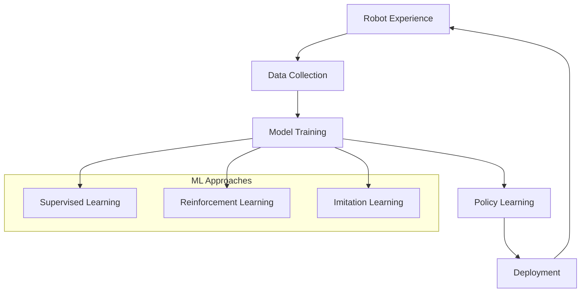
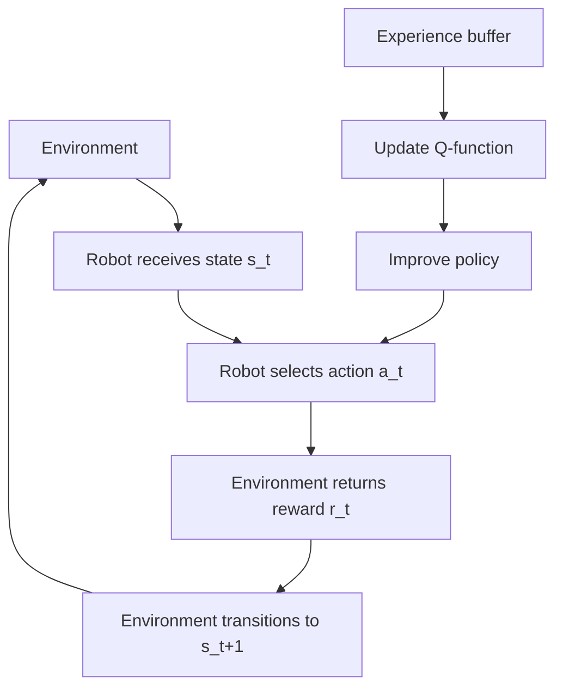
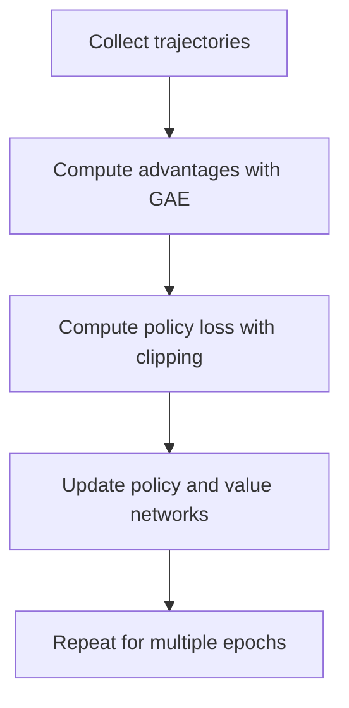
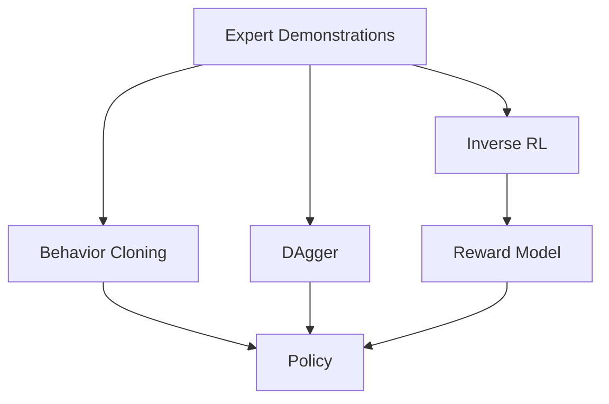
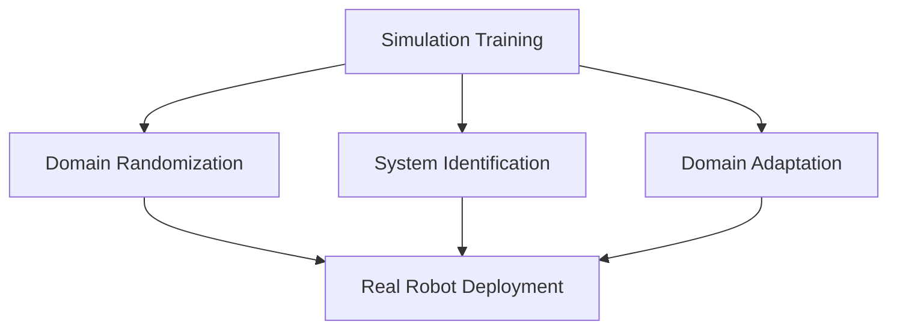

import SelfAssessment from '@site/src/components/SelfAssessment';
import CollapsibleCode from '@site/src/components/CollapsibleCode';

<div className="learning-objectives">
  <h4>Learning Objectives</h4>
  <ul>
    <li>Understand when and why to use ML in robotics</li>
    <li>Implement neural networks with PyTorch</li>
    <li>Build and train DQN agents for discrete control</li>
    <li>Implement PPO for continuous control tasks</li>
    <li>Apply imitation learning from demonstrations</li>
    <li>Transfer learning from simulation to real robots</li>
  </ul>
</div>

## 1. Introduction to ML in Robotics

Machine learning enables robots to learn from experience rather than being explicitly programmed for every situation. This chapter covers the fundamental ML techniques essential for modern robotics.



### Why ML for Robotics?

Traditional robotics relies on precise models and hand-crafted controllers. However, many real-world problems resist analytical solutions:

| Challenge | Traditional Approach | ML Approach |
|-----------|---------------------|-------------|
| Complex dynamics | Simplified models | Learn from experience |
| Unstructured environments | Extensive sensing | Learn robust representations |
| Unknown objects | Pre-defined behaviors | Learn generalization |
| Long-horizon tasks | Hand-crafted policies | Learn from rewards |

---

## 2. Neural Network Fundamentals

We use PyTorch for neural network implementations due to its dynamic computation graphs and extensive ecosystem.

<CollapsibleCode title="Neural Network Basics" language="python">
```python
#!/usr/bin/env python3
"""
Neural Network Fundamentals for Robotics using PyTorch.
"""

import torch
import torch.nn as nn
import torch.optim as optim
from typing import List, Tuple
import numpy as np


class RoboticsMLP(nn.Module):
    """
    Multi-layer perceptron for robot state processing.
    """

    def __init__(
        self,
        input_dim: int,
        hidden_dims: List[int],
        output_dim: int,
        activation: str = "relu"
    ):
        super().__init__()

        # Select activation function
        if activation == "relu":
            self.activation = nn.ReLU()
        elif activation == "tanh":
            self.activation = nn.Tanh()
        elif activation == "elu":
            self.activation = nn.ELU()
        else:
            self.activation = nn.ReLU()

        # Build layers
        layers = []
        prev_dim = input_dim

        for hidden_dim in hidden_dims:
            layers.append(nn.Linear(prev_dim, hidden_dim))
            layers.append(self.activation)
            prev_dim = hidden_dim

        layers.append(nn.Linear(prev_dim, output_dim))
        self.network = nn.Sequential(*layers)

    def forward(self, x: torch.Tensor) -> torch.Tensor:
        """Forward pass through the network."""
        return self.network(x)


class ConvolutionalEncoder(nn.Module):
    """
    CNN encoder for image-based robot perception.
    """

    def __init__(self, in_channels: int = 3, latent_dim: int = 256):
        super().__init__()

        self.encoder = nn.Sequential(
            # Conv block 1: 64x64 -> 32x32
            nn.Conv2d(in_channels, 32, kernel_size=4, stride=2, padding=1),
            nn.BatchNorm2d(32),
            nn.ReLU(),

            # Conv block 2: 32x32 -> 16x16
            nn.Conv2d(32, 64, kernel_size=4, stride=2, padding=1),
            nn.BatchNorm2d(64),
            nn.ReLU(),

            # Conv block 3: 16x16 -> 8x8
            nn.Conv2d(64, 128, kernel_size=4, stride=2, padding=1),
            nn.BatchNorm2d(128),
            nn.ReLU(),

            # Conv block 4: 8x8 -> 4x4
            nn.Conv2d(128, 256, kernel_size=4, stride=2, padding=1),
            nn.BatchNorm2d(256),
            nn.ReLU(),

            nn.Flatten(),
            nn.Linear(256 * 4 * 4, latent_dim),
            nn.ReLU()
        )

    def forward(self, x: torch.Tensor) -> torch.Tensor:
        return self.encoder(x)


class ValueNetwork(nn.Module):
    """
    Value function approximation for RL.
    """

    def __init__(self, state_dim: int, hidden_dims: List[int] = [256, 256]):
        super().__init__()

        layers = [state_dim] + hidden_dims + [1]
        network = []

        for i in range(len(layers) - 1):
            network.append(nn.Linear(layers[i], layers[i + 1]))
            if i < len(layers) - 2:
                network.append(nn.ReLU())

        self.network = nn.Sequential(*network)

    def forward(self, state: torch.Tensor) -> torch.Tensor:
        return self.network(state).squeeze(-1)


class QNetwork(nn.Module):
    """
    Q-function for DQN.
    """

    def __init__(self, state_dim: int, action_dim: int, hidden_dims: List[int] = [256, 256]):
        super().__init__()

        layers = [state_dim] + hidden_dims + [action_dim]
        network = []

        for i in range(len(layers) - 1):
            network.append(nn.Linear(layers[i], layers[i + 1]))
            if i < len(layers) - 2:
                network.append(nn.ReLU())

        self.network = nn.Sequential(*network)

    def forward(self, state: torch.Tensor) -> torch.Tensor:
        return self.network(state)


class GaussianPolicy(nn.Module):
    """
    Stochastic policy for continuous control.
    """

    def __init__(
        self,
        state_dim: int,
        action_dim: int,
        hidden_dims: List[int] = [256, 256],
        log_std_min: float = -20,
        log_std_max: float = 2
    ):
        super().__init__()

        self.log_std_min = log_std_min
        self.log_std_max = log_std_max

        # Mean network
        mean_layers = [state_dim] + hidden_dims
        mean_network = []
        for i in range(len(mean_layers) - 1):
            mean_network.append(nn.Linear(mean_layers[i], mean_layers[i + 1]))
            mean_network.append(nn.ReLU())
        mean_network.append(nn.Linear(mean_layers[-1], action_dim))
        self.mean_network = nn.Sequential(*mean_network)

        # Log std network
        self.log_std_network = nn.Sequential(
            nn.Linear(state_dim + action_dim, hidden_dims[-1]),
            nn.ReLU(),
            nn.Linear(hidden_dims[-1], action_dim)
        )

    def forward(
        self,
        state: torch.Tensor,
        action: torch.Tensor = None
    ) -> Tuple[torch.Tensor, torch.Tensor]:
        mean = self.mean_network(state)

        # Compute log std using tanh squashing
        if action is None:
            log_std = self.log_std_network(
                torch.cat([state, mean], dim=-1)
            )
            log_std = torch.tanh(log_std)
            log_std = self.log_std_min + 0.5 * (self.log_std_max - self.log_std_min) * (log_std + 1)
            std = torch.exp(log_std)
            return mean, std

        # During evaluation, use mean action
        return mean, torch.zeros_like(mean)


def create_mlp(
    input_dim: int,
    output_dim: int,
    hidden_dims: List[int],
    activation: str = "relu"
) -> nn.Sequential:
    """Helper function to create a simple MLP."""

    layers = []
    prev_dim = input_dim

    for hidden_dim in hidden_dims:
        layers.append(nn.Linear(prev_dim, hidden_dim))
        if activation == "relu":
            layers.append(nn.ReLU())
        elif activation == "tanh":
            layers.append(nn.Tanh())
        prev_dim = hidden_dim

    layers.append(nn.Linear(prev_dim, output_dim))
    return nn.Sequential(*layers)


if __name__ == "__main__":
    print("=" * 60)
    print("Neural Network Fundamentals Demo")
    print("=" * 60)

    # Test MLP
    mlp = RoboticsMLP(input_dim=10, hidden_dims=[128, 64], output_dim=2)
    dummy_input = torch.randn(32, 10)
    output = mlp(dummy_input)
    print(f"MLP Input shape: {dummy_input.shape}")
    print(f"MLP Output shape: {output.shape}")

    # Test CNN encoder
    cnn = ConvolutionalEncoder(in_channels=3, latent_dim=256)
    image_input = torch.randn(8, 3, 64, 64)
    encoded = cnn(image_input)
    print(f"CNN Input shape: {image_input.shape}")
    print(f"CNN Output shape: {encoded.shape}")

    # Test Q-network
    q_net = QNetwork(state_dim=10, action_dim=4)
    q_values = q_net(dummy_input)
    print(f"Q-network output shape: {q_values.shape}")

    # Test Gaussian policy
    policy = GaussianPolicy(state_dim=10, action_dim=2)
    mean, std = policy(dummy_input)
    print(f"Policy mean shape: {mean.shape}")
    print(f"Policy std shape: {std.shape}")

    print("\nNeural networks created successfully!")
```
</CollapsibleCode>

---

## 3. Reinforcement Learning Foundations

RL provides a framework for robots to learn optimal behaviors through interaction with an environment.



### Markov Decision Process

An MDP is defined by the tuple (S, A, P, R, γ):

- **S**: State space
- **A**: Action space
- **P(s'|s, a)**: Transition dynamics
- **R(s, a)**: Reward function
- **γ**: Discount factor

### Value Functions

- **V^π(s)**: Expected return from state s following policy π
- **Q^π(s, a)**: Expected return from state s, taking action a, then following π
- **A^π(s, a)**: Advantage of action a over policy's action

<CollapsibleCode title="Reinforcement Learning Fundamentals" language="python">
```python
#!/usr/bin/env python3
"""
Reinforcement Learning Fundamentals for Robotics.
"""

import torch
import torch.nn as nn
import torch.nn.functional as F
import numpy as np
from typing import Tuple, Dict, Optional
from dataclasses import dataclass
from collections import deque
import random


@dataclass
class Transition:
    """Experience transition."""
    state: np.ndarray
    action: int
    reward: float
    next_state: np.ndarray
    done: bool


class ReplayBuffer:
    """Experience replay buffer for DQN."""

    def __init__(self, capacity: int, state_dim: int):
        self.buffer = deque(maxlen=capacity)
        self.state_dim = state_dim

    def push(
        self,
        state: np.ndarray,
        action: int,
        reward: float,
        next_state: np.ndarray,
        done: bool
    ):
        self.buffer.append(Transition(state, action, reward, next_state, done))

    def sample(self, batch_size: int) -> Tuple[np.ndarray, np.ndarray, np.ndarray, np.ndarray, np.ndarray]:
        """Sample a batch of transitions."""
        batch = random.sample(self.buffer, batch_size)

        states = np.array([t.state for t in batch])
        actions = np.array([t.action for t in batch])
        rewards = np.array([t.reward for t in batch])
        next_states = np.array([t.next_state for t in batch])
        dones = np.array([t.done for t in batch]).astype(float)

        return states, actions, rewards, next_states, dones

    def __len__(self):
        return len(self.buffer)


class OrnsteinUhlenbeckProcess:
    """OU noise for exploration in continuous control."""

    def __init__(self, size: int, mu: float = 0.0, theta: float = 0.15, sigma: float = 0.2):
        self.size = size
        self.mu = mu
        self.theta = theta
        self.sigma = sigma
        self.reset()

    def reset(self):
        self.x = np.ones(self.size) * self.mu

    def sample(self) -> np.ndarray:
        dx = self.theta * (self.mu - self.x) + self.sigma * np.random.randn(self.size)
        self.x += dx
        return self.x


class EpsilonGreedy:
    """Epsilon-greedy exploration strategy."""

    def __init__(self, start_epsilon: float, end_epsilon: float, decay_steps: int):
        self.start_epsilon = start_epsilon
        self.end_epsilon = end_epsilon
        self.decay_steps = decay_steps

    def get_epsilon(self, step: int) -> float:
        """Get current epsilon value."""
        if step >= self.decay_steps:
            return self.end_epsilon
        return self.end_epsilon + (self.start_epsilon - self.end_epsilon) * \
               (1 - step / self.decay_steps)

    def select_action(self, q_values: np.ndarray, step: int, training: bool = True) -> int:
        """Select action using epsilon-greedy policy."""
        if not training:
            return np.argmax(q_values)

        epsilon = self.get_epsilon(step)
        if np.random.random() < epsilon:
            return np.random.randint(len(q_values))
        return np.argmax(q_values)


def compute_returns(rewards: np.ndarray, dones: np.ndarray, gamma: float) -> np.ndarray:
    """Compute discounted returns."""
    returns = np.zeros_like(rewards)
    cumulative = 0

    for t in reversed(range(len(rewards))):
        if dones[t]:
            cumulative = 0
        cumulative = rewards[t] + gamma * cumulative
        returns[t] = cumulative

    return returns


def compute_gae(
    rewards: np.ndarray,
    dones: np.ndarray,
    values: np.ndarray,
    gamma: float,
    gae_lambda: float
) -> Tuple[np.ndarray, np.ndarray]:
    """
    Compute Generalized Advantage Estimation.

    GAE reduces variance of advantage estimates while maintaining low bias.
    """
    advantages = np.zeros_like(rewards)
    gae = 0

    for t in reversed(range(len(rewards))):
        if t == len(rewards) - 1:
            next_value = 0
        else:
            next_value = values[t + 1]

        delta = rewards[t] + gamma * next_value * (1 - dones[t]) - values[t]
        gae = delta + gamma * gae_lambda * (1 - dones[t]) * gae
        advantages[t] = gae

    returns = advantages + values
    return advantages, returns


if __name__ == "__main__":
    print("=" * 60)
    print("RL Fundamentals Demo")
    print("=" * 60)

    # Test replay buffer
    buffer = ReplayBuffer(capacity=10000, state_dim=10)
    for i in range(100):
        buffer.push(
            state=np.random.randn(10),
            action=np.random.randint(4),
            reward=np.random.randn(),
            next_state=np.random.randn(10),
            done=np.random.random() < 0.1
        )

    batch = buffer.sample(batch_size=32)
    print(f"Replay buffer size: {len(buffer)}")
    print(f"Sample batch shapes: {tuple(x.shape for x in batch)}")

    # Test epsilon greedy
    explorer = EpsilonGreedy(start_epsilon=1.0, end_epsilon=0.01, decay_steps=100000)
    for step in [0, 10000, 100000]:
        eps = explorer.get_epsilon(step)
        print(f"Step {step}: epsilon = {eps:.4f}")

    # Test GAE
    rewards = np.random.randn(10)
    dones = np.zeros(10)
    values = np.random.randn(10)
    advantages, returns = compute_gae(rewards, dones, values, gamma=0.99, gae_lambda=0.95)
    print(f"Advantages shape: {advantages.shape}")
    print(f"Returns shape: {returns.shape}")

    print("\nRL fundamentals working correctly!")
```
</CollapsibleCode>

---

## 4. Deep Q-Networks (DQN)

DQN combines Q-learning with deep neural networks to handle high-dimensional state spaces.

<CollapsibleCode title="Deep Q-Network Implementation" language="python">
```python
#!/usr/bin/env python3
"""
Deep Q-Network (DQN) Implementation for Discrete Control.
"""

import torch
import torch.nn as nn
import torch.optim as optim
import numpy as np
from typing import Tuple, Dict, Optional
from dataclasses import dataclass
from collections import deque
import random
import gymnasium as gym


@dataclass
class DQNConfig:
    """Configuration for DQN agent."""
    state_dim: int = 10
    action_dim: int = 4
    hidden_dims: Tuple[int, int] = (256, 256)
    learning_rate: float = 3e-4
    gamma: float = 0.99
    buffer_size: int = 100000
    batch_size: int = 64
    target_update_freq: int = 1000
    start_epsilon: float = 1.0
    end_epsilon: float = 0.01
    epsilon_decay: int = 100000
    min_replay_samples: int = 1000
    device: str = "cpu"


class QNetwork(nn.Module):
    """Q-network for DQN."""

    def __init__(self, state_dim: int, action_dim: int, hidden_dims: Tuple[int, int]):
        super().__init__()
        self.network = nn.Sequential(
            nn.Linear(state_dim, hidden_dims[0]),
            nn.ReLU(),
            nn.Linear(hidden_dims[0], hidden_dims[1]),
            nn.ReLU(),
            nn.Linear(hidden_dims[1], action_dim)
        )

    def forward(self, state: torch.Tensor) -> torch.Tensor:
        return self.network(state)


class ReplayBuffer:
    """Experience replay buffer."""

    def __init__(self, capacity: int, state_dim: int):
        self.buffer = deque(maxlen=capacity)
        self.state_dim = state_dim

    def push(
        self,
        state: np.ndarray,
        action: int,
        reward: float,
        next_state: np.ndarray,
        done: bool
    ):
        self.buffer.append((state, action, reward, next_state, done))

    def sample(self, batch_size: int) -> Tuple:
        batch = random.sample(self.buffer, batch_size)
        states, actions, rewards, next_states, dones = zip(*batch)
        return (
            np.array(states),
            np.array(actions),
            np.array(rewards),
            np.array(next_states),
            np.array(dones)
        )

    def __len__(self):
        return len(self.buffer)


class DQNAgent:
    """DQN Agent for discrete control tasks."""

    def __init__(self, config: Optional[DQNConfig] = None):
        if config is None:
            config = DQNConfig()
        self.config = config

        # Networks
        self.q_network = QNetwork(
            config.state_dim,
            config.action_dim,
            config.hidden_dims
        ).to(config.device)

        self.target_network = QNetwork(
            config.state_dim,
            config.action_dim,
            config.hidden_dims
        ).to(config.device)

        self.target_network.load_state_dict(self.q_network.state_dict())
        self.target_network.eval()

        # Optimizer
        self.optimizer = optim.Adam(self.q_network.parameters(), lr=config.learning_rate)

        # Replay buffer
        self.replay_buffer = ReplayBuffer(config.buffer_size, config.state_dim)

        # Exploration
        self.epsilon = config.start_epsilon
        self.epsilon_decay = config.epsilon_decay
        self.end_epsilon = config.end_epsilon

        # Training state
        self.step = 0

    def select_action(self, state: np.ndarray, training: bool = True) -> int:
        """Select action using epsilon-greedy policy."""
        if training and np.random.random() < self.epsilon:
            return np.random.randint(self.config.action_dim)
        with torch.no_grad():
            state_tensor = torch.FloatTensor(state).unsqueeze(0).to(self.config.device)
            q_values = self.q_network(state_tensor)
            return q_values.argmax(dim=1).item()

    def update(self) -> Dict[str, float]:
        """Perform one gradient update step."""
        if len(self.replay_buffer) < self.config.min_replay_samples:
            return {"loss": 0.0}

        # Sample batch
        states, actions, rewards, next_states, dones = self.replay_buffer.sample(
            self.config.batch_size
        )

        # Convert to tensors
        states = torch.FloatTensor(states).to(self.config.device)
        actions = torch.LongTensor(actions).to(self.config.device)
        rewards = torch.FloatTensor(rewards).to(self.config.device)
        next_states = torch.FloatTensor(next_states).to(self.config.device)
        dones = torch.FloatTensor(dones).to(self.config.device)

        # Compute current Q values
        current_q = self.q_network(states).gather(1, actions.unsqueeze(1)).squeeze(1)

        # Compute target Q values
        with torch.no_grad():
            next_q = self.target_network(next_states).max(dim=1)[0]
            target_q = rewards + self.config.gamma * next_q * (1 - dones)

        # Compute loss
        loss = F.mse_loss(current_q, target_q)

        # Optimize
        self.optimizer.zero_grad()
        loss.backward()
        torch.nn.utils.clip_grad_norm_(self.q_network.parameters(), 1.0)
        self.optimizer.step()

        # Update target network
        if self.step % self.config.target_update_freq == 0:
            self.target_network.load_state_dict(self.q_network.state_dict())

        # Decay epsilon
        self.epsilon = max(
            self.end_epsilon,
            self.epsilon - (self.config.start_epsilon - self.end_epsilon) / self.epsilon_decay
        )

        self.step += 1
        return {"loss": loss.item(), "epsilon": self.epsilon}

    def store_transition(
        self,
        state: np.ndarray,
        action: int,
        reward: float,
        next_state: np.ndarray,
        done: bool
    ):
        self.replay_buffer.push(state, action, reward, next_state, done)


def train_dqn(
    env_name: str = "CartPole-v1",
    total_steps: int = 500000,
    eval_freq: int = 10000
) -> Dict:
    """Train DQN agent on a gym environment."""

    env = gym.make(env_name)
    eval_env = gym.make(env_name)

    config = DQNConfig(
        state_dim=env.observation_space.shape[0],
        action_dim=env.action_space.n,
        device="cuda" if torch.cuda.is_available() else "cpu"
    )

    agent = DQNAgent(config)

    # Training metrics
    returns = []
    losses = []

    state, _ = env.reset()
    for step in range(total_steps):
        # Select action
        action = agent.select_action(state, training=True)

        # Take step
        next_state, reward, terminated, truncated, _ = env.step(action)
        done = terminated or truncated

        # Store transition
        agent.store_transition(state, action, reward, next_state, float(done))

        # Update
        if len(agent.replay_buffer) > config.min_replay_samples:
            metrics = agent.update()
            losses.append(metrics["loss"])

        state = next_state

        if done:
            state, _ = env.reset()

        # Evaluation
        if (step + 1) % eval_freq == 0:
            eval_returns = evaluate(agent, eval_env, num_episodes=10)
            returns.append(np.mean(eval_returns))
            print(f"Step {step + 1}: Return = {returns[-1]:.1f}, Loss = {np.mean(losses[-100:]):.4f}")

    return {"returns": returns, "losses": losses}


def evaluate(agent: DQNAgent, env, num_episodes: int = 10) -> list:
    """Evaluate agent performance."""
    returns = []

    for _ in range(num_episodes):
        state, _ = env.reset()
        total_reward = 0

        while True:
            action = agent.select_action(state, training=False)
            next_state, reward, terminated, truncated, _ = env.step(action)
            total_reward += reward

            if terminated or truncated:
                break

            state = next_state

        returns.append(total_reward)

    return returns


if __name__ == "__main__":
    print("=" * 60)
    print("Deep Q-Network (DQN) Demo")
    print("=" * 60)

    # Test DQN on CartPole
    print("Training DQN on CartPole...")
    results = train_dqn(env_name="CartPole-v1", total_steps=100000, eval_freq=5000)

    print("\nDQN training complete!")
```
</CollapsibleCode>

---

## 5. Proximal Policy Optimization (PPO)

PPO is a policy gradient method that optimizes clipped surrogate objectives for stable learning.



<CollapsibleCode title="PPO Implementation" language="python">
```python
#!/usr/bin/env python3
"""
Proximal Policy Optimization (PPO) for Continuous Control.
"""

import torch
import torch.nn as nn
import torch.optim as optim
import torch.nn.functional as F
import numpy as np
from typing import Tuple, Dict, Optional
from dataclasses import dataclass
import gymnasium as gym


@dataclass
class PPOConfig:
    """Configuration for PPO agent."""
    state_dim: int = 10
    action_dim: int = 2
    hidden_dims: Tuple[int, int] = (256, 256)
    learning_rate: float = 3e-4
    clip_epsilon: float = 0.2
    gamma: float = 0.99
    gae_lambda: float = 0.95
    value_coef: float = 0.5
    entropy_coef: float = 0.01
    update_epochs: int = 10
    batch_size: int = 64
    device: str = "cpu"


class Actor(nn.Module):
    """Gaussian policy network."""

    def __init__(self, state_dim: int, action_dim: int, hidden_dims: Tuple[int, int]):
        super().__init__()

        self.network = nn.Sequential(
            nn.Linear(state_dim, hidden_dims[0]),
            nn.Tanh(),
            nn.Linear(hidden_dims[0], hidden_dims[1]),
            nn.Tanh()
        )

        self.mean = nn.Linear(hidden_dims[1], action_dim)
        self.log_std = nn.Linear(hidden_dims[1], action_dim)
        self.log_std_min = -20
        self.log_std_max = 2

    def forward(self, state: torch.Tensor) -> Tuple[torch.Tensor, torch.Tensor]:
        x = self.network(state)
        mean = self.mean(x)

        log_std = self.log_std(x)
        log_std = torch.clamp(log_std, self.log_std_min, self.log_std_max)
        std = torch.exp(log_std)

        return mean, std

    def get_action(self, state: torch.Tensor, deterministic: bool = False) -> Tuple[torch.Tensor, torch.Tensor]:
        mean, std = self.forward(state)

        if deterministic:
            action = mean
        else:
            dist = torch.distributions.Normal(mean, std)
            action = dist.rsample()

        # Tanh squashing for bounded actions
        action = torch.tanh(action)
        log_prob = self._get_log_prob(mean, std, action)

        return action, log_prob

    def _get_log_prob(
        self,
        mean: torch.Tensor,
        std: torch.Tensor,
        action: torch.Tensor
    ) -> torch.Tensor:
        """Compute log probability with tanh correction."""
        dist = torch.distributions.Normal(mean, std)
        raw_action = torch.atanh(torch.clamp(action, -0.999, 0.999))
        log_prob = dist.log_prob(raw_action) - torch.log(1 - action.pow(2) + 1e-6)
        return log_prob.sum(dim=-1)


class Critic(nn.Module):
    """Value function network."""

    def __init__(self, state_dim: int, hidden_dims: Tuple[int, int]):
        super().__init__()

        self.network = nn.Sequential(
            nn.Linear(state_dim, hidden_dims[0]),
            nn.Tanh(),
            nn.Linear(hidden_dims[0], hidden_dims[1]),
            nn.Tanh(),
            nn.Linear(hidden_dims[1], 1)
        )

    def forward(self, state: torch.Tensor) -> torch.Tensor:
        return self.network(state).squeeze(-1)


class PPOLearner:
    """PPO learner for continuous control."""

    def __init__(self, config: Optional[PPOConfig] = None):
        if config is None:
            config = PPOConfig()
        self.config = config

        self.actor = Actor(
            config.state_dim,
            config.action_dim,
            config.hidden_dims
        ).to(config.device)

        self.critic = Critic(
            config.state_dim,
            config.hidden_dims
        ).to(config.device)

        self.actor_optimizer = optim.Adam(self.actor.parameters(), lr=config.learning_rate)
        self.critic_optimizer = optim.Adam(self.critic.parameters(), lr=config.learning_rate)

    def get_action(self, state: np.ndarray, deterministic: bool = False) -> Tuple[np.ndarray, np.ndarray, float]:
        """Get action from current policy."""
        with torch.no_grad():
            state_tensor = torch.FloatTensor(state).unsqueeze(0).to(self.config.device)
            action, log_prob = self.actor.get_action(state_tensor, deterministic=deterministic)
            action = action.cpu().numpy().squeeze()
            log_prob = log_prob.item()

        return action, np.zeros_like(action), log_prob

    def update(
        self,
        states: torch.Tensor,
        actions: torch.Tensor,
        old_log_probs: torch.Tensor,
        advantages: torch.Tensor,
        returns: torch.Tensor
    ) -> Dict[str, float]:
        """Perform PPO update."""

        # Get current values
        values = self.critic(states)

        # Compute value loss
        value_loss = F.mse_loss(values, returns)

        # Compute policy loss
        _, new_log_probs = self.actor.get_action(states)
        ratio = torch.exp(new_log_probs - old_log_probs)

        # Clipped surrogate objective
        surr1 = ratio * advantages
        surr2 = torch.clamp(ratio, 1 - self.config.clip_epsilon, 1 + self.config.clip_epsilon) * advantages
        policy_loss = -torch.min(surr1, surr2).mean()

        # Entropy bonus
        dist = torch.distributions.Normal(
            self.actor.network(states) if hasattr(self.actor, 'network') else torch.zeros_like(states),
            torch.ones_like(states)
        )
        entropy = dist.entropy().mean()

        # Total loss
        total_loss = policy_loss + self.config.value_coef * value_loss - self.config.entropy_coef * entropy

        # Update
        self.actor_optimizer.zero_grad()
        self.critic_optimizer.zero_grad()
        total_loss.backward()
        torch.nn.utils.clip_grad_norm_(self.actor.parameters(), 0.5)
        torch.nn.utils.clip_grad_norm_(self.critic.parameters(), 0.5)
        self.actor_optimizer.step()
        self.critic_optimizer.step()

        return {
            "policy_loss": policy_loss.item(),
            "value_loss": value_loss.item(),
            "entropy": entropy.item()
        }


class TrajectoryBuffer:
    """Buffer for collecting trajectories."""

    def __init__(self, config: PPOConfig):
        self.states = []
        self.actions = []
        self.rewards = []
        self.values = []
        self.log_probs = []
        self.dones = []

        self.config = config

    def push(
        self,
        state: np.ndarray,
        action: np.ndarray,
        reward: float,
        value: float,
        log_prob: float,
        done: bool
    ):
        self.states.append(state)
        self.actions.append(action)
        self.rewards.append(reward)
        self.values.append(value)
        self.log_probs.append(log_prob)
        self.dones.append(done)

    def get(self) -> Tuple[np.ndarray, np.ndarray, np.ndarray, np.ndarray, np.ndarray]:
        """Get all data as arrays."""
        return (
            np.array(self.states),
            np.array(self.actions),
            np.array(self.rewards),
            np.array(self.values),
            np.array(self.log_probs),
            np.array(self.dones)
        )

    def clear(self):
        self.states = []
        self.actions = []
        self.rewards = []
        self.values = []
        self.log_probs = []
        self.dones = []


def compute_gae(
    rewards: np.ndarray,
    dones: np.ndarray,
    values: np.ndarray,
    gamma: float,
    gae_lambda: float
) -> Tuple[np.ndarray, np.ndarray]:
    """Compute Generalized Advantage Estimation."""
    advantages = np.zeros_like(rewards)
    gae = 0

    for t in reversed(range(len(rewards))):
        if t == len(rewards) - 1:
            next_value = 0
        else:
            next_value = values[t + 1]

        delta = rewards[t] + gamma * next_value * (1 - dones[t]) - values[t]
        gae = delta + gamma * gae_lambda * (1 - dones[t]) * gae
        advantages[t] = gae

    returns = advantages + values
    return advantages, returns


def train_ppo(
    env_name: str = "HalfCheetah-v4",
    total_timesteps: int = 1000000,
    num_envs: int = 1,
    update_freq: int = 2048
) -> Dict:
    """Train PPO agent."""

    envs = gym.make(env_name, render_mode=None) if num_envs == 1 else \
           gym.make_vec(env_name, num_envs=num_envs)

    config = PPOConfig(
        state_dim=envs.observation_space.shape[0],
        action_dim=envs.action_space.shape[0],
        device="cuda" if torch.cuda.is_available() else "cpu"
    )

    learner = PPOLearner(config)
    buffer = TrajectoryBuffer(config)

    # Training loop
    state, _ = envs.reset()
    returns = []

    for timestep in range(total_timesteps):
        # Collect trajectory
        for _ in range(update_freq):
            with torch.no_grad():
                state_tensor = torch.FloatTensor(state).to(config.device)
                values = learner.critic(state_tensor).cpu().numpy()

            actions, _, log_probs = learner.get_action(state)

            next_state, reward, terminated, truncated, _ = envs.step(actions)

            buffer.push(state, actions, reward, values, log_probs, float(terminated or truncated))

            state = next_state

            if terminated or truncated:
                returns.append(sum(envs.return_queue))
                state, _ = envs.reset()

        # Get trajectory data
        states, actions, rewards, values, log_probs, dones = buffer.get()

        # Compute advantages and returns
        advantages, returns_arr = compute_gae(
            rewards, dones, values, config.gamma, config.gae_lambda
        )

        # Normalize advantages
        advantages = (advantages - advantages.mean()) / (advantages.std() + 1e-8)

        # Convert to tensors
        states = torch.FloatTensor(states).to(config.device)
        actions = torch.FloatTensor(actions).to(config.device)
        old_log_probs = torch.FloatTensor(log_probs).to(config.device)
        advantages = torch.FloatTensor(advantages).to(config.device)
        returns_arr = torch.FloatTensor(returns_arr).to(config.device)

        # Update
        metrics = learner.update(states, actions, old_log_probs, advantages, returns_arr)

        buffer.clear()

        # Logging
        if timestep % 100 == 0:
            print(f"Timestep {timestep}: Return = {np.mean(returns[-10:]):.1f}, "
                  f"Policy Loss = {metrics['policy_loss']:.4f}")

    return {"returns": returns}


if __name__ == "__main__":
    print("=" * 60)
    print("Proximal Policy Optimization (PPO) Demo")
    print("=" * 60)

    # Test PPO on HalfCheetah
    print("Training PPO on HalfCheetah...")
    results = train_ppo(env_name="HalfCheetah-v4", total_timesteps=200000, update_freq=1024)

    print("\nPPO training complete!")
```
</CollapsibleCode>

---

## 6. Imitation Learning

Imitation learning enables robots to learn from expert demonstrations.



<CollapsibleCode title="Imitation Learning" language="python">
```python
#!/usr/bin/env python3
"""
Imitation Learning: Behavior Cloning and DAgger.
"""

import torch
import torch.nn as nn
import torch.optim as optim
import numpy as np
from typing import Tuple, List, Dict
from dataclasses import dataclass


@dataclass
class Demonstration:
    """Expert demonstration trajectory."""
    states: np.ndarray
    actions: np.ndarray
    rewards: np.ndarray


class BehaviorCloning(nn.Module):
    """
    Behavior cloning from expert demonstrations.
    Simple supervised learning approach.
    """

    def __init__(self, state_dim: int, action_dim: int, hidden_dims: List[int] = [256, 256]):
        super().__init__()

        layers = [state_dim] + hidden_dims + [action_dim]
        network = []

        for i in range(len(layers) - 1):
            network.append(nn.Linear(layers[i], layers[i + 1]))
            if i < len(layers) - 2:
                network.append(nn.ReLU())
                network.append(nn.Dropout(0.1))

        network.append(nn.Tanh())  # Bound actions
        self.network = nn.Sequential(*network)

        self.optimizer = optim.Adam(self.parameters(), lr=1e-3)
        self.criterion = nn.MSELoss()

    def forward(self, state: torch.Tensor) -> torch.Tensor:
        return self.network(state)

    def train_step(self, states: np.ndarray, actions: np.ndarray) -> float:
        """One training step."""
        self.optimizer.zero_grad()

        state_tensor = torch.FloatTensor(states)
        action_tensor = torch.FloatTensor(actions)

        pred_actions = self(state_tensor)
        loss = self.criterion(pred_actions, action_tensor)

        loss.backward()
        self.optimizer.step()

        return loss.item()

    def predict(self, state: np.ndarray) -> np.ndarray:
        """Predict action for given state."""
        with torch.no_grad():
            state_tensor = torch.FloatTensor(state)
            return self(state_tensor).numpy()


class DAgger(nn.Module):
    """
    Dataset Aggregation (DAgger) for imitation learning.
    Iteratively collects data from the learned policy and labels it with expert.
    """

    def __init__(self, state_dim: int, action_dim: int, expert, hidden_dims: List[int] = [256, 256]):
        super().__init__()

        self.expert = expert  # Expert policy (can be another model)
        self.policy = BehaviorCloning(state_dim, action_dim, hidden_dims)

        # Dataset
        self.states: List[np.ndarray] = []
        self.actions: List[np.ndarray] = []

    def collect_rollout(self, env, num_episodes: int = 10) -> List[Demonstration]:
        """Collect expert demonstrations."""
        demonstrations = []

        for _ in range(num_episodes):
            state, _ = env.reset()
            states, actions, rewards = [], [], []

            while True:
                action = self.expert.predict(state)
                next_state, reward, terminated, truncated, _ = env.step(action)

                states.append(state)
                actions.append(action)
                rewards.append(reward)

                if terminated or truncated:
                    break

                state = next_state

            demonstrations.append(Demonstration(
                states=np.array(states),
                actions=np.array(actions),
                rewards=np.array(rewards)
            ))

        return demonstrations

    def aggregate_datasets(self, demonstrations: List[Demonstration]):
        """Aggregate demonstrations to dataset."""
        for demo in demonstrations:
            self.states.extend(demo.states)
            self.actions.extend(demo.actions)

    def train_policy(self, iterations: int = 100, batch_size: int = 64):
        """Train policy on aggregated dataset."""
        states = np.array(self.states)
        actions = np.array(self.actions)

        for i in range(iterations):
            # Sample batch
            indices = np.random.choice(len(states), batch_size, replace=True)
            loss = self.policy.train_step(states[indices], actions[indices])

            if i % 10 == 0:
                print(f"DAgger iteration {i}: loss = {loss:.4f}")


class BCQ:
    """
    Batch Constrained Q-learning (BCQ) for offline RL.
    Learns to mimic behavior from a fixed dataset.
    """

    def __init__(self, state_dim: int, action_dim: int, hidden_dims: List[int] = [256, 256]):
        self.latent_dim = 5  # Latent space for perturbation

        # Perturbation model (generates perturbations around expert actions)
        self.perturbation = nn.Sequential(
            nn.Linear(state_dim + action_dim, hidden_dims[0]),
            nn.ReLU(),
            nn.Linear(hidden_dims[0], hidden_dims[1]),
            nn.ReLU(),
            nn.Linear(hidden_dims[1], action_dim * self.latent_dim)
        )

        # Q-network
        self.q1 = nn.Sequential(
            nn.Linear(state_dim + action_dim + self.latent_dim, hidden_dims[0]),
            nn.ReLU(),
            nn.Linear(hidden_dims[0], hidden_dims[1]),
            nn.ReLU(),
            nn.Linear(hidden_dims[1], 1)
        )

        self.q2 = nn.Sequential(
            nn.Linear(state_dim + action_dim + self.latent_dim, hidden_dims[0]),
            nn.ReLU(),
            nn.Linear(hidden_dims[1], hidden_dims[1]),
            nn.ReLU(),
            nn.Linear(hidden_dims[1], 1)
        )

        self.optimizer = optim.Adam(self.parameters(), lr=1e-3)

    def get_action(self, state: np.ndarray) -> np.ndarray:
        """Get action from BCQ policy."""
        with torch.no_grad():
            state_tensor = torch.FloatTensor(state).unsqueeze(0)

            # Get perturbation parameters
            raw_pert = self.perturbation(state_tensor)
            pert = torch.tanh(raw_pert).view(-1, self.latent_dim)

            # Sample perturbation
            perturbed = pert.mean(dim=1).unsqueeze(0)

            # Get Q values for all possible perturbations
            q_values = self.q1(torch.cat([state_tensor, perturbed], dim=-1))
            best_idx = q_values.argmax(dim=1)

            return perturbed[0, best_idx.item()].numpy()


def generate_demonstrations(
    env,
    expert_policy,
    num_demonstrations: int = 100
) -> List[Demonstration]:
    """Generate expert demonstrations."""

    demonstrations = []

    for _ in range(num_demonstrations):
        state, _ = env.reset()
        states, actions, rewards = [], [], []

        for _ in range(1000):  # Max episode length
            action = expert_policy.predict(state)
            next_state, reward, terminated, truncated, _ = env.step(action)

            states.append(state)
            actions.append(action)
            rewards.append(reward)

            if terminated or truncated:
                break

            state = next_state

        demonstrations.append(Demonstration(
            states=np.array(states),
            actions=np.array(actions),
            rewards=np.array(rewards)
        ))

    return demonstrations


if __name__ == "__main__":
    print("=" * 60)
    print("Imitation Learning Demo")
    print("=" * 60)

    import gymnasium as gym

    env = gym.make("CartPole-v1")

    # Simple expert (rule-based)
    class RuleExpert:
        def predict(self, state):
            pole_angle = state[2]
            return 0 if pole_angle < 0 else 1

    expert = RuleExpert()

    # Generate demonstrations
    print("Generating expert demonstrations...")
    demonstrations = generate_demonstrations(env, expert, num_demonstrations=50)

    # Behavior cloning
    bc = BehaviorCloning(state_dim=4, action_dim=2, hidden_dims=[128, 64])

    # Train BC
    for states, actions, _ in demonstrations:
        bc.train_step(states, actions)

    print("Behavior cloning training complete!")

    # Evaluate
    from collections import deque

    returns = []
    for _ in range(10):
        state, _ = env.reset()
        total_reward = 0

        for _ in range(500):
            action = int(bc.predict(state) > 0)
            state, reward, terminated, truncated, _ = env.step(action)
            total_reward += reward

            if terminated or truncated:
                break

        returns.append(total_reward)

    print(f"Average return: {np.mean(returns):.1f}")
```
</CollapsibleCode>

---

## 7. Transfer Learning and Sim2Real

Transfer learning enables models trained in simulation to transfer to real robots.



<CollapsibleCode title="Transfer Learning for Robotics" language="python">
```python
#!/usr/bin/env python3
"""
Transfer Learning and Sim2Real for Robotics.
"""

import torch
import torch.nn as nn
import torch.optim as optim
import numpy as np
from typing import Tuple, Dict, List
from dataclasses import dataclass


@dataclass
class DomainRandomizer:
    """Domain randomization for sim2real transfer."""

    def __init__(
        self,
        visual_domains: Dict[str, Tuple[float, float]] = None,
        dynamics_domains: Dict[str, Tuple[float, float]] = None
    ):
        self.visual_domains = visual_domains or {
            "light_intensity": (0.8, 1.2),
            "camera_noise": (0.0, 0.1),
            "color_jitter": (0.0, 0.2)
        }

        self.dynamics_domains = dynamics_domains or {
            "friction": (0.8, 1.2),
            "mass": (0.9, 1.1),
            "gravity": (0.99, 1.01),
            "latency": (0.0, 0.05)
        }

    def randomize_visual(self, image: np.ndarray) -> np.ndarray:
        """Apply visual domain randomization to image."""
        # Light intensity
        intensity = np.random.uniform(*self.visual_domains["light_intensity"])
        image = (image * intensity).clip(0, 255).astype(np.uint8)

        # Noise
        noise_level = np.random.uniform(*self.visual_domains["camera_noise"])
        if noise_level > 0:
            noise = np.random.randn(*image.shape).astype(np.float32) * noise_level * 255
            image = (image.astype(np.float32) + noise).clip(0, 255).astype(np.uint8)

        return image

    def randomize_dynamics(self, params: Dict) -> Dict:
        """Apply dynamics randomization to physical parameters."""
        randomized = {}

        for key, value in params.items():
            if key in self.dynamics_domains:
                low, high = self.dynamics_domains[key]
                scale = np.random.uniform(low, high)
                randomized[key] = value * scale
            else:
                randomized[key] = value

        return randomized


class DomainAdversarialNetwork(nn.Module):
    """
    Domain adversarial network for domain adaptation.
    Learns features that are invariant to the domain.
    """

    def __init__(self, feature_dim: int, hidden_dim: int = 128):
        super().__init__()

        # Feature extractor (shared across domains)
        self.feature_extractor = nn.Sequential(
            nn.Linear(feature_dim, hidden_dim),
            nn.ReLU(),
            nn.Linear(hidden_dim, hidden_dim),
            nn.ReLU()
        )

        # Label classifier (predicts task labels)
        self.label_classifier = nn.Sequential(
            nn.Linear(hidden_dim, hidden_dim // 2),
            nn.ReLU(),
            nn.Linear(hidden_dim // 2, 1)  # Binary classification
        )

        # Domain classifier (adversarial)
        self.domain_classifier = nn.Sequential(
            nn.Linear(hidden_dim, hidden_dim // 2),
            nn.ReLU(),
            nn.Linear(hidden_dim // 2, 1)
        )

        self.domain_classifier[-1].weight.data.fill_(0)
        self.domain_classifier[-1].bias.data.fill_(0)

    def forward(
        self,
        features: torch.Tensor,
        alpha: float = 1.0
    ) -> Tuple[torch.Tensor, torch.Tensor]:
        """Forward pass with gradient reversal for domain classifier."""

        # Extract features
        features = self.feature_extractor(features)

        # Task prediction
        task_pred = self.label_classifier(features)

        # Domain prediction with gradient reversal
        reverse_features = GradientReversalFunction.apply(features, alpha)
        domain_pred = self.domain_classifier(reverse_features)

        return task_pred, domain_pred


class GradientReversalFunction(torch.autograd.Function):
    """Gradient reversal function for domain adaptation."""

    @staticmethod
    def forward(ctx, x, lambda_):
        ctx.lambda_ = lambda_
        return x.view_as(x)

    @staticmethod
    def backward(ctx, grad_output):
        return grad_output.neg() * ctx.lambda_, None


class DomainAdaptationTrainer:
    """Trainer for domain adaptation."""

    def __init__(
        self,
        feature_dim: int,
        lr: float = 1e-3,
        lambda_: float = 0.5
    ):
        self.model = DomainAdversarialNetwork(feature_dim)
        self.optimizer = optim.Adam(self.model.parameters(), lr=lr)
        self.lambda_ = lambda_
        self.criterion = nn.BCEWithLogitsLoss()

    def train_step(
        self,
        source_features: torch.Tensor,
        source_labels: torch.Tensor,
        target_features: torch.Tensor,
        target_labels: torch.Tensor
    ) -> Dict[str, float]:
        """One training step."""

        # Combine source and target
        all_features = torch.cat([source_features, target_features], dim=0)

        # Forward pass
        task_preds, domain_preds = self.model(all_features, self.lambda_)

        # Source labels
        source_task_preds = task_preds[:len(source_features)]
        target_task_preds = task_preds[len(source_features):]

        # Domain labels (0=source, 1=target)
        source_domain = torch.zeros(len(source_features), 1)
        target_domain = torch.ones(len(target_features), 1)
        all_domain = torch.cat([source_domain, target_domain], dim=0).float()

        # Losses
        task_loss = self.criterion(source_task_preds, source_labels.unsqueeze(-1))
        domain_loss = self.criterion(domain_preds, all_domain)

        # Total loss (minimize task loss, maximize domain loss)
        loss = task_loss - 0.1 * domain_loss

        # Update
        self.optimizer.zero_grad()
        loss.backward()
        self.optimizer.step()

        return {
            "task_loss": task_loss.item(),
            "domain_loss": domain_loss.item(),
            "total_loss": loss.item()
        }


class Sim2RealTransfer:
    """Complete Sim2Real transfer pipeline."""

    def __init__(self, state_dim: int, action_dim: int):
        self.state_dim = state_dim
        self.action_dim = action_dim

        # Domain randomizer
        self.randomizer = DomainRandomizer()

        # Policy network
        self.policy = self._create_policy()

        # Adaptation network (learns residual for real-world)
        self.adaptation_network = nn.Sequential(
            nn.Linear(state_dim, 64),
            nn.ReLU(),
            nn.Linear(64, action_dim)
        )

    def _create_policy(self) -> nn.Module:
        """Create policy network."""
        return nn.Sequential(
            nn.Linear(self.state_dim, 256),
            nn.ReLU(),
            nn.Linear(256, 256),
            nn.ReLU(),
            nn.Linear(256, self.action_dim),
            nn.Tanh()
        )

    def train_with_randomization(
        self,
        sim_env,
        num_iterations: int = 10000,
        batch_size: int = 64
    ) -> Dict:
        """Train with domain randomization."""

        optimizer = optim.Adam(self.policy.parameters(), lr=1e-3)
        returns = []

        for iteration in range(num_iterations):
            # Randomize environment
            randomized_params = self.randomizer.randomize_dynamics({})

            # Collect rollout
            state, _ = sim_env.reset()
            states, actions, rewards = [], [], []

            for _ in range(1000):
                with torch.no_grad():
                    action = self.policy(
                        torch.FloatTensor(state)
                    ).numpy()

                next_state, reward, terminated, truncated, _ = sim_env.step(action)

                states.append(state)
                actions.append(action)
                rewards.append(reward)

                if terminated or truncated:
                    break

                state = next_state

            returns.append(sum(rewards))

            # Compute returns and update
            returns_arr = np.array(rewards)
            returns_tensor = torch.FloatTensor(returns_arr)

            # Simple REINFORCE update
            optimizer.zero_grad()
            loss = self._compute_policy_loss(
                torch.FloatTensor(np.array(states)),
                torch.FloatTensor(np.array(actions)),
                returns_tensor
            )
            loss.backward()
            optimizer.step()

            if iteration % 100 == 0:
                print(f"Iteration {iteration}: Return = {np.mean(returns[-10:]):.1f}")

        return {"returns": returns}

    def _compute_policy_loss(
        self,
        states: torch.Tensor,
        actions: torch.Tensor,
        returns: torch.Tensor
    ) -> torch.Tensor:
        """Compute policy gradient loss."""
        pred_actions = self.policy(states)
        return F.mse_loss(pred_actions, actions)


def evaluate_sim2real_transfer(
    sim_policy: nn.Module,
    real_env,
    num_episodes: int = 10
) -> Dict:
    """Evaluate policy transfer to real robot."""

    returns = []

    for _ in range(num_episodes):
        state, _ = real_env.reset()
        total_reward = 0

        while True:
            with torch.no_grad():
                action = sim_policy(torch.FloatTensor(state)).numpy()

            next_state, reward, terminated, truncated, _ = real_env.step(action)
            total_reward += reward

            if terminated or truncated:
                break

            state = next_state

        returns.append(total_reward)

    return {
        "mean_return": np.mean(returns),
        "std_return": np.std(returns),
        "success_rate": sum(1 for r in returns if r > threshold) / len(returns)
    }


if __name__ == "__main__":
    print("=" * 60)
    print("Transfer Learning and Sim2Real Demo")
    print("=" * 60)

    # Test domain randomizer
    randomizer = DomainRandomizer()
    test_image = np.random.randint(0, 255, (64, 64, 3), dtype=np.uint8)
    randomized_image = randomizer.randomize_visual(test_image)
    print(f"Original image: {test_image.shape}")
    print(f"Randomized image: {randomized_image.shape}")

    # Test domain adversarial network
    dan = DomainAdversarialNetwork(feature_dim=20)
    features = torch.randn(32, 20)
    task_preds, domain_preds = dan(features, alpha=1.0)
    print(f"Task predictions shape: {task_preds.shape}")
    print(f"Domain predictions shape: {domain_preds.shape}")

    # Test sim2real transfer
    sim2real = Sim2RealTransfer(state_dim=10, action_dim=2)

    import gymnasium as gym
    sim_env = gym.make("HalfCheetah-v4")

    print("\nTraining with domain randomization...")
    results = sim2real.train_with_randomization(
        sim_env,
        num_iterations=1000,
        batch_size=64
    )

    print("\nSim2Real training complete!")
```
</CollapsibleCode>

---

## 8. Chapter Summary

This chapter covered the fundamentals of machine learning for robotics:

| Topic | Key Concepts |
|-------|-------------|
| Neural Networks | PyTorch, MLP, CNN, policy/value networks |
| DQN | Experience replay, target networks, epsilon-greedy |
| PPO | Clipped surrogate, GAE, actor-critic |
| Imitation Learning | Behavior cloning, DAgger, BCQ |
| Transfer Learning | Domain randomization, domain adaptation |

---

## 9. Self-Assessment

<SelfAssessment title="Chapter 4 Self-Assessment" questions={[
    {id: 'q1', text: 'What is the main advantage of using experience replay in DQN?', options: ['Increases exploration', 'Reduces correlation between samples', 'Speeds up convergence', 'All of the above'], correctAnswer: 1, explanation: 'Experience replay breaks temporal correlations between consecutive transitions, leading to more stable learning.'},
    {id: 'q2', text: 'In PPO, what does the clipping prevent?', options: ['Exploration', 'Overly large policy updates', 'Value function divergence', 'Replay buffer overflow'], correctAnswer: 1, explanation: 'PPO clips the probability ratio to prevent overly large policy updates that could destabilize training.'},
    {id: 'q3', text: 'What is the primary purpose of GAE (Generalized Advantage Estimation)?', options: ['Increase sample efficiency', 'Reduce variance while maintaining low bias', 'Replace the critic network', 'Speed up environment interaction'], correctAnswer: 1, explanation: 'GAE provides a balanced trade-off between bias and variance in advantage estimation.'},
    {id: 'q4', text: 'In behavior cloning, what is the main limitation?', options: ['Computational cost', 'Distribution shift between expert and learned policy', 'Requires reward function', 'Only works for discrete actions'], correctAnswer: 1, explanation: 'Distribution shift causes compounding errors as small mistakes lead to states the expert never visited.'},
    {id: 'q5', text: 'What is the purpose of domain randomization in sim2real transfer?', options: ['Speed up simulation', 'Make the policy robust to distribution shift', 'Replace real data', 'Reduce model size'], correctAnswer: 1, explanation: 'Domain randomization exposes the policy to varied conditions during training, making it more robust to real-world variations.'}
]}/>

---

## 10. Further Reading

- [Deep Reinforcement Learning That Matters](https://arxiv.org/abs/1709.06560)
- [Proximal Policy Optimization Algorithms](https://arxiv.org/abs/1707.06347)
- [Addressing Function Approximation Error in Actor-Critic Methods](https://arxiv.org/abs/1802.09477)
- [DAgger: Dataset Aggregation](https://arxiv.org/abs/1012.0844)

---

## 11. Glossary

| Term | Definition |
|------|------------|
| **Experience Replay** | Technique storing agent experiences for reuse, breaking temporal correlations |
| **Target Network** | Separate network with delayed updates to stabilize Q-value targets |
| **GAE** | Generalized Advantage Estimation - balanced advantage estimator |
| **Clipping** | PPO technique limiting policy update magnitude |
| **Distribution Shift** | Problem where training and deployment distributions differ |
| **Domain Randomization** | Training on varied environments to improve transfer |
| **Entropy** | Measure of policy randomness, used to encourage exploration |
