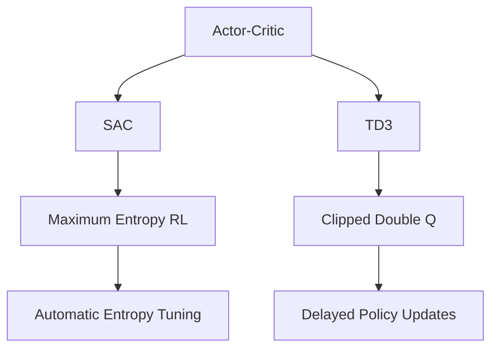
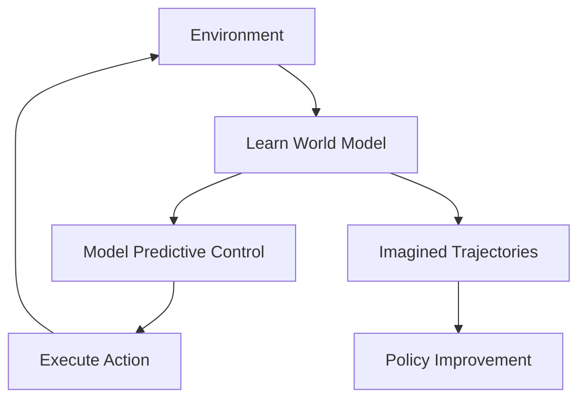
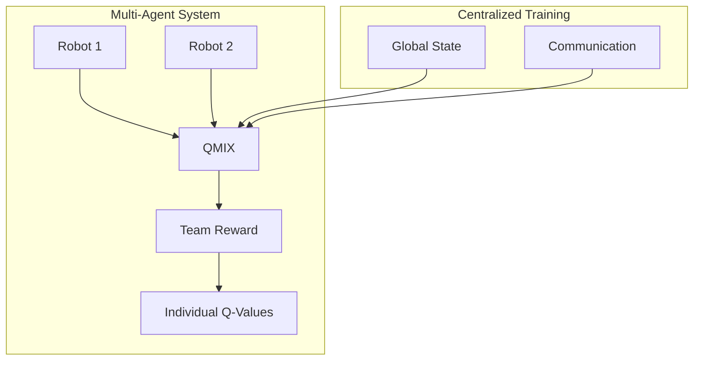
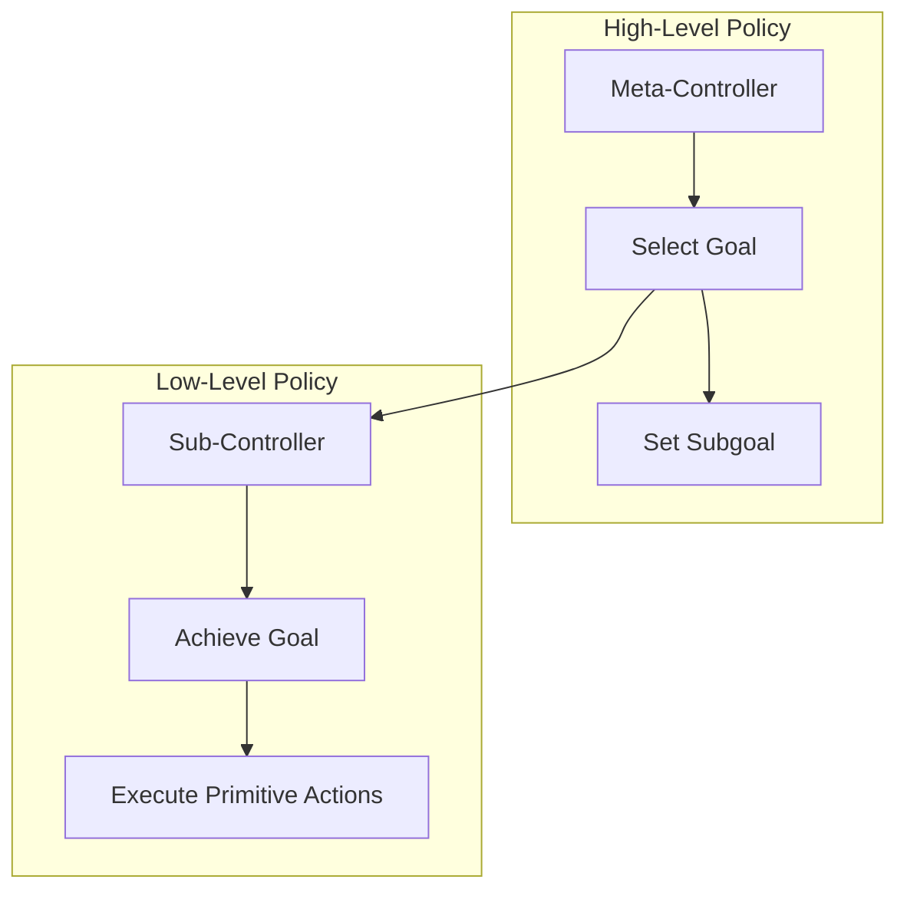

import SelfAssessment from '@site/src/components/SelfAssessment';
import CollapsibleCode from '@site/src/components/CollapsibleCode';

<div className="learning-objectives">
  <h4>Learning Objectives</h4>
  <ul>
    <li>Implement SAC (Soft Actor-Critic) for efficient continuous control</li>
    <li>Implement TD3 (Twin Delayed DDPG) with clipped double Q-learning</li>
    <li>Understand and implement model-based RL (PlaNet, Dreamer)</li>
    <li>Apply multi-agent RL for cooperative robot teams</li>
    <li>Use hierarchical RL for long-horizon tasks</li>
    <li>Understand offline RL and conservative Q-learning</li>
  </ul>
</div>

## 1. Advanced Actor-Critic Methods

Building on Chapter 4's PPO foundation, we now explore state-of-the-art actor-critic algorithms that offer better sample efficiency and performance.



### Soft Actor-Critic (SAC)

SAC maximizes both expected return and entropy, leading to more exploratory and robust policies.

<CollapsibleCode title="Soft Actor-Critic Implementation" language="python">
```python
#!/usr/bin/env python3
"""
Soft Actor-Critic (SAC) Implementation.
"""

import torch
import torch.nn as nn
import torch.nn.functional as F
import torch.optim as optim
import numpy as np
from typing import Tuple, Dict, Optional
from dataclasses import dataclass
from collections import deque
import random
import gymnasium as gym


@dataclass
class SACConfig:
    """SAC Configuration."""
    state_dim: int = 10
    action_dim: int = 2
    hidden_dims: Tuple[int, int] = (256, 256)
    learning_rate: float = 3e-4
    gamma: float = 0.99
    tau: float = 0.005  # Soft update coefficient
    buffer_size: int = 1000000
    batch_size: int = 256
    initial_alpha: float = 0.2
    target_entropy: Optional[float] = None
    device: str = "cpu"


class SquashGaussianPolicy(nn.Module):
    """Squashed Gaussian policy for SAC."""

    def __init__(
        self,
        state_dim: int,
        action_dim: int,
        hidden_dims: Tuple[int, int]
    ):
        super().__init__()

        self.net = nn.Sequential(
            nn.Linear(state_dim, hidden_dims[0]),
            nn.ReLU(),
            nn.Linear(hidden_dims[0], hidden_dims[1]),
            nn.ReLU()
        )

        self.mean = nn.Linear(hidden_dims[1], action_dim)
        self.log_std = nn.Linear(hidden_dims[1], action_dim)

        # Action bounds
        self.log_std_min = -20
        self.log_std_max = 2

    def forward(
        self,
        state: torch.Tensor,
        deterministic: bool = False,
        with_log_prob: bool = True
    ) -> Tuple[torch.Tensor, torch.Tensor]:
        x = self.net(state)
        mean = self.mean(x)
        log_std = self.log_std(x)
        log_std = torch.clamp(log_std, self.log_std_min, self.log_std_max)
        std = torch.exp(log_std)

        # Sample action
        if deterministic:
            action = torch.tanh(mean)
        else:
            dist = torch.distributions.Normal(mean, std)
            x_t = dist.rsample()
            action = torch.tanh(x_t)

        # Compute log probability
        if with_log_prob:
            # log_prob = log_prob_of_action_given_tanh_normal
            log_prob = dist.log_prob(x_t) - torch.log(1 - action.pow(2) + 1e-6)
            log_prob = log_prob.sum(dim=-1)
        else:
            log_prob = None

        return action, log_prob


class QNetwork(nn.Module):
    """Twin Q-networks for SAC."""

    def __init__(
        self,
        state_dim: int,
        action_dim: int,
        hidden_dims: Tuple[int, int]
    ):
        super().__init__()

        # Q1
        self.q1 = nn.Sequential(
            nn.Linear(state_dim + action_dim, hidden_dims[0]),
            nn.ReLU(),
            nn.Linear(hidden_dims[0], hidden_dims[1]),
            nn.ReLU(),
            nn.Linear(hidden_dims[1], 1)
        )

        # Q2
        self.q2 = nn.Sequential(
            nn.Linear(state_dim + action_dim, hidden_dims[0]),
            nn.ReLU(),
            nn.Linear(hidden_dims[0], hidden_dims[1]),
            nn.ReLU(),
            nn.Linear(hidden_dims[1], 1)
        )

    def forward(
        self,
        state: torch.Tensor,
        action: torch.Tensor
    ) -> Tuple[torch.Tensor, torch.Tensor]:
        q1 = self.q1(torch.cat([state, action], dim=-1))
        q2 = self.q2(torch.cat([state, action], dim=-1))
        return q1.squeeze(-1), q2.squeeze(-1)


class ReplayBuffer:
    """Replay buffer with automatic entropy coefficient."""

    def __init__(self, capacity: int, state_dim: int, action_dim: int):
        self.capacity = capacity
        self.state_dim = state_dim
        self.action_dim = action_dim

        self.states = np.zeros((capacity, state_dim), dtype=np.float32)
        self.actions = np.zeros((capacity, action_dim), dtype=np.float32)
        self.rewards = np.zeros(capacity, dtype=np.float32)
        self.next_states = np.zeros((capacity, state_dim), dtype=np.float32)
        self.dones = np.zeros(capacity, dtype=np.float32)

        self.idx = 0
        self.size = 0

    def push(
        self,
        state: np.ndarray,
        action: np.ndarray,
        reward: float,
        next_state: np.ndarray,
        done: bool
    ):
        self.states[self.idx] = state
        self.actions[self.idx] = action
        self.rewards[self.idx] = reward
        self.next_states[self.idx] = next_state
        self.dones[self.idx] = float(done)

        self.idx = (self.idx + 1) % self.capacity
        self.size = min(self.size + 1, self.capacity)

    def sample(self, batch_size: int) -> Tuple:
        indices = np.random.randint(0, self.size, size=batch_size)

        return (
            torch.FloatTensor(self.states[indices]),
            torch.FloatTensor(self.actions[indices]),
            torch.FloatTensor(self.rewards[indices]),
            torch.FloatTensor(self.next_states[indices]),
            torch.FloatTensor(self.dones[indices])
        )


class SACAgent:
    """SAC Agent with automatic entropy tuning."""

    def __init__(self, config: Optional[SACConfig] = None):
        if config is None:
            config = SACConfig()
        self.config = config

        # Networks
        self.policy = SquashGaussianPolicy(
            config.state_dim,
            config.action_dim,
            config.hidden_dims
        ).to(config.device)

        self.q_network = QNetwork(
            config.state_dim,
            config.action_dim,
            config.hidden_dims
        ).to(config.device)

        self.q_target = QNetwork(
            config.state_dim,
            config.action_dim,
            config.hidden_dims
        ).to(config.device)

        self.q_target.load_state_dict(self.q_network.state_dict())

        # Optimizers
        self.policy_optimizer = optim.Adam(self.policy.parameters(), lr=config.learning_rate)
        self.q_optimizer = optim.Adam(self.q_network.parameters(), lr=config.learning_rate)

        # Entropy coefficient (automatic tuning)
        self.log_alpha = torch.tensor(np.log(config.initial_alpha), requires_grad=True, device=config.device)
        self.alpha_optimizer = optim.Adam([self.log_alpha], lr=config.learning_rate)
        self.alpha = self.log_alpha.exp()

        # Target entropy
        if config.target_entropy is None:
            self.target_entropy = -np.prod(config.action_dim).item()
        else:
            self.target_entropy = config.target_entropy

        # Replay buffer
        self.replay_buffer = ReplayBuffer(
            config.buffer_size,
            config.state_dim,
            config.action_dim
        )

    def select_action(self, state: np.ndarray, deterministic: bool = False) -> np.ndarray:
        with torch.no_grad():
            state_tensor = torch.FloatTensor(state).unsqueeze(0).to(self.config.device)
            action, _ = self.policy(state_tensor, deterministic=deterministic)
            return action.cpu().numpy().squeeze()

    def update(self) -> Dict[str, float]:
        # Sample from replay buffer
        states, actions, rewards, next_states, dones = self.replay_buffer.sample(self.config.batch_size)
        states = states.to(self.config.device)
        actions = actions.to(self.config.device)
        rewards = rewards.to(self.config.device)
        next_states = next_states.to(self.config.device)
        dones = dones.to(self.config.device)

        # Compute current Q values
        q1, q2 = self.q_network(states, actions)

        # Compute next Q values with target policy
        with torch.no_grad():
            next_actions, next_log_probs = self.policy(next_states, with_log_prob=True)
            q1_target, q2_target = self.q_target(next_states, next_actions)
            q_target = torch.min(q1_target, q2_target) - self.alpha * next_log_probs

        # Target Q values
        q_target = rewards.unsqueeze(-1) + self.config.gamma * (1 - dones.unsqueeze(-1)) * q_target

        # Q loss
        q_loss = F.mse_loss(q1, q_target) + F.mse_loss(q2, q_target)

        # Update Q networks
        self.q_optimizer.zero_grad()
        q_loss.backward()
        self.q_optimizer.step()

        # Policy loss (maximize Q + entropy)
        new_actions, log_probs = self.policy(states, with_log_prob=True)
        q1_new, q2_new = self.q_network(states, new_actions)
        q_new = torch.min(q1_new, q2_new)

        policy_loss = (self.alpha * log_probs - q_new).mean()

        # Update policy
        self.policy_optimizer.zero_grad()
        policy_loss.backward()
        self.policy_optimizer.step()

        # Update entropy coefficient
        alpha_loss = -(self.log_alpha * (log_probs + self.target_entropy).detach()).mean()

        self.alpha_optimizer.zero_grad()
        alpha_loss.backward()
        self.alpha_optimizer.step()
        self.alpha = self.log_alpha.exp()

        # Soft update target network
        with torch.no_grad():
            for param, target_param in zip(self.q_network.parameters(), self.q_target.parameters()):
                target_param.data.copy_(self.config.tau * param.data + (1 - self.config.tau) * target_param.data)

        return {
            "q_loss": q_loss.item(),
            "policy_loss": policy_loss.item(),
            "alpha": self.alpha.item()
        }


def train_sac(
    env_name: str = "HalfCheetah-v4",
    total_timesteps: int = 1000000,
    eval_freq: int = 10000
) -> Dict:
    """Train SAC agent."""

    env = gym.make(env_name)
    eval_env = gym.make(env_name)

    config = SACConfig(
        state_dim=env.observation_space.shape[0],
        action_dim=env.action_space.shape[0],
        device="cuda" if torch.cuda.is_available() else "cpu"
    )

    agent = SACAgent(config)

    returns = []
    state, _ = env.reset()

    for timestep in range(total_timesteps):
        # Select action
        action = agent.select_action(state)

        # Take step
        next_state, reward, terminated, truncated, _ = env.step(action)
        done = terminated or truncated

        # Store transition
        agent.replay_buffer.push(state, action, reward, next_state, float(done))

        # Update
        if len(agent.replay_buffer) > config.batch_size:
            agent.update()

        state = next_state

        if done:
            state, _ = env.reset()

        # Evaluation
        if (timestep + 1) % eval_freq == 0:
            eval_returns = []
            for _ in range(10):
                state, _ = eval_env.reset()
                total_reward = 0
                while True:
                    action = agent.select_action(state, deterministic=True)
                    next_state, reward, terminated, truncated, _ = eval_env.step(action)
                    total_reward += reward
                    if terminated or truncated:
                        break
                    state = next_state
                eval_returns.append(total_reward)

            returns.append(np.mean(eval_returns))
            print(f"Timestep {timestep + 1}: Return = {returns[-1]:.1f}")

    return {"returns": returns}


if __name__ == "__main__":
    print("=" * 60)
    print("Soft Actor-Critic (SAC) Demo")
    print("=" * 60)

    print("Training SAC on HalfCheetah...")
    results = train_sac(env_name="HalfCheetah-v4", total_timesteps=200000)

    print("\nSAC training complete!")
```
</CollapsibleCode>

---

## 2. TD3: Twin Delayed DDPG

TD3 addresses overestimation bias in DDPG through three key improvements:

1. **Clipped Double Q-Learning**: Use two Q-networks, take the minimum
2. **Delayed Policy Updates**: Update policy less frequently than Q-networks
3. **Target Policy Noise**: Add noise to target actions for regularization

<CollapsibleCode title="TD3 Implementation" language="python">
```python
#!/usr/bin/env python3
"""
Twin Delayed DDPG (TD3) Implementation.
"""

import torch
import torch.nn as nn
import torch.nn.functional as F
import torch.optim as optim
import numpy as np
from typing import Tuple, Dict
from dataclasses import dataclass
from collections import deque
import random
import gymnasium as gym


@dataclass
class TD3Config:
    """TD3 Configuration."""
    state_dim: int = 10
    action_dim: int = 2
    hidden_dims: Tuple[int, int] = (256, 256)
    learning_rate: float = 3e-4
    gamma: float = 0.99
    tau: float = 0.005
    buffer_size: int = 1000000
    batch_size: int = 256
    policy_noise: float = 0.2  # Noise added to target actions
    noise_clip: float = 0.5
    policy_freq: int = 2  # Policy update frequency
    initial_exploration_steps: int = 10000
    device: str = "cpu"


class Actor(nn.Module):
    """Policy network."""

    def __init__(self, state_dim: int, action_dim: int, hidden_dims: Tuple[int, int]):
        super().__init__()

        self.net = nn.Sequential(
            nn.Linear(state_dim, hidden_dims[0]),
            nn.ReLU(),
            nn.Linear(hidden_dims[0], hidden_dims[1]),
            nn.ReLU(),
            nn.Linear(hidden_dims[1], action_dim),
            nn.Tanh()
        )

    def forward(self, state: torch.Tensor) -> torch.Tensor:
        return self.net(state)


class Critic(nn.Module):
    """Critic network (twin)."""

    def __init__(self, state_dim: int, action_dim: int, hidden_dims: Tuple[int, int]):
        super().__init__()

        # Q1
        self.q1 = nn.Sequential(
            nn.Linear(state_dim + action_dim, hidden_dims[0]),
            nn.ReLU(),
            nn.Linear(hidden_dims[0], hidden_dims[1]),
            nn.ReLU(),
            nn.Linear(hidden_dims[1], 1)
        )

        # Q2
        self.q2 = nn.Sequential(
            nn.Linear(state_dim + action_dim, hidden_dims[0]),
            nn.ReLU(),
            nn.Linear(hidden_dims[0], hidden_dims[1]),
            nn.ReLU(),
            nn.Linear(hidden_dims[1], 1)
        )

    def forward(
        self,
        state: torch.Tensor,
        action: torch.Tensor
    ) -> Tuple[torch.Tensor, torch.Tensor]:
        q1 = self.q1(torch.cat([state, action], dim=-1))
        q2 = self.q2(torch.cat([state, action], dim=-1))
        return q1.squeeze(-1), q2.squeeze(-1)


class ReplayBuffer:
    """Replay buffer."""

    def __init__(self, capacity: int, state_dim: int, action_dim: int):
        self.capacity = capacity
        self.states = np.zeros((capacity, state_dim), dtype=np.float32)
        self.actions = np.zeros((capacity, action_dim), dtype=np.float32)
        self.rewards = np.zeros(capacity, dtype=np.float32)
        self.next_states = np.zeros((capacity, state_dim), dtype=np.float32)
        self.dones = np.zeros(capacity, dtype=np.float32)
        self.idx = 0
        self.size = 0

    def push(self, state, action, reward, next_state, done):
        self.states[self.idx] = state
        self.actions[self.idx] = action
        self.rewards[self.idx] = reward
        self.next_states[self.idx] = next_state
        self.dones[self.idx] = float(done)
        self.idx = (self.idx + 1) % self.capacity
        self.size = min(self.size + 1, self.capacity)

    def sample(self, batch_size: int):
        indices = np.random.randint(0, self.size, batch_size)
        return (
            torch.FloatTensor(self.states[indices]),
            torch.FloatTensor(self.actions[indices]),
            torch.FloatTensor(self.rewards[indices]),
            torch.FloatTensor(self.next_states[indices]),
            torch.FloatTensor(self.dones[indices])
        )


class TD3Agent:
    """TD3 Agent."""

    def __init__(self, config: TD3Config):
        self.config = config

        # Networks
        self.actor = Actor(config.state_dim, config.action_dim, config.hidden_dims).to(config.device)
        self.actor_target = Actor(config.state_dim, config.action_dim, config.hidden_dims).to(config.device)
        self.actor_target.load_state_dict(self.actor.state_dict())

        self.critic = Critic(config.state_dim, config.action_dim, config.hidden_dims).to(config.device)
        self.critic_target = Critic(config.state_dim, config.action_dim, config.hidden_dims).to(config.device)
        self.critic_target.load_state_dict(self.critic.state_dict())

        # Optimizers
        self.actor_optimizer = optim.Adam(self.actor.parameters(), lr=config.learning_rate)
        self.critic_optimizer = optim.Adam(self.critic.parameters(), lr=config.learning_rate)

        # Replay buffer
        self.replay_buffer = ReplayBuffer(config.buffer_size, config.state_dim, config.action_dim)

        # Training state
        self.step = 0

    def select_action(self, state: np.ndarray, add_noise: bool = True) -> np.ndarray:
        with torch.no_grad():
            state_tensor = torch.FloatTensor(state).unsqueeze(0).to(self.config.device)
            action = self.actor(state_tensor).cpu().numpy().squeeze()

            if add_noise and self.step < self.config.initial_exploration_steps:
                # Random exploration
                action = np.random.uniform(-1, 1, size=self.config.action_dim)
            elif add_noise:
                # Add exploration noise
                noise = np.random.randn(self.config.action_dim) * 0.1
                action = np.clip(action + noise, -1, 1)

            return action

    def update(self) -> Dict[str, float]:
        # Sample batch
        states, actions, rewards, next_states, dones = self.replay_buffer.sample(self.config.batch_size)
        states = states.to(self.config.device)
        actions = actions.to(self.config.device)
        rewards = rewards.to(self.config.device)
        next_states = next_states.to(self.config.device)
        dones = dones.to(self.config.device)

        # Compute target Q values
        with torch.no_grad():
            next_actions = self.actor_target(next_states)
            # Add clipped noise to target actions
            noise = torch.randn_like(next_actions) * self.config.policy_noise
            noise = torch.clamp(noise, -self.config.noise_clip, self.config.noise_clip)
            next_actions = torch.clamp(next_actions + noise, -1, 1)

            q1_target, q2_target = self.critic_target(next_states, next_actions)
            q_target = torch.min(q1_target, q2_target)
            target_q = rewards.unsqueeze(-1) + self.config.gamma * (1 - dones.unsqueeze(-1)) * q_target

        # Compute current Q values
        q1, q2 = self.critic(states, actions)

        # Critic loss
        critic_loss = F.mse_loss(q1, target_q) + F.mse_loss(q2, target_q)

        # Update critics
        self.critic_optimizer.zero_grad()
        critic_loss.backward()
        self.critic_optimizer.step()

        # Delayed policy update
        if self.step % self.config.policy_freq == 0:
            # Policy loss (maximize Q)
            policy_loss = -self.critic(states, self.actor(states))[0].mean()

            self.actor_optimizer.zero_grad()
            policy_loss.backward()
            self.actor_optimizer.step()

            # Soft update target networks
            with torch.no_grad():
                for param, target_param in zip(self.actor.parameters(), self.actor_target.parameters()):
                    target_param.data.copy_(self.config.tau * param.data + (1 - self.config.tau) * target_param.data)

                for param, target_param in zip(self.critic.parameters(), self.critic_target.parameters()):
                    target_param.data.copy_(self.config.tau * param.data + (1 - self.config.tau) * target_param.data)

            return {
                "critic_loss": critic_loss.item(),
                "policy_loss": policy_loss.item()
            }

        self.step += 1
        return {"critic_loss": critic_loss.item()}


def train_td3(
    env_name: str = "HalfCheetah-v4",
    total_timesteps: int = 1000000,
    eval_freq: int = 10000
) -> Dict:
    """Train TD3 agent."""

    env = gym.make(env_name)
    eval_env = gym.make(env_name)

    config = TD3Config(
        state_dim=env.observation_space.shape[0],
        action_dim=env.action_space.shape[0],
        device="cuda" if torch.cuda.is_available() else "cpu"
    )

    agent = TD3Agent(config)

    returns = []
    state, _ = env.reset()

    for timestep in range(total_timesteps):
        action = agent.select_action(state)
        next_state, reward, terminated, truncated, _ = env.step(action)
        done = terminated or truncated

        agent.replay_buffer.push(state, action, reward, next_state, float(done))

        if len(agent.replay_buffer) > config.batch_size:
            agent.update()

        state = next_state

        if done:
            state, _ = env.reset()

        if (timestep + 1) % eval_freq == 0:
            eval_returns = []
            for _ in range(10):
                state, _ = eval_env.reset()
                total_reward = 0
                while True:
                    action = agent.select_action(state, add_noise=False)
                    next_state, reward, terminated, truncated, _ = eval_env.step(action)
                    total_reward += reward
                    if terminated or truncated:
                        break
                    state = next_state
                eval_returns.append(total_reward)

            returns.append(np.mean(eval_returns))
            print(f"Timestep {timestep + 1}: Return = {returns[-1]:.1f}")

    return {"returns": returns}


if __name__ == "__main__":
    print("=" * 60)
    print("Twin Delayed DDPG (TD3) Demo")
    print("=" * 60)

    print("Training TD3 on HalfCheetah...")
    results = train_td3(env_name="HalfCheetah-v4", total_timesteps=200000)

    print("\nTD3 training complete!")
```
</CollapsibleCode>

---

## 3. Model-Based Reinforcement Learning

Model-based RL learns a dynamics model and uses it for planning, greatly improving sample efficiency.



<CollapsibleCode title="Model-Based RL with World Models" language="python">
```python
#!/usr/bin/env python3
"""
Model-Based Reinforcement Learning with World Models.
"""

import torch
import torch.nn as nn
import torch.nn.functional as F
import torch.optim as optim
import numpy as np
from typing import Tuple, Dict, Optional
from dataclasses import dataclass
from collections import deque
import random


@dataclass
class WorldModelConfig:
    """World Model Configuration."""
    obs_dim: int = 10
    action_dim: int = 2
    latent_dim: int = 32
    hidden_dims: Tuple[int, int] = (200, 200)
    learning_rate: float = 1e-3
    device: str = "cpu"


class Encoder(nn.Module):
    """VAE-style encoder for observations."""

    def __init__(self, obs_dim: int, latent_dim: int, hidden_dims: Tuple[int, int]):
        super().__init__()

        self.net = nn.Sequential(
            nn.Linear(obs_dim, hidden_dims[0]),
            nn.ReLU(),
            nn.Linear(hidden_dims[0], hidden_dims[1]),
            nn.ReLU()
        )

        self.fc_mean = nn.Linear(hidden_dims[1], latent_dim)
        self.fc_std = nn.Linear(hidden_dims[1], latent_dim)

    def forward(self, obs: torch.Tensor) -> Tuple[torch.Tensor, torch.Tensor]:
        h = self.net(obs)
        mean = self.fc_mean(h)
        log_std = self.fc_std(h)
        log_std = torch.clamp(log_std, -5, 2)
        return mean, log_std


class Decoder(nn.Module):
    """VAE-style decoder for observations."""

    def __init__(self, obs_dim: int, latent_dim: int, hidden_dims: Tuple[int, int]):
        super().__init__()

        self.net = nn.Sequential(
            nn.Linear(latent_dim, hidden_dims[0]),
            nn.ReLU(),
            nn.Linear(hidden_dims[0], hidden_dims[1]),
            nn.ReLU(),
            nn.Linear(hidden_dims[1], obs_dim)
        )

    def forward(self, z: torch.Tensor) -> torch.Tensor:
        return self.net(z)


class DynamicsModel(nn.Module):
    """Latent dynamics model."""

    def __init__(self, latent_dim: int, action_dim: int, hidden_dims: Tuple[int, int]):
        super().__init__()

        self.net = nn.Sequential(
            nn.Linear(latent_dim + action_dim, hidden_dims[0]),
            nn.ReLU(),
            nn.Linear(hidden_dims[0], hidden_dims[1]),
            nn.ReLU(),
            nn.Linear(hidden_dims[1], latent_dim)
        )

    def forward(self, z: torch.Tensor, action: torch.Tensor) -> torch.Tensor:
        return self.net(torch.cat([z, action], dim=-1))


class RewardModel(nn.Module):
    """Reward predictor."""

    def __init__(self, latent_dim: int, hidden_dims: Tuple[int, int]):
        super().__init__()

        self.net = nn.Sequential(
            nn.Linear(latent_dim, hidden_dims[0]),
            nn.ReLU(),
            nn.Linear(hidden_dims[0], hidden_dims[1]),
            nn.ReLU(),
            nn.Linear(hidden_dims[1], 1)
        )

    def forward(self, z: torch.Tensor) -> torch.Tensor:
        return self.net(z)


class WorldModel(nn.Module):
    """Complete world model (VAE + Dynamics + Reward)."""

    def __init__(self, config: WorldModelConfig):
        super().__init__()
        self.config = config

        # VAE for observation encoding
        self.encoder = Encoder(config.obs_dim, config.latent_dim, config.hidden_dims)
        self.decoder = Decoder(config.obs_dim, config.latent_dim, config.hidden_dims)

        # Dynamics model
        self.dynamics = DynamicsModel(
            config.latent_dim,
            config.action_dim,
            config.hidden_dims
        )

        # Reward model
        self.reward = RewardModel(config.latent_dim, config.hidden_dims)

        # Optimizers
        self.vae_optimizer = optim.Adam(
            list(self.encoder.parameters()) + list(self.decoder.parameters()),
            lr=config.learning_rate
        )
        self.dynamics_optimizer = optim.Adam(
            list(self.dynamics.parameters()) + list(self.reward.parameters()),
            lr=config.learning_rate
        )

    def reparameterize(self, mean: torch.Tensor, log_std: torch.Tensor) -> torch.Tensor:
        std = torch.exp(log_std)
        noise = torch.randn_like(std)
        return mean + std * noise

    def encode(self, obs: torch.Tensor) -> Tuple[torch.Tensor, torch.Tensor]:
        return self.encoder(obs)

    def decode(self, z: torch.Tensor) -> torch.Tensor:
        return self.decoder(z)

    def predict_next(self, z: torch.Tensor, action: torch.Tensor) -> Tuple[torch.Tensor, torch.Tensor]:
        """Predict next latent state and reward."""
        next_z = self.dynamics(z, action)
        reward = self.reward(z)
        return next_z, reward

    def update_vae(self, obs: torch.Tensor) -> Dict[str, float]:
        """Update VAE encoder/decoder."""
        self.vae_optimizer.zero_grad()

        mean, log_std = self.encode(obs)
        z = self.reparameterize(mean, log_std)
        recon = self.decode(z)

        # Reconstruction loss
        recon_loss = F.mse_loss(recon, obs)

        # KL divergence (simplified)
        kl_loss = -0.5 * torch.mean(1 + log_std - mean.pow(2) - log_std.exp())

        loss = recon_loss + 0.1 * kl_loss
        loss.backward()
        self.vae_optimizer.step()

        return {"vae_loss": loss.item(), "recon_loss": recon_loss.item()}

    def update_dynamics(
        self,
        obs: torch.Tensor,
        actions: torch.Tensor,
        next_obs: torch.Tensor,
        rewards: torch.Tensor
    ) -> Dict[str, float]:
        """Update dynamics and reward models."""
        self.dynamics_optimizer.zero_grad()

        # Encode observations
        with torch.no_grad():
            z, _ = self.encode(obs)
            next_z, _ = self.encode(next_obs)

        # Predict next state
        pred_next_z = self.dynamics(z, actions)

        # Dynamics loss
        dynamics_loss = F.mse_loss(pred_next_z, next_z)

        # Reward loss
        pred_rewards = self.reward(z)
        reward_loss = F.mse_loss(pred_rewards, rewards.unsqueeze(-1))

        loss = dynamics_loss + reward_loss
        loss.backward()
        self.dynamics_optimizer.step()

        return {
            "dynamics_loss": dynamics_loss.item(),
            "reward_loss": reward_loss.item()
        }


class MPController:
    """Model Predictive Controller using world model."""

    def __init__(
        self,
        world_model: WorldModel,
        action_dim: int,
        planning_horizon: int = 15,
        num_samples: int = 100,
        device: str = "cpu"
    ):
        self.world_model = world_model
        self.action_dim = action_dim
        self.horizon = planning_horizon
        self.num_samples = num_samples
        self.device = device

    def plan(
        self,
        obs: np.ndarray,
        reward_model: nn.Module
    ) -> np.ndarray:
        """Plan actions using shooting-based MPC."""

        obs_tensor = torch.FloatTensor(obs).unsqueeze(0).to(self.device)

        with torch.no_grad():
            z, _ = self.world_model.encode(obs_tensor)

        best_return = float('-inf')
        best_action_seq = None

        for _ in range(self.num_samples):
            # Sample action sequence
            action_seq = torch.FloatTensor(
                self.horizon, self.action_dim
            ).uniform_(-1, 1).to(self.device)

            # Simulate trajectories
            z_curr = z.clone()
            total_reward = 0

            for h in range(self.horizon):
                action = action_seq[h:h+1]
                z_curr, _ = self.world_model.predict_next(z_curr, action)
                reward = reward_model(z_curr)
                total_reward += reward.item()

            if total_reward > best_return:
                best_return = total_reward
                best_action_seq = action_seq.cpu().numpy()

        # Return first action
        return best_action_seq[0] if best_action_seq is not None else np.zeros(self.action_dim)


def train_world_model(
    env,
    world_model: WorldModel,
    num_episodes: int = 100
) -> Dict:
    """Train world model on environment interactions."""

    for episode in range(num_episodes):
        state, _ = env.reset()
        done = False

        while not done:
            action = env.action_space.sample()
            next_state, reward, terminated, truncated, _ = env.step(action)
            done = terminated or truncated

            # Update VAE
            obs_tensor = torch.FloatTensor(state)
            world_model.update_vae(obs_tensor)

            # Update dynamics
            obs_tensor = torch.FloatTensor(state)
            action_tensor = torch.FloatTensor(action)
            next_obs_tensor = torch.FloatTensor(next_state)
            reward_tensor = torch.FloatTensor([reward])

            world_model.update_dynamics(
                obs_tensor, action_tensor, next_obs_tensor, reward_tensor
            )

            state = next_state

        if episode % 10 == 0:
            print(f"Episode {episode}")

    return {}


if __name__ == "__main__":
    print("=" * 60)
    print("Model-Based Reinforcement Learning Demo")
    print("=" * 60)

    import gymnasium as gym

    # Create environment and world model
    env = gym.make("HalfCheetah-v4")
    config = WorldModelConfig(
        obs_dim=env.observation_space.shape[0],
        action_dim=env.action_space.shape[0]
    )
    world_model = WorldModel(config)

    # Train world model
    print("Training world model...")
    train_world_model(env, world_model, num_episodes=50)

    print("\nWorld model training complete!")
```
</CollapsibleCode>

---

## 4. Multi-Agent Reinforcement Learning

MARL enables multiple robots to coordinate and cooperate.



<CollapsibleCode title="Multi-Agent RL with QMIX" language="python">
```python
#!/usr/bin/env python3
"""
Multi-Agent Reinforcement Learning with QMIX.
"""

import torch
import torch.nn as nn
import torch.nn.functional as F
import torch.optim as optim
import numpy as np
from typing import Tuple, Dict, List
from dataclasses import dataclass
from collections import deque
import random


@dataclass
class QMIXConfig:
    """QMIX Configuration."""
    num_agents: int = 3
    state_dim: int = 30
    obs_dim: int = 10
    action_dim: int = 5
    hidden_dims: Tuple[int, int] = (64, 64)
    mixing_hidden_dims: Tuple[int, int] = (32, 32)
    learning_rate: float = 5e-4
    gamma: float = 0.99
    buffer_size: int = 5000
    batch_size: int = 32
    device: str = "cpu"


class QNetwork(nn.Module):
    """Individual Q-network for each agent."""

    def __init__(
        self,
        obs_dim: int,
        action_dim: int,
        hidden_dims: Tuple[int, int]
    ):
        super().__init__()

        self.net = nn.Sequential(
            nn.Linear(obs_dim, hidden_dims[0]),
            nn.ReLU(),
            nn.Linear(hidden_dims[0], hidden_dims[1]),
            nn.ReLU(),
            nn.Linear(hidden_dims[1], action_dim)
        )

    def forward(self, obs: torch.Tensor) -> torch.Tensor:
        return self.net(obs)


class MixingNetwork(nn.Module):
    """Mixing network to combine individual Q-values."""

    def __init__(
        self,
        state_dim: int,
        num_agents: int,
        action_dim: int,
        mixing_hidden_dims: Tuple[int, int]
    ):
        super().__init__()

        # Hypernetworks for mixing weights
        self.hyper_w1 = nn.Linear(state_dim, mixing_hidden_dims[0] * num_agents * action_dim)
        self.hyper_w2 = nn.Linear(state_dim, mixing_hidden_dims[1] * mixing_hidden_dims[0])

        # Biases
        self.hyper_b1 = nn.Linear(state_dim, mixing_hidden_dims[0])
        self.hyper_b2 = nn.Linear(state_dim, mixing_hidden_dims[1])

        self.num_agents = num_agents
        self.action_dim = action_dim
        self.mixing_hidden_dims = mixing_hidden_dims

    def forward(
        self,
        q_values: torch.Tensor,  # (batch, num_agents * action_dim)
        state: torch.Tensor       # (batch, state_dim)
    ) -> torch.Tensor:
        batch_size = q_values.shape[0]

        # Reshape Q-values
        q_values = q_values.view(batch_size, self.num_agents, self.action_dim)

        # First mixing layer
        w1 = self.hyper_w1(state).view(batch_size, self.mixing_hidden_dims[0], self.num_agents * self.action_dim)
        b1 = self.hyper_b1(state).view(batch_size, self.mixing_hidden_dims[0], 1)

        # Combine agents and actions
        q_flat = q_values.view(batch_size, self.num_agents * self.action_dim, 1)
        hidden = F.elu(torch.bmm(w1, q_flat) + b1)

        # Second mixing layer
        w2 = self.hyper_w2(state).view(batch_size, self.mixing_hidden_dims[1], self.mixing_hidden_dims[0])
        b2 = self.hyper_b2(state).view(batch_size, self.mixing_hidden_dims[1], 1)

        # Output layer (single Q-value)
        out = torch.bmm(w2, hidden) + b2
        return out.squeeze(-1)


class QMIXAgent:
    """QMIX Agent for multi-agent coordination."""

    def __init__(self, config: QMIXConfig):
        self.config = config
        self.num_agents = config.num_agents

        # Individual Q-networks
        self.q_networks = nn.ModuleList([
            QNetwork(config.obs_dim, config.action_dim, config.hidden_dims)
            for _ in range(config.num_agents)
        ])

        # Target Q-networks
        self.target_q_networks = nn.ModuleList([
            QNetwork(config.obs_dim, config.action_dim, config.hidden_dims)
            for _ in range(config.num_agents)
        ])

        # Mixing network
        self.mixing_net = MixingNetwork(
            config.state_dim,
            config.num_agents,
            config.action_dim,
            config.mixing_hidden_dims
        )

        self.target_mixing_net = MixingNetwork(
            config.state_dim,
            config.num_agents,
            config.action_dim,
            config.mixing_hidden_dims
        )

        # Copy parameters to target networks
        self.sync_target_networks()

        # Optimizers
        self.q_optimizer = optim.Adam(
            list(self.q_networks.parameters()) +
            list(self.mixing_net.parameters()),
            lr=config.learning_rate
        )

        # Replay buffer
        self.buffer = MultiAgentReplayBuffer(config)

    def sync_target_networks(self):
        """Sync target networks with current networks."""
        for q, target_q in zip(self.q_networks, self.target_q_networks):
            target_q.load_state_dict(q.state_dict())

        self.target_mixing_net.load_state_dict(self.mixing_net.state_dict())

    def select_actions(
        self,
        obs: List[np.ndarray],
        available_actions: List[np.ndarray] = None,
        deterministic: bool = False
    ) -> List[int]:
        """Select actions for all agents."""
        actions = []

        with torch.no_grad():
            for i, obs_i in enumerate(obs):
                obs_tensor = torch.FloatTensor(obs_i).unsqueeze(0)
                q_values = self.q_networks[i](obs_tensor)

                if available_actions is not None:
                    mask = torch.ones(1, self.config.action_dim) * float('-inf')
                    mask[0, available_actions[i]] = 0
                    q_values = q_values + mask

                if deterministic:
                    action = q_values.argmax(dim=1).item()
                else:
                    probs = F.softmax(q_values, dim=1)
                    action = torch.multinomial(probs, 1).item()

                actions.append(action)

        return actions

    def update(self) -> Dict[str, float]:
        """Perform one update step."""
        if len(self.buffer) < self.config.batch_size:
            return {}

        # Sample batch
        batch = self.buffer.sample(self.config.batch_size)
        states, obs, actions, rewards, next_states, next_obs, dones = batch

        # Compute individual Q-values
        q_values = []
        q_targets = []

        for i in range(self.num_agents):
            q_i = self.q_networks[i](obs[:, i])
            q_values.append(q_i)

            with torch.no_grad():
                q_target_i = self.target_q_networks[i](next_states[:, i])
                q_targets.append(q_target_i)

        # Stack Q-values
        q_values = torch.stack(q_values, dim=1)  # (batch, agents, actions)
        q_targets = torch.stack(q_targets, dim=1)

        # Gather chosen actions
        chosen_q = torch.gather(
            q_values, 2, actions.unsqueeze(-1)
        ).squeeze(-1)  # (batch, agents)

        # Mix Q-values
        chosen_q_total = self.mixing_net(
            chosen_q.view(self.config.batch_size, -1),
            states
        )

        # Compute target
        with torch.no_grad():
            # Target Q-values
            next_q_targets = []
            for i in range(self.num_agents):
                next_q_i = self.target_q_networks[i](next_obs[:, i])
                next_q_targets.append(next_q_i)

            next_q_targets = torch.stack(next_q_targets, dim=1)
            next_chosen_q = torch.gather(
                next_q_targets, 2,
                self.select_max_actions(next_q_targets).unsqueeze(-1)
            ).squeeze(-1)

            # Mix target
            next_q_total = self.target_mixing_net(
                next_chosen_q.view(self.config.batch_size, -1),
                next_states
            )

            target = rewards + self.config.gamma * (1 - dones) * next_q_total

        # Compute loss
        loss = F.mse_loss(chosen_q_total, target)

        # Update
        self.q_optimizer.zero_grad()
        loss.backward()
        torch.nn.utils.clip_grad_norm_(self.q_networks.parameters(), 10)
        self.q_optimizer.step()

        return {"loss": loss.item()}

    def select_max_actions(self, q_values: torch.Tensor) -> torch.Tensor:
        """Select max actions for target computation."""
        return q_values.argmax(dim=2)


class MultiAgentReplayBuffer:
    """Replay buffer for multi-agent RL."""

    def __init__(self, config: QMIXConfig):
        self.capacity = config.buffer_size
        self.batch_size = config.batch_size
        self.num_agents = config.num_agents

        self.states = np.zeros((config.buffer_size, config.state_dim), dtype=np.float32)
        self.obs = np.zeros((config.buffer_size, config.num_agents, config.obs_dim), dtype=np.float32)
        self.actions = np.zeros((config.buffer_size, config.num_agents), dtype=np.int64)
        self.rewards = np.zeros((config.buffer_size, 1), dtype=np.float32)
        self.next_states = np.zeros((config.buffer_size, config.state_dim), dtype=np.float32)
        self.next_obs = np.zeros((config.buffer_size, config.num_agents, config.obs_dim), dtype=np.float32)
        self.dones = np.zeros((config.buffer_size, 1), dtype=np.float32)

        self.idx = 0
        self.size = 0

    def push(
        self,
        states: np.ndarray,
        obs: List[np.ndarray],
        actions: List[int],
        rewards: float,
        next_states: np.ndarray,
        next_obs: List[np.ndarray],
        done: bool
    ):
        self.states[self.idx] = states
        self.obs[self.idx] = np.array(obs)
        self.actions[self.idx] = np.array(actions)
        self.rewards[self.idx] = rewards
        self.next_states[self.idx] = next_states
        self.next_obs[self.idx] = np.array(next_obs)
        self.dones[self.idx] = float(done)

        self.idx = (self.idx + 1) % self.capacity
        self.size = min(self.size + 1, self.capacity)

    def sample(self, batch_size: int):
        indices = np.random.randint(0, self.size, batch_size)

        return (
            torch.FloatTensor(self.states[indices]),
            torch.FloatTensor(self.obs[indices]),
            torch.LongTensor(self.actions[indices]),
            torch.FloatTensor(self.rewards[indices]),
            torch.FloatTensor(self.next_states[indices]),
            torch.FloatTensor(self.next_obs[indices]),
            torch.FloatTensor(self.dones[indices])
        )

    def __len__(self):
        return self.size


if __name__ == "__main__":
    print("=" * 60)
    print("Multi-Agent RL with QMIX Demo")
    print("=" * 60)

    config = QMIXConfig(
        num_agents=3,
        state_dim=30,
        obs_dim=10,
        action_dim=5
    )

    agent = QMIXAgent(config)

    print("QMIX agent created successfully!")
    print(f"Number of agents: {config.num_agents}")
    print(f"State dimension: {config.state_dim}")
```
</CollapsibleCode>

---

## 5. Hierarchical Reinforcement Learning

HRL decomposes complex tasks into simpler sub-tasks using a hierarchy of policies.



<CollapsibleCode title="Hierarchical RL with Options" language="python">
```python
#!/usr/bin/env python3
"""
Hierarchical Reinforcement Learning with Options Framework.
"""

import torch
import torch.nn as nn
import torch.nn.functional as F
import torch.optim as optim
import numpy as np
from typing import Tuple, Dict, List, Optional
from dataclasses import dataclass


@dataclass
class HRLConfig:
    """Hierarchical RL Configuration."""
    state_dim: int = 10
    action_dim: int = 2
    num_options: int = 4
    hidden_dims: Tuple[int, int] = (256, 256)
    learning_rate: float = 3e-4
    gamma: float = 0.99
    temperature: float = 1.0  # For option termination
    device: str = "cpu"


class OptionPolicy(nn.Module):
    """Option policy (low-level)."""

    def __init__(
        self,
        state_dim: int,
        action_dim: int,
        hidden_dims: Tuple[int, int]
    ):
        super().__init__()

        self.net = nn.Sequential(
            nn.Linear(state_dim, hidden_dims[0]),
            nn.ReLU(),
            nn.Linear(hidden_dims[0], hidden_dims[1]),
            nn.ReLU(),
            nn.Linear(hidden_dims[1], action_dim),
            nn.Tanh()
        )

    def forward(self, state: torch.Tensor) -> torch.Tensor:
        return self.net(state)


class OptionTermination(nn.Module):
    """Option termination function."""

    def __init__(
        self,
        state_dim: int,
        num_options: int,
        hidden_dims: Tuple[int, int]
    ):
        super().__init__()

        self.net = nn.Sequential(
            nn.Linear(state_dim, hidden_dims[0]),
            nn.ReLU(),
            nn.Linear(hidden_dims[0], hidden_dims[1]),
            nn.ReLU(),
            nn.Linear(hidden_dims[1], num_options)
        )

    def forward(self, state: torch.Tensor) -> torch.Tensor:
        """Return termination probabilities for each option."""
        logits = self.net(state)
        return torch.sigmoid(logits)


class MetaPolicy(nn.Module):
    """Meta-policy (high-level) for option selection."""

    def __init__(
        self,
        state_dim: int,
        num_options: int,
        hidden_dims: Tuple[int, int]
    ):
        super().__init__()

        self.net = nn.Sequential(
            nn.Linear(state_dim, hidden_dims[0]),
            nn.ReLU(),
            nn.Linear(hidden_dims[0], hidden_dims[1]),
            nn.ReLU(),
            nn.Linear(hidden_dims[1], num_options)
        )

    def forward(self, state: torch.Tensor) -> torch.Tensor:
        logits = self.net(state)
        return F.softmax(logits, dim=-1)


class HierarchicalPolicy(nn.Module):
    """Complete hierarchical policy with options."""

    def __init__(self, config: HRLConfig):
        super().__init__()
        self.config = config
        self.num_options = config.num_options

        # Option policies (one per option)
        self.option_policies = nn.ModuleList([
            OptionPolicy(
                config.state_dim,
                config.action_dim,
                config.hidden_dims
            )
            for _ in range(config.num_options)
        ])

        # Option termination network
        self.termination = OptionTermination(
            config.state_dim,
            config.num_options,
            config.hidden_dims
        )

        # Meta-policy for option selection
        self.meta_policy = MetaPolicy(
            config.state_dim,
            config.num_options,
            config.hidden_dims
        )

        # Optimizer
        self.optimizer = optim.Adam(self.parameters(), lr=config.learning_rate)

    def select_option(self, state: torch.Tensor) -> Tuple[torch.Tensor, torch.Tensor]:
        """Select an option using meta-policy."""
        probs = self.meta_policy(state)
        dist = torch.distributions.Categorical(probs)
        option = dist.sample()
        log_prob = dist.log_prob(option)
        return option, log_prob

    def select_action(
        self,
        state: torch.Tensor,
        current_option: int
    ) -> Tuple[torch.Tensor, torch.Tensor]:
        """Select action using current option policy."""
        action = self.option_policies[current_option](state)
        return action, torch.zeros(1)

    def should_terminate(
        self,
        state: torch.Tensor,
        current_option: int
    ) -> torch.Tensor:
        """Check if current option should terminate."""
        terminations = self.termination(state)
        return terminations[:, current_option]

    def update(
        self,
        states: torch.Tensor,
        actions: torch.Tensor,
        rewards: torch.Tensor,
        next_states: torch.Tensor,
        dones: torch.Tensor,
        options: torch.Tensor,
        log_probs: torch.Tensor,
        is_meta_update: bool = False
    ) -> Dict[str, float]:
        """Update hierarchical policy."""
        self.optimizer.zero_grad()

        batch_size = states.shape[0]

        # Compute returns
        returns = []
        R = 0
        for r, d in zip(rewards.flip(0), dones.flip(0)):
            R = r + self.config.gamma * R * (1 - d)
            returns.insert(0, R)
        returns = torch.stack(returns)

        # Loss computation depends on whether we're updating meta-policy or option policies
        if is_meta_update:
            # Update meta-policy
            meta_probs = self.meta_policy(states)
            meta_dist = torch.distributions.Categorical(meta_probs)
            meta_loss = -meta_dist.log_prob(options) * returns.detach()
            loss = meta_loss.mean()
        else:
            # Update option policies
            action_losses = []
            for i in range(self.num_options):
                mask = (options == i)
                if mask.sum() > 0:
                    # Get actions for this option
                    option_actions = self.option_policies[i](states[mask])
                    # Simple MSE loss with returns
                    loss = F.mse_loss(option_actions, actions[mask])
                    action_losses.append(loss)

            loss = torch.stack(action_losses).mean() if action_losses else torch.tensor(0.0)

        loss.backward()
        self.optimizer.step()

        return {"loss": loss.item()}


class Goal-conditioned Policy:
    """Goal-conditioned policy for HRL."""

    def __init__(
        self,
        state_dim: int,
        goal_dim: int,
        action_dim: int,
        hidden_dims: Tuple[int, int] = (256, 256)
    ):
        self.state_dim = state_dim
        self.goal_dim = goal_dim
        self.action_dim = action_dim

        self.network = nn.Sequential(
            nn.Linear(state_dim + goal_dim, hidden_dims[0]),
            nn.ReLU(),
            nn.Linear(hidden_dims[0], hidden_dims[1]),
            nn.ReLU(),
            nn.Linear(hidden_dims[1], action_dim),
            nn.Tanh()
        )

        self.optimizer = optim.Adam(self.parameters(), lr=1e-3)

    def forward(
        self,
        state: torch.Tensor,
        goal: torch.Tensor
    ) -> torch.Tensor:
        x = torch.cat([state, goal], dim=-1)
        return self.network(x)

    def update(
        self,
        states: torch.Tensor,
        goals: torch.Tensor,
        actions: torch.Tensor,
        advantages: torch.Tensor
    ) -> Dict[str, float]:
        self.optimizer.zero_grad()

        pred_actions = self(states, goals)
        loss = F.mse_loss(pred_actions, actions) * advantages.mean()

        loss.backward()
        self.optimizer.step()

        return {"gcp_loss": loss.item()}


if __name__ == "__main__":
    print("=" * 60)
    print("Hierarchical Reinforcement Learning Demo")
    print("=" * 60)

    config = HRLConfig(
        state_dim=10,
        action_dim=2,
        num_options=4
    )

    hr_policy = HierarchicalPolicy(config)

    # Test forward passes
    state = torch.randn(32, config.state_dim)

    # Select option
    option, log_prob = hr_policy.select_option(state)
    print(f"Selected option: {option}")
    print(f"Option log prob: {log_prob}")

    # Select action given option
    action, action_log_prob = hr_policy.select_action(state, option)
    print(f"Selected action: {action}")

    # Check termination
    termination_prob = hr_policy.should_terminate(state, option)
    print(f"Termination probability: {termination_prob}")

    print("\nHierarchical policy created successfully!")
```
</CollapsibleCode>

---

## 6. Offline Reinforcement Learning

Offline RL learns from fixed datasets without any environment interaction.

<CollapsibleCode title="Offline RL with CQL" language="python">
```python
#!/usr/bin/env python3
"""
Offline Reinforcement Learning with Conservative Q-Learning (CQL).
"""

import torch
import torch.nn as nn
import torch.nn.functional as F
import torch.optim as optim
import numpy as np
from typing import Tuple, Dict
from dataclasses import dataclass


@dataclass
class CQLConfig:
    """CQL Configuration."""
    state_dim: int = 10
    action_dim: int = 2
    hidden_dims: Tuple[int, int] = (256, 256)
    learning_rate: float = 3e-4
    gamma: float = 0.99
    tau: float = 0.005
    alpha: float = 1.0  # Conservative coefficient
    device: str = "cpu"


class QNetwork(nn.Module):
    """Twin Q-networks with conservative regularization."""

    def __init__(
        self,
        state_dim: int,
        action_dim: int,
        hidden_dims: Tuple[int, int]
    ):
        super().__init__()

        self.q1 = nn.Sequential(
            nn.Linear(state_dim + action_dim, hidden_dims[0]),
            nn.ReLU(),
            nn.Linear(hidden_dims[0], hidden_dims[1]),
            nn.ReLU(),
            nn.Linear(hidden_dims[1], 1)
        )

        self.q2 = nn.Sequential(
            nn.Linear(state_dim + action_dim, hidden_dims[0]),
            nn.ReLU(),
            nn.Linear(hidden_dims[0], hidden_dims[1]),
            nn.ReLU(),
            nn.Linear(hidden_dims[1], 1)
        )

    def forward(
        self,
        state: torch.Tensor,
        action: torch.Tensor
    ) -> Tuple[torch.Tensor, torch.Tensor]:
        q1 = self.q1(torch.cat([state, action], dim=-1))
        q2 = self.q2(torch.cat([state, action], dim=-1))
        return q1.squeeze(-1), q2.squeeze(-1)


class ConservativeDQN(nn.Module):
    """Conservative Q-learning for offline RL."""

    def __init__(self, config: CQLConfig):
        self.config = config

        # Online and target networks
        self.q_network = QNetwork(
            config.state_dim,
            config.action_dim,
            config.hidden_dims
        ).to(config.device)

        self.target_network = QNetwork(
            config.state_dim,
            config.action_dim,
            config.hidden_dims
        ).to(config.device)

        self.target_network.load_state_dict(self.q_network.state_dict())

        # Policy for sampling actions
        self.policy = nn.Sequential(
            nn.Linear(config.state_dim, config.hidden_dims[0]),
            nn.ReLU(),
            nn.Linear(config.hidden_dims[0], config.hidden_dims[1]),
            nn.ReLU(),
            nn.Linear(config.hidden_dims[1], config.action_dim),
            nn.Tanh()
        )

        # Optimizers
        self.q_optimizer = optim.Adam(self.q_network.parameters(), lr=config.learning_rate)
        self.policy_optimizer = optim.Adam(self.policy.parameters(), lr=config.learning_rate)

        self.log_alpha = torch.tensor(0.0, requires_grad=True, device=config.device)
        self.alpha_optimizer = optim.Adam([self.log_alpha], lr=config.learning_rate)
        self.target_entropy = -config.action_dim

    def forward(
        self,
        state: torch.Tensor,
        action: torch.Tensor
    ) -> Tuple[torch.Tensor, torch.Tensor]:
        return self.q_network(state, action)

    def get_policy_action(self, state: torch.Tensor) -> torch.Tensor:
        """Get action from learned policy."""
        with torch.no_grad():
            return self.policy(state)

    def update(self, batch) -> Dict[str, float]:
        """Perform CQL update."""
        states, actions, rewards, next_states, dones = batch
        states = states.to(self.config.device)
        actions = actions.to(self.config.device)
        rewards = rewards.to(self.config.device)
        next_states = next_states.to(self.config.device)
        dones = dones.to(self.config.device)

        batch_size = states.shape[0]

        # Standard RL loss (DQfD-style)
        with torch.no_grad():
            next_actions = self.get_policy_action(next_states)
            q1_next, q2_next = self.target_network(next_states, next_actions)
            q_next = torch.min(q1_next, q2_next)
            q_target = rewards + self.config.gamma * (1 - dones) * q_next

        q1, q2 = self.q_network(states, actions)
        q_loss = F.mse_loss(q1, q_target) + F.mse_loss(q2, q_target)

        # Conservative loss: push up Q-values for all actions
        # Sample random actions
        random_actions = torch.rand(batch_size, self.config.action_dim, device=self.config.device) * 2 - 1

        # Q-values for policy actions
        policy_actions = self.get_policy_action(states)

        # Compute conservative loss
        q_random1, q_random2 = self.q_network(states, random_actions)
        q_policy1, q_policy2 = self.q_network(states, policy_actions)

        cql_random = torch.logsumexp(q_random1, dim=1) + torch.logsumexp(q_random2, dim=1)
        cql_policy = torch.logsumexp(q_policy1, dim=1) + torch.logsumexp(q_policy2, dim=1)

        # Conservative loss: discourage Q-values for out-of-distribution actions
        conservative_loss = (
            torch.mean(cql_random - q1) +
            torch.mean(cql_random - q2)
        )

        # Total loss
        total_loss = q_loss + self.config.alpha * conservative_loss

        # Update
        self.q_optimizer.zero_grad()
        total_loss.backward()
        self.q_optimizer.step()

        # Update policy
        policy_actions = self.get_policy_action(states)
        q_policy1, q_policy2 = self.q_network(states, policy_actions)
        policy_loss = -torch.min(q_policy1, q_policy2).mean()

        self.policy_optimizer.zero_grad()
        policy_loss.backward()
        self.policy_optimizer.step()

        # Soft update target
        with torch.no_grad():
            for param, target_param in zip(self.q_network.parameters(), self.target_network.parameters()):
                target_param.data.copy_(self.config.tau * param.data + (1 - self.config.tau) * target_param.data)

        return {
            "q_loss": q_loss.item(),
            "conservative_loss": conservative_loss.item(),
            "policy_loss": policy_loss.item()
        }


class DecisionTransformer(nn.Module):
    """Decision Transformer for offline RL with transformers."""

    def __init__(
        self,
        state_dim: int,
        action_dim: int,
        hidden_dim: int = 128,
        num_layers: int = 3,
        num_heads: int = 4,
        context_len: int = 20
    ):
        super().__init__()

        self.state_dim = state_dim
        self.action_dim = action_dim
        self.hidden_dim = hidden_dim
        self.context_len = context_len

        # Embeddings
        self.state_embedding = nn.Linear(state_dim, hidden_dim)
        self.action_embedding = nn.Linear(action_dim, hidden_dim)
        self.return_embedding = nn.Linear(1, hidden_dim)
        self.timestep_embedding = nn.Embedding(context_len, hidden_dim)

        # Transformer
        self.transformer = nn.TransformerEncoder(
            nn.TransformerEncoderLayer(
                d_model=hidden_dim,
                nhead=num_heads,
                dim_feedforward=hidden_dim * 4,
                dropout=0.1
            ),
            num_layers=num_layers
        )

        # Output heads
        self.action_head = nn.Sequential(
            nn.Linear(hidden_dim, hidden_dim),
            nn.ReLU(),
            nn.Linear(hidden_dim, action_dim)
        )

        self.return_head = nn.Linear(hidden_dim, 1)

    def forward(
        self,
        states: torch.Tensor,      # (batch, context_len, state_dim)
        actions: torch.Tensor,      # (batch, context_len, action_dim)
        returns_to_go: torch.Tensor, # (batch, context_len, 1)
        timesteps: torch.Tensor,     # (batch, context_len)
        target_return: float = 1.0
    ) -> Tuple[torch.Tensor, torch.Tensor]:
        batch_size, T, _ = states.shape

        # Embed inputs
        state_emb = self.state_embedding(states)
        action_emb = self.action_embedding(actions)
        return_emb = self.return_embedding(returns_to_go)

        # Timestep embedding
        time_emb = self.timestep_embedding(timesteps)

        # Add embeddings
        state_emb = state_emb + time_emb
        action_emb = action_emb + time_emb
        return_emb = return_emb + time_emb

        # Interleave: state, action, return, state, action, return, ...
        # For simplicity, we concatenate
        x = torch.cat([state_emb, action_emb, return_emb], dim=-1)

        # Transformer
        x = x.transpose(0, 1)  # (T, batch, hidden * 3)
        x = self.transformer(x)
        x = x.transpose(0, 1)  # (batch, T, hidden * 3)

        # Predict action and return
        action_pred = self.action_head(x[:, :-1])  # Predict action at t given t-1
        return_pred = self.return_head(x)

        return action_pred, return_pred


class OfflineDataset:
    """Dataset for offline RL."""

    def __init__(
        self,
        states: np.ndarray,
        actions: np.ndarray,
        rewards: np.ndarray,
        dones: np.ndarray,
        next_states: np.ndarray = None
    ):
        self.states = torch.FloatTensor(states)
        self.actions = torch.FloatTensor(actions)
        self.rewards = torch.FloatTensor(rewards)
        self.dones = torch.FloatTensor(dones)
        self.next_states = torch.FloatTensor(next_states) if next_states is not None else None

    def __len__(self):
        return len(self.states)

    def __getitem__(self, idx):
        if self.next_states is not None:
            return (
                self.states[idx],
                self.actions[idx],
                self.rewards[idx],
                self.next_states[idx],
                self.dones[idx]
            )
        return (
            self.states[idx],
            self.actions[idx],
            self.rewards[idx],
            self.dones[idx]
        )


if __name__ == "__main__":
    print("=" * 60)
    print("Offline Reinforcement Learning (CQL) Demo")
    print("=" * 60)

    config = CQLConfig(state_dim=10, action_dim=2)

    # Create CQL agent
    cql_agent = ConservativeDQN(config)

    print("CQL agent created successfully!")
    print(f"State dimension: {config.state_dim}")
    print(f"Action dimension: {config.action_dim}")
```
</CollapsibleCode>

---

## 7. Chapter Summary

This chapter covered advanced RL algorithms:

| Algorithm | Key Innovation | Best For |
|-----------|---------------|----------|
| **SAC** | Maximum entropy, automatic entropy tuning | Continuous control, exploration |
| **TD3** | Clipped double Q, delayed updates | Sample-efficient continuous control |
| **Model-Based RL** | World models, MPC planning | Very sample-efficient learning |
| **QMIX** | Monotonic value decomposition | Multi-agent coordination |
| **Hierarchical RL** | Options, goal-conditioned policies | Long-horizon tasks |
| **CQL** | Conservative Q-learning | Offline learning from datasets |

---

## 8. Self-Assessment

<SelfAssessment title="Chapter 5 Self-Assessment" questions={[
    {id: 'q1', text: 'What is the primary purpose of the entropy term in SAC?', options: ['Increase computation speed', 'Encourage exploration', 'Reduce overestimation', 'Speed up convergence'], correctAnswer: 1, explanation: 'The entropy bonus in SAC encourages exploration by preferring stochastic policies.'},
    {id: 'q2', text: 'How does TD3 reduce overestimation bias?', options: ['Using two Q-networks and taking the minimum', 'Using a larger network', 'Increasing batch size', 'Adding more hidden layers'], correctAnswer: 0, explanation: 'TD3 uses clipped double Q-learning with two Q-networks and takes the minimum to reduce overestimation.'},
    {id: 'q3', text: 'What is the main advantage of model-based RL?', options: ['Better theoretical guarantees', 'Higher sample efficiency', 'Easier implementation', 'More stable training'], correctAnswer: 1, explanation: 'Model-based RL uses learned dynamics models for planning, greatly improving sample efficiency.'},
    {id: 'q4', text: 'In QMIX, why does the mixing network use hypernetworks?', options: ['To reduce computation', 'To ensure monotonicity between individual and team Q-values', 'To increase capacity', 'To enable communication'], correctAnswer: 1, explanation: 'QMIX uses hypernetworks to ensure the mix of individual Q-values produces a monotonically increasing team Q-value.'},
    {id: 'q5', text: 'What is the key idea behind Conservative Q-Learning (CQL)?', options: ['Using larger buffers', 'Adding a penalty for out-of-distribution actions', 'Increasing learning rate', 'Using target networks'], correctAnswer: 1, explanation: 'CQL adds a conservative regularizer that penalizes Q-values for out-of-distribution actions, preventing overestimation on unseen data.'}
]}/>

---

## 9. Further Reading

- [Soft Actor-Critic: Off-Policy Maximum Entropy RL](https://arxiv.org/abs/1801.01290)
- [Addressing Function Approximation Error in Actor-Critic Methods](https://arxiv.org/abs/1802.09477)
- [World Models](https://arxiv.org/abs/1803.10122)
- [QMIX: Monotonic Value Function Factorisation](https://arxiv.org/abs/1803.11485)
- [Conservative Q-Learning for Offline RL](https://arxiv.org/abs/2006.04779)

---

## 10. Glossary

| Term | Definition |
|------|------------|
| **Maximum Entropy RL** | RL framework that maximizes both reward and policy entropy |
| **Clipped Double Q** | Using two Q-networks and taking the minimum to reduce overestimation |
| **World Model** | Learned dynamics model that predicts future states |
| **MPC** | Model Predictive Control - planning with a dynamics model |
| **Monotonicity** | Property ensuring individual agent contributions sum correctly |
| **Option** | A temporally-extended action (sub-policy) in HRL |
| **Offline RL** | Learning from a fixed dataset without environment interaction |
| **Conservative Q-Learning** | Method adding a penalty for Q-values on unseen actions |
