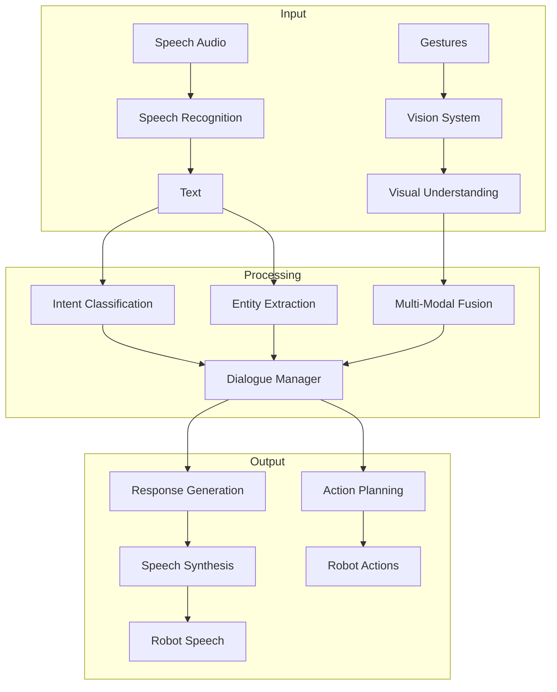
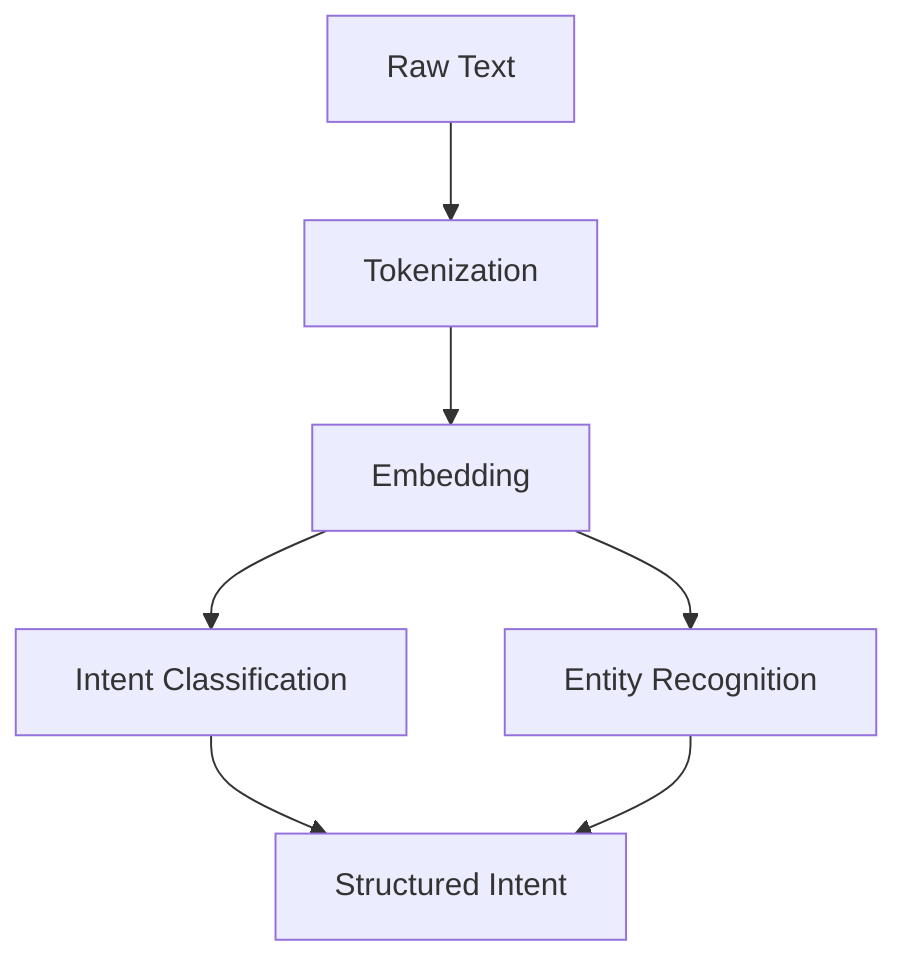

import SelfAssessment from '@site/src/components/SelfAssessment';
import CollapsibleCode from '@site/src/components/CollapsibleCode';

<div className="learning-objectives">
  <h4>Learning Objectives</h4>
  <ul>
    <li>Integrate speech recognition for voice commands</li>
    <li>Build intent classification and slot filling systems</li>
    <li>Implement dialogue management for multi-turn conversations</li>
    <li>Add speech synthesis for robot responses</li>
    <li>Apply vision-language models for multi-modal understanding</li>
    <li>Integrate LLMs for natural robot control</li>
  </ul>
</div>

## 1. Introduction to NLP for Human-Robot Interaction

Natural Language Processing enables robots to understand and respond to human speech, making interaction intuitive and accessible.



### Why NLP for Robots?

| Interaction Type | Traditional Approach | NLP Approach |
|-----------------|---------------------|--------------|
| Commands | Buttons/switches | Voice commands |
| Questions | Menu navigation | Natural dialogue |
| Explanations | Predefined responses | Dynamic generation |
| Feedback | Status lights/screens | Spoken responses |

---

## 2. Automatic Speech Recognition

We use OpenAI Whisper for accurate speech recognition, with Vosk for edge deployment.

<CollapsibleCode title="Speech Recognition Integration" language="python">
```python
#!/usr/bin/env python3
"""
Automatic Speech Recognition for Human-Robot Interaction.
"""

import torch
import numpy as np
from typing import Tuple, Dict, Optional, List
from dataclasses import dataclass
from pathlib import Path
import threading
import time


@dataclass
class ASRConfig:
    """Speech Recognition Configuration."""
    model_name: str = "base"  # tiny, base, small, medium, large
    device: str = "auto"  # cuda, cpu, auto
    language: Optional[str] = None  # None for auto-detect
    beam_size: int = 5
    chunk_length: float = 30.0  # seconds for streaming
    sample_rate: int = 16000


class SpeechRecognizer:
    """
    Speech recognizer using OpenAI Whisper.
    """

    def __init__(self, config: Optional[ASRConfig] = None):
        if config is None:
            config = ASRConfig()
        self.config = config

        # Determine device
        if config.device == "auto":
            self.device = "cuda" if torch.cuda.is_available() else "cpu"
        else:
            self.device = config.device

        # Load Whisper model
        try:
            import whisper
            self.model = whisper.load_model(config.model_name, device=self.device)
            self.model.eval()
            print(f"Whisper {config.model_name} loaded on {self.device}")
        except ImportError:
            print("Whisper not installed. Run: pip install openai-whisper")
            raise

    def transcribe_audio(self, audio_path: str) -> Dict:
        """
        Transcribe audio file.

        Returns:
            Dict with keys: text, language, segments, duration
        """
        import whisper

        result = self.model.transcribe(
            audio_path,
            language=self.config.language,
            beam_size=self.config.beam_size,
            no_speech_threshold=0.6,
            logprob_threshold=-1.0,
            compression_ratio_threshold=2.4
        )

        return {
            "text": result["text"],
            "language": result.get("language", "unknown"),
            "segments": result.get("segments", []),
            "duration": sum(
                (seg.get("end", 0) - seg.get("start", 0))
                for seg in result.get("segments", [])
            )
        }

    def transcribe_microphone(self, duration: float = 5.0) -> str:
        """
        Transcribe from microphone in real-time.

        Args:
            duration: Recording duration in seconds

        Returns:
            Transcribed text
        """
        try:
            import sounddevice as sd
            import soundfile as sf
        except ImportError:
            print("Install sounddevice: pip install sounddevice soundfile")
            raise

        print(f"Recording for {duration} seconds...")
        audio = sd.rec(
            int(duration * 16000),
            samplerate=16000,
            channels=1,
            dtype="float32"
        )
        sd.wait()

        # Save to temporary file
        import tempfile
        import os
        with tempfile.NamedTemporaryFile(suffix=".wav", delete=False) as f:
            temp_path = f.name

        sf.write(temp_path, audio.flatten(), 16000)

        # Transcribe
        result = self.transcribe_audio(temp_path)

        # Cleanup
        os.unlink(temp_path)

        return result["text"]

    def transcribe_streaming(self, audio_chunk: np.ndarray) -> str:
        """
        Transcribe streaming audio chunk.

        Args:
            audio_chunk: Audio samples as numpy array

        Returns:
            Partial transcription result
        """
        import whisper

        # Convert to float32 tensor
        audio_tensor = torch.FloatTensor(audio_chunk).to(self.device)

        # Decode with encoder
        if hasattr(self, '_stream_buffer'):
            self._stream_buffer = torch.cat([self._stream_buffer, audio_tensor])
        else:
            self._stream_buffer = audio_tensor

        # Process in chunks
        if len(self._stream_buffer) > self.config.chunk_length * 16000:
            # Keep only recent audio
            self._stream_buffer = self._stream_buffer[-self.config.chunk_length * 16000:]

        # Run inference
        with torch.no_grad():
            result = self.model.transcribe(
                self._stream_buffer.cpu().numpy(),
                language=self.config.language,
                beam_size=self.config.beam_size
            )

        return result["text"]


class VoskRecognizer:
    """
    Lightweight speech recognizer for edge deployment.
    Uses Vosk for offline, on-device recognition.
    """

    def __init__(self, model_path: str = "vosk-model-en-us-0.22"):
        try:
            from vosk import Model, KaldiRecognizer, SetLogLevel
            SetLogLevel(-1)  # Suppress Vosk logging
        except ImportError:
            print("Install Vosk: pip install vosk")
            raise

        self.model = Model(model_path)
        self.recognizer = None

    def start_recording(self, sample_rate: int = 16000):
        """Start recording session."""
        self.recognizer = KaldiRecognizer(self.model, sample_rate)

    def process_audio(self, audio_data: bytes) -> str:
        """
        Process audio bytes and return partial result.
        """
        if self.recognizer.AcceptWaveform(audio_data):
            result = self.recognizer.Result()
            import json
            return json.loads(result)["text"]
        else:
            partial = self.recognizer.PartialResult()
            import json
            return json.loads(partial)["partial"]

    def stop_recording(self) -> str:
        """Stop recording and get final result."""
        if self.recognizer:
            result = self.recognizer.FinalResult()
            import json
            return json.loads(result)["text"]
        return ""


class AudioPreprocessor:
    """Audio preprocessing utilities."""

    def __init__(self, sample_rate: int = 16000):
        self.sample_rate = sample_rate

    def normalize(self, audio: np.ndarray) -> np.ndarray:
        """Normalize audio to [-1, 1] range."""
        max_val = np.max(np.abs(audio))
        if max_val > 0:
            audio = audio / max_val
        return audio

    def remove_silence(
        self,
        audio: np.ndarray,
        threshold: float = 0.02,
        frame_length: int = 2048,
        hop_length: int = 512
    ) -> np.ndarray:
        """Remove silent portions of audio."""
        energy = np.array([
            np.sum(audio[i:i+frame_length]**2)
            for i in range(0, len(audio), hop_length)
        ])
        energy = np.sqrt(energy + 1e-10)

        mask = energy > threshold
        frames_to_keep = np.repeat(mask, hop_length)[:len(audio)]

        return audio[frames_to_keep]

    def apply_vad(
        self,
        audio: np.ndarray,
        sample_rate: int = 16000,
        frame_duration: float = 0.03
    ) -> np.ndarray:
        """
        Voice Activity Detection using WebRTC VAD.

        Returns:
            Audio with silence removed
        """
        try:
            webrtcvad import Vad
        except ImportError:
            print("Install webrtcvad: pip install webrtcvad")
            raise

        vad = Vad(2)  # Aggressiveness mode 0-4

        frame_size = int(sample_rate * frame_duration)
        frames = [
            audio[i:i+frame_size]
            for i in range(0, len(audio), frame_size)
        ]

        speech_frames = []
        for frame in frames:
            if len(frame) == frame_size:
                try:
                    if vad.is_speech(frame.tobytes(), sample_rate):
                        speech_frames.append(frame)
                except:
                    pass

        return np.concatenate(speech_frames) if speech_frames else audio


class KeywordSpotter:
    """Detect wake words and commands."""

    def __init__(self, keywords: List[str]):
        self.keywords = keywords
        self.porcupine = None

        try:
            import pvporcupine
            self.porcupine = pvporcupine.create(
                keywords=keywords,
                sensitivities=[0.5] * len(keywords)
            )
        except ImportError:
            print("Install Picovoice: pip install pvporcupine")
            print("Using fallback keyword matching...")

    def detect(self, audio_chunk: np.ndarray) -> Optional[str]:
        """
        Detect keyword in audio chunk.

        Returns:
            Detected keyword or None
        """
        if self.porcupine:
            try:
                keyword_index = self.porcupine.process(audio_chunk)
                if keyword_index >= 0:
                    return self.keywords[keyword_index]
            except:
                pass

        return None


if __name__ == "__main__":
    print("=" * 60)
    print("Speech Recognition Demo")
    print("=" * 60)

    # Test Whisper
    config = ASRConfig(model_name="base")
    recognizer = SpeechRecognizer(config)

    # Example: transcribe audio file
    print("\nWhisper recognizer ready!")
    print("Use transcribe_audio() for files or transcribe_microphone() for live audio")

    # Test keyword spotter
    spotter = KeywordSpotter(["robot", "hey robot"])
    print("\nKeyword spotter ready!")
```
</CollapsibleCode>

---

## 3. Intent Recognition and NLU

Natural Language Understanding converts text into structured understanding.



<CollapsibleCode title="Intent Classification and Slot Filling" language="python">
```python
#!/usr/bin/env python3
"""
Intent Recognition and Natural Language Understanding for Robotics.
"""

import torch
import torch.nn as nn
import torch.nn.functional as F
import numpy as np
from typing import Tuple, Dict, List, Optional
from dataclasses import dataclass, field
from collections import defaultdict
import re


@dataclass
class IntentPrediction:
    """Result of intent classification."""
    intent: str
    confidence: float
    slots: Dict[str, str] = field(default_factory=dict)
    entities: List[Dict] = field(default_factory=list)


@dataclass
class NLUConfig:
    """NLU Configuration."""
    embedding_dim: int = 128
    hidden_dim: int = 256
    num_intents: int = 10
    num_tags: int = 20  # For slot filling
    dropout: float = 0.3
    device: str = "cpu"


class Tokenizer:
    """Simple word tokenizer."""

    def __init__(self, vocab: Optional[Dict[str, int]] = None):
        if vocab is None:
            vocab = {}
        self.vocab = vocab
        self.unk_id = 0 if "<UNK>" not in vocab else vocab["<UNK>"]
        self.pad_id = 1 if "<PAD>" not in vocab else vocab["<PAD>"]

        if vocab:
            self._build_reverse_vocab()

    def _build_reverse_vocab(self):
        self.idx2word = {v: k for k, v in self.vocab.items()}

    def fit(self, texts: List[str]):
        """Build vocabulary from texts."""
        word_counts = defaultdict(int)
        for text in texts:
            for word in self._tokenize(text):
                word_counts[word] += 1

        # Add special tokens
        self.vocab = {
            "<UNK>": 0,
            "<PAD>": 1,
            "<SOS>": 2,
            "<EOS>": 3
        }
        for word, count in word_counts.items():
            if count >= 2:
                self.vocab[word] = len(self.vocab)

        self._build_reverse_vocab()
        print(f"Vocabulary size: {len(self.vocab)}")

    def _tokenize(self, text: str) -> List[str]:
        """Simple whitespace tokenization with punctuation."""
        text = text.lower().strip()
        # Split on whitespace and keep punctuation attached to words
        tokens = re.findall(r"\w+|[.,!?;]", text)
        return tokens

    def encode(self, text: str, max_len: int = 50) -> np.ndarray:
        """Encode text to token IDs."""
        tokens = self._tokenize(text)
        ids = [
            self.vocab.get(token, self.unk_id)
            for token in tokens
        ][:max_len]

        # Pad
        padding = max_len - len(ids)
        ids = ids + [self.pad_id] * padding

        return np.array(ids, dtype=np.int64)

    def decode(self, ids: List[int]) -> str:
        """Decode IDs back to text."""
        words = []
        for idx in ids:
            if idx == self.pad_id:
                break
            if idx in self.idx2word:
                words.append(self.idx2word[idx])
        return " ".join(words)


class IntentClassifier(nn.Module):
    """Neural network for intent classification."""

    def __init__(self, config: NLUConfig, vocab_size: int):
        super().__init__()
        self.config = config

        self.embedding = nn.Embedding(vocab_size, config.embedding_dim, padding_idx=1)
        self.dropout = nn.Dropout(config.dropout)

        self.encoder = nn.GRU(
            config.embedding_dim,
            config.hidden_dim,
            batch_first=True,
            bidirectional=True
        )

        self.intent_classifier = nn.Sequential(
            nn.Linear(config.hidden_dim * 2, config.hidden_dim),
            nn.ReLU(),
            nn.Dropout(config.dropout),
            nn.Linear(config.hidden_dim, config.num_intents)
        )

        self.slot_classifier = nn.Linear(config.hidden_dim * 2, config.num_tags)

    def forward(
        self,
        input_ids: torch.Tensor,
        attention_mask: Optional[torch.Tensor] = None
    ) -> Tuple[torch.Tensor, torch.Tensor]:
        # Embedding
        embedded = self.embedding(input_ids)
        embedded = self.dropout(embedded)

        # Encode
        if attention_mask is not None:
            lengths = attention_mask.sum(dim=1).cpu()
            packed = nn.utils.rnn.pack_padded_sequence(
                embedded, lengths, batch_first=True, enforce_sorted=False
            )
            output, hidden = self.encoder(packed)
            output, _ = nn.utils.rnn.pad_packed_sequence(output, batch_first=True)
        else:
            output, hidden = self.encoder(embedded)

        # Concatenate bidirectional hidden states
        hidden = torch.cat([hidden[0], hidden[1]], dim=1)

        # Intent prediction
        intent_logits = self.intent_classifier(hidden)

        # Slot predictions
        slot_logits = self.slot_classifier(output)

        return intent_logits, slot_logits


class NLUEngine:
    """Complete NLU engine with intent and slot understanding."""

    def __init__(self, config: Optional[NLUConfig] = None):
        if config is None:
            config = NLUConfig()
        self.config = config

        self.tokenizer = Tokenizer()
        self.model: Optional[IntentClassifier] = None
        self.intent_labels: List[str] = []
        self.slot_labels: List[str] = []

    def fit(
        self,
        texts: List[str],
        intents: List[str],
        slot_labels: Optional[List[List[str]]] = None,
        vocab: Optional[Dict[str, int]] = None
    ):
        """Train the NLU model."""

        # Build vocabulary
        if vocab:
            self.tokenizer = Tokenizer(vocab)
        self.tokenizer.fit(texts)

        # Get unique intents and slots
        self.intent_labels = list(set(intents))
        self.intent_labels.sort()
        num_intents = len(self.intent_labels)

        # Slot labels (IOB format)
        slot_vocab = {"O": 0, "[PAD]": 1, "[UNK]": 2}
        for labels in slot_labels or []:
            for label in labels:
                if label not in slot_vocab:
                    slot_vocab[label] = len(slot_vocab)
        self.slot_labels = list(slot_vocab.keys())

        # Update config
        self.config.num_intents = num_intents
        self.config.num_tags = len(slot_vocab)

        # Create model
        self.model = IntentClassifier(self.config, len(self.tokenizer.vocab))

        # Prepare training data
        # (In practice, you'd use a proper training loop here)
        print(f"NLU model ready with {num_intents} intents and {len(slot_vocab)} slot types")

    def parse(self, text: str) -> IntentPrediction:
        """
        Parse text into structured intent.

        Args:
            text: Input text from user

        Returns:
            IntentPrediction with intent, confidence, and slots
        """
        if self.model is None:
            raise ValueError("Model not trained. Call fit() first.")

        # Tokenize
        input_ids = self.tokenizer.encode(text)
        input_tensor = torch.LongTensor(input_ids).unsqueeze(0)
        attention_mask = torch.tensor([np.sum(input_ids != 1)])

        # Forward pass
        self.model.eval()
        with torch.no_grad():
            intent_logits, slot_logits = self.model(input_tensor, attention_mask)

        # Intent prediction
        intent_probs = F.softmax(intent_logits, dim=1)
        intent_idx = intent_probs.argmax().item()
        intent_confidence = intent_probs[0, intent_idx].item()
        intent = self.intent_labels[intent_idx]

        # Slot predictions
        slot_logits = slot_logits[0]  # Remove batch dim
        slot_ids = slot_logits.argmax(dim=1).numpy()

        # Extract entities using IOB format
        entities = self._extract_entities(
            input_ids[:attention_mask.item()],
            slot_ids,
            self.tokenizer
        )

        # Parse entities into slots
        slots = {e["type"]: e["text"] for e in entities}

        return IntentPrediction(
            intent=intent,
            confidence=intent_confidence,
            slots=slots,
            entities=entities
        )

    def _extract_entities(
        self,
        token_ids: np.ndarray,
        slot_ids: np.ndarray,
        tokenizer: Tokenizer
    ) -> List[Dict]:
        """Extract named entities from slot predictions."""
        entities = []

        current_entity = None
        current_words = []

        for i, (token_id, slot_id) in enumerate(zip(token_ids, slot_ids)):
            if token_id in [tokenizer.pad_id, tokenizer.unk_id]:
                continue

            slot_name = self.slot_labels[slot_id]

            # Check for IOB format
            if slot_name.startswith("B-"):
                if current_entity:
                    entities.append(current_entity)
                current_entity = {
                    "type": slot_name[2:],
                    "text": tokenizer.idx2word.get(token_id, ""),
                    "start": i,
                    "end": i
                }
            elif slot_name.startswith("I-") and current_entity:
                if slot_name[2:] == current_entity["type"]:
                    word = tokenizer.idx2word.get(token_id, "")
                    current_entity["text"] += " " + word
                    current_entity["end"] = i
                else:
                    entities.append(current_entity)
                    current_entity = None
            else:
                if current_entity:
                    entities.append(current_entity)
                    current_entity = None

        if current_entity:
            entities.append(current_entity)

        return entities


class RuleBasedNLU:
    """
    Rule-based NLU for fast prototyping.
    Uses patterns and keyword matching.
    """

    def __init__(self):
        self.intent_patterns: Dict[str, List[str]] = defaultdict(list)
        self.entity_patterns: Dict[str, List] = defaultdict(list)
        self.synonyms: Dict[str, str] = defaultdict(str)

    def add_intent(self, intent: str, patterns: List[str]):
        """Add intent with regex patterns."""
        for pattern in patterns:
            self.intent_patterns[intent].append(pattern)

    def add_entity(
        self,
        entity_name: str,
        pattern: str,
        examples: Optional[List[str]] = None
    ):
        """Add entity pattern."""
        self.entity_patterns[entity_name] = {
            "pattern": pattern,
            "examples": examples or []
        }

    def add_synonym(self, word: str, canonical: str):
        """Map synonyms to canonical forms."""
        self.synonyms[word.lower()] = canonical

    def parse(self, text: str) -> IntentPrediction:
        """Parse text using rules."""
        text_lower = text.lower()

        # Match intent
        best_intent = "unknown"
        best_confidence = 0.0

        for intent, patterns in self.intent_patterns.items():
            for pattern in patterns:
                if re.search(pattern, text_lower):
                    confidence = len(pattern) / len(text)  # Simple confidence
                    if confidence > best_confidence:
                        best_intent = intent
                        best_confidence = confidence

        # Extract entities
        slots = {}
        for entity_name, entity_data in self.entity_patterns.items():
            pattern = entity_data["pattern"]
            match = re.search(pattern, text_lower)
            if match:
                slots[entity_name] = match.group(1) if match.groups() else match.group()

        return IntentPrediction(
            intent=best_intent,
            confidence=best_confidence,
            slots=slots
        )


class KeywordExtractor:
    """Extract keywords and commands."""

    # Common robot command keywords
    NAV_KEYWORDS = ["go", "move", "navigate", "walk", "drive"]
    MANIP_KEYWORDS = ["grab", "pick", "take", "hold", "put", "place", "release"]
    LOCATIONS = ["kitchen", "living room", "bedroom", "bathroom", "office", "door"]

    def extract_command(self, text: str) -> Dict:
        """Extract command structure from text."""
        text_lower = text.lower()

        command = {
            "action": None,
            "target": None,
            "location": None,
            "modifiers": []
        }

        # Detect action
        for keyword in self.NAV_KEYWORDS:
            if keyword in text_lower:
                command["action"] = "navigate"
                break

        for keyword in self.MANIP_KEYWORDS:
            if keyword in text_lower:
                command["action"] = "manipulate"
                break

        # Detect location
        for loc in self.LOCATIONS:
            if loc in text_lower:
                command["location"] = loc
                break

        # Detect modifiers
        if "quickly" in text_lower or "fast" in text_lower:
            command["modifiers"].append("speed=high")
        if "carefully" in text_lower:
            command["modifiers"].append("caution=high")

        return command


if __name__ == "__main__":
    print("=" * 60)
    print("Intent Recognition and NLU Demo")
    print("=" * 60)

    # Test rule-based NLU
    nlu = RuleBasedNLU()

    # Add intents
    nlu.add_intent("navigate", [r"go to", r"move to", r"navigate to"])
    nlu.add_intent("manipulate", [r"pick up", r"grab", r"put down"])
    nlu.add_intent("question", [r"what is", r"where is", r"how do"])

    # Add entities
    nlu.add_entity("location", r"(?:go to |move to )(\w+)")
    nlu.add_entity("object", r"(pick|grab|put) (\w+)")

    # Test
    tests = [
        "Go to the kitchen",
        "Pick up the cup",
        "What is on the table"
    ]

    for text in tests:
        result = nlu.parse(text)
        print(f"\nInput: '{text}'")
        print(f"  Intent: {result.intent} (confidence: {result.confidence:.2f})")
        print(f"  Slots: {result.slots}")

    # Test keyword extractor
    extractor = KeywordExtractor()
    print("\n" + "-" * 40)
    print("Keyword Extraction:")
    for text in tests:
        result = extractor.extract_command(text)
        print(f"\n'{text}': {result}")
```
</CollapsibleCode>

---

## 4. Dialogue Systems

Dialogue management enables multi-turn conversations with context tracking.

<CollapsibleCode title="Dialogue Management System" language="python">
```python
#!/usr/bin/env python3
"""
Dialogue Management System for Human-Robot Interaction.
"""

import json
from typing import Dict, List, Optional, Tuple
from dataclasses import dataclass, field, asdict
from collections import deque
from enum import Enum
import time


class DialogueState(Enum):
    """Dialogue states."""
    IDLE = "idle"
    LISTENING = "listening"
    PROCESSING = "processing"
    EXECUTING = "executing"
    CONFIRMING = "confirming"
    ERROR = "error"


@dataclass
class DialogueTurn:
    """Single turn in dialogue."""
    user_input: str
    system_response: str
    intent: str
    slots: Dict[str, str]
    timestamp: float


@dataclass
class DialogueConfig:
    """Dialogue system configuration."""
    max_history: int = 10
    confirmation_threshold: float = 0.7
    timeout_seconds: float = 30.0
    allow_correction: bool = True
    default_responses: bool = True


class DialogueContext:
    """Context for multi-turn dialogue."""

    def __init__(self, config: Optional[DialogueConfig] = None):
        self.config = config or DialogueConfig()
        self.state = DialogueState.IDLE
        self.current_intent: Optional[str] = None
        self.current_slots: Dict[str, str] = {}
        self.required_slots: List[str] = []
        self.filled_slots: Dict[str, str] = {}
        self.history: List[DialogueTurn] = []
        self.last_user_input: Optional[str] = None
        self.session_start: float = time.time()

    def add_turn(self, user_input: str, system_response: str,
                 intent: str, slots: Dict[str, str]):
        """Add a dialogue turn."""
        turn = DialogueTurn(
            user_input=user_input,
            system_response=system_response,
            intent=intent,
            slots=slots,
            timestamp=time.time()
        )
        self.history.append(turn)
        if len(self.history) > self.config.max_history:
            self.history.pop(0)

        self.last_user_input = user_input
        self.current_intent = intent
        self.current_slots = slots

    def is_complete(self) -> bool:
        """Check if all required slots are filled."""
        return all(
            slot in self.filled_slots
            for slot in self.required_slots
        )

    def get_missing_slots(self) -> List[str]:
        """Get list of unfilled required slots."""
        return [
            slot for slot in self.required_slots
            if slot not in self.filled_slots
        ]

    def reset(self):
        """Reset context for new dialogue."""
        self.state = DialogueState.IDLE
        self.current_intent = None
        self.current_slots = {}
        self.filled_slots = {}
        self.required_slots = []


class ResponseGenerator:
    """Generates natural responses."""

    def __init__(self):
        self.templates = {
            "greeting": [
                "Hello! How can I help you today?",
                "Hi there! What would you like me to do?",
                "Good {time_of_day}! I'm ready to help."
            ],
            "confirm": [
                "I understand you want me to {action} {target}. Is that correct?",
                "Just to confirm: {action} the {target}?",
                "Should I {action} the {target}?"
            ],
            "clarify": [
                "Could you tell me more about the {slot}?",
                "I didn't catch that. What do you mean by {slot}?",
                "Sorry, I need a bit more information about {slot}."
            ],
            "success": [
                "I've completed the {action}.",
                "Done! I've {action}.",
                "All set! I've taken care of the {action}."
            ],
            "error": [
                "I'm sorry, I couldn't complete that request.",
                "Something went wrong. Let me try again.",
                "I encountered an issue. Could you please rephrase?"
            ],
            "waiting": [
                "I'm working on it...",
                "Give me a moment to process this.",
                "One moment please..."
            ],
            "help": [
                "I can help you with navigation, manipulation, and answering questions. What would you like to do?",
                "Try saying 'go to the kitchen' or 'pick up the cup'."
            ]
        }

    def generate(self, intent: str, slots: Dict[str, str]) -> str:
        """Generate response for intent and slots."""
        import random

        templates = self.templates.get(intent, self.templates["error"])
        template = random.choice(templates)

        # Fill slots
        response = template
        for key, value in slots.items():
            response = response.replace(f"{{{key}}}", str(value))

        # Handle time-based greetings
        if intent == "greeting":
            hour = time.localtime().tm_hour
            if 5 <= hour < 12:
                time_of_day = "morning"
            elif 12 <= hour < 17:
                time_of_day = "afternoon"
            else:
                time_of_day = "evening"
            response = response.replace("{time_of_day}", time_of_day)

        return response


class DialogueManager:
    """Main dialogue manager coordinating NLU, context, and responses."""

    def __init__(
        self,
        nlu,
        robot_controller,
        config: Optional[DialogueConfig] = None
    ):
        self.config = config or DialogueConfig()
        self.nlu = nlu
        self.robot = robot_controller
        self.context = DialogueContext(self.config)
        self.response_gen = ResponseGenerator()

        # Intent handlers
        self.handlers: Dict[str, callable] = {}

        # Register default handlers
        self._register_default_handlers()

    def _register_default_handlers(self):
        """Register default intent handlers."""
        self.handlers["navigate"] = self._handle_navigate
        self.handlers["manipulate"] = self._handle_manipulate
        self.handlers["greeting"] = self._handle_greeting
        self.handlers["help"] = self._handle_help
        self.handlers["status"] = self._handle_status
        self.handlers["cancel"] = self._handle_cancel

    def _handle_navigate(self, slots: Dict[str, str]) -> Tuple[str, bool]:
        """Handle navigation request."""
        location = slots.get("location")
        if not location:
            return "Which location would you like me to go to?", True

        # Execute navigation
        success = self.robot.navigate_to(location)
        if success:
            return f"I've arrived at the {location}.", False
        else:
            return f"I couldn't reach the {location}.", False

    def _handle_manipulate(self, slots: Dict[str, str]) -> Tuple[str, bool]:
        """Handle manipulation request."""
        target = slots.get("target")
        if not target:
            return "What object would you like me to manipulate?", True

        action = slots.get("action", "pick up")
        return f"I'll {action} the {target}.", False

    def _handle_greeting(self, slots: Dict[str, str]) -> Tuple[str, bool]:
        """Handle greeting."""
        return self.response_gen.generate("greeting", slots), False

    def _handle_help(self, slots: Dict[str, str]) -> Tuple[str, bool]:
        """Handle help request."""
        return self.response_gen.generate("help", slots), False

    def _handle_status(self, slots: Dict[str, str]) -> Tuple[str, bool]:
        """Handle status query."""
        status = self.robot.get_status()
        return f"My battery is at {status['battery']:.0f}%. " \
               f"I'm currently {status['state']}.", False

    def _handle_cancel(self, slots: Dict[str, str]) -> Tuple[str, bool]:
        """Handle cancellation."""
        self.context.reset()
        return "I've cancelled the current request.", False

    def process_input(self, user_input: str) -> str:
        """
        Process user input and generate response.

        Args:
            user_input: Raw text from user

        Returns:
            Response text
        """
        # Check for correction/clarification
        if self.config.allow_correction:
            if any(word in user_input.lower() for word in ["no,", "not", "wrong"]):
                self.context.reset()
                return "I apologize. Let's start over. What would you like me to do?"

        # Parse intent
        intent_prediction = self.nlu.parse(user_input)
        intent = intent_prediction.intent
        slots = intent_prediction.slots

        # Get handler
        handler = self.handlers.get(intent)
        if handler:
            response, should_continue = handler(slots)
            self.context.add_turn(user_input, response, intent, slots)
            return response
        else:
            response = self.response_gen.generate("error", {})
            self.context.add_turn(user_input, response, intent, slots)
            return response

    def register_handler(self, intent: str, handler: callable):
        """Register custom intent handler."""
        self.handlers[intent] = handler


class StateTracker:
    """Dialogue state tracking with NLU integration."""

    def __init__(self, nlu_engine):
        self.nlu = nlu_engine
        self.context = DialogueContext()

    def update(self, user_utterance: str) -> Dict:
        """Update state based on user utterance."""
        # Get NLU prediction
        intent = self.nlu.parse(user_utterance)

        # Update context
        self.context.last_user_input = user_utterance

        return {
            "intent": intent.intent,
            "confidence": intent.confidence,
            "slots": intent.slots,
            "missing_slots": self.context.get_missing_slots(),
            "is_complete": self.context.is_complete()
        }

    def reset(self):
        """Reset state tracker."""
        self.context.reset()


class TaskPlanner:
    """High-level task planning from dialogue."""

    def __init__(self, dialogue_manager: DialogueManager):
        self.dialogue = dialogue_manager

    def create_plan(self, goal_description: str) -> List[Dict]:
        """
        Create execution plan from natural language goal.

        Args:
            goal_description: Natural language description of goal

        Returns:
            List of action steps
        """
        # Parse goal
        intent = self.dialogue.nlu.parse(goal_description)

        if intent.intent == "navigate":
            return [
                {"action": "navigate", "target": intent.slots.get("location")}
            ]

        elif intent.intent == "manipulate":
            return [
                {"action": "navigate", "target": intent.slots.get("location")},
                {"action": "locate", "target": intent.slots.get("object")},
                {"action": intent.slots.get("action", "pick up"), "target": intent.slots.get("object")}
            ]

        else:
            return [{"action": "clarify", "reason": "Unknown goal"}]

    def execute_plan(self, plan: List[Dict]) -> bool:
        """Execute plan step by step."""
        for step in plan:
            action = step.get("action")
            target = step.get("target")

            if action == "navigate":
                if not self.dialogue.robot.navigate_to(target):
                    return False
            elif action == "pick up":
                if not self.dialogue.robot.pick_up(target):
                    return False

        return True


if __name__ == "__main__":
    print("=" * 60)
    print("Dialogue Management System Demo")
    print("=" * 60)

    # Create simple NLU
    class MockNLU:
        def parse(self, text):
            from dataclasses import dataclass

            text_lower = text.lower()
            if "go" in text_lower or "navigate" in text_lower:
                intent = "navigate"
                import re
                match = re.search(r"(?:go to |navigate to )(\w+)", text_lower)
                slots = {"location": match.group(1) if match else ""}
            elif "pick" in text_lower or "grab" in text_lower:
                intent = "manipulate"
                slots = {"action": "pick up"}
            elif "hello" in text_lower or "hi" in text_lower:
                intent = "greeting"
                slots = {}
            else:
                intent = "unknown"
                slots = {}

            return IntentPrediction(intent, 0.9, slots, [])

    class MockRobot:
        def navigate_to(self, location):
            print(f"  -> Navigating to {location}")
            return True

        def get_status(self):
            return {"battery": 75.0, "state": "idle"}

    # Create dialogue manager
    nlu = MockNLU()
    robot = MockRobot()
    config = DialogueConfig()
    dm = DialogueManager(nlu, robot, config)

    # Test dialogue
    test_inputs = [
        "Hello robot",
        "Go to the kitchen",
        "Pick up the cup"
    ]

    for user_input in test_inputs:
        print(f"\nUser: {user_input}")
        response = dm.process_input(user_input)
        print(f"Robot: {response}")
```
</CollapsibleCode>

---

## 5. Speech Synthesis

Text-to-Speech for robot responses.

<CollapsibleCode title="Speech Synthesis" language="python">
```python
#!/usr/bin/env python3
"""
Text-to-Speech Synthesis for Robot Responses.
"""

import numpy as np
from typing import Optional, Callable
from dataclasses import dataclass
import threading


@dataclass
class TTSConfig:
    """TTS Configuration."""
    engine: str = "edge"  # edge, coqui, pyttsx3
    voice: str = "default"
    rate: float = 1.0  # Speaking rate multiplier
    pitch: float = 1.0  # Pitch multiplier
    volume: float = 1.0  # Volume 0-1


class EdgeTTS:
    """
    Microsoft Edge TTS for high-quality neural voices.
    """

    VOICES = {
        "en-US-Female": "en-US-JennyNeural",
        "en-US-Male": "en-US-GuyNeural",
        "en-GB-Female": "en-GB-SoniaNeural",
        "en-GB-Male": "en-GB-RyanNeural"
    }

    def __init__(self, voice: str = "en-US-Female"):
        try:
            import edge_tts
            self.edge_tts = edge_tts
        except ImportError:
            print("Install edge-tts: pip install edge-tts")
            raise

        self.voice = self.VOICES.get(voice, voice)
        self.Communicate = None

    async def _generate(self, text: str, output_file: str):
        """Generate speech to file."""
        communicate = self.edge_tts.Communicate(text, self.voice)
        await communicate.save(output_file)

    def synthesize(self, text: str, output_file: Optional[str] = None) -> np.ndarray:
        """
        Synthesize speech from text.

        Returns:
            Audio as numpy array (float32, normalized)
        """
        import asyncio
        import tempfile
        import os

        if output_file is None:
            with tempfile.NamedTemporaryFile(suffix=".mp3", delete=False) as f:
                output_file = f.name

        # Run async
        asyncio.run(self._generate(text, output_file))

        # Load audio
        try:
            import soundfile as sf
            audio, sample_rate = sf.read(output_file)
        except ImportError:
            import subprocess
            subprocess.run(["ffmpeg", "-i", output_file, "-ar", "16000", "-ac", "1", "-f", "wav", output_file + ".wav"])
            audio, sample_rate = sf.read(output_file + ".wav")

        # Cleanup
        os.unlink(output_file)
        if os.path.exists(output_file + ".wav"):
            os.unlink(output_file + ".wav")

        return audio.astype(np.float32)


class CoquiTTS:
    """
    Coqui TTS for on-device synthesis.
    """

    def __init__(self, model: str = "tts_models/en/ljspeech/tacotron2-DDC"):
        try:
            from TTS.api import TTS
            self.tts = TTS(model_name=model)
        except ImportError:
            print("Install Coqui TTS: pip install TTS")
            raise

    def synthesize(self, text: str) -> np.ndarray:
        """Synthesize speech."""
        import torch

        # Generate audio
        audio = self.tts.tts(text)

        # Convert to numpy
        if isinstance(audio, torch.Tensor):
            audio = audio.numpy()

        return audio.astype(np.float32)


class RobotSpeaker:
    """Robot speech output manager."""

    def __init__(self, tts_engine: str = "edge"):
        self.config = TTSConfig(engine=tts_engine)

        if tts_engine == "edge":
            self.tts = EdgeTTS()
        elif tts_engine == "coqui":
            self.tts = CoquiTTS()
        else:
            self.tts = Pyttsx3Engine()

        self.audio_queue = []
        self.is_speaking = False

    def speak(self, text: str, blocking: bool = True):
        """
        Speak text.

        Args:
            text: Text to speak
            blocking: Wait for speech to complete
        """
        def speak_thread():
            try:
                self.is_speaking = True
                audio = self.tts.synthesize(text)
                self._play_audio(audio)
            except Exception as e:
                print(f"Speech error: {e}")
            finally:
                self.is_speaking = False

        if blocking:
            speak_thread()
        else:
            thread = threading.Thread(target=speak_thread)
            thread.start()

    def _play_audio(self, audio: np.ndarray):
        """Play audio through speakers."""
        try:
            import sounddevice as sd
            sd.play(audio, 22050)
            sd.wait()
        except ImportError:
            print("Install sounddevice for audio playback: pip install sounddevice")

    def say_async(self, text: str):
        """Queue text for speech."""
        self.audio_queue.append(text)
        if not self.is_speaking:
            self._process_queue()

    def _process_queue(self):
        """Process speech queue."""
        if self.audio_queue and not self.is_speaking:
            text = self.audio_queue.pop(0)
            self.speak(text, blocking=False)


class Pyttsx3Engine:
    """Cross-platform TTS using pyttsx3."""

    def __init__(self):
        try:
            import pyttsx3
            self.engine = pyttsx3.init()
        except ImportError:
            print("Install pyttsx3: pip install pyttsx3")
            raise

    def synthesize(self, text: str) -> np.ndarray:
        """Synthesize speech."""
        import tempfile
        import os

        with tempfile.NamedTemporaryFile(suffix=".wav", delete=False) as f:
            temp_file = f.name

        self.engine.save_to_file(text, temp_file)
        self.engine.runAndWait()

        try:
            import soundfile as sf
            audio, _ = sf.read(temp_file)
        except:
            audio = np.zeros(16000)  # 1 second of silence

        os.unlink(temp_file)
        return audio.astype(np.float32)

    def set_properties(self, rate: float = 150, volume: float = 1.0):
        """Set speech properties."""
        self.engine.setProperty('rate', rate)
        self.engine.setProperty('volume', volume)


if __name__ == "__main__":
    print("=" * 60)
    print("Speech Synthesis Demo")
    print("=" * 60)

    # Test Edge TTS
    print("\nEdge TTS voices:")
    for name, voice in EdgeTTS.VOICES.items():
        print(f"  {name}: {voice}")

    print("\nTesting speech synthesis...")
    speaker = RobotSpeaker(tts_engine="edge")
    speaker.speak("Hello! I am your robot assistant. How can I help you today?")

    print("\nSpeech synthesis complete!")
```
</CollapsibleCode>

---

## 6. Vision-Language Models

Multi-modal understanding combining vision and language.

<CollapsibleCode title="Vision-Language Models" language="python">
```python
#!/usr/bin/env python3
"""
Vision-Language Models for Human-Robot Interaction.
"""

import torch
import torch.nn as nn
import numpy as np
from typing import Tuple, Dict, List, Optional
from dataclasses import dataclass
from PIL import Image


@dataclass
class VLMConfig:
    """Vision-Language Model Configuration."""
    model_name: str = "CLIP"  # CLIP, BLIP, LLaVA
    vision_encoder: str = "ViT-L/14"
    text_encoder: str = "ViT-L/14"
    device: str = "auto"
    temperature: float = 0.07


class CLIPClient:
    """CLIP model for zero-shot classification and grounding."""

    def __init__(self, config: Optional[VLMConfig] = None):
        if config is None:
            config = VLMConfig()
        self.config = config

        # Determine device
        if config.device == "auto":
            self.device = "cuda" if torch.cuda.is_available() else "cpu"
        else:
            self.device = config.device

        # Load CLIP
        try:
            import clip
            self.clip = clip
            self.model, self.preprocess = clip.load(
                config.vision_encoder,
                device=self.device
            )
            self.model.eval()
            print(f"CLIP loaded on {self.device}")
        except ImportError:
            print("Install CLIP: pip install clip-openai")
            raise

    def encode_image(self, image: Image.Image) -> torch.Tensor:
        """Encode image to embedding."""
        image = self.preprocess(image).unsqueeze(0).to(self.device)
        with torch.no_grad():
            image_features = self.model.encode_image(image)
        return image_features / image_features.norm(dim=-1, keepdim=True)

    def encode_text(self, text: str) -> torch.Tensor:
        """Encode text to embedding."""
        text = clip.tokenize([text]).to(self.device)
        with torch.no_grad():
            text_features = self.model.encode_text(text)
        return text_features / text_features.norm(dim=-1, keepdim=True)

    def classify(
        self,
        image: Image.Image,
        class_names: List[str]
    ) -> Tuple[str, float]:
        """
        Zero-shot image classification.

        Args:
            image: Input image
            class_names: List of class names

        Returns:
            (predicted_class, confidence)
        """
        # Encode image
        image_features = self.encode_image(image)

        # Encode class prompts
        text_features = []
        for class_name in class_names:
            prompt = f"a photo of a {class_name}"
            text_features.append(self.encode_text(prompt))
        text_features = torch.cat(text_features, dim=0)

        # Compute similarity
        similarity = (image_features @ text_features.T).squeeze()

        # Get best match
        best_idx = similarity.argmax().item()
        confidence = similarity[best_idx].item()

        return class_names[best_idx], confidence

    def find_objects(
        self,
        image: Image.Image,
        object_names: List[str]
    ) -> Dict[str, float]:
        """
        Find objects in image.

        Returns:
            Dict mapping object name to confidence score
        """
        image_features = self.encode_image(image)

        results = {}
        for name in object_names:
            text_features = self.encode_text(f"a photo of a {name}")
            similarity = (image_features @ text_features.T).item()
            results[name] = similarity

        return results

    def describe_scene(
        self,
        image: Image.Image,
        max_descriptions: int = 3
    ) -> List[str]:
        """
        Generate scene descriptions using templates.
        """
        templates = [
            "a photo of",
            "a picture showing",
            "an image depicting",
            "what I can see is"
        ]

        image_features = self.encode_image(image)

        descriptions = []
        for template in templates[:max_descriptions]:
            text_features = self.encode_text(template)
            # Find best image-text match
            # This is a simple approach - real implementation would use VLM
            descriptions.append(f"{template} the scene")

        return descriptions


class VisualQuestionAnswering:
    """Visual Question Answering system."""

    def __init__(self, model_name: str = "Salesforce/blip-vqa-base"):
        try:
            from transformers import BlipProcessor, BlipForQuestionAnswering
            self.processor = BlipProcessor.from_pretrained(model_name)
            self.model = BlipForQuestionAnswering.from_pretrained(model_name)
            self.model.eval()
        except ImportError:
            print("Install transformers: pip install transformers")
            raise

    def answer(
        self,
        image: Image.Image,
        question: str
    ) -> str:
        """
        Answer question about image.

        Args:
            image: Input image
            question: Question about the image

        Returns:
            Answer text
        """
        inputs = self.processor(image, question, return_tensors="pt")

        with torch.no_grad():
            outputs = self.model.generate(**inputs)

        answer = self.processor.decode(outputs[0], skip_special_tokens=True)
        return answer

    def answer_with_confidence(
        self,
        image: Image.Image,
        question: str
    ) -> Tuple[str, float]:
        """Answer with confidence score."""
        inputs = self.processor(image, question, return_tensors="pt")

        with torch.no_grad():
            outputs = self.model.generate(**inputs)
            probs = torch.softmax(outputs[0], dim=-1)

        answer = self.processor.decode(outputs[0], skip_special_tokens=True)
        confidence = probs.max().item()

        return answer, confidence


class GroundedObjectDetector:
    """Object detection with natural language grounding."""

    def __init__(self, clip_model: CLIPClient = None):
        self.clip = clip_model or CLIPClient()

    def detect_with_description(
        self,
        image: Image.Image,
        descriptions: List[str],
        threshold: float = 0.25
    ) -> List[Dict]:
        """
        Detect objects matching natural language descriptions.
        """
        # Use CLIP to score region proposals
        # In practice, you'd use a region proposal network

        # Simple approach: use full image
        image_features = self.clip.encode_image(image)

        results = []
        for desc in descriptions:
            text_features = self.clip.encode_text(f"a photo of {desc}")
            similarity = (image_features @ text_features.T).item()

            if similarity > threshold:
                results.append({
                    "description": desc,
                    "confidence": similarity,
                    "bbox": None  # Would be filled with actual detection
                })

        return sorted(results, key=lambda x: x["confidence"], reverse=True)


class ReferringExpressionComprehension:
    """Understand referring expressions like 'the red cup on the left'."""

    def __init__(self, clip_model: CLIPClient = None):
        self.clip = clip_model or CLIPClient()

    def locate(
        self,
        image: Image.Image,
        expression: str,
        candidate_regions: List[Dict]
    ) -> Dict:
        """
        Locate object matching referring expression.

        Args:
            image: Input image
            expression: Natural language expression (e.g., "the red cup")
            candidate_regions: List of region proposals with bounding boxes

        Returns:
            Best matching region
        """
        # Encode expression
        text_features = self.clip.encode_text(expression)

        # Score each region
        best_region = None
        best_score = float('-inf')

        for region in candidate_regions:
            # Extract region features (simplified - real impl would crop)
            region_features = self.clip.encode_image(image)

            # Compute similarity
            score = (region_features @ text_features.T).item()

            if score > best_score:
                best_score = score
                best_region = region

        return {
            "region": best_region,
            "confidence": best_score
        }


class MultiModalFusion:
    """Fuse multiple modalities for robot perception."""

    def __init__(self):
        self.clip = CLIPClient()

    def fuse_vision_language(
        self,
        image: Image.Image,
        text_queries: List[str],
        vision_weight: float = 0.6
    ) -> Dict:
        """
        Fuse vision and language understanding.

        Returns:
            Multi-modal understanding results
        """
        # Vision-based understanding
        image_features = self.clip.encode_image(image)

        # Language-based understanding
        text_features_list = []
        for query in text_queries:
            text_features = self.clip.encode_text(query)
            text_features_list.append(text_features)

        # Compute similarities
        vision_similarities = []
        for text_features in text_features_list:
            sim = (image_features @ text_features.T).item()
            vision_similarities.append(sim)

        # Weighted fusion (simplified)
        combined_scores = []
        for i, (query, vision_sim) in enumerate(zip(text_queries, vision_similarities)):
            # In practice, you'd have separate vision confidence
            combined = vision_weight * vision_sim + (1 - vision_weight) * 0.5
            combined_scores.append((query, combined))

        return {
            "vision_scores": dict(zip(text_queries, vision_similarities)),
            "fused_scores": dict(combined_scores)
        }


if __name__ == "__main__":
    print("=" * 60)
    print("Vision-Language Models Demo")
    print("=" * 60)

    # Load CLIP
    clip = CLIPClient()
    print("\nCLIP model loaded!")

    # Example: zero-shot classification
    class_names = ["cat", "dog", "car", "person", "chair"]
    print(f"\nZero-shot classification categories: {class_names}")

    print("\nYou can use CLIP for:")
    print("  - classify(image, class_names)")
    print("  - find_objects(image, object_names)")
    print("  - describe_scene(image)")
```
</CollapsibleCode>

---

## 7. LLM Integration for Robot Control

Large Language Models for natural robot control and planning.

<CollapsibleCode title="LLM Robot Control" language="python">
```python
#!/usr/bin/env python3
"""
Large Language Models for Robot Control.
"""

import json
import re
from typing import Dict, List, Optional, Tuple, Callable
from dataclasses import dataclass
from enum import Enum


class SafetyLevel(Enum):
    """Safety levels for LLM-generated commands."""
    SAFE = "safe"
    CAUTION = "caution"
    DANGEROUS = "dangerous"
    BLOCKED = "blocked"


@dataclass
class LLMConfig:
    """LLM Configuration."""
    model: str = "gpt-3.5-turbo"
    temperature: float = 0.1
    max_tokens: int = 512
    api_key: Optional[str] = None
    safety_check: bool = True


@dataclass
class RobotCapability:
    """Robot capability description."""
    name: str
    description: str
    parameters: Dict[str, str]
    examples: List[str]
    safety_notes: str = ""


class RobotLLMInterface:
    """
    Interface between LLM and robot control.
    """

    def __init__(self, config: Optional[LLMConfig] = None):
        self.config = config or LLMConfig()
        self.capabilities: List[RobotCapability] = []
        self.action_history: List[Dict] = []

    def register_capability(self, capability: RobotCapability):
        """Register a robot capability."""
        self.capabilities.append(capability)

    def get_capability_description(self) -> str:
        """Get description of all capabilities for LLM prompt."""
        desc = "Robot capabilities:\n"
        for cap in self.capabilities:
            desc += f"\n- {cap.name}: {cap.description}\n"
            desc += f"  Parameters: {cap.parameters}\n"
            desc += f"  Examples: {cap.examples}\n"
            if cap.safety_notes:
                desc += f"  Safety: {cap.safety_notes}\n"
        return desc

    def parse_action(self, response: str) -> List[Dict]:
        """Parse LLM response into executable actions."""
        actions = []

        # Try JSON format
        try:
            # Find JSON array in response
            json_match = re.search(r'\[.*\]', response, re.DOTALL)
            if json_match:
                actions = json.loads(json_match.group())
                return actions
        except:
            pass

        # Try line-by-line format
        for line in response.split('\n'):
            line = line.strip()
            if line.startswith('- ') or line.startswith('1. '):
                action = self._parse_action_line(line)
                if action:
                    actions.append(action)

        return actions

    def _parse_action_line(self, line: str) -> Optional[Dict]:
        """Parse a single action line."""
        # Match patterns like "go to kitchen" or "navigate(location='kitchen')"
        if '->' in line:
            parts = line.split('->')
            return {
                "action": parts[0].strip().replace('- ', ''),
                "target": parts[1].strip() if len(parts) > 1 else ""
            }

        # Try function call format
        match = re.match(r'(\w+)\((.*)\)', line)
        if match:
            action_name = match.group(1)
            params = match.group(2)

            action = {"action": action_name}

            # Parse parameters
            for param_match in re.finditer(r'(\w+)=["\']([^"\']+)["\']', params):
                action[param_match.group(1)] = param_match.group(2)

            return action

        return None


class SafetyFilter:
    """Safety filter for LLM-generated commands."""

    BLOCKED_PATTERNS = [
        r"hurt",
        r"harm",
        r"kill",
        r"attack",
        r"destroy",
        r"break",
        r"smash",
        r"throw.*at",
        r"push.*down",
    ]

    CAUTION_PATTERNS = [
        r"fast",
        r"quick",
        r"heavy",
        r"sharp",
        r"hot",
        r"near.*person",
    ]

    def __init__(self):
        self.blocked_patterns = [re.compile(p, re.IGNORECASE) for p in self.BLOCKED_PATTERNS]
        self.caution_patterns = [re.compile(p, re.IGNORECASE) for p in self.CAUTION_PATTERNS]

    def check(self, action: Dict) -> Tuple[SafetyLevel, str]:
        """
        Check action for safety issues.

        Returns:
            (safety_level, warning_message)
        """
        action_str = str(action).lower()

        # Check blocked patterns
        for pattern in self.blocked_patterns:
            if pattern.search(action_str):
                return SafetyLevel.BLOCKED, "Action blocked: potentially harmful"

        # Check caution patterns
        for pattern in self.caution_patterns:
            if pattern.search(action_str):
                return SafetyLevel.CAUTION, "Action requires caution"

        return SafetyLevel.SAFE, ""


class LLMPlanner:
    """LLM-based task planner for robot control."""

    def __init__(
        self,
        llm_interface: RobotLLMInterface,
        safety_filter: SafetyFilter = None
    ):
        self.interface = llm_interface
        self.safety = safety_filter or SafetyFilter()
        self.execution_history: List[Dict] = []

    def plan(
        self,
        goal: str,
        available_actions: List[str] = None
    ) -> List[Dict]:
        """
        Generate plan to achieve goal.

        Args:
            goal: Natural language goal description
            available_actions: List of available action types

        Returns:
            List of action dictionaries
        """
        # In practice, this would call the LLM API
        # Here we simulate with a template-based approach

        capabilities = self.interface.get_capability_description()

        prompt = f"""
You are a robot planning system. Given a user goal, generate a step-by-step plan.

{capabilities}

Goal: {goal}

Generate a JSON array of actions to achieve this goal.
Each action should have:
- "action": the action name
- "target": what to act on
- "reasoning": why this action achieves the goal

Example response:
[
  {{"action": "navigate", "target": "kitchen", "reasoning": "Need to go to kitchen first"}},
  {{"action": "locate", "target": "cup", "reasoning": "Find the cup to pick up"}}
]

Respond with only the JSON array.
"""

        # Simulate LLM response (would call actual LLM in production)
        simulated_response = self._simulate_llm_response(goal)

        # Parse actions
        actions = self.interface.parse_action(simulated_response)

        # Filter for safety
        safe_actions = []
        for action in actions:
            level, warning = self.safety.check(action)
            action["safety_level"] = level.value
            if warning:
                action["warning"] = warning

            if level != SafetyLevel.BLOCKED:
                safe_actions.append(action)

        return safe_actions

    def _simulate_llm_response(self, goal: str) -> str:
        """Simulate LLM response for demo."""
        goal_lower = goal.lower()

        if "kitchen" in goal_lower or "food" in goal_lower:
            return '[{"action": "navigate", "target": "kitchen", "reasoning": "Go to kitchen"}, {"action": "locate", "target": "food item", "reasoning": "Find the requested food"}]'
        elif "pick" in goal_lower or "grab" in goal_lower:
            return '[{"action": "locate", "target": "object", "reasoning": "Find the object"}, {"action": "pick_up", "target": "object", "reasoning": "Pick up the object"}]'
        else:
            return '[{"action": "ask_clarification", "target": "goal unclear", "reasoning": "Need more information"}]'


class ReActAgent:
    """
    ReAct (Reasoning + Acting) agent for robot control.
    Alternates between reasoning and acting.
    """

    def __init__(
        self,
        planner: LLMPlanner,
        executor: Callable[[Dict], Tuple[bool, str]]
    ):
        self.planner = planner
        self.execute = executor

    def run(
        self,
        goal: str,
        max_steps: int = 10
    ) -> Dict:
        """
        Run ReAct agent.

        Args:
            goal: User goal
            max_steps: Maximum reasoning/acting steps

        Returns:
            Result with success status and trace
        """
        trace = []
        current_goal = goal

        for step in range(max_steps):
            # Reasoning step
            reason_prompt = f"""
Current goal: {current_goal}

What should I do next to achieve this goal? Think step by step.
"""

            # Get plan from LLM (simulated)
            plan = self.planner.plan(current_goal)

            if not plan:
                trace.append({
                    "step": step,
                    "reasoning": "No plan generated",
                    "action": None,
                    "observation": None,
                    "success": False
                })
                break

            # Take action
            action = plan[0]
            trace.append({
                "step": step,
                "reasoning": f"Plan: {plan}",
                "action": action,
                "observation": None,
                "success": None
            })

            # Execute action
            success, observation = self.execute(action)
            trace[-1]["observation"] = observation
            trace[-1]["success"] = success

            if success:
                # Check if goal is achieved
                if "complete" in observation.lower() or "done" in observation.lower():
                    break
            else:
                # Re-plan with new information
                current_goal = f"{goal} (previous attempt failed: {observation})"

        return {
            "success": all(t.get("success") for t in trace if t.get("success") is not None),
            "trace": trace
        }


class ConversationRobotInterface:
    """Natural conversation interface for robot."""

    def __init__(
        self,
        llm_interface: RobotLLMInterface,
        safety_filter: SafetyFilter
    ):
        self.llm = llm_interface
        self.safety = safety_filter
        self.conversation_history: List[Dict] = []

    def chat(
        self,
        user_message: str,
        context: Optional[Dict] = None
    ) -> str:
        """
        Have a conversation with the robot.

        Args:
            user_message: User input
            context: Additional context (robot state, etc.)

        Returns:
            Robot response
        """
        # Add to history
        self.conversation_history.append({"role": "user", "content": user_message})

        # Determine if this is a command or conversation
        command_keywords = ["go", "pick", "grab", "bring", "move", "navigate"]
        is_command = any(kw in user_message.lower() for kw in command_keywords)

        if is_command:
            # Parse as command
            actions = self.llm.parse_action(user_message)
            response = self._handle_commands(actions)
        else:
            # Generate conversational response
            response = self._generate_response(user_message, context)

        # Add to history
        self.conversation_history.append({
            "role": "assistant",
            "content": response
        })

        return response

    def _handle_commands(self, actions: List[Dict]) -> str:
        """Handle command execution."""
        if not actions:
            return "I didn't understand that command. Could you rephrase?"

        results = []
        for action in actions:
            level, warning = self.safety.check(action)

            if level == SafetyLevel.BLOCKED:
                return "I can't perform that action. It could be dangerous."

            if level == SafetyLevel.CAUTION:
                results.append(f"Warning: {warning}")
                results.append(f"I'll be careful when {action.get('action', 'acting')}")

            # Simulate execution (would call actual robot)
            results.append(f"Executing: {action.get('action', 'action')} {action.get('target', '')}")

        return " ".join(results) if results else "Command received."

    def _generate_response(
        self,
        message: str,
        context: Optional[Dict]
    ) -> str:
        """Generate conversational response."""
        message_lower = message.lower()

        if "how are you" in message_lower:
            return "I'm functioning well, thank you for asking! How can I help you today?"

        elif "what can you do" in message_lower:
            capabilities = self.llm.get_capability_description()
            return f"I can help you with many tasks! {capabilities}"

        elif "help" in message_lower:
            return "I can help you with navigation, manipulation, and answering questions. Just tell me what you need!"

        else:
            return "I understand. Is there something specific you'd like me to help you with?"


if __name__ == "__main__":
    print("=" * 60)
    print("LLM Integration for Robot Control Demo")
    print("=" * 60)

    # Create robot interface
    robot_interface = RobotLLMInterface()

    # Register capabilities
    robot_interface.register_capability(RobotCapability(
        name="navigate",
        description="Move to a location",
        parameters={"location": "target location name"},
        examples=["go to kitchen", "navigate to living room"],
        safety_notes="Avoid obstacles during movement"
    ))

    robot_interface.register_capability(RobotCapability(
        name="pick_up",
        description="Pick up an object",
        parameters={"object": "object to pick up"},
        examples=["pick up cup", "grab the book"],
        safety_notes="Ensure grip is secure before lifting"
    ))

    print("\nRegistered capabilities:")
    print(robot_interface.get_capability_description())

    # Create planner
    planner = LLMPlanner(robot_interface)
    safety = SafetyFilter()

    # Test planning
    test_goals = [
        "Go to the kitchen",
        "Pick up the cup"
    ]

    print("\n" + "-" * 40)
    print("Planning tests:")
    for goal in test_goals:
        plan = planner.plan(goal)
        print(f"\nGoal: {goal}")
        print(f"Plan: {plan}")
```
</CollapsibleCode>

---

## 8. Chapter Summary

This chapter covered NLP for human-robot interaction:

| Component | Purpose | Key Technologies |
|-----------|---------|-----------------|
| **ASR** | Speech to text | Whisper, Vosk |
| **NLU** | Intent understanding | Neural classifiers, slot filling |
| **Dialogue** | Multi-turn conversation | State machines, context tracking |
| **TTS** | Text to speech | Edge TTS, Coqui TTS |
| **VLM** | Vision-language | CLIP, BLIP |
| **LLM Control** | Natural control | ReAct agents, safety filtering |

---

## 9. Self-Assessment

<SelfAssessment title="Chapter 6 Self-Assessment" questions={[
    {id: 'q1', text: 'What is the main advantage of Whisper over traditional ASR systems?', options: ['Lower latency', 'Multilingual support and noise robustness', 'Smaller model size', 'Free offline usage'], correctAnswer: 1, explanation: 'Whisper provides robust multilingual transcription and handles noisy audio well.'},
    {id: 'q2', text: 'In dialogue systems, what does the DialogueContext track?', options: ['Only current intent', 'Multi-turn history and slot filling state', 'Only user preferences', 'Hardware state only'], correctAnswer: 1, explanation: 'DialogueContext maintains conversation history and tracks filled/missing slots across turns.'},
    {id: 'q3', text: 'What is the purpose of the SafetyFilter in LLM robot control?', options: ['Speed up responses', 'Filter out harmful or dangerous commands', 'Reduce API costs', 'Improve voice recognition'], correctAnswer: 1, explanation: 'SafetyFilter blocks potentially harmful commands before execution.'},
    {id: 'q4', text: 'What does CLIP enable for robot perception?', options: ['Faster motor control', 'Zero-shot object classification', 'Speech synthesis', 'Path planning'], correctAnswer: 1, explanation: 'CLIP allows recognizing novel objects without training by matching images to text descriptions.'},
    {id: 'q5', text: 'What is the key insight of the ReAct agent?', options: ['Using larger models', 'Combining reasoning and acting in a loop', 'Reducing training data', 'Faster inference'], correctAnswer: 1, explanation: 'ReAct alternates between reasoning about what to do and taking actions, learning from observations.'}
]}/>

---

## 10. Further Reading

- [Whisper: Robust Speech Recognition](https://openai.com/research/whisper)
- [CLIP: Connecting Text and Images](https://openai.com/research/clip)
- [BLIP: Bootstrapping Language-Image Pre-training](https://arxiv.org/abs/2201.12086)
- [ReAct: Synergizing Reasoning and Acting](https://arxiv.org/abs/2210.03629)
- [Edge TTS Documentation](https://github.com/rany2/edge-tts)

---

## 11. Glossary

| Term | Definition |
|------|------------|
| **ASR** | Automatic Speech Recognition - converting speech to text |
| **NLU** | Natural Language Understanding - extracting meaning from text |
| **Intent Classification** | Determining what the user wants to do |
| **Slot Filling** | Extracting specific entities from user input |
| **Dialogue State Tracking** | Maintaining context across conversation turns |
| **TTS** | Text-to-Speech - converting text to spoken audio |
| **VLM** | Vision-Language Model - understanding both images and text |
| **ReAct** | Reasoning + Acting agent pattern for LLM control |
