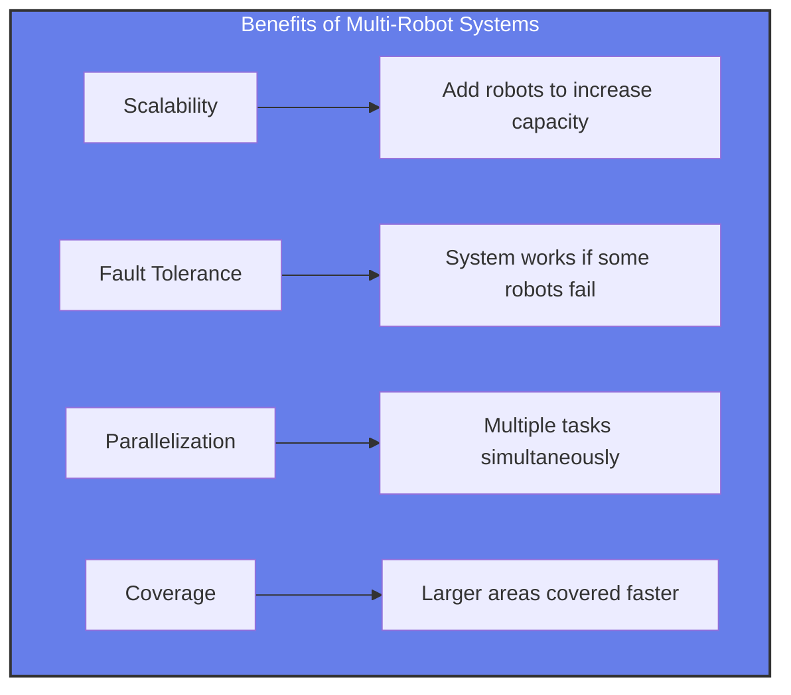
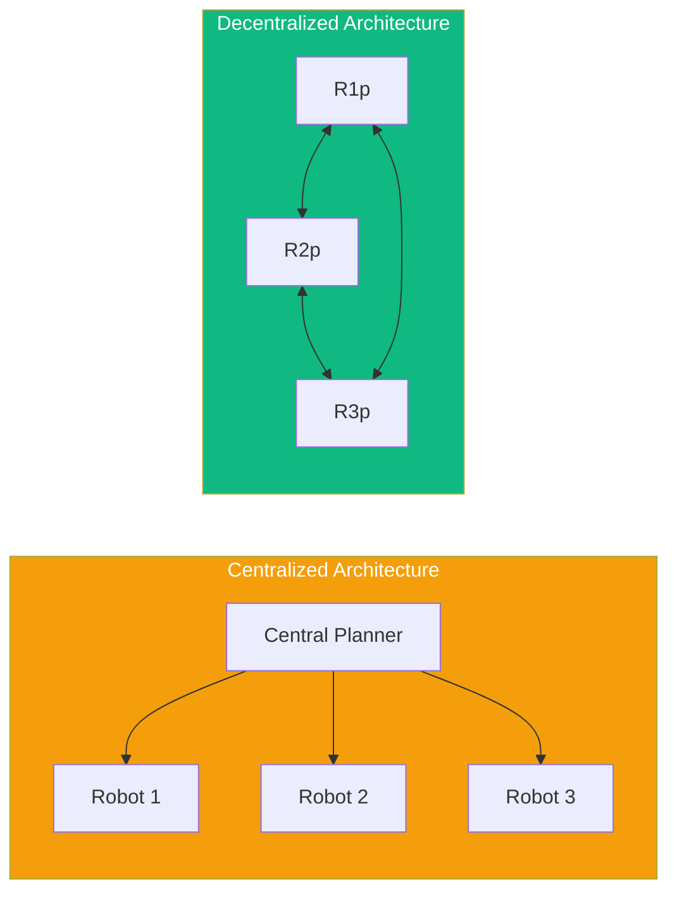
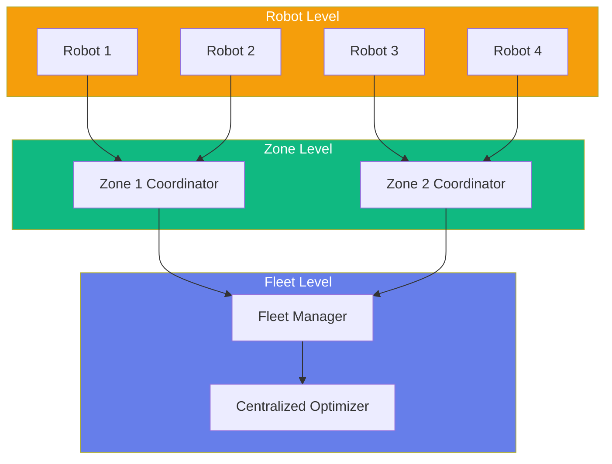
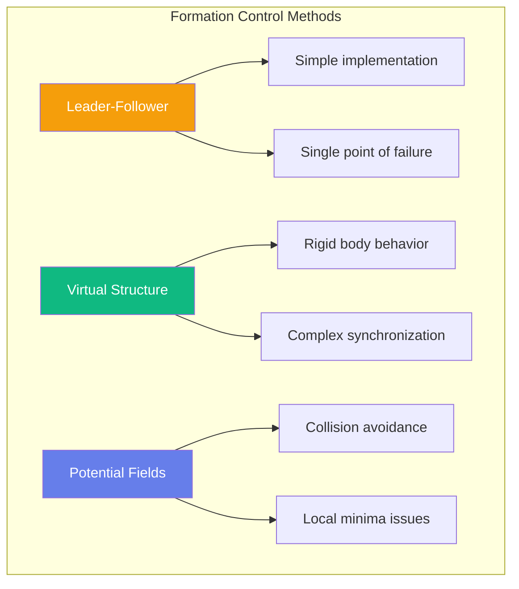
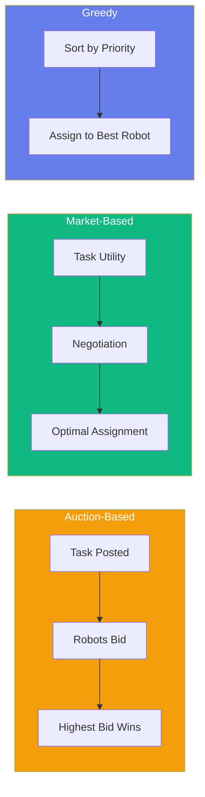
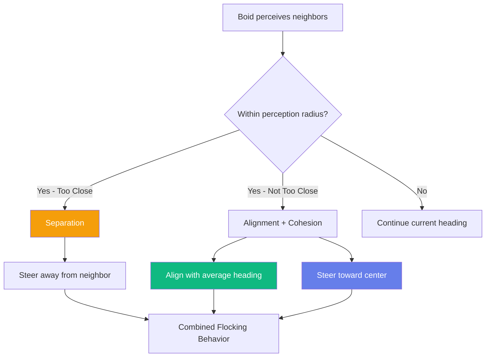

import PersonalizeButton from '@site/src/components/PersonalizeButton';
import TranslateButton from '@site/src/components/TranslateButton';
import CollapsibleCode from '@site/src/components/CollapsibleCode';
import InteractiveDiagram from '@site/src/components/InteractiveDiagram';
import SelfAssessment from '@site/src/components/SelfAssessment';

<div className="learning-objectives">
  <h4>Learning Objectives</h4>
  <ul>
    <li>Understand multi-robot coordination architectures (centralized, decentralized, hybrid)</li>
    <li>Implement formation control algorithms (leader-follower, virtual structure, potential fields)</li>
    <li>Apply auction-based and market-based task allocation</li>
    <li>Design swarm robotics behaviors with emergent collective intelligence</li>
    <li>Configure ROS 2 DDS for multi-robot communication</li>
    <li>Implement fault tolerance and consensus mechanisms</li>
  </ul>
</div>

## Prerequisites

- Chapters 1-3 (Physical AI foundations, Perception, Motion Control)
- Basic understanding of distributed systems
- ROS 2 fundamentals (Chapter 1)
- Network communication concepts

<PersonalizeButton />
<TranslateButton />

---

## 1. Introduction to Multi-Robot Systems

### Why Multiple Robots?

Multi-robot systems have become essential in modern robotics, offering capabilities that exceed single-robot approaches:

<InteractiveDiagram
  title="Multi-Robot System Benefits"
  description="Key advantages of using multiple robots"
  diagramId="multi-robot-benefits"
>

</InteractiveDiagram>

| Advantage | Description | Example Use Case |
|-----------|-------------|------------------|
| **Scalability** | Add robots to linearly increase system capacity | Warehouse fulfillment |
| **Fault Tolerance** | No single point of failure; system degrades gracefully | Search and rescue |
| **Parallel Execution** | Multiple robots work simultaneously | Agricultural harvesting |
| **Coverage** | Larger areas covered in less time | Environmental monitoring |
| **Cost Efficiency** | Multiple simpler robots cheaper than one complex one | Floor cleaning (Roomba fleet) |

### Challenges in Multi-Robot Systems

<InteractiveDiagram
  title="Multi-Robot Challenges"
  description="Key challenges in coordinating multiple robots"
  diagramId="multi-robot-challenges"
>
```mermaid
mindmap
  root((Multi-Robot Challenges))
    Communication
      Network delays
      Bandwidth limits
      Message loss
    Coordination
      Task allocation
      Conflict resolution
      Deadlock avoidance
    Scalability
      O(n²) interactions
      Information sharing
      Computation burden
    Robustness
      Robot failures
      Recovery strategies
      Consensus building
```
</InteractiveDiagram>

### Application Domains

| Domain | Example Applications |
|--------|---------------------|
| **Warehouse Automation** | Amazon Kiva, Alibaba Geesun |
| **Agriculture** | Crop monitoring, harvesting, spraying |
| **Search and Rescue** | Disaster response, exploration |
| **Environmental Monitoring** | Water quality, air quality, wildlife |
| **Construction** | 3D printing, component assembly |
| **Military/Defense** | Surveillance, perimeter security |

---

## 2. Multi-Robot Coordination Architectures

### Centralized vs Decentralized

<InteractiveDiagram
  title="Architecture Comparison"
  description="Centralized vs Decentralized architectures"
  diagramId="architecture-comparison"
>

</InteractiveDiagram>

| Aspect | Centralized | Decentralized | Hybrid |
|--------|-------------|---------------|--------|
| **Decision Making** | Single planner | Peer-to-peer | Local + global |
| **Communication** | All to/from central | Direct between robots | Mixed |
| **Scalability** | Limited | High | Medium-High |
| **Fault Tolerance** | Single point of failure | No single point | Partial |
| **Complexity** | Simple to design | Complex algorithms | Moderate |

### ROS 2 Multi-Robot Setup

<CollapsibleCode
  title="ROS 2 Multi-Robot Configuration"
  language="bash"
>
```bash
#!/bin/bash
# ROS 2 Multi-Robot Setup Script

# Robot 1 - Warehouse Robot Alpha
export ROS_DOMAIN_ID=0
export ROS_NAMESPACE=/robot1
export RMW_IMPLEMENTATION=rmw_fastrtps_cpp
export FASTRTPS_DEFAULT_PROFILES_FILE=/path/to/fastdds_config.xml

# Robot 2 - Warehouse Robot Beta
export ROS_DOMAIN_ID=0
export ROS_NAMESPACE=/robot2
export RMW_IMPLEMENTATION=rmw_fastrtps_cpp

# Robot 3 - Warehouse Robot Gamma
export ROS_DOMAIN_ID=0
export ROS_NAMESPACE=/robot3
export RMW_IMPLEMENTATION=rmw_fastrtps_cpp
```
</CollapsibleCode>

<CollapsibleCode
  title="ROS 2 Multi-Robot Node Framework"
  language="python"
>
```python
#!/usr/bin/env python3
"""
ROS 2 Multi-Robot Framework for coordinated operation.
"""

import rclpy
from rclpy.node import Node
from rclpy.parameter import Parameter
from std_msgs.msg import String, Float32MultiArray
from geometry_msgs.msg import PoseStamped, Twist
from nav_msgs.msg import Odometry
import numpy as np


class MultiRobotNode(Node):
    """Base class for multi-robot nodes."""

    def __init__(self, robot_name, robot_count):
        super().__init__(f'{robot_name}_node')

        self.robot_name = robot_name
        self.robot_id = int(robot_name.split('_')[1])
        self.robot_count = robot_count

        # Declare parameters
        self.declare_parameter('namespace', robot_name)
        self.declare_parameter('robot_id', self.robot_id)
        self.declare_parameter('robot_count', robot_count)

        # Publishers
        self.pose_pub = self.create_publisher(
            PoseStamped, f'/{robot_name}/pose', 10
        )
        self.cmd_pub = self.create_publisher(
            Twist, f'/{robot_name}/cmd_vel', 10
        )

        # Subscribers
        self.create_subscription(
            Odometry, f'/{robot_name}/odom', self.odom_callback, 10
        )

        # Timer for publishing
        self.timer = self.create_timer(0.1, self.publish_loop)

        self.current_pose = None
        self.get_logger().info(f'{robot_name} initialized (ID: {self.robot_id})')

    def odom_callback(self, msg):
        """Handle odometry updates."""
        self.current_pose = msg.pose.pose

    def publish_loop(self):
        """Periodic publishing loop."""
        pass


class MultiRobotManager(Node):
    """Central manager for multi-robot coordination."""

    def __init__(self, robot_count):
        super().__init__('multi_robot_manager')

        self.robot_count = robot_count
        self.robot_poses = [None] * robot_count

        # Subscribe to all robot poses
        for i in range(robot_count):
            self.create_subscription(
                PoseStamped,
                f'/robot_{i}/pose',
                lambda msg, idx=i: self.pose_callback(msg, idx),
                10
            )

        self.get_logger().info('Multi-Robot Manager initialized')

    def pose_callback(self, msg, robot_id):
        """Store pose from robot."""
        self.robot_poses[robot_id] = msg.pose


def main(args=None):
    """Main entry point for multi-robot setup."""
    rclpy.init(args=args)

    # Example: Create manager with 3 robots
    manager = MultiRobotManager(robot_count=3)

    try:
        rclpy.spin(manager)
    except KeyboardInterrupt:
        pass
    finally:
        manager.destroy_node()
        rclpy.shutdown()


if __name__ == '__main__':
    main()
```
</CollapsibleCode>

### Hybrid Coordination

<InteractiveDiagram
  title="Hybrid Architecture"
  description="Hierarchical hybrid coordination approach"
  diagramId="hybrid-architecture"
>

</InteractiveDiagram>

---

## 3. Formation Control

### Leader-Follower Formation

<CollapsibleCode
  title="Leader-Follower Formation Controller"
  language="python"
>
```python
#!/usr/bin/env python3
"""
Formation Control using Leader-Follower approach.
Implements line, V-shape, and circle formations.
"""

import numpy as np
import math
from dataclasses import dataclass
from typing import List, Tuple, Dict


@dataclass
class RobotPose:
    """Robot pose representation."""
    x: float
    y: float
    theta: float

    def to_array(self) -> np.ndarray:
        """Convert to numpy array."""
        return np.array([self.x, self.y, self.theta])


class FormationController:
    """Multi-robot formation controller."""

    def __init__(self, robots: List[str], formation_type: str = "line",
                 spacing: float = 1.0):
        """
        Initialize formation controller.

        Args:
            robots: List of robot names/IDs
            formation_type: line, v_shape, or circle
            spacing: Distance between robots in formation
        """
        self.robots = robots
        self.n_robots = len(robots)
        self.formation_type = formation_type
        self.spacing = spacing

    def compute_formation_poses(self, leader_pose: RobotPose) -> Dict[str, RobotPose]:
        """
        Compute target poses for all followers based on leader position.

        Args:
            leader_pose: Current pose of the leader robot

        Returns:
            Dictionary mapping robot names to target poses
        """
        formations = {
            "line": self._line_formation,
            "v_shape": self._v_formation,
            "circle": self._circle_formation,
            "wedge": self._wedge_formation
        }

        if self.formation_type not in formations:
            raise ValueError(f"Unknown formation: {self.formation_type}")

        return formations[self.formation_type](leader_pose)

    def _line_formation(self, leader_pose: RobotPose) -> Dict[str, RobotPose]:
        """Compute line formation behind leader."""
        poses = {}

        # Leader is first robot
        leader_name = self.robots[0]
        poses[leader_name] = leader_pose

        # Followers line up behind leader
        for i, robot_name in enumerate(self.robots[1:], 1):
            # Position behind leader based on formation
            offset_x = -i * self.spacing
            offset_y = 0

            # Rotate offset by leader orientation
            cos_t = math.cos(leader_pose.theta)
            sin_t = math.sin(leader_pose.theta)

            new_x = leader_pose.x + offset_x * cos_t - offset_y * sin_t
            new_y = leader_pose.y + offset_x * sin_t + offset_y * cos_t

            poses[robot_name] = RobotPose(new_x, new_y, leader_pose.theta)

        return poses

    def _v_formation(self, leader_pose: RobotPose) -> Dict[str, RobotPose]:
        """Compute V-shaped formation (flocking style)."""
        poses = {}
        poses[self.robots[0]] = leader_pose

        cos_t = math.cos(leader_pose.theta)
        sin_t = math.sin(leader_pose.theta)

        # Left and right sides of V
        left_count = (self.n_robots - 1) // 2
        right_count = (self.n_robots - 1) - left_count

        left_idx = 1
        right_idx = 1 + left_count

        # Create left side
        for i in range(left_count):
            offset_x = -(i + 1) * self.spacing * 0.7
            offset_y = (i + 1) * self.spacing

            new_x = leader_pose.x + offset_x * cos_t - offset_y * sin_t
            new_y = leader_pose.y + offset_x * sin_t + offset_y * cos_t

            robot_name = self.robots[left_idx]
            poses[robot_name] = RobotPose(new_x, new_y, leader_pose.theta)
            left_idx += 1

        # Create right side
        for i in range(right_count):
            offset_x = -(i + 1) * self.spacing * 0.7
            offset_y = -(i + 1) * self.spacing

            new_x = leader_pose.x + offset_x * cos_t - offset_y * sin_t
            new_y = leader_pose.y + offset_x * sin_t + offset_y * cos_t

            robot_name = self.robots[right_idx]
            poses[robot_name] = RobotPose(new_x, new_y, leader_pose.theta)
            right_idx += 1

        return poses

    def _circle_formation(self, leader_pose: RobotPose) -> Dict[str, RobotPose]:
        """Compute circular formation around leader."""
        poses = {}
        poses[self.robots[0]] = leader_pose

        radius = (self.n_robots - 1) * self.spacing / (2 * math.pi)

        for i, robot_name in enumerate(self.robots[1:], 1):
            angle = leader_pose.theta + (i - 1) * 2 * math.pi / (self.n_robots - 1)

            new_x = leader_pose.x + radius * math.cos(angle)
            new_y = leader_pose.y + radius * math.sin(angle)
            new_theta = angle + math.pi/2

            poses[robot_name] = RobotPose(new_x, new_y, new_theta)

        return poses

    def _wedge_formation(self, leader_pose: RobotPose) -> Dict[str, RobotPose]:
        """Compute wedge/arrowhead formation."""
        poses = {}
        poses[self.robots[0]] = leader_pose

        cos_t = math.cos(leader_pose.theta)
        sin_t = math.sin(leader_pose.theta)

        rows = int(math.sqrt(self.n_robots - 1)) + 1
        col = 0

        for i, robot_name in enumerate(self.robots[1:], 1):
            row = i // rows
            col = i % rows if i % rows != 0 else rows - 1

            offset_x = -(row + 1) * self.spacing * 0.8
            offset_y = (col - rows/2) * self.spacing

            new_x = leader_pose.x + offset_x * cos_t - offset_y * sin_t
            new_y = leader_pose.y + offset_x * sin_t + offset_y * cos_t

            poses[robot_name] = RobotPose(new_x, new_y, leader_pose.theta)

        return poses


class FormationTrackingController:
    """Track formation while avoiding collisions."""

    def __init__(self, formation_controller: FormationController,
                 max_velocity: float = 1.0,
                 collision_radius: float = 0.5):
        self.formation = formation_controller
        self.max_velocity = max_velocity
        self.collision_radius = collision_radius

    def compute_velocities(self, leader_pose: RobotPose,
                           current_poses: Dict[str, RobotPose]) -> Dict[str, np.ndarray]:
        """
        Compute velocity commands for formation tracking.

        Args:
            leader_pose: Current leader position
            current_poses: Current poses of all robots

        Returns:
            Dictionary mapping robots to velocity commands
        """
        target_poses = self.formation.compute_formation_poses(leader_pose)
        velocities = {}

        for robot_name in self.formation.robots:
            if robot_name not in current_poses:
                continue

            target = target_poses[robot_name]
            current = current_poses[robot_name]

            # Position error
            dx = target.x - current.x
            dy = target.y - current.y

            # Proportional velocity
            k_p = 2.0
            vx = k_p * dx
            vy = k_p * dy

            # Limit velocity
            velocity = np.array([vx, vy])
            if np.linalg.norm(velocity) > self.max_velocity:
                velocity = velocity / np.linalg.norm(velocity) * self.max_velocity

            # Collision avoidance
            for other_name, other_pose in current_poses.items():
                if other_name == robot_name:
                    continue

                dist = math.sqrt((current.x - other_pose.x)**2 +
                                (current.y - other_pose.y)**2)

                if dist < self.collision_radius:
                    # Push away from nearby robot
                    push_x = current.x - other_pose.x
                    push_y = current.y - other_pose.y
                    push_dist = math.sqrt(push_x**2 + push_y**2)

                    if push_dist > 0:
                        push_strength = (self.collision_radius - dist) / dist
                        velocity[0] += push_x * push_strength
                        velocity[1] += push_y * push_strength

            velocities[robot_name] = velocity

        return velocities


if __name__ == "__main__":
    print("Formation Control - Leader Follower")
    print("=" * 50)

    # Create formation controller with 5 robots
    robots = ["robot_0", "robot_1", "robot_2", "robot_3", "robot_4"]

    for formation_type in ["line", "v_shape", "circle", "wedge"]:
        controller = FormationController(robots, formation_type=formation_type,
                                        spacing=1.5)

        # Leader at origin facing forward
        leader = RobotPose(x=0, y=0, theta=0)

        poses = controller.compute_formation_poses(leader)

        print(f"\n{formation_type.upper()} Formation:")
        for name, pose in poses.items():
            print(f"  {name}: ({pose.x:.2f}, {pose.y:.2f}, {pose.theta:.2f})")
```
</CollapsibleCode>

### Virtual Structure Approach

<CollapsibleCode
  title="Virtual Structure Formation Control"
  language="python"
>
```python
#!/usr/bin/env python3
"""
Virtual Structure Approach for Formation Control.
Treats the entire formation as a single rigid body.
"""

import numpy as np
import math
from typing import List
from dataclasses import dataclass


@dataclass
class Vector3:
    """3D Vector."""
    x: float
    y: float
    z: float

    def __add__(self, other):
        return Vector3(self.x + other.x, self.y + other.y, self.z + other.z)

    def __sub__(self, other):
        return Vector3(self.x - other.x, self.y - other.y, self.z - other.z)

    def __mul__(self, scalar):
        return Vector3(self.x * scalar, self.y * scalar, self.z * scalar)

    def dot(self, other):
        return self.x * other.x + self.y * other.y + self.z * other.z

    def norm(self):
        return math.sqrt(self.x**2 + self.y**2 + self.z**2)

    def normalize(self):
        n = self.norm()
        if n > 0:
            return Vector3(self.x/n, self.y/n, self.z/n)
        return Vector3(0, 0, 0)


class VirtualStructure:
    """Virtual rigid body structure for formation."""

    def __init__(self, desired_positions: List[Vector3]):
        """
        Initialize virtual structure.

        Args:
            desired_positions: List of relative positions for each robot
        """
        self.desired_positions = desired_positions
        self.n_robots = len(desired_positions)

        # Virtual structure state
        self.position = Vector3(0, 0, 0)  # Centroid
        self.velocity = Vector3(0, 0, 0)
        self.orientation = 0.0  # 2D orientation (radians)
        self.angular_velocity = 0.0

    def update(self, dt: float, desired_velocity: Vector3,
               desired_angular_velocity: float = 0.0):
        """Update virtual structure state."""
        # Update position
        self.position = self.position + desired_velocity * dt
        self.velocity = desired_velocity

        # Update orientation
        self.orientation += desired_angular_velocity * dt
        self.angular_velocity = desired_angular_velocity

    def get_robot_target(self, robot_idx: int) -> Vector3:
        """
        Get target position for a specific robot.

        Args:
            robot_idx: Index of the robot

        Returns:
            World-frame target position for the robot
        """
        if robot_idx >= self.n_robots:
            raise ValueError(f"Robot index {robot_idx} out of range")

        local_pos = self.desired_positions[robot_idx]

        # Rotate local position by orientation
        cos_t = math.cos(self.orientation)
        sin_t = math.sin(self.orientation)

        rotated_x = local_pos.x * cos_t - local_pos.y * sin_t
        rotated_y = local_pos.x * sin_t + local_pos.y * cos_t

        # Translate to world frame
        world_x = self.position.x + rotated_x
        world_y = self.position.y + rotated_y

        return Vector3(world_x, world_y, 0)


class VirtualStructureController:
    """Controller using virtual structure approach."""

    def __init__(self, virtual_structure: VirtualStructure,
                 kp_position: float = 2.0,
                 kp_orientation: float = 1.0):
        self.vs = virtual_structure
        self.kp_position = kp_position
        self.kp_orientation = kp_orientation

    def compute_robot_commands(self, current_robot_positions: List[Vector3],
                               target_trajectory: Vector3 = None,
                               target_orientation: float = None) -> List[Vector3]:
        """
        Compute velocity commands for all robots.

        Args:
            current_robot_positions: Current positions of all robots
            target_trajectory: Optional target velocity for virtual structure
            target_orientation: Optional target angular velocity

        Returns:
            List of velocity commands for each robot
        """
        commands = []

        for i in range(self.vs.n_robots):
            current = current_robot_positions[i]
            target = self.vs.get_robot_target(i)

            # Compute error
            error = target - current

            # Proportional control
            velocity = error * self.kp_position
            commands.append(velocity)

        return commands

    def sync_formation(self, robot_positions: List[Vector3], dt: float):
        """
        Synchronize formation - all robots move to their target positions.

        Args:
            robot_positions: Current positions of all robots
            dt: Time step
        """
        commands = self.compute_robot_commands(robot_positions)

        # Update virtual structure to follow centroid of robots
        centroid = Vector3(0, 0, 0)
        for pos in robot_positions:
            centroid = centroid + pos
        centroid = centroid * (1.0 / len(robot_positions))

        self.vs.position = centroid


if __name__ == "__main__":
    print("Virtual Structure Formation Control")
    print("=" * 50)

    # Define formation: 5 robots in a pentagon
    angle_step = 2 * math.pi / 5
    radius = 2.0
    desired_positions = []

    for i in range(5):
        angle = i * angle_step
        desired_positions.append(Vector3(
            x=radius * math.cos(angle),
            y=radius * math.sin(angle),
            z=0
        ))

    # Create virtual structure
    vs = VirtualStructure(desired_positions)

    # Create controller
    controller = VirtualStructureController(vs)

    # Simulate movement
    print("\nSimulating formation movement...")
    for step in range(5):
        # Set desired velocity for virtual structure
        desired_vel = Vector3(x=0.5, y=0.3, z=0)
        vs.update(dt=0.1, desired_velocity=desired_vel)

        # Get robot targets
        print(f"\nStep {step + 1}: Centroid at ({vs.position.x:.2f}, {vs.position.y:.2f})")
        print("Robot targets:")
        for i in range(5):
            target = vs.get_robot_target(i)
            print(f"  Robot {i}: ({target.x:.2f}, {target.y:.2f})")
```
</CollapsibleCode>

<InteractiveDiagram
  title="Formation Control Methods"
  description="Comparison of formation control approaches"
  diagramId="formation-methods"
>

</InteractiveDiagram>

---

## 4. Task Allocation

### Auction-Based Allocation

<CollapsibleCode
  title="Auction-Based Task Allocator"
  language="python"
>
```python
#!/usr/bin/env python3
"""
Auction-Based Task Allocation for Multi-Robot Systems.
Uses sealed-bid auctions for robots to bid on tasks.
"""

import numpy as np
import math
from dataclasses import dataclass, field
from typing import List, Dict, Tuple, Optional
from enum import Enum
import random


class AuctionState(Enum):
    """State of the auction system."""
    IDLE = "idle"
    AUCTION_RUNNING = "auction_running"
    ALLOCATION_COMPLETE = "allocation_complete"


@dataclass
class Task:
    """Represents a task to be allocated."""
    task_id: int
    x: float  # Location X
    y: float  # Location Y
    priority: int = 0  # Higher = more important
    deadline: float = float('inf')  # Time deadline
    required_capability: str = "none"  # Required robot capability
    estimated_duration: float = 1.0  # Estimated time to complete
    reward: float = 10.0  # Reward for completing

    def __lt__(self, other):
        """Compare by priority for sorting."""
        return self.priority > other.priority  # Higher priority first


@dataclass
class Robot:
    """Represents a robot in the system."""
    robot_id: int
    x: float
    y: float
    capabilities: List[str] = field(default_factory=list)
    max_tasks: int = 3  # Maximum concurrent tasks
    speed: float = 1.0  # Movement speed

    def estimate_cost(self, task: Task) -> float:
        """
        Estimate cost to complete a task.

        Args:
            task: The task to estimate cost for

        Returns:
            Estimated cost (time + distance)
        """
        # Distance to task
        distance = math.sqrt((task.x - self.x)**2 + (task.y - self.y)**2)

        # Cost is travel time plus task duration
        travel_time = distance / self.speed
        cost = travel_time + task.estimated_duration

        # Capability penalty
        if task.required_capability != "none":
            if task.required_capability not in self.capabilities:
                cost *= 10  # Very expensive if cannot perform

        return cost

    def can_complete(self, task: Task) -> bool:
        """Check if robot can complete the task."""
        if task.required_capability != "none":
            return task.required_capability in self.capabilities
        return True


@dataclass
class Bid:
    """Represents a robot's bid on a task."""
    robot_id: int
    task_id: int
    cost: float
    value: float  # Reward - cost
    timestamp: float = 0.0


class AuctionAllocator:
    """Auction-based task allocation system."""

    def __init__(self, robots: List[Robot], auction_timeout: float = 5.0):
        """
        Initialize auction allocator.

        Args:
            robots: List of available robots
            auction_timeout: Maximum time for auction to complete
        """
        self.robots = robots
        self.auction_timeout = auction_timeout
        self.current_auction = None
        self.assignments: Dict[int, int] = {}  # task_id -> robot_id
        self.auction_state = AuctionState.IDLE

    def run_auction(self, tasks: List[Task]) -> Dict[int, int]:
        """
        Run auction to allocate tasks.

        Args:
            tasks: List of tasks to allocate

        Returns:
            Dictionary mapping task_id to robot_id
        """
        self.auction_state = AuctionState.AUCTION_RUNNING
        self.assignments = {}

        # Sort tasks by priority
        sorted_tasks = sorted(tasks)

        # Each task goes through auction
        for task in sorted_tasks:
            winner = self._auction_single_task(task)
            if winner is not None:
                self.assignments[task.task_id] = winner

        self.auction_state = AuctionState.ALLOCATION_COMPLETE
        return self.assignments

    def _auction_single_task(self, task: Task) -> Optional[int]:
        """
        Run auction for a single task.

        Args:
            task: Task to auction

        Returns:
            ID of winning robot, or None
        """
        bids = []

        # Collect bids from all capable robots
        for robot in self.robots:
            if robot.can_complete(task):
                cost = robot.estimate_cost(task)
                # Value = reward - cost (lower cost = higher value)
                value = task.reward - cost
                bid = Bid(
                    robot_id=robot.robot_id,
                    task_id=task.task_id,
                    cost=cost,
                    value=value
                )
                bids.append(bid)

        if not bids:
            return None  # No capable robots

        # Find winner (highest value)
        bids.sort(key=lambda b: b.value, reverse=True)
        winner = bids[0]

        return winner.robot_id

    def get_assignment_for_task(self, task_id: int) -> Optional[Robot]:
        """Get the robot assigned to a specific task."""
        robot_id = self.assignments.get(task_id)
        if robot_id is None:
            return None

        for robot in self.robots:
            if robot.robot_id == robot_id:
                return robot
        return None


class MarketBasedAllocator:
    """Market-based task allocation with negotiation."""

    def __init__(self, robots: List[Robot]):
        self.robots = robots
        self.task_history = []
        self.performance_metrics = {}

    def allocate_tasks(self, tasks: List[Task]) -> Dict[int, int]:
        """
        Allocate tasks using market-based approach.

        Args:
            tasks: List of tasks to allocate

        Returns:
            Mapping of task_id to robot_id
        """
        assignments = {}

        # Calculate task utilities
        for task in sorted(tasks, key=lambda t: t.priority, reverse=True):
            best_robot = None
            best_utility = float('-inf')

            for robot in self.robots:
                if not robot.can_complete(task):
                    continue

                cost = robot.estimate_cost(task)
                # Utility = reward / cost (efficiency)
                utility = task.reward / cost if cost > 0 else float('inf')

                # Consider robot's current workload
                current_tasks = sum(1 for t_id, r_id in assignments.items()
                                   if r_id == robot.robot_id)
                workload_factor = 1.0 / (1.0 + current_tasks * 0.1)

                utility *= workload_factor

                if utility > best_utility:
                    best_utility = utility
                    best_robot = robot

            if best_robot is not None:
                assignments[task.task_id] = best_robot.robot_id

        return assignments


if __name__ == "__main__":
    print("Auction-Based Task Allocation")
    print("=" * 50)

    # Create robots with different capabilities
    robots = [
        Robot(robot_id=0, x=0, y=0, capabilities=["navigation", "grasping"],
              speed=1.0),
        Robot(robot_id=1, x=5, y=5, capabilities=["navigation", "vision"],
              speed=1.2),
        Robot(robot_id=2, x=10, y=0, capabilities=["grasping", "lifting"],
              speed=0.8),
        Robot(robot_id=3, x=5, y=10, capabilities=["navigation", "grasping", "vision"],
              speed=1.0),
    ]

    # Create tasks
    tasks = [
        Task(task_id=0, x=2, y=3, priority=3, required_capability="grasping",
             reward=15.0),
        Task(task_id=1, x=8, y=7, priority=2, required_capability="vision",
             reward=12.0),
        Task(task_id=2, x=1, y=9, priority=1, required_capability="none",
             reward=8.0),
        Task(task_id=3, x=12, y=2, priority=3, required_capability="lifting",
             reward=20.0),
    ]

    # Run auction allocation
    allocator = AuctionAllocator(robots)
    assignments = allocator.run_auction(tasks)

    print("\nAuction Results:")
    print("-" * 40)
    for task_id, robot_id in assignments.items():
        task = next(t for t in tasks if t.task_id == task_id)
        robot = next(r for r in robots if r.robot_id == robot_id)
        print(f"Task {task_id} at ({task.x}, {task.y})")
        print(f"  -> Assigned to Robot {robot_id} at ({robot.x}, {robot.y})")
        print(f"  -> Estimated cost: {robot.estimate_cost(task):.2f}")
```
</CollapsibleCode>

<InteractiveDiagram
  title="Task Allocation Methods"
  description="Comparison of task allocation approaches"
  diagramId="task-allocation"
>

</InteractiveDiagram>

---

## 5. Swarm Robotics

### Boids Flocking Model

<CollapsibleCode
  title="Boids Flocking Simulation"
  language="python"
>
```python
#!/usr/bin/env python3
"""
Boids Flocking Model for Swarm Robotics.
Implements separation, alignment, and cohesion behaviors.
"""

import numpy as np
import math
from dataclasses import dataclass
from typing import List, Tuple
import random


@dataclass
class Boid:
    """A single boid (bird-like agent)."""
    x: float
    y: float
    vx: float
    vy: float
    boid_id: int


class BoidsSimulation:
    """Simulation of boids flocking behavior."""

    def __init__(self, n_boids: int, width: float = 100, height: float = 100,
                 perception_radius: float = 25.0,
                 separation_weight: float = 1.5,
                 alignment_weight: float = 1.0,
                 cohesion_weight: float = 1.0,
                 max_speed: float = 3.0,
                 min_speed: float = 1.0):
        """
        Initialize boids simulation.

        Args:
            n_boids: Number of boids
            width: World width
            height: World height
            perception_radius: Distance to see other boids
            separation_weight: Weight for separation behavior
            alignment_weight: Weight for alignment behavior
            cohesion_weight: Weight for cohesion behavior
            max_speed: Maximum velocity magnitude
            min_speed: Minimum velocity magnitude
        """
        self.n_boids = n_boids
        self.width = width
        self.height = height
        self.perception_radius = perception_radius
        self.separation_weight = separation_weight
        self.alignment_weight = alignment_weight
        self.cohesion_weight = cohesion_weight
        self.max_speed = max_speed
        self.min_speed = min_speed

        # Initialize boids randomly
        self.boids = []
        for i in range(n_boids):
            angle = random.uniform(0, 2 * math.pi)
            speed = random.uniform(min_speed, max_speed)
            boid = Boid(
                x=random.uniform(0, width),
                y=random.uniform(0, height),
                vx=math.cos(angle) * speed,
                vy=math.sin(angle) * speed,
                boid_id=i
            )
            self.boids.append(boid)

    def compute_flocking_force(self, boid: Boid) -> Tuple[float, float]:
        """
        Compute the flocking force for a single boid.

        Args:
            boid: The boid to compute forces for

        Returns:
            (fx, fy) force vector
        """
        separation = np.array([0.0, 0.0])
        alignment = np.array([0.0, 0.0])
        cohesion = np.array([0.0, 0.0])
        neighbors = 0

        boid_pos = np.array([boid.x, boid.y])
        boid_vel = np.array([boid.vx, boid.vy])

        for other in self.boids:
            if other.boid_id == boid.boid_id:
                continue

            other_pos = np.array([other.x, other.y])
            other_vel = np.array([other.vx, other.vy])

            # Distance to neighbor
            diff = boid_pos - other_pos
            distance = np.linalg.norm(diff)

            if distance < self.perception_radius and distance > 0:
                # Separation: steer away from close neighbors
                separation += diff / (distance * distance)
                neighbors += 1

                # Alignment: match velocity of neighbors
                alignment += other_vel

                # Cohesion: steer toward center of neighbors
                cohesion += other_pos

        if neighbors > 0:
            separation *= 1.0 / neighbors
            alignment /= neighbors
            cohesion = cohesion / neighbors - boid_pos

        # Apply weights
        separation *= self.separation_weight
        alignment *= self.alignment_weight
        cohesion *= self.cohesion_weight

        # Combine forces
        total_force = separation + alignment + cohesion

        return total_force[0], total_force[1]

    def update(self, dt: float):
        """
        Update all boids by one time step.

        Args:
            dt: Time step
        """
        new_velocities = []

        for boid in self.boids:
            # Compute flocking force
            fx, fy = self.compute_flocking_force(boid)

            # Add boundary avoidance (soft boundaries)
            margin = 10.0
            force_x, force_y = fx, fy

            if boid.x < margin:
                force_x += (margin - boid.x) * 2
            elif boid.x > self.width - margin:
                force_x += (self.width - margin - boid.x) * 2

            if boid.y < margin:
                force_y += (margin - boid.y) * 2
            elif boid.y > self.height - margin:
                force_y += (self.height - margin - boid.y) * 2

            # Update velocity
            new_vx = boid.vx + force_x * dt
            new_vy = boid.vy + force_y * dt

            # Limit speed
            speed = math.sqrt(new_vx**2 + new_vy**2)
            if speed > self.max_speed:
                new_vx = (new_vx / speed) * self.max_speed
                new_vy = (new_vy / speed) * self.max_speed
            elif speed < self.min_speed and speed > 0:
                new_vx = (new_vx / speed) * self.min_speed
                new_vy = (new_vy / speed) * self.min_speed

            new_velocities.append((new_vx, new_vy))

        # Update positions
        for i, boid in enumerate(self.boids):
            boid.vx, boid.vy = new_velocities[i]
            boid.x += boid.vx * dt
            boid.y += boid.vy * dt

            # Wrap around boundaries (toroidal world)
            if boid.x < 0:
                boid.x = self.width
            elif boid.x > self.width:
                boid.x = 0

            if boid.y < 0:
                boid.y = self.height
            elif boid.y > self.height:
                boid.y = 0

    def compute_flocking_metrics(self) -> dict:
        """Compute metrics to measure flocking quality."""
        if len(self.boids) < 2:
            return {"avg_speed": 0, "alignment": 0, "cohesion": 0}

        # Average speed
        avg_speed = sum(math.sqrt(b.vx**2 + b.vy**2) for b in self.boids) / len(self.boids)

        # Alignment (how aligned are velocities)
        avg_vel = np.array([sum(b.vx for b in self.boids) / len(self.boids),
                           sum(b.vy for b in self.boids) / len(self.boids)])
        alignment = np.linalg.norm(avg_vel) / avg_speed if avg_speed > 0 else 0

        # Cohesion (how close are boids to center)
        center_x = sum(b.x for b in self.boids) / len(self.boids)
        center_y = sum(b.y for b in self.boids) / len(self.boids)
        avg_dist = sum(math.sqrt((b.x - center_x)**2 + (b.y - center_y)**2)
                      for b in self.boids) / len(self.boids)
        cohesion = 1.0 / (1.0 + avg_dist)

        return {
            "avg_speed": avg_speed,
            "alignment": alignment,
            "cohesion": cohesion,
            "num_boids": len(self.boids)
        }


class StigmergicSwarm:
    """Stigmergic coordination through environment."""

    def __init__(self, width: int = 50, height: int = 50,
                 evaporation_rate: float = 0.02,
                 diffusion_rate: float = 0.1):
        """
        Initialize stigmergic swarm.

        Args:
            width: Grid width
            height: Grid height
            evaporation_rate: Pheromone decay rate
            diffusion_rate: Pheromone spread rate
        """
        self.width = width
        self.height = height
        self.evaporation_rate = evaporation_rate
        self.diffusion_rate = diffusion_rate

        # Pheromone grid
        self.pheromone = np.zeros((height, width))

        # Robot positions
        self.robots = [(random.uniform(0, width), random.uniform(0, height))
                      for _ in range(10)]

    def update_pheromones(self):
        """Update pheromone grid (diffusion + evaporation)."""
        # Simple diffusion
        new_pheromone = self.pheromone.copy()

        for y in range(1, self.height - 1):
            for x in range(1, self.width - 1):
                # Diffusion from neighbors
                avg = (self.pheromone[y-1, x] + self.pheromone[y+1, x] +
                       self.pheromone[y, x-1] + self.pheromone[y, x+1]) / 4
                new_pheromone[y, x] = (1 - self.diffusion_rate) * self.pheromone[y, x] + \
                                      self.diffusion_rate * avg

        # Evaporation
        new_pheromone *= (1 - self.evaporation_rate)
        self.pheromone = new_pheromone

    def deposit_pheromone(self, x: float, y: float, amount: float = 1.0):
        """Deposit pheromone at a location."""
        xi, yi = int(x), int(y)
        if 0 <= xi < self.width and 0 <= yi < self.height:
            self.pheromone[yi, xi] += amount


if __name__ == "__main__":
    print("Boids Flocking Simulation")
    print("=" * 50)

    # Create simulation
    sim = BoidsSimulation(n_boids=50, width=100, height=100)

    print(f"Created {sim.n_boids} boids")

    # Run simulation for several steps
    print("\nSimulating flocking behavior...")
    for step in range(10):
        sim.update(dt=0.1)

        metrics = sim.compute_flocking_metrics()
        print(f"Step {step + 1}: Speed={metrics['avg_speed']:.2f}, "
              f"Alignment={metrics['alignment']:.2f}, "
              f"Cohesion={metrics['cohesion']:.2f}")
```
</CollapsibleCode>

### Swarm Intelligence Principles

<InteractiveDiagram
  title="Boids Rules"
  description="The three fundamental rules of boids flocking"
  diagramId="boids-rules"
>

</InteractiveDiagram>

---

## 6. Communication and Consensus

### ROS 2 DDS Configuration

<CollapsibleCode
  title="ROS 2 DDS Configuration for Multi-Robot"
  language="xml"
>
```xml
<?xml version="1.0" encoding="UTF-8" ?>
<!-- ROS 2 DDS Configuration for Multi-Robot Systems -->
<!-- Save as fastdds_multi_robot.xml -->

<?xml version="1.0" encoding="UTF-8" ?>
<profiles xmlns="http://www.eprosima.com/XMLSchema/ff-dds">
    <transport_descriptors>
        <!-- UDP Transport for all robots -->
        <transport_descriptor>
            <transport_id>udp_transport</transport_id>
            <type>UDPv4TransportDescriptor</type>
            <sendBufferSize>65536</sendBufferSize>
            <receiveBufferSize>65536</receiveBufferSize>
            <TTL>1</TTL>
            <maxMessageSize>16384</maxMessageSize>
            <whiteList>
                <address>192.168.1.0</address>  <!-- Local network -->
            </whiteList>
        </transport_descriptor>
    </transport_descriptors>

    <participant profile_name="robot_participant">
        <rtps>
            <name>MultiRobotParticipant</name>
            <defaultUnicastLocatorList>
                <locator>
                    <udpv4>
                        <address>192.168.1.100</address>
                        <port>7400</port>
                    </udpv4>
                </locator>
            </defaultUnicastLocatorList>
            <transportDescriptors>
                <transportDescriptorRef>udp_transport</transportDescriptorRef>
            </transportDescriptors>
        </rtps>
    </participant>

    <publisher profile_name="robot_publisher">
        <topic>
            <dataType>geometry_msgs/msg/PoseStamped</dataType>
            <topicName>robot_pose</topicName>
        </topic>
        <qos>
            <reliability>
                <kind>BEST_EFFORT</kind>
            </reliability>
            <durability>
                <kind>VOLATILE</kind>
            </durability>
            <history>
                <kind>KEEP_LAST</kind>
                <depth>10</depth>
            </history>
        </qos>
    </publisher>

    <subscriber profile_name="robot_subscriber">
        <topic>
            <dataType>geometry_msgs/msg/Twist</dataType>
            <topicName>cmd_vel</topicName>
        </topic>
        <qos>
            <reliability>
                <kind>RELIABLE</kind>
            </reliability>
            <durability>
                <kind>VOLATILE</kind>
            </durability>
        </qos>
    </subscriber>
</profiles>
```
</CollapsibleCode>

### Fault Tolerance and Consensus

<CollapsibleCode
  title="Fault-Tolerant Multi-Robot Consensus"
  language="python"
>
```python
#!/usr/bin/env python3
"""
Fault-Tolerant Consensus for Multi-Robot Systems.
Implements Byzantine fault tolerance and failure detection.
"""

import numpy as np
import math
from dataclasses import dataclass, field
from typing import List, Dict, Optional, Set
from enum import Enum
import random
import time


class RobotState(Enum):
    """State of a robot."""
    ACTIVE = "active"
    SUSPECTED_FAILED = "suspected_failed"
    FAILED = "failed"


@dataclass
class RobotStatus:
    """Status of a robot in the consensus system."""
    robot_id: int
    state: RobotState = RobotState.ACTIVE
    last_heartbeat: float = 0.0
    consecutive_failures: int = 0
    reputation: float = 1.0  # Trust score


class HeartbeatMonitor:
    """Monitor robot heartbeats for failure detection."""

    def __init__(self, robots: List[int], timeout: float = 2.0,
                 failure_threshold: int = 3):
        """
        Initialize heartbeat monitor.

        Args:
            robots: List of robot IDs
            timeout: Time before a robot is suspected failed
            failure_threshold: Consecutive timeouts before marking failed
        """
        self.robots = set(robots)
        self.timeout = timeout
        self.failure_threshold = failure_threshold

        self.last_heartbeat: Dict[int, float] = {r: time.time() for r in robots}
        self.status: Dict[int, RobotStatus] = {
            r: RobotStatus(robot_id=r) for r in robots
        }

    def receive_heartbeat(self, robot_id: int):
        """Record a heartbeat from a robot."""
        self.last_heartbeat[robot_id] = time.time()

        if self.status[robot_id].state == RobotState.SUSPECTED_FAILED:
            # Robot recovered
            self.status[robot_id].state = RobotState.ACTIVE
            self.status[robot_id].consecutive_failures = 0

    def check_failures(self, current_time: float) -> Set[int]:
        """
        Check for failed robots.

        Args:
            current_time: Current time

        Returns:
            Set of failed robot IDs
        """
        failed = set()

        for robot_id in self.robots:
            time_since_heartbeat = current_time - self.last_heartbeat[robot_id]

            if time_since_heartbeat > self.timeout:
                status = self.status[robot_id]
                status.consecutive_failures += 1

                if status.consecutive_failures >= self.failure_threshold:
                    status.state = RobotState.FAILED
                    failed.add(robot_id)
                else:
                    status.state = RobotState.SUSPECTED_FAILED

        return failed


class ByzantineConsensus:
    """Byzantine fault-tolerant consensus."""

    def __init__(self, n_robots: int, f_tolerated: int = 1):
        """
        Initialize Byzantine consensus.

        Args:
            n_robots: Total number of robots
            f_tolerated: Maximum number of faulty robots that can be tolerated
        """
        self.n = n_robots
        self.f = f_tolerated

        # Lamport timestamps for ordering
        self.timestamps: Dict[int, int] = {}
        self.proposals: Dict[int, float] = {}

    def propose(self, robot_id: int, value: float):
        """A robot proposes a value."""
        if robot_id not in self.timestamps:
            self.timestamps[robot_id] = 0
        self.timestamps[robot_id] += 1

        self.proposals[robot_id] = value

    def reach_consensus(self, active_robots: List[int]) -> Optional[float]:
        """
        Attempt to reach consensus among active robots.

        Args:
            active_robots: List of active (non-failed) robot IDs

        Returns:
            Consensus value or None if not reached
        """
        if len(active_robots) <= 2 * self.f:
            return None  # Not enough robots for Byzantine agreement

        # Phase 1: Gather all proposals
        values = []
        for robot_id in active_robots:
            if robot_id in self.proposals:
                values.append(self.proposals[robot_id])

        if not values:
            return None

        # Phase 2: Byzantine agreement using median
        # With f faulty robots, need 2f+1 correct robots for agreement
        sorted_values = sorted(values)

        # Consensus is the median of proposals
        median_idx = len(sorted_values) // 2

        return sorted_values[median_idx]


class DistributedTaskConsensus:
    """Consensus on task assignment with fault tolerance."""

    def __init__(self, robot_ids: List[int], quorum_size: int = 3):
        """
        Initialize task consensus.

        Args:
            robot_ids: List of all robot IDs
            quorum_size: Minimum robots needed for decision
        """
        self.robot_ids = set(robot_ids)
        self.quorum_size = quorum_size

        # Voting records
        self.votes: Dict[int, Dict[int, float]] = {}  # task_id -> {robot_id -> vote}
        self.decided: Dict[int, bool] = {}

    def vote(self, task_id: int, robot_id: int, vote_value: float):
        """Cast a vote for task assignment."""
        if task_id not in self.votes:
            self.votes[task_id] = {}

        self.votes[task_id][robot_id] = vote_value

    def decide(self, task_id: int, threshold: float = 0.7) -> Optional[float]:
        """
        Make a decision on task assignment.

        Args:
            task_id: Task to decide on
            threshold: Agreement threshold (e.g., 0.7 = 70%)

        Returns:
            Decided value or None if no consensus
        """
        if task_id not in self.votes:
            return None

        votes = self.votes[task_id]

        if len(votes) < self.quorum_size:
            return None  # Not enough votes

        # Count vote distribution
        vote_counts: Dict[float, int] = {}
        for value in votes.values():
            vote_counts[value] = vote_counts.get(value, 0) + 1

        # Find the value with majority
        total_votes = len(votes)
        for value, count in vote_counts.items():
            if count / total_votes >= threshold:
                self.decided[task_id] = True
                return value

        return None  # No majority reached


if __name__ == "__main__":
    print("Fault-Tolerant Multi-Robot Consensus")
    print("=" * 50)

    # Create heartbeat monitor
    robots = [0, 1, 2, 3, 4]
    monitor = HeartbeatMonitor(robots, timeout=0.5, failure_threshold=3)

    print("\nSimulating robot failures...")
    monitor.receive_heartbeat(0)
    monitor.receive_heartbeat(1)

    # Robot 2 fails (no heartbeat)
    current_time = time.time()
    failed = monitor.check_failures(current_time + 1.0)
    print(f"After 1s: Failed robots = {failed}")

    # Robot 2 still fails
    failed = monitor.check_failures(current_time + 2.0)
    print(f"After 2s: Failed robots = {failed}")
    print(f"Robot 2 state: {monitor.status[2].state}")

    # Robot 3 and 4 fail
    monitor.check_failures(current_time + 3.0)
    print(f"Robot 3 state: {monitor.status[3].state}")
    print(f"Robot 4 state: {monitor.status[4].state}")

    # Byzantine consensus
    print("\nByzantine Consensus Test:")
    consensus = ByzantineConsensus(n_robots=5, f_tolerated=1)

    # Normal robots propose values
    consensus.propose(0, 10.0)
    consensus.propose(1, 10.0)
    consensus.propose(2, 10.0)
    consensus.propose(3, 5.0)  # Byzantine robot proposes different value
    consensus.propose(4, 10.0)

    active = [0, 1, 2, 4]  # Robot 3 is faulty
    result = consensus.reach_consensus(active)
    print(f"Consensus value: {result}")
```
</CollapsibleCode>

<InteractiveDiagram
  title="Consensus Process"
  description="Steps in distributed consensus"
  diagramId="consensus-process"
>
```mermaid
sequenceDiagram
    participant R1 as Robot 1
    participant R2 as Robot 2
    participant R3 as Robot 3

    R1->>R2: Propose value
    R2->>R3: Propose value
    R3->>R1: Propose value

    R1->>R2: Share vote
    R2->>R3: Share vote
    R3->>R1: Share vote

    R1->>R2: Decision
    R2->>R3: Decision
    R3->>R1: Decision

    Note over R1,R2,R3: Consensus Reached
```
</InteractiveDiagram>

---

## 7. Hands-on Project: Warehouse Multi-Robot System

<CollapsibleCode
  title="Complete Warehouse Multi-Robot Simulation"
  language="python"
>
```python
#!/usr/bin/env python3
"""
Complete Warehouse Multi-Robot System Simulation.
Combines formation control, task allocation, and collision avoidance.
"""

import numpy as np
import math
from dataclasses import dataclass, field
from typing import List, Dict, Tuple, Optional
import random


@dataclass
class WarehouseRobot:
    """Robot in warehouse environment."""
    robot_id: int
    x: float
    y: float
    state: str = "idle"  # idle, moving, charging
    current_task: Optional[int] = None
    battery: float = 100.0
    max_speed: float = 2.0

    @property
    def position(self) -> Tuple[float, float]:
        return (self.x, self.y)


class WarehouseEnvironment:
    """Warehouse environment for multi-robot simulation."""

    def __init__(self, width: float = 100, height: float = 100,
                 n_shelves: int = 10, n_stations: int = 4):
        """
        Initialize warehouse environment.

        Args:
            width: Warehouse width
            height: Warehouse height
            n_shelves: Number of storage shelves
            n_stations: Number of picking stations
        """
        self.width = width
        self.height = height

        # Create shelves (storage locations)
        self.shelves = []
        for i in range(n_shelves):
            self.shelves.append({
                "id": i,
                "x": random.uniform(10, width - 10),
                "y": random.uniform(10, height - 10),
                "items": random.randint(1, 5)
            })

        # Create picking stations
        self.stations = []
        for i in range(n_stations):
            self.stations.append({
                "id": i,
                "x": width - 5 if i % 2 == 0 else 5,
                "y": 10 + i * (height - 20) / (n_stations - 1),
                "orders": []
            })

        # Obstacles
        self.obstacles = [
            {"x": width/2, "y": height/2, "radius": 5}
        ]

        # Robots
        self.robots: List[WarehouseRobot] = []


class WarehouseController:
    """Controller for warehouse multi-robot operations."""

    def __init__(self, environment: WarehouseEnvironment, n_robots: int = 5):
        """
        Initialize warehouse controller.

        Args:
            environment: Warehouse environment
            n_robots: Number of robots to deploy
        """
        self.env = environment

        # Create robots
        for i in range(n_robots):
            robot = WarehouseRobot(
                robot_id=i,
                x=env.stations[i % env.n_stations]["x"],
                y=env.stations[i % env.n_stations]["y"] + 5,
                max_speed=1.5
            )
            self.env.robots.append(robot)

        # Task queue
        self.task_queue: List[Dict] = []

        # Completed tasks
        self.completed_tasks: List[Dict] = []

    def add_order(self, shelf_id: int, station_id: int, priority: int = 1):
        """Add a new order to the queue."""
        self.task_queue.append({
            "shelf_id": shelf_id,
            "station_id": station_id,
            "priority": priority,
            "status": "pending"
        })

    def assign_tasks(self) -> bool:
        """Assign pending tasks to available robots."""
        assigned = False

        # Sort tasks by priority
        self.task_queue.sort(key=lambda t: t["priority"], reverse=True)

        for task in self.task_queue:
            if task["status"] != "pending":
                continue

            # Find available robot
            for robot in self.env.robots:
                if robot.state == "idle":
                    # Assign task
                    robot.current_task = task["shelf_id"]
                    robot.state = "moving"
                    task["status"] = "assigned"
                    task["assigned_robot"] = robot.robot_id
                    assigned = True
                    break

        return assigned

    def navigate_robot(self, robot: WarehouseRobot,
                       target_x: float, target_y: float) -> bool:
        """
        Navigate robot to target position with obstacle avoidance.

        Args:
            robot: Robot to navigate
            target_x: Target X position
            target_y: Target Y position

        Returns:
            True if reached target
        """
        dx = target_x - robot.x
        dy = target_y - robot.y
        distance = math.sqrt(dx**2 + dy**2)

        if distance < 0.5:
            return True  # Reached target

        # Base direction to target
        dir_x = dx / distance
        dir_y = dy / distance

        # Obstacle avoidance
        for obs in self.env.obstacles:
            obs_dx = robot.x - obs["x"]
            obs_dy = robot.y - obs["y"]
            obs_dist = math.sqrt(obs_dx**2 + obs_dy**2)

            if obs_dist < obs["radius"] + 2:  # Safety margin
                # Push away from obstacle
                push_strength = (obs["radius"] + 2 - obs_dist) / obs_dist
                dir_x += obs_dx * push_strength * 2
                dir_y += obs_dy * push_strength * 2

        # Normalize direction
        dir_dist = math.sqrt(dir_x**2 + dir_y**2)
        if dir_dist > 0:
            dir_x /= dir_dist
            dir_y /= dir_dist

        # Update position
        speed = robot.max_speed
        robot.x += dir_x * speed
        robot.y += dir_y * speed

        return False

    def execute_orders(self) -> int:
        """
        Execute all assigned orders.

        Returns:
            Number of tasks completed
        """
        completed = 0

        for robot in self.env.robots:
            if robot.state != "moving" or robot.current_task is None:
                continue

            task = next((t for t in self.task_queue
                        if t.get("assigned_robot") == robot.robot_id),
                       None)

            if task is None:
                continue

            shelf = self.env.shelves[task["shelf_id"]]

            # Navigate to shelf
            if not self.navigate_robot(robot, shelf["x"], shelf["y"]):
                continue  # Not at shelf yet

            # Pick up item
            if shelf["items"] > 0:
                shelf["items"] -= 1

            # Navigate to station
            station = self.env.stations[task["station_id"]]
            if not self.navigate_robot(robot, station["x"], station["y"]):
                continue  # Not at station yet

            # Deliver item
            station["orders"].append(task)
            self.completed_tasks.append(task)

            # Reset robot
            robot.current_task = None
            robot.state = "idle"
            completed += 1

        return completed

    def get_status(self) -> Dict:
        """Get system status."""
        return {
            "total_robots": len(self.env.robots),
            "idle_robots": sum(1 for r in self.env.robots if r.state == "idle"),
            "moving_robots": sum(1 for r in self.env.robots if r.state == "moving"),
            "pending_tasks": sum(1 for t in self.task_queue if t["status"] == "pending"),
            "completed_tasks": len(self.completed_tasks)
        }


if __name__ == "__main__":
    print("Warehouse Multi-Robot System")
    print("=" * 50)

    # Create environment and controller
    env = WarehouseEnvironment(width=100, height=100, n_shelves=10, n_stations=4)
    controller = WarehouseController(env, n_robots=5)

    # Add orders
    print("\nAdding orders...")
    for i in range(15):
        shelf_id = random.randint(0, 9)
        station_id = random.randint(0, 3)
        controller.add_order(shelf_id, station_id, priority=random.randint(1, 3))
        print(f"  Order {i+1}: Shelf {shelf_id} -> Station {station_id}")

    # Run simulation
    print("\nRunning warehouse simulation...")
    for step in range(20):
        # Assign tasks
        controller.assign_tasks()

        # Execute orders
        completed = controller.execute_orders()

        status = controller.get_status()
        print(f"Step {step + 1}: Idle={status['idle_robots']}, "
              f"Moving={status['moving_robots']}, "
              f"Completed={status['completed_tasks']}")

        if status["completed_tasks"] >= 15:
            print("\nAll orders completed!")
            break
```
</CollapsibleCode>

---

## 8. Glossary

| Term | Definition |
|------|------------|
| **Multi-Robot System** | System of multiple robots working together |
| **Formation Control** | Maintaining a specific geometric arrangement |
| **Task Allocation** | Assigning tasks to robots in a team |
| **Auction-Based Allocation** | Robots bid on tasks; highest bid wins |
| **Swarm Robotics** | Large numbers of simple robots with emergent behavior |
| **Stigmergy** | Indirect coordination through environment |
| **Flocking** | Collective motion like bird flocks |
| **Consensus** | Agreement among distributed agents |
| **Fault Tolerance** | System continues working despite failures |
| **Byzantine Fault** | Arbitrary/malicious behavior from failed nodes |
| **DDS** | Data Distribution Service for real-time communication |

---

## 9. Self-Assessment Questions

<SelfAssessment
  title="Chapter 7 Knowledge Check"
  questions={[
    {
      id: 'q1',
      text: 'What are the main advantages of multi-robot systems over single-robot systems?',
      options: [
        'Lower cost per robot',
        'Scalability and fault tolerance',
        'Simpler control algorithms',
        'Easier maintenance'
      ],
      correctAnswer: 1,
      explanation: 'Multi-robot systems offer scalability (add robots to increase capacity) and fault tolerance (no single point of failure).'
    },
    {
      id: 'q2',
      text: 'What are the three fundamental rules of the boids flocking model?',
      options: [
        'Speed, direction, acceleration',
        'Separation, alignment, cohesion',
        'Follow, lead, wait',
        'Search, capture, return'
      ],
      correctAnswer: 1,
      explanation: 'The boids model consists of separation (avoid crowding), alignment (steer towards average heading), and cohesion (steer towards average position).'
    },
    {
      id: 'q3',
      text: 'In auction-based task allocation, how is the winner determined?',
      options: [
        'Central planner assigns tasks',
        'Robot with highest bid wins',
        'Robot with lowest cost wins',
        'Round-robin assignment'
      ],
      correctAnswer: 2,
      explanation: 'In auction-based allocation, robots bid based on their cost to complete a task; the robot with the lowest cost (highest value) wins the auction.'
    },
    {
      id: 'q4',
      text: 'What is the minimum number of robots needed to tolerate f Byzantine faults?',
      options: [
        'f + 1',
        '2f',
        '3f + 1',
        '2f + 1'
      ],
      correctAnswer: 3,
      explanation: 'Byzantine fault tolerance requires at least 3f + 1 robots to tolerate f faulty robots.'
    },
    {
      id: 'q5',
      text: 'What is the key difference between centralized and decentralized multi-robot architectures?',
      options: [
        'Centralized uses more power',
        'Decentralized has no single point of failure',
        'Centralized is faster',
        'Decentralized is simpler to implement'
      ],
      correctAnswer: 1,
      explanation: 'The key difference is fault tolerance: decentralized systems have no single point of failure, while centralized systems rely on a central planner.'
    }
  ]}
/>

---

## 10. Further Reading

- [ROS 2 Multi-Robot Documentation](https://docs.ros.org/en/humble/Guides/Working-with-multiple-Robots.html)
- [Swarm Robotics: From Biology to Applications](https://ieeexplore.ieee.org/document/8360349)
- [Multi-Robot Systems: A Survey](https://www.cs.cmu.edu/~motionplanning/papers/sbp_papers/integrated3/kumar_multirobot_survey.pdf)
- [Market-Based Task Allocation](https://www.cs.cmu.edu/~minama/pubs/gerkey_market_aaai04.pdf)

---

## 11. Chapter Summary

In this chapter, you learned:

1. **Multi-Robot Fundamentals**: Benefits (scalability, fault tolerance) and challenges (communication, coordination)
2. **Coordination Architectures**: Centralized, decentralized, and hybrid approaches
3. **Formation Control**: Leader-follower, virtual structure, and potential field methods
4. **Task Allocation**: Auction-based and market-based approaches for efficient assignment
5. **Swarm Robotics**: Boids flocking model and emergent collective behaviors
6. **Communication**: ROS 2 DDS configuration for multi-robot communication
7. **Fault Tolerance**: Heartbeat monitoring, Byzantine consensus, and recovery strategies

You now have the foundation to design and implement multi-robot coordination systems!

---

*This chapter is part of the "Physical AI & Humanoid Robotics" book. Next: Chapter 8 - Hardware Integration*
