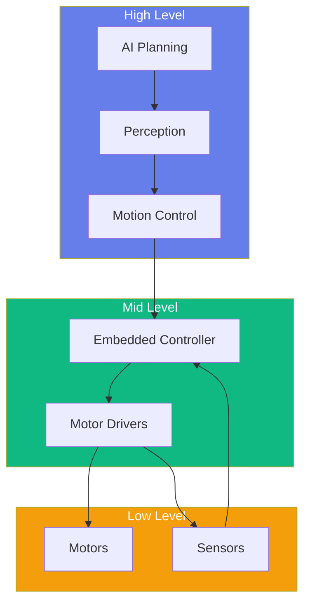
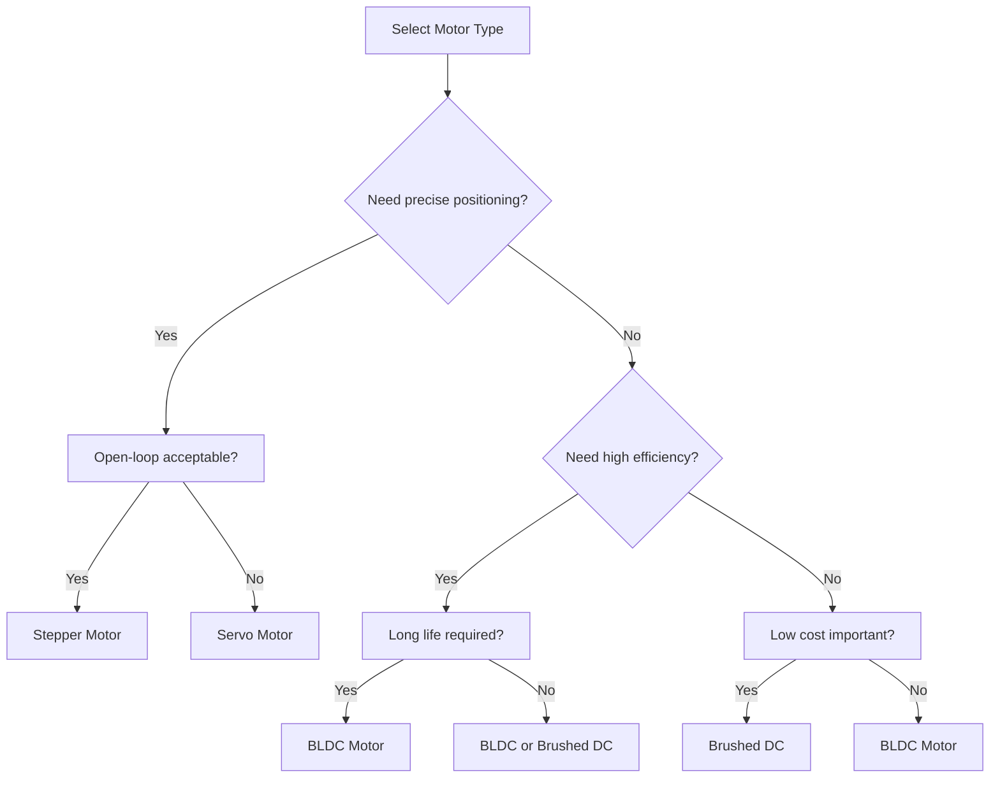
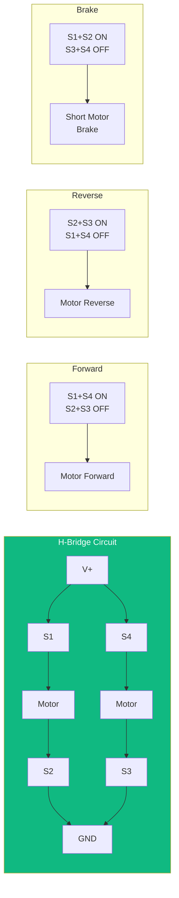

import PersonalizeButton from '@site/src/components/PersonalizeButton';
import TranslateButton from '@site/src/components/TranslateButton';
import CollapsibleCode from '@site/src/components/CollapsibleCode';
import InteractiveDiagram from '@site/src/components/InteractiveDiagram';
import SelfAssessment from '@site/src/components/SelfAssessment';

<div className="learning-objectives">
  <h4>Learning Objectives</h4>
  <ul>
    <li>Understand different motor types and their applications (DC, BLDC, stepper, servo)</li>
    <li>Implement motor control with H-bridges and PWM</li>
    <li>Interface with motor drivers via Serial, CAN, and other protocols</li>
    <li>Integrate encoders and position sensors</li>
    <li>Read and process IMU data (accelerometer, gyroscope, magnetometer)</li>
    <li>Implement sensor fusion algorithms (complementary filter, Kalman filter)</li>
    <li>Develop embedded systems with Arduino, STM32, and ESP32</li>
    <li>Design power systems with battery management</li>
  </ul>
</div>

## Prerequisites

- Chapters 1-3 (Physical AI foundations, Perception, Motion Control)
- Basic electronics knowledge
- Understanding of control theory basics
- ROS 2 fundamentals (Chapter 1)

<PersonalizeButton />
<TranslateButton />

---

## 1. Introduction to Robot Hardware

### The Hardware-Software Interface

Robot hardware provides the physical embodiment of our control algorithms. Understanding the hardware layer is essential for building responsive, reliable robots.

<InteractiveDiagram
  title="Robot Hardware Architecture"
  description="Layers from low-level hardware to high-level AI"
  diagramId="hardware-architecture"
>

</InteractiveDiagram>

### Motor Types Comparison

| Type | Pros | Cons | Best Applications |
|------|------|------|-------------------|
| **DC Brushed** | Simple, cheap, good torque at low speed | Brush wear, limited lifespan | Simple toys, small robots |
| **DC Brushless (BLDC)** | Efficient, long life, high power | Complex control, expensive | Drones, electric vehicles |
| **Stepper** | Precise positioning, open-loop control | Can lose steps, high power draw | 3D printers, CNC machines |
| **Servo (PWM)** | Position controlled, compact | Limited rotation, gear wear | RC vehicles, robotic arms |
| **AC Induction** | Very durable, high power | Requires AC, complex control | Industrial robots |

<InteractiveDiagram
  title="Motor Selection Guide"
  description="Decision tree for motor selection"
  diagramId="motor-selection"
>

</InteractiveDiagram>

### Sensor Overview

| Sensor Type | Measures | Common Use | Interface |
|-------------|----------|------------|-----------|
| **Encoder** | Position/Velocity | Motor feedback | Quadrature (A/B) |
| **Potentiometer** | Absolute position | Joint angle | Analog |
| **IMU** | Acceleration/Angular rate | Orientation | I2C/SPI |
| **LiDAR** | Distance (360°) | Mapping | Ethernet/USB |
| **Camera** | Visual data | Perception | USB/GigE |
| **Force/Torque** | Contact force | Manipulation | Analog/Digital |
| **Ultrasonic** | Distance | Obstacle detection | Trigger/Echo |

---

## 2. Motor Control Fundamentals

### H-Bridge Circuits

An H-bridge enables bidirectional control of a DC motor using four switches.

<InteractiveDiagram
  title="H-Bridge Operation"
 description="How H-bridge switches control motor direction"
diagramId="h-bridge"
>

</InteractiveDiagram>

### PWM Control

Pulse Width Modulation controls motor speed by varying the duty cycle.

<CollapsibleCode
  title="PWM Motor Controller"
  language="python"
>
```python
#!/usr/bin/env python3
"""
PWM Motor Controller for Raspberry Pi.
Uses GPIO PWM for motor speed control.
"""

import RPi.GPIO as GPIO
import time
from typing import Optional


class PWM MotorController:
    """PWM-based motor controller for DC motors."""

    def __init__(self, en_pin: int, in1_pin: int, in2_pin: int,
                 pwm_frequency: int = 1000):
        """
        Initialize motor controller.

        Args:
            en_pin: PWM enable pin
            in1_pin: Direction control pin 1
            in2_pin: Direction control pin 2
            pwm_frequency: PWM frequency in Hz
        """
        self.en_pin = en_pin
        self.in1_pin = in1_pin
        self.in2_pin = in2_pin
        self.pwm_frequency = pwm_frequency

        # Setup GPIO
        GPIO.setmode(GPIO.BCM)
        GPIO.setup([en_pin, in1_pin, in2_pin], GPIO.OUT)

        # PWM instance (0-100 duty cycle)
        self.pwm = GPIO.PWM(en_pin, pwm_frequency)
        self.pwm.start(0)

        # Current state
        self._current_speed = 0
        self._current_direction = 0  # 1=forward, -1=reverse, 0=brake

    def set_speed(self, speed: float):
        """
        Set motor speed.

        Args:
            speed: Speed from -100 (full reverse) to +100 (full forward)
        """
        speed = max(-100, min(100, speed))  # Clamp to range

        if speed > 0:
            # Forward
            GPIO.output(self.in1_pin, GPIO.HIGH)
            GPIO.output(self.in2_pin, GPIO.LOW)
            self._current_direction = 1
        elif speed < 0:
            # Reverse
            GPIO.output(self.in1_pin, GPIO.LOW)
            GPIO.output(self.in2_pin, GPIO.HIGH)
            self._current_direction = -1
        else:
            # Brake
            GPIO.output(self.in1_pin, GPIO.HIGH)
            GPIO.output(self.in2_pin, GPIO.HIGH)
            self._current_direction = 0

        self.pwm.ChangeDutyCycle(abs(speed))
        self._current_speed = speed

    def forward(self, speed: float = 50):
        """Drive motor forward."""
        self.set_speed(speed)

    def reverse(self, speed: float = 50):
        """Drive motor in reverse."""
        self.set_speed(-speed)

    def brake(self):
        """Apply brake (short motor terminals)."""
        self.set_speed(0)

    def coast(self):
        """Coast (disable motor driver)."""
        self.pwm.ChangeDutyCycle(0)
        GPIO.output(self.in1_pin, GPIO.LOW)
        GPIO.output(self.in2_pin, GPIO.LOW)

    def cleanup(self):
        """Cleanup GPIO resources."""
        self.coast()
        self.pwm.stop()
        GPIO.cleanup([self.en_pin, self.in1_pin, self.in2_pin])


class SpeedController:
    """PID speed controller for motor."""

    def __init__(self, motor_controller: PWM MotorController,
                 kp: float = 0.5, ki: float = 0.1, kd: float = 0.05):
        """
        Initialize speed controller.

        Args:
            motor_controller: Motor to control
            kp: Proportional gain
            ki: Integral gain
            kd: Derivative gain
        """
        self.motor = motor_controller
        self.kp = kp
        self.ki = ki
        self.kd = kd

        # PID state
        self.integral = 0
        self.last_error = 0

    def compute(self, setpoint: float, measurement: float, dt: float) -> float:
        """
        Compute PID control output.

        Args:
            setpoint: Target speed
            measurement: Current speed
            dt: Time step

        Returns:
            Control output
        """
        error = setpoint - measurement

        # Proportional
        P = self.kp * error

        # Integral
        self.integral += error * dt
        I = self.ki * self.integral

        # Derivative
        derivative = (error - self.last_error) / dt
        D = self.kd * derivative

        self.last_error = error

        return P + I + D


if __name__ == "__main__":
    print("PWM Motor Controller")
    print("=" * 50)

    # Example (commented out for safety without hardware)
    # motor = PWM MotorController(en_pin=18, in1_pin=23, in2_pin=24)
    #
    # print("Ramp up motor...")
    # for speed in range(0, 101, 10):
    #     motor.set_speed(speed)
    #     time.sleep(0.5)
    #
    # print("Full reverse...")
    # motor.set_speed(-100)
    # time.sleep(2)
    #
    # print("Brake...")
    # motor.brake()
    # motor.cleanup()

    print("Controller class ready for use with Raspberry Pi")
```
</CollapsibleCode>

### Current Sensing

Current sensing protects motors from overcurrent conditions.

<CollapsibleCode
  title="Current Sensing Circuit"
  language="python"
>
```python
#!/usr/bin/env python3
"""
Current Sensing for Motor Protection.
Uses ADC to measure motor current.
"""

import spidev
import time
from dataclasses import dataclass
from typing import Optional


@dataclass
class CurrentReading:
    """Current measurement result."""
    current_ma: float
    timestamp: float
    is_overcurrent: bool


class CurrentSensor:
    """ACS712 or similar current sensor interface."""

    def __init__(self, spi_channel: int = 0, device: int = 0,
                 sensitivity: float = 0.185,  # V/A for ACS712-5A
                 vref: float = 3.3,
                 adc_bits: int = 12,
                 overcurrent_threshold: float = 4000):  # mA
        """
        Initialize current sensor.

        Args:
            spi_channel: SPI channel (0 or 1)
            device: SPI device number
            sensitivity: Sensor sensitivity (V/A)
            vref: Reference voltage
            adc_bits: ADC resolution bits
            overcurrent_threshold: Threshold in mA for overcurrent
        """
        self.sensitivity = sensitivity
        self.vref = vref
        self.adc_max = (1 << adc_bits) - 1
        self.overcurrent_threshold = overcurrent_threshold

        # Setup SPI
        self.spi = spidev.SpiDev()
        self.spi.open(spi_channel, device)
        self.spi.max_speed_hz = 1000000

        # Zero offset (measured with no current)
        self.zero_offset = self._read_adc() * vref / self.adc_max

    def _read_adc(self) -> int:
        """Read raw ADC value."""
        # MCP3008 protocol: 3 byte transfer
        # Byte 1: Start bit + single-ended + channel
        # Byte 2: Null data (LSB of result)
        # Byte 3: LSB of result
        response = self.spi.xfer2([1, (8 + 0) << 4, 0])
        value = ((response[1] & 3) << 8) | response[2]
        return value

    def read_current(self) -> CurrentReading:
        """
        Read motor current.

        Returns:
            CurrentReading with current in mA
        """
        # Read ADC multiple times for averaging
        readings = []
        for _ in range(10):
            readings.append(self._read_adc())
            time.sleep(0.001)

        avg_adc = sum(readings) / len(readings)

        # Convert to voltage
        voltage = (avg_adc / self.adc_max) * self.vref

        # Remove zero offset
        voltage_offset = voltage - self.zero_offset

        # Convert to current (mA)
        current_ma = voltage_offset / self.sensitivity * 1000

        return CurrentReading(
            current_ma=current_ma,
            timestamp=time.time(),
            is_overcurrent=abs(current_ma) > self.overcurrent_threshold
        )

    def calibrate_zero(self):
        """Calibrate zero offset with motor off."""
        readings = []
        for _ in range(100):
            readings.append(self._read_adc())
            time.sleep(0.01)

        avg_adc = sum(readings) / len(readings)
        self.zero_offset = (avg_adc / self.adc_max) * self.vref
        print(f"Calibrated zero offset: {self.zero_offset:.4f}V")


if __name__ == "__main__":
    print("Current Sensing for Motor Protection")
    print("=" * 50)

    # Example usage (requires SPI hardware)
    # sensor = CurrentSensor(spi_channel=0, device=0)
    # sensor.calibrate_zero()
    #
    # try:
    #     while True:
    #         reading = sensor.read_current()
    #         status = "OVERCURRENT!" if reading.is_overcurrent else "OK"
    #         print(f"Current: {reading.current_ma:.1f}mA [{status}]")
    #         time.sleep(0.1)
    # except KeyboardInterrupt:
    #     print("\nStopped")

    print("Current sensor class ready for use with ACS712 and MCP3008")
```
</CollapsibleCode>

---

## 3. Motor Driver Interfaces

### Serial Communication

<CollapsibleCode
  title="Serial Motor Driver Interface"
  language="python"
>
```python
#!/usr/bin/env python3
"""
Serial Motor Driver Controller.
Communicates with motor controllers via serial protocol.
"""

import serial
import time
from dataclasses import dataclass
from typing import List, Optional, Tuple
from enum import IntEnum


class MotorCommand(IntEnum):
    """Motor controller commands."""
    SET_VELOCITY = 0x01
    SET_POSITION = 0x02
    SET_CURRENT = 0x03
    GET_STATUS = 0x04
    GET_POSITION = 0x05
    GET_VELOCITY = 0x06
    ENABLE = 0x10
    DISABLE = 0x11
    SET_BRAKE = 0x12
    EMERGENCY_STOP = 0x13


@dataclass
class MotorStatus:
    """Motor controller status."""
    enabled: bool
    position: float  # encoder counts
    velocity: float  # counts per second
    current: float   # mA
    temperature: float  # Celsius
    fault_flags: int


class SerialMotorController:
    """Serial interface to motor controller board."""

    def __init__(self, port: str = "/dev/ttyUSB0", baudrate: int = 115200,
                 motor_count: int = 4, timeout: float = 1.0):
        """
        Initialize serial motor controller.

        Args:
            port: Serial port
            baudrate: Communication speed
            motor_count: Number of motors
            timeout: Serial timeout
        """
        self.port = port
        self.baudrate = baudrate
        self.motor_count = motor_count

        # Open serial connection
        self.serial = serial.Serial(port, baudrate, timeout=timeout)

        # Response buffer
        self.rx_buffer = bytearray()

        # Discard any stale data
        self.serial.reset_input_buffer()
        time.sleep(0.1)  # Wait for Arduino reset

    def _send_command(self, cmd: MotorCommand, motor_id: int,
                      data: bytes = b'') -> bool:
        """
        Send command to motor controller.

        Args:
            cmd: Command byte
            motor_id: Motor number (0-3)
            data: Optional data payload

        Returns:
            True if sent successfully
        """
        # Build packet: [START, MOTOR_ID, CMD, LEN, DATA..., CHECKSUM]
        packet = bytearray()
        packet.append(0xAA)  # Start byte
        packet.append(motor_id & 0xFF)
        packet.append(cmd)
        packet.append(len(data) & 0xFF)
        packet.extend(data)

        # Simple checksum
        checksum = sum(packet) & 0xFF
        packet.append(checksum)

        try:
            self.serial.write(packet)
            self.serial.flush()
            return True
        except Exception as e:
            print(f"Send failed: {e}")
            return False

    def _read_response(self, expected_len: int = 8) -> Optional[bytearray]:
        """
        Read response from controller.

        Args:
            expected_len: Expected response length

        Returns:
            Response data or None
        """
        start_time = time.time()
        while time.time() - start_time < self.serial.timeout:
            if self.serial.in_waiting >= expected_len:
                return self.serial.read(expected_len)
            time.sleep(0.001)

        return None

    def set_velocity(self, motor_id: int, velocity: float) -> bool:
        """
        Set motor velocity.

        Args:
            motor_id: Motor number
            velocity: Velocity in RPM or counts/sec

        Returns:
            True if successful
        """
        # Send velocity as 4-byte float
        import struct
        data = struct.pack('<f', velocity)
        return self._send_command(MotorCommand.SET_VELOCITY, motor_id, data)

    def set_position(self, motor_id: int, position: float) -> bool:
        """
        Set motor position (for position mode).

        Args:
            motor_id: Motor number
            position: Target position

        Returns:
            True if successful
        """
        import struct
        data = struct.pack('<f', position)
        return self._send_command(MotorCommand.SET_POSITION, motor_id, data)

    def get_position(self, motor_id: int) -> Optional[float]:
        """
        Read current motor position.

        Args:
            motor_id: Motor number

        Returns:
            Position in encoder counts or None
        """
        if not self._send_command(MotorCommand.GET_POSITION, motor_id):
            return None

        response = self._read_response(8)
        if response and response[0] == 0xAA:
            import struct
            return struct.unpack('<f', response[4:8])[0]

        return None

    def get_velocity(self, motor_id: int) -> Optional[float]:
        """Read current motor velocity."""
        if not self._send_command(MotorCommand.GET_VELOCITY, motor_id):
            return None

        response = self._read_response(8)
        if response and response[0] == 0xAA:
            import struct
            return struct.unpack('<f', response[4:8])[0]

        return None

    def enable(self, motor_id: int) -> bool:
        """Enable motor driver."""
        return self._send_command(MotorCommand.ENABLE, motor_id)

    def disable(self, motor_id: int) -> bool:
        """Disable motor driver."""
        return self._send_command(MotorCommand.DISABLE, motor_id)

    def emergency_stop(self) -> bool:
        """Emergency stop all motors."""
        return self._send_command(MotorCommand.EMERGENCY_STOP, 0)

    def get_all_positions(self) -> List[Optional[float]]:
        """Read positions from all motors."""
        return [self.get_position(i) for i in range(self.motor_count)]

    def close(self):
        """Close serial connection."""
        self.serial.close()


if __name__ == "__main__":
    print("Serial Motor Controller")
    print("=" * 50)

    # Example (requires hardware)
    # controller = SerialMotorController(port="/dev/ttyUSB0", baudrate=115200)
    #
    # # Enable motors
    # for i in range(4):
    #     controller.enable(i)
    #
    # # Move motor 0 at 100 RPM
    # controller.set_velocity(0, 100)
    # time.sleep(2)
    #
    # # Read position
    # pos = controller.get_position(0)
    # print(f"Motor 0 position: {pos}")
    #
    # # Stop
    # controller.emergency_stop()
    # controller.close()

    print("Serial motor controller class ready")
```
</CollapsibleCode>

### CAN Bus for Robotics

<CollapsibleCode
  title="CAN Bus Motor Control"
  language="python"
>
```python
#!/usr/bin/env python3
"""
CAN Bus Interface for Robot Motor Control.
Uses python-can library for CAN communication.
"""

import can
import struct
import time
from dataclasses import dataclass
from typing import Optional, Dict
from enum import IntEnum


class CANMessageType(IntEnum):
    """CAN message identifiers."""
    MOTOR_CMD = 0x201  # Motor command (send)
    MOTOR_STATUS = 0x181  # Motor status (receive)
    EMERGENCY_STOP = 0x001
    HEARTBEAT = 0x700


@dataclass
class MotorCommandData:
    """Motor command data structure."""
    target_velocity: float  # rad/s
    target_torque: float    # Nm
    position_limit: float   # rad
    control_mode: int       # 0=velocity, 1=torque, 2=position


@dataclass
class MotorStatusData:
    """Motor status data structure."""
    position: float     # rad
    velocity: float     # rad/s
    torque: float       # Nm
    temperature: float  # Celsius
    fault_code: int
    enabled: bool


class CANMotorController:
    """CAN bus interface for motor controllers."""

    def __init__(self, channel: str = "can0", bitrate: int = 1000000):
        """
        Initialize CAN interface.

        Args:
            channel: CAN interface channel
            bitrate: CAN bitrate
        """
        self.channel = channel
        self.bus = None
        self.motor_statuses: Dict[int, MotorStatusData] = {}

        # Notifier for async updates
        self.notifier = None

    def connect(self):
        """Connect to CAN bus."""
        self.bus = can.interface.Bus(
            channel=self.channel,
            bustype='socketcan',
            bitrate=1000000
        )
        print(f"Connected to CAN bus on {self.channel}")

    def send_motor_command(self, motor_id: int, cmd: MotorCommandData):
        """
        Send command to motor.

        Args:
            motor_id: Motor controller ID (0-3)
            cmd: Command data
        """
        if self.bus is None:
            return

        # Build message
        msg = can.Message(
            arbitration_id=CANMessageType.MOTOR_CMD + motor_id,
            data=struct.pack(
                '<fffif',
                cmd.target_velocity,
                cmd.target_torque,
                cmd.position_limit,
                cmd.control_mode
            ),
            is_extended_id=False
        )

        try:
            self.bus.send(msg)
        except Exception as e:
            print(f"Failed to send CAN message: {e}")

    def enable_motor(self, motor_id: int):
        """Enable a motor."""
        cmd = MotorCommandData(0, 0, 0, 0)
        self.send_motor_command(motor_id, cmd)

    def disable_motor(self, motor_id: int):
        """Disable a motor."""
        # Send zero command
        cmd = MotorCommandData(0, 0, 0, 0)
        self.send_motor_command(motor_id, cmd)

    def set_velocity(self, motor_id: int, velocity_rad_s: float):
        """Set motor velocity."""
        cmd = MotorCommandData(
            target_velocity=velocity_rad_s,
            target_torque=0,
            position_limit=0,
            control_mode=0  # Velocity mode
        )
        self.send_motor_command(motor_id, cmd)

    def emergency_stop_all(self):
        """Send emergency stop to all motors."""
        if self.bus is None:
            return

        msg = can.Message(
            arbitration_id=CANMessageType.EMERGENCY_STOP,
            data=b'\x00' * 8,
            is_extended_id=False
        )

        self.bus.send(msg)

    def receive_status(self, timeout: float = 0.1) -> Optional[MotorStatusData]:
        """
        Receive motor status message.

        Args:
            timeout: Read timeout

        Returns:
            MotorStatusData or None
        """
        if self.bus is None:
            return None

        msg = self.bus.recv(timeout)
        if msg is None:
            return None

        if msg.arbitration_id >= CANMessageType.MOTOR_STATUS and \
           msg.arbitration_id < CANMessageType.MOTOR_STATUS + 16:
            motor_id = msg.arbitration_id - CANMessageType.MOTOR_STATUS

            if len(msg.data) == 8:
                pos, vel, torque, temp_fault = struct.unpack('<ffff', msg.data)

                status = MotorStatusData(
                    position=pos,
                    velocity=vel,
                    torque=torque,
                    temperature=temp_fault,
                    fault_code=int(temp_fault) & 0xFF,
                    enabled=(temp_fault & 0x100) != 0
                )

                self.motor_statuses[motor_id] = status
                return status

        return None

    def get_all_statuses(self) -> Dict[int, MotorStatusData]:
        """Get status of all known motors."""
        return self.motor_statuses.copy()

    def close(self):
        """Close CAN connection."""
        if self.bus:
            self.bus.shutdown()


if __name__ == "__main__":
    print("CAN Bus Motor Controller")
    print("=" * 50)

    # Example (requires CAN hardware)
    # can_controller = CANMotorController(channel="can0")
    # can_controller.connect()
    #
    # # Enable motors
    # for i in range(4):
    #     can_controller.enable_motor(i)
    #
    # # Set velocity
    # can_controller.set_velocity(0, 10.0)  # 10 rad/s
    #
    # # Read status
    # for _ in range(10):
    #     status = can_controller.receive_status()
    #     if status:
    #         print(f"Position: {status.position:.2f} rad")
    #     time.sleep(0.1)
    #
    # can_controller.emergency_stop_all()
    # can_controller.close()

    print("CAN motor controller class ready")
```
</CollapsibleCode>

---

## 4. Position and Velocity Sensing

### Encoder Interfaces

<CollapsibleCode
  title="Quadrature Encoder Reader"
  language="python"
>
```python
#!/usr/bin/env python3
"""
Quadrature Encoder Reader.
Reads position and velocity from incremental encoders.
"""

import RPi.GPIO as GPIO
import time
from dataclasses import dataclass
from typing import Tuple
import threading


@dataclass
class EncoderReading:
    """Encoder measurement result."""
    position: int  # counts
    velocity: float  # counts per second
    direction: int   # 1 or -1


class QuadratureEncoder:
    """Reads quadrature encoder signals."""

    def __init__(self, pin_a: int, pin_b: int, counts_per_rev: int = 500,
                 use_index: bool = False, pin_index: int = None):
        """
        Initialize encoder reader.

        Args:
            pin_a: GPIO pin for channel A
            pin_b: GPIO pin for channel B
            counts_per_rev: Encoder counts per revolution
            use_index: Whether to use index signal
            pin_index: GPIO pin for index (Z) signal
        """
        self.pin_a = pin_a
        self.pin_b = pin_b
        self.counts_per_rev = counts_per_rev
        self.use_index = use_index
        self.pin_index = pin_index

        # Position tracking
        self._position = 0
        self._last_a = 0
        self._last_b = 0
        self._direction = 1

        # Velocity calculation
        self._last_time = time.time()
        self._last_position = 0
        self._velocity = 0.0

        # Thread safety
        self._lock = threading.Lock()

        # Setup GPIO
        GPIO.setmode(GPIO.BCM)
        GPIO.setup([pin_a, pin_b], GPIO.IN, pull_up_down=GPIO.PUD_UP)

        if use_index and pin_index is not None:
            GPIO.setup(pin_index, GPIO.IN, pull_up_down=GPIO.PUD_UP)

        # Initial read
        self._last_a = GPIO.input(pin_a)
        self._last_b = GPIO.input(pin_b)

        # Add edge detection
        GPIO.add_event_detect(pin_a, GPIO.BOTH, self._callback_a)
        GPIO.add_event_detect(pin_b, GPIO.BOTH, self._callback_b)

    def _callback_a(self, channel):
        """Handle channel A edge."""
        a = GPIO.input(self.pin_a)
        b = GPIO.input(self.pin_b)

        with self._lock:
            if a != self._last_a:
                if a:  # Rising edge
                    if b:
                        self._position -= 1
                        self._direction = -1
                    else:
                        self._position += 1
                        self._direction = 1
                else:  # Falling edge
                    if b:
                        self._position += 1
                        self._direction = 1
                    else:
                        self._position -= 1
                        self._direction = -1

                self._last_a = a

    def _callback_b(self, channel):
        """Handle channel B edge."""
        a = GPIO.input(self.pin_a)
        b = GPIO.input(self.pin_b)

        with self._lock:
            if b != self._last_b:
                if b:  # Rising edge
                    if a:
                        self._position += 1
                        self._direction = 1
                    else:
                        self._position -= 1
                        self._direction = -1
                else:  # Falling edge
                    if a:
                        self._position -= 1
                        self._direction = -1
                    else:
                        self._position += 1
                        self._direction = 1

                self._last_b = b

    def read(self) -> EncoderReading:
        """
        Read current position and velocity.

        Returns:
            EncoderReading with position and velocity
        """
        current_time = time.time()

        with self._lock:
            # Calculate velocity
            dt = current_time - self._last_time
            if dt > 0:
                dpos = self._position - self._last_position
                self._velocity = dpos / dt

            self._last_time = current_time
            self._last_position = self._position

            return EncoderReading(
                position=self._position,
                velocity=self._velocity,
                direction=self._direction
            )

    def get_position(self) -> int:
        """Get current position in counts."""
        with self._lock:
            return self._position

    def get_revolutions(self) -> float:
        """Get current position in revolutions."""
        return self._position / self.counts_per_rev

    def get_radians(self) -> float:
        """Get current position in radians."""
        return 2 * 3.14159 * self._position / self.counts_per_rev

    def get_velocity_rps(self) -> float:
        """Get velocity in revolutions per second."""
        with self._lock:
            return self._velocity / self.counts_per_rev

    def get_velocity_rpm(self) -> float:
        """Get velocity in RPM."""
        return self.get_velocity_rps() * 60

    def reset(self):
        """Reset position to zero."""
        with self._lock:
            self._position = 0
            self._last_position = 0
            self._last_time = time.time()

    def cleanup(self):
        """Cleanup GPIO resources."""
        GPIO.remove_event_detect(self.pin_a)
        GPIO.remove_event_detect(self.pin_b)
        if self.use_index and self.pin_index:
            GPIO.remove_event_detect(self.pin_index)


class EncoderManager:
    """Manages multiple encoders."""

    def __init__(self):
        self.encoders: Dict[int, QuadratureEncoder] = {}

    def add_encoder(self, encoder_id: int, encoder: QuadratureEncoder):
        """Add an encoder."""
        self.encoders[encoder_id] = encoder

    def read_all(self) -> Dict[int, EncoderReading]:
        """Read from all encoders."""
        return {i: enc.read() for i, enc in self.encoders.items()}

    def get_all_positions(self) -> Dict[int, int]:
        """Get positions from all encoders."""
        return {i: enc.get_position() for i, enc in self.encoders.items()}


if __name__ == "__main__":
    print("Quadrature Encoder Reader")
    print("=" * 50)

    # Example (requires hardware)
    # encoder = QuadratureEncoder(pin_a=17, pin_b=18, counts_per_rev=500)
    #
    # try:
    #     while True:
    #         reading = encoder.read()
    #         print(f"Position: {reading.position}, "
    #               f"Velocity: {reading.velocity:.1f} cps, "
    #               f"Direction: {reading.direction}")
    #         time.sleep(0.1)
    # except KeyboardInterrupt:
    #     encoder.cleanup()

    print("Encoder class ready for use with Raspberry Pi")
```
</CollapsibleCode>

---

## 5. Inertial Measurement Units

### MPU6050 Interface

<CollapsibleCode
  title="MPU6050 IMU Interface"
  language="python"
>
```python
#!/usr/bin/env python3
"""
MPU6050 IMU Interface.
Reads accelerometer, gyroscope, and temperature.
"""

import smbus2
import time
import math
from dataclasses import dataclass
from typing import Tuple, Optional


@dataclass
class IMUReading:
    """Raw IMU sensor readings."""
    accel_x: float  # g
    accel_y: float  # g
    accel_z: float  # g
    gyro_x: float   # deg/s
    gyro_y: float   # deg/s
    gyro_z: float   # deg/s
    temperature: float  # Celsius


@dataclass
class CalibratedIMUReading:
    """Calibrated IMU readings."""
    accel_x: float
    accel_y: float
    accel_z: float
    gyro_x: float
    gyro_y: float
    gyro_z: float
    temperature: float


class MPU6050:
    """Interface to MPU6050 IMU sensor."""

    # Register addresses
    REG_ACCEL_XOUT_H = 0x3B
    REG_ACCEL_XOUT_L = 0x3C
    REG_ACCEL_YOUT_H = 0x3D
    REG_ACCEL_YOUT_L = 0x3E
    REG_ACCEL_ZOUT_H = 0x3F
    REG_ACCEL_ZOUT_L = 0x40
    REG_GYRO_XOUT_H = 0x43
    REG_GYRO_XOUT_L = 0x44
    REG_GYRO_YOUT_H = 0x45
    REG_GYRO_YOUT_L = 0x46
    REG_GYRO_ZOUT_H = 0x47
    REG_GYRO_ZOUT_L = 0x48
    REG_TEMP_OUT_H = 0x41
    REG_TEMP_OUT_L = 0x42
    REG_PWR_MGMT_1 = 0x6B
    REG_CONFIG = 0x1A
    REG_GYRO_CONFIG = 0x1B
    REG_ACCEL_CONFIG = 0x1C

    # Accelerometer ranges (g)
    ACCEL_RANGE_2G = 0
    ACCEL_RANGE_4G = 1
    ACCEL_RANGE_8G = 2
    ACCEL_RANGE_16G = 3

    # Gyroscope ranges (deg/s)
    GYRO_RANGE_250 = 0
    GYRO_RANGE_500 = 1
    GYRO_RANGE_1000 = 2
    GYRO_RANGE_2000 = 3

    def __init__(self, bus: int = 1, address: int = 0x68):
        """
        Initialize MPU6050.

        Args:
            bus: I2C bus number
            address: I2C address
        """
        self.bus = smbus2.SMBus(bus)
        self.address = address

        # Scale factors (set later based on range)
        self.accel_scale = 16384.0  # LSB/g for 2g range
        self.gyro_scale = 131.0     # LSB/(deg/s) for 250 deg/s range

        # Calibration offsets (set by calibration)
        self.accel_offset = (0, 0, 0)
        self.gyro_offset = (0, 0, 0)

        # Wake up MPU6050
        self.bus.write_byte_data(self.address, self.REG_PWR_MGMT_1, 0)

        # Default configuration
        self.set_accel_range(self.ACCEL_RANGE_2G)
        self.set_gyro_range(self.GYRO_RANGE_250)

        print(f"MPU6050 initialized on bus {bus}, address 0x{address:02X}")

    def set_accel_range(self, range_bits: int):
        """
        Set accelerometer range.

        Args:
            range_bits: Range setting (0-3)
        """
        scales = [16384.0, 8192.0, 4096.0, 2048.0]
        self.accel_scale = scales[range_bits] if range_bits < 4 else scales[0]
        self.bus.write_byte_data(self.address, self.REG_ACCEL_CONFIG, range_bits << 3)

    def set_gyro_range(self, range_bits: int):
        """
        Set gyroscope range.

        Args:
            range_bits: Range setting (0-3)
        """
        scales = [131.0, 65.5, 32.8, 16.4]
        self.gyro_scale = scales[range_bits] if range_bits < 4 else scales[0]
        self.bus.write_byte_data(self.address, self.REG_GYRO_CONFIG, range_bits << 3)

    def _read_word(self, reg: int) -> int:
        """Read signed 16-bit value."""
        high = self.bus.read_byte_data(self.address, reg)
        low = self.bus.read_byte_data(self.address, reg + 1)
        value = (high << 8) | low
        if value >= 0x8000:
            value -= 0x10000
        return value

    def read_raw(self) -> IMUReading:
        """
        Read raw sensor values.

        Returns:
            IMUReading with raw values
        """
        # Read accelerometer
        ax = self._read_word(self.REG_ACCEL_XOUT_H)
        ay = self._read_word(self.REG_ACCEL_YOUT_H)
        az = self._read_word(self.REG_ACCEL_ZOUT_H)

        # Read gyroscope
        gx = self._read_word(self.REG_GYRO_XOUT_H)
        gy = self._read_word(self.REG_GYRO_YOUT_H)
        gz = self._read_word(self.REG_GYRO_ZOUT_H)

        # Read temperature
        temp = self._read_word(self.REG_TEMP_OUT_H)
        temp_c = temp / 340.0 + 36.53

        return IMUReading(
            accel_x=ax / self.accel_scale,
            accel_y=ay / self.accel_scale,
            accel_z=az / self.accel_scale,
            gyro_x=gx / self.gyro_scale,
            gyro_y=gy / self.gyro_scale,
            gyro_z=gz / self.gyro_scale,
            temperature=temp_c
        )

    def read_calibrated(self) -> CalibratedIMUReading:
        """
        Read calibrated sensor values.

        Returns:
            CalibratedIMUReading
        """
        raw = self.read_raw()

        return CalibratedIMUReading(
            accel_x=raw.accel_x - self.accel_offset[0],
            accel_y=raw.accel_y - self.accel_offset[1],
            accel_z=raw.accel_z - self.accel_offset[2],
            gyro_x=raw.gyro_x - self.gyro_offset[0],
            gyro_y=raw.gyro_y - self.gyro_offset[1],
            gyro_z=raw.gyro_z - self.gyro_offset[2],
            temperature=raw.temperature
        )

    def calibrate(self, samples: int = 1000, delay: float = 0.01):
        """
        Calibrate sensor offsets.

        Args:
            samples: Number of samples to average
            delay: Delay between samples
        """
        print(f"Calibrating with {samples} samples...")

        ax_sum = ay_sum = az_sum = 0
        gx_sum = gy_sum = gz_sum = 0

        for _ in range(samples):
            raw = self.read_raw()
            ax_sum += raw.accel_x
            ay_sum += raw.accel_y
            az_sum += raw.accel_z
            gx_sum += raw.gyro_x
            gy_sum += raw.gyro_y
            gz_sum += raw.gyro_z
            time.sleep(delay)

        # Calculate averages
        self.accel_offset = (ax_sum / samples, ay_sum / samples,
                            (az_sum / samples) - 1.0)  # Subtract 1g for Z

        self.gyro_offset = (gx_sum / samples, gy_sum / samples,
                           gz_sum / samples)

        print(f"Accel offset: {self.accel_offset}")
        print(f"Gyro offset: {self.gyro_offset}")

    def get_orientation(self) -> Tuple[float, float, float]:
        """
        Calculate orientation from accelerometer.

        Returns:
            (pitch, roll, yaw) in radians
        """
        cal = self.read_calibrated()

        # Calculate pitch and roll
        pitch = math.atan2(cal.accel_x,
                          math.sqrt(cal.accel_y**2 + cal.accel_z**2))
        roll = math.atan2(cal.accel_y,
                         math.sqrt(cal.accel_x**2 + cal.accel_z**2))

        return pitch, roll, 0.0  # Yaw requires magnetometer


if __name__ == "__main__":
    print("MPU6050 IMU Interface")
    print("=" * 50)

    # Example
    # imu = MPU6050(bus=1, address=0x68)
    # imu.calibrate(samples=500)
    #
    # try:
    #     while True:
    #         cal = imu.read_calibrated()
    #         pitch, roll, _ = imu.get_orientation()
    #         print(f"Pitch: {math.degrees(pitch):.1f}deg, "
    #               f"Roll: {math.degrees(roll):.1f}deg, "
    #               f"Gyro Z: {cal.gyro_z:.1f}deg/s")
    #         time.sleep(0.1)
    # except KeyboardInterrupt:
    #     print("\nStopped")

    print("MPU6050 interface ready")
```
</CollapsibleCode>

<InteractiveDiagram
  title="MPU6050 Axes"
  description="Accelerometer and gyroscope axes orientation"
  diagramId="mpu6050-axes"
>
```mermaid
flowchart TB
    subgraph MPU["MPU6050 Sensor"]
        X[X axis<br/>Accel/Gyro] --> Right
        Y[Y axis<br/>Accel/Gyro] --> Forward
        Z[Z axis<br/>Accel/Gyro] --> Up
    end

    subgraph Orientation["Calculated Angles"]
        Roll[Roll - Rotation around X] --> from YZ
        Pitch[Pitch - Rotation around Y] --> from XZ
        Yaw[Yaw - Rotation around Z] --> from XY
    end

    X --> Pitch
    Y --> Roll
    Z --> Yaw
```
</InteractiveDiagram>

---

## 6. Sensor Fusion

### Complementary Filter

<CollapsibleCode
  title="Complementary Filter for Orientation"
  language="python"
>
```python
#!/usr/bin/env python3
"""
Complementary Filter for Sensor Fusion.
Combines accelerometer and gyroscope data for orientation estimation.
"""

import time
import math
from dataclasses import dataclass
from typing import Tuple


@dataclass
class Orientation3D:
    """3D orientation estimate."""
    roll: float   # radians
    pitch: float  # radians
    yaw: float    # radians


class ComplementaryFilter:
    """
    Complementary filter for orientation estimation.

    Combines:
    - High-pass filtered gyroscope (short-term accuracy)
    - Low-pass filtered accelerometer (long-term stability)
    """

    def __init__(self, alpha: float = 0.98, alpha_yaw: float = 0.95):
        """
        Initialize complementary filter.

        Args:
            alpha: Filter coefficient for gyroscope (0-1)
                  Higher = more gyroscope trust, faster response
            alpha_yaw: Filter coefficient for yaw (magnetometer fusion)
        """
        self.alpha = alpha
        self.alpha_yaw = alpha_yaw

        # Current orientation
        self.roll = 0.0
        self.pitch = 0.0
        self.yaw = 0.0

        # Previous gyroscope values
        self.last_gyro_x = 0.0
        self.last_gyro_y = 0.0
        self.last_gyro_z = 0.0

    def update(self, accel_x: float, accel_y: float, accel_z: float,
               gyro_x: float, gyro_y: float, gyro_z: float,
               dt: float) -> Orientation3D:
        """
        Update orientation estimate.

        Args:
            accel_x, accel_y, accel_z: Accelerometer readings (g)
            gyro_x, gyro_y, gyro_z: Gyroscope readings (rad/s)
            dt: Time step (seconds)

        Returns:
            Updated orientation
        """
        # Calculate pitch and roll from accelerometer
        accel_pitch = math.atan2(-accel_x,
                                 math.sqrt(accel_y**2 + accel_z**2))
        accel_roll = math.atan2(accel_y, accel_z)

        # Integrate gyroscope (short-term, high frequency)
        gyro_roll = self.roll + gyro_x * dt
        gyro_pitch = self.pitch + gyro_y * dt
        gyro_yaw = self.yaw + gyro_z * dt

        # Complementary filter combine
        self.roll = self.alpha * gyro_roll + (1 - self.alpha) * accel_roll
        self.pitch = self.alpha * gyro_pitch + (1 - self.alpha) * accel_pitch
        self.yaw = self.alpha_yaw * gyro_yaw + (1 - self.alpha_yaw) * self.yaw

        return Orientation3D(roll=self.roll, pitch=self.pitch, yaw=self.yaw)

    def update_magnetometer(self, mag_x: float, mag_y: float,
                           mag_z: float) -> float:
        """
        Update yaw using magnetometer data.

        Args:
            mag_x, mag_y, mag_z: Magnetometer readings

        Returns:
            Updated yaw angle
        """
        # Calculate yaw from magnetometer
        # Tilt compensation
        cos_roll = math.cos(self.roll)
        sin_roll = math.sin(self.roll)
        cos_pitch = math.cos(self.pitch)
        sin_pitch = math.sin(self.pitch)

        # Tilt-compensated heading
        mx = mag_x * cos_pitch + mag_y * sin_roll * sin_pitch + mag_z * cos_roll * sin_pitch
        my = -mag_y * cos_roll + mag_z * sin_roll

        mag_yaw = math.atan2(-my, mx)

        # Fuse with current yaw estimate
        self.yaw = self.alpha_yaw * self.yaw + (1 - self.alpha_yaw) * mag_yaw

        return self.yaw

    def reset(self):
        """Reset filter state."""
        self.roll = 0.0
        self.pitch = 0.0
        self.yaw = 0.0


class MadgwickFilter:
    """Madgwick AHRS (Attitude and Heading Reference System) filter."""

    def __init__(self, beta: float = 0.1, sample_period: float = 0.01):
        """
        Initialize Madgwick filter.

        Args:
            beta: Filter gain (higher = faster convergence, more noise)
            sample_period: Sample period in seconds
        """
        self.beta = beta
        self.sample_period = sample_period

        # Quaternion representing the estimated orientation
        # q = [w, x, y, z] where w is scalar
        self.q = [1.0, 0.0, 0.0, 0.0]

    def update(self, gyro: Tuple[float, float, float],
               accel: Tuple[float, float, float],
               mag: Tuple[float, float, float] = None,
               mag_bias: Tuple[float, float, float] = None) -> Tuple[float, float, float]:
        """
        Update orientation estimate using Madgwick algorithm.

        Args:
            gyro: Gyroscope readings (rad/s)
            accel: Accelerometer readings (g)
            mag: Magnetometer readings (optional)
            mag_bias: Magnetometer bias (optional)

        Returns:
            Euler angles (roll, pitch, yaw) in radians
        """
        q = self.q

        # Normalize accelerometer
        ax, ay, az = accel
        norm = math.sqrt(ax**2 + ay**2 + az**2)
        if norm == 0:
            return self.get_euler()
        ax, ay, az = ax/norm, ay/norm, az/norm

        # Gradient descent algorithm corrective step
        f = [
            2*(q[1]*q[3] - q[0]*q[2]) - ax,
            2*(q[0]*q[1] + q[2]*q[3]) - ay,
            2*(0.5 - q[1]**2 - q[2]**2) - az
        ]

        # Jacobian
        j = [
            [-2*q[2], 2*q[3], -2*q[0], 2*q[1]],
            [2*q[1], 2*q[0], 2*q[3], 2*q[2]],
            [0, -4*q[1], -4*q[2], 0]
        ]

        # Step direction
        step = [
            j[0][0]*f[0] + j[1][0]*f[1] + j[2][0]*f[2],
            j[0][1]*f[0] + j[1][1]*f[1] + j[2][1]*f[2],
            j[0][2]*f[0] + j[1][2]*f[1] + j[2][2]*f[2],
            j[0][3]*f[0] + j[1][3]*f[1] + j[2][3]*f[2]
        ]

        # Normalize step
        step_norm = math.sqrt(sum(s**2 for s in step))
        if step_norm > 0:
            step = [s/step_norm for s in step]

        # Compute rate of change
        gx, gy, gz = gyro
        q_dot = [
            0.5 * (-q[1]*gx - q[2]*gy - q[3]*gz) - self.beta * step[0],
            0.5 * (q[0]*gx + q[2]*gz - q[3]*gy) - self.beta * step[1],
            0.5 * (q[0]*gy - q[1]*gz + q[3]*gx) - self.beta * step[2],
            0.5 * (q[0]*gz + q[1]*gy - q[2]*gx) - self.beta * step[3]
        ]

        # Integrate
        q = [q[i] + q_dot[i] * self.sample_period for i in range(4)]

        # Normalize quaternion
        norm = math.sqrt(sum(q[i]**2 for i in range(4)))
        self.q = [q[i]/norm for i in range(4)]

        return self.get_euler()

    def get_euler(self) -> Tuple[float, float, float]:
        """Get Euler angles from quaternion."""
        q = self.q

        # Roll (x-axis rotation)
        sinr_cosp = 2 * (q[0]*q[1] + q[2]*q[3])
        cosr_cosp = 1 - 2 * (q[1]**2 + q[2]**2)
        roll = math.atan2(sinr_cosp, cosr_cosp)

        # Pitch (y-axis rotation)
        sinp = 2 * (q[0]*q[2] - q[3]*q[1])
        if abs(sinp) >= 1:
            pitch = math.copysign(math.pi/2, sinp)
        else:
            pitch = math.asin(sinp)

        # Yaw (z-axis rotation)
        siny_cosp = 2 * (q[0]*q[3] + q[1]*q[2])
        cosy_cosp = 1 - 2 * (q[2]**2 + q[3]**2)
        yaw = math.atan2(siny_cosp, cosy_cosp)

        return roll, pitch, yaw


if __name__ == "__main__":
    print("Sensor Fusion Filters")
    print("=" * 50)

    # Example
    # filter = ComplementaryFilter(alpha=0.98)
    #
    # try:
    #     while True:
    #         # Read IMU
    #         accel = imu.read_calibrated()
    #         gyro = (accel.gyro_x, accel.gyro_y, accel.gyro_z)
    #         acc = (accel.accel_x, accel.accel_y, accel.accel_z)
    #
    #         # Update filter
    #         orientation = filter.update(*acc, *gyro, dt=0.01)
    #
    #         print(f"Roll: {math.degrees(orientation.roll):.1f}deg, "
    #               f"Pitch: {math.degrees(orientation.pitch):.1f}deg")
    #         time.sleep(0.01)
    # except KeyboardInterrupt:
    #     pass

    print("Sensor fusion filters ready")
```
</CollapsibleCode>

---

## 7. Embedded Systems

### Arduino Firmware

<CollapsibleCode
  title="Arduino Motor Controller Firmware"
  language="cpp"
>
```cpp
/*
  Arduino Motor Controller Firmware
  Serial interface for motor control with PID
*/

#include <PID.h>

// Motor pin configuration
#define ENA_PIN 9    // PWM enable
#define IN1_PIN 8    // Direction 1
#define IN2_PIN 7    // Direction 2
#define ENCODER_A 2  // Encoder channel A
#define ENCODER_B 3  // Encoder channel B

// PID parameters
#define KP 1.0
#define KI 0.1
#define KD 0.05

// Global variables
volatile long encoder_count = 0;
float target_velocity = 0;
float current_velocity = 0;
unsigned long last_time = 0;

// PID controller
PID velPID(&current_velocity, &motor_power, &target_velocity,
           KP, KI, DIRECT);

void setup() {
  // Setup serial
  Serial.begin(115200);
  Serial.println("Motor Controller Ready");

  // Setup motor pins
  pinMode(ENA_PIN, OUTPUT);
  pinMode(IN1_PIN, OUTPUT);
  pinMode(IN2_PIN, OUTPUT);

  // Setup encoder pins
  pinMode(ENCODER_A, INPUT_PULLUP);
  pinMode(ENCODER_B, INPUT_PULLUP);

  // Encoder interrupts
  attachInterrupt(digitalPinToInterrupt(ENCODER_A), encoderISR, CHANGE);
  attachInterrupt(digitalPinToInterrupt(ENCODER_B), encoderISR, CHANGE);

  // Initialize PID
  velPID.SetMode(AUTOMATIC);
  velPID.SetOutputLimits(-255, 255);

  last_time = millis();
}

void loop() {
  unsigned long current_time = millis();
  float dt = (current_time - last_time) / 1000.0;
  last_time = current_time;

  // Calculate velocity (counts per second)
  static long last_count = 0;
  long delta_count = encoder_count - last_count;
  current_velocity = delta_count / dt;
  last_count = encoder_count;

  // Compute PID
  velPID.Compute();

  // Apply motor power
  setMotorPower(motor_power);

  // Process serial commands
  if (Serial.available()) {
    processCommand();
  }

  // Send status
  static unsigned long last_status = 0;
  if (current_time - last_status > 100) {
    sendStatus();
    last_status = current_time;
  }
}

void encoderISR() {
  // Quadrature decoding
  static int last_a = 0;
  int a = digitalRead(ENCODER_A);
  int b = digitalRead(ENCODER_B);

  if (a && !last_a) {
    if (b) encoder_count--;
    else encoder_count++;
  }
  last_a = a;
}

void setMotorPower(int power) {
  if (power >= 0) {
    digitalWrite(IN1_PIN, HIGH);
    digitalWrite(IN2_PIN, LOW);
  } else {
    digitalWrite(IN1_PIN, LOW);
    digitalWrite(IN2_PIN, HIGH);
    power = -power;
  }
  analogWrite(ENA_PIN, power);
}

void processCommand() {
  String cmd = Serial.readStringUntil('\n');
  cmd.trim();

  if (cmd.startsWith("V")) {
    // Set velocity
    target_velocity = cmd.substring(1).toFloat();
    Serial.println("OK VELOCITY " + String(target_velocity));
  } else if (cmd.startsWith("P")) {
    // Get position
    Serial.println("POS " + String(encoder_count));
  } else if (cmd == "STOP") {
    target_velocity = 0;
    Serial.println("OK STOP");
  }
}

void sendStatus() {
  Serial.print("STATUS ");
  Serial.print(encoder_count);
  Serial.print(" ");
  Serial.print(current_velocity);
  Serial.print(" ");
  Serial.println(target_velocity);
}
```
</CollapsibleCode>

### ESP32 WiFi Control

<CollapsibleCode
  title="ESP32 WiFi Motor Controller"
  language="python"
>
```python
#!/usr/bin/env python3
"""
ESP32 WiFi Motor Controller.
Python client for ESP32 motor control over WiFi.
"""

import socket
import time
from dataclasses import dataclass
from typing import Optional, List
import threading


@dataclass
class ESP32Status:
    """Status from ESP32 motor controller."""
    encoder_position: int
    velocity: float
    target_velocity: float
    battery_voltage: float
    temperature: float


class ESP32MotorController:
    """WiFi client for ESP32 motor controller."""

    def __init__(self, ip: str = "192.168.4.1", port: int = 8888):
        """
        Initialize ESP32 controller.

        Args:
            ip: ESP32 IP address
            port: Communication port
        """
        self.ip = ip
        self.port = port
        self.socket = None
        self.connected = False

        # Status tracking
        self._status_lock = threading.Lock()
        self._latest_status: Optional[ESP32Status] = None

    def connect(self) -> bool:
        """Connect to ESP32 motor controller."""
        try:
            self.socket = socket.socket(socket.AF_INET, socket.SOCK_STREAM)
            self.socket.settimeout(5.0)
            self.socket.connect((self.ip, self.port))
            self.connected = True
            print(f"Connected to ESP32 at {self.ip}:{self.port}")

            # Start status receiver thread
            self._receiver_thread = threading.Thread(
                target=self._status_receiver, daemon=True
            )
            self._receiver_thread.start()

            return True
        except Exception as e:
            print(f"Connection failed: {e}")
            return False

    def _status_receiver(self):
        """Background thread to receive status updates."""
        while self.connected:
            try:
                data = self.socket.recv(1024)
                if not data:
                    break

                # Parse status packet
                parts = data.decode().strip().split()
                if len(parts) >= 6 and parts[0] == "STATUS":
                    status = ESP32Status(
                        encoder_position=int(parts[1]),
                        velocity=float(parts[2]),
                        target_velocity=float(parts[3]),
                        battery_voltage=float(parts[4]),
                        temperature=float(parts[5])
                    )
                    with self._status_lock:
                        self._latest_status = status
            except Exception as e:
                if self.connected:
                    print(f"Receive error: {e}")
                break

    def set_velocity(self, velocity: float) -> bool:
        """
        Set motor velocity.

        Args:
            velocity: Target velocity in RPM

        Returns:
            True if successful
        """
        if not self.connected:
            return False

        try:
            cmd = f"V{velocity:.2f}\n"
            self.socket.send(cmd.encode())
            return True
        except Exception as e:
            print(f"Failed to send velocity: {e}")
            return False

    def set_position(self, position: int) -> bool:
        """Set target position (for position mode)."""
        if not self.connected:
            return False

        try:
            cmd = f"P{position}\n"
            self.socket.send(cmd.encode())
            return True
        except Exception as e:
            print(f"Failed to send position: {e}")
            return False

    def emergency_stop(self) -> bool:
        """Send emergency stop command."""
        if not self.connected:
            return False

        try:
            self.socket.send("STOP\n".encode())
            return True
        except Exception as e:
            print(f"Failed to send stop: {e}")
            return False

    def get_status(self) -> Optional[ESP32Status]:
        """Get latest status from controller."""
        with self._status_lock:
            return self._latest_status

    def get_position(self) -> Optional[int]:
        """Get encoder position."""
        status = self.get_status()
        if status:
            return status.encoder_position
        return None

    def get_velocity(self) -> Optional[float]:
        """Get current velocity."""
        status = self.get_status()
        if status:
            return status.velocity
        return None

    def disconnect(self):
        """Disconnect from ESP32."""
        self.connected = False
        if self.socket:
            self.socket.close()
            self.socket = None
        print("Disconnected from ESP32")


if __name__ == "__main__":
    print("ESP32 WiFi Motor Controller")
    print("=" * 50)

    # Example
    # controller = ESP32MotorController(ip="192.168.4.1")
    #
    # if controller.connect():
    #     # Set velocity
    #     controller.set_velocity(100)
    #
    #     # Monitor for 5 seconds
    #     for _ in range(50):
    #         status = controller.get_status()
    #         if status:
    #             print(f"Pos: {status.encoder_position}, "
    #                   f"Vel: {status.velocity:.1f}, "
    #                   f"Batt: {status.battery_voltage:.2f}V")
    #         time.sleep(0.1)
    #
    #     controller.emergency_stop()
    #     controller.disconnect()

    print("ESP32 controller class ready")
```
</CollapsibleCode>

---

## 8. Power Systems

### Battery Management

<CollapsibleCode
  title="Battery Management System"
  language="python"
>
```python
#!/usr/bin/env python3
"""
Battery Management System for Mobile Robots.
Monitors battery voltage, current, and estimates remaining capacity.
"""

import time
import math
from dataclasses import dataclass
from typing import Optional, Tuple
from enum import Enum


class BatteryType(Enum):
    """Battery chemistry types."""
    LI_ION = "Li-Ion"
    LI_PO = "LiPo"
    NIMH = "NiMH"
    LEAD_ACID = "Lead-Acid"


@dataclass
class BatteryStatus:
    """Complete battery status."""
    voltage: float          # Volts
    current: float          # Amps (positive = discharging)
    remaining_capacity: float  # mAh remaining
    total_capacity: float   # mAh (design)
    percentage: float       # 0-100%
    temperature: float      # Celsius
    health: float           # 0-100%
    is_low: bool            # Low battery warning
    is_critical: bool       # Critical battery warning


class BatteryMonitor:
    """Battery monitoring with state estimation."""

    def __init__(self, battery_type: BatteryType, nominal_voltage: float,
                 capacity_mah: float, cells: int = 1,
                 low_threshold: float = 0.2, critical_threshold: float = 0.1):
        """
        Initialize battery monitor.

        Args:
            battery_type: Battery chemistry
            nominal_voltage: Nominal voltage (e.g., 11.1V for 3S LiPo)
            capacity_mah: Battery capacity in mAh
            cells: Number of cells (for multi-cell batteries)
            low_threshold: Fraction for low battery warning
            critical_threshold: Fraction for critical battery
        """
        self.battery_type = battery_type
        self.nominal_voltage = nominal_voltage
        self.cells = cells
        self.design_capacity_mah = capacity_mah
        self.low_threshold = low_threshold
        self.critical_threshold = critical_threshold

        # State tracking
        self.used_capacity_mah = 0.0
        self.last_update = time.time()
        self.charging = False
        self.temperature = 25.0

        # Voltage-based capacity estimation (for LiPo)
        self.voltage_per_cell = {
            'full': 4.2,
            'nominal': 3.7,
            'empty': 3.0
        }

    def update(self, voltage: float, current: float,
               temperature: float = 25.0, dt: Optional[float] = None):
        """
        Update battery state.

        Args:
            voltage: Measured battery voltage
            current: Measured current (positive = discharging)
            temperature: Battery temperature
            dt: Time step (auto-calculated if None)
        """
        if dt is None:
            dt = time.time() - self.last_update

        self.temperature = temperature
        self.last_update = time.time()

        # Determine if charging or discharging
        self.charging = current < -0.01  # Small negative = charging

        if self.charging:
            # Reducing used capacity while charging
            self.used_capacity_mah = max(0, self.used_capacity_mah + current * 1000 * dt / 3600)
        else:
            # Increasing used capacity while discharging
            self.used_capacity_mah += current * 1000 * dt / 3600

        self.used_capacity_mah = max(0, self.used_capacity_mah)

    def get_status(self) -> BatteryStatus:
        """
        Get complete battery status.

        Returns:
            BatteryStatus with all measurements
        """
        # Calculate percentage
        remaining = self.design_capacity_mah - self.used_capacity_mah
        percentage = (remaining / self.design_capacity_mah) * 100

        # Check voltage for LiPo accuracy
        if self.battery_type in [BatteryType.LI_ION, BatteryType.LI_PO]:
            voltage_per_cell = voltage / self.cells
            if voltage_per_cell < 3.2:
                percentage *= 0.5  # Strong correction for low voltage

        percentage = max(0, min(100, percentage))

        return BatteryStatus(
            voltage=voltage,
            current=current if not self.charging else -current,
            remaining_capacity=max(0, self.design_capacity_mah - self.used_capacity_mah),
            total_capacity=self.design_capacity_mah,
            percentage=percentage,
            temperature=self.temperature,
            health=self._estimate_health(),
            is_low=percentage < self.low_threshold * 100,
            is_critical=percentage < self.critical_threshold * 100
        )

    def _estimate_health(self) -> float:
        """Estimate battery health based on usage patterns."""
        # Simple health model based on temperature exposure
        # Optimal temperature is 20-30C
        if 20 <= self.temperature <= 30:
            return 100.0

        # Degrade based on temperature deviation
        deviation = abs(self.temperature - 25)
        health_penalty = deviation * 0.5  # 0.5% per degree deviation
        return max(50, 100 - health_penalty)

    def estimate_runtime(self, average_current: float) -> float:
        """
        Estimate remaining runtime.

        Args:
            average_current: Expected current draw (A)

        Returns:
            Estimated minutes remaining
        """
        if average_current <= 0:
            return float('inf')

        remaining_mah = self.design_capacity_mah - self.used_capacity_mah
        hours = remaining_mah / (average_current * 1000)
        return hours * 60


class PowerDistribution:
    """Power distribution management for multi-system robots."""

    def __init__(self, total_budget_watts: float):
        """
        Initialize power distribution.

        Args:
            total_budget_watts: Total available power
        """
        self.total_budget = total_budget_watts
        self.devices = {}
        self.priorities = {}

    def register_device(self, name: str, max_power: float,
                       priority: int = 0):
        """
        Register a power consumer.

        Args:
            name: Device name
            max_power: Maximum power in watts
            priority: Priority (higher = more important)
        """
        self.devices[name] = {'max_power': max_power, 'current_power': 0}
        self.priorities[name] = priority

    def allocate_power(self, available_power: float) -> dict:
        """
        Allocate power to devices based on priority.

        Args:
            available_power: Total available power

        Returns:
            Allocation results
        """
        allocations = {}

        # Sort devices by priority
        sorted_devices = sorted(
            self.devices.items(),
            key=lambda x: self.priorities.get(x[0], 0),
            reverse=True
        )

        remaining = available_power

        for name, device in sorted_devices:
            # Try to allocate full power
            if remaining >= device['max_power']:
                allocations[name] = device['max_power']
                remaining -= device['max_power']
            elif remaining > 0:
                # Allocate partial power
                allocations[name] = remaining
                remaining = 0
            else:
                allocations[name] = 0

            device['current_power'] = allocations[name]

        return allocations


if __name__ == "__main__":
    print("Battery Management System")
    print("=" * 50)

    # Create LiPo battery monitor
    battery = BatteryMonitor(
        battery_type=BatteryType.LI_PO,
        nominal_voltage=11.1,
        capacity_mah=5000,
        cells=3
    )

    # Simulate discharge
    print("\nSimulating discharge at 2A...")
    for minute in range(0, 61, 10):
        battery.update(voltage=12.6 - minute * 0.01, current=2.0,
                      temperature=25, dt=600)

        status = battery.get_status()
        runtime = battery.estimate_runtime(2.0)

        print(f"  {minute}min: {status.percentage:.1f}%, "
              f"{status.voltage:.2f}V, "
              f"Runtime: {runtime:.0f}min")

    print("\nLow battery warning triggered!" if battery.get_status().is_low else "")
```
</CollapsibleCode>

---

## 9. Hands-on Project: Complete Robot Controller

<CollapsibleCode
  title="Complete Robot Hardware Stack"
  language="python"
>
```python
#!/usr/bin/env python3
"""
Complete Robot Hardware Controller.
Integrates motor control, IMU, and power management.
"""

import time
import math
import threading
from dataclasses import dataclass
from typing import Dict, Optional, Tuple


@dataclass
class RobotState:
    """Complete robot state."""
    # Motor positions (radians)
    left_wheel_pos: float
    right_wheel_pos: float

    # Velocities (rad/s)
    left_wheel_vel: float
    right_wheel_vel: float

    # Orientation (radians)
    roll: float
    pitch: float
    yaw: float

    # Battery
    battery_percentage: float
    battery_voltage: float

    # Timestamp
    timestamp: float


class RobotController:
    """Complete robot hardware controller."""

    def __init__(self, wheel_radius: float = 0.05, track_width: float = 0.2):
        """
        Initialize robot controller.

        Args:
            wheel_radius: Wheel radius in meters
            track_width: Distance between wheels
        """
        self.wheel_radius = wheel_radius
        self.track_width = track_width

        # Subsystems (initialized in connect)
        self.motor_controller = None
        self.imu = None
        self.battery_monitor = None

        # State
        self._state = RobotState(
            left_wheel_pos=0, right_wheel_pos=0,
            left_wheel_vel=0, right_wheel_vel=0,
            roll=0, pitch=0, yaw=0,
            battery_percentage=100, battery_voltage=12.0,
            timestamp=time.time()
        )
        self._state_lock = threading.Lock()

        # Control parameters
        self.linear_kp = 1.0
        self.angular_kp = 2.0

    def connect(self):
        """Connect to all hardware."""
        # In real implementation, initialize:
        # self.motor_controller = SerialMotorController(...)
        # self.imu = MPU6050(...)
        # self.battery_monitor = BatteryMonitor(...)
        print("Connecting to robot hardware...")

    def set_velocity(self, linear: float, angular: float):
        """
        Set robot velocity.

        Args:
            linear: Linear velocity (m/s)
            angular: Angular velocity (rad/s)
        """
        # Differential drive kinematics
        # v_left = (2*linear - angular*track) / (2*r)
        # v_right = (2*linear + angular*track) / (2*r)

        v_left = (2 * linear - angular * self.track_width) / (2 * self.wheel_radius)
        v_right = (2 * linear + angular * self.track_width) / (2 * self.wheel_radius)

        # Convert to encoder counts per second
        # Assuming 500 counts per revolution
        counts_per_rev = 500
        wheel_circumference = 2 * math.pi * self.wheel_radius

        left_cps = v_left * counts_per_rev / wheel_circumference
        right_cps = v_right * counts_per_rev / wheel_circumference

        # Send to motors
        # self.motor_controller.set_velocity(0, left_cps)
        # self.motor_controller.set_velocity(1, right_cps)

    def update(self):
        """Update robot state from sensors."""
        with self._state_lock:
            # Read encoders
            # left_pos = self.motor_controller.get_position(0)
            # right_pos = self.motor_controller.get_position(1)

            # Read IMU
            # imu_reading = self.imu.read_calibrated()

            # Read battery
            # battery = self.battery_monitor.get_status()

            # Update state (placeholder values)
            self._state.timestamp = time.time()
            self._state.battery_percentage = 85.0
            self._state.battery_voltage = 11.8

    def get_state(self) -> RobotState:
        """Get current robot state."""
        with self._state_lock:
            return RobotState(
                left_wheel_pos=self._state.left_wheel_pos,
                right_wheel_pos=self._state.right_wheel_pos,
                left_wheel_vel=self._state.left_wheel_vel,
                right_wheel_vel=self._state.right_wheel_vel,
                roll=self._state.roll,
                pitch=self._state.pitch,
                yaw=self._state.yaw,
                battery_percentage=self._state.battery_percentage,
                battery_voltage=self._state.battery_voltage,
                timestamp=self._state.timestamp
            )

    def execute_pattern(self, pattern_name: str):
        """Execute predefined motion pattern."""
        patterns = {
            'circle': self._pattern_circle,
            'square': self._pattern_square,
            'figure8': self._pattern_figure8
        }

        if pattern_name in patterns:
            patterns[pattern_name]()
        else:
            print(f"Unknown pattern: {pattern_name}")

    def _pattern_circle(self, radius: float = 0.5, speed: float = 0.3):
        """Execute circular pattern."""
        # v = omega * r  =>  omega = v / r
        angular = speed / radius

        duration = 2 * math.pi / angular
        start_time = time.time()

        while time.time() - start_time < duration:
            self.set_velocity(speed, angular)
            time.sleep(0.01)

        self.set_velocity(0, 0)

    def _pattern_square(self, side_length: float = 1.0, speed: float = 0.3):
        """Execute square pattern."""
        duration = side_length / speed

        for _ in range(4):
            # Move forward
            start = time.time()
            while time.time() - start < duration:
                self.set_velocity(speed, 0)
                time.sleep(0.01)

            # Turn 90 degrees
            turn_duration = (math.pi / 2) / 1.0  # 1 rad/s turn rate
            start = time.time()
            while time.time() - start < turn_duration:
                self.set_velocity(0, 1.0)
                time.sleep(0.01)

        self.set_velocity(0, 0)

    def _pattern_figure8(self, speed: float = 0.3):
        """Execute figure-8 pattern."""
        # Figure 8 is two circles with opposite curvature
        radius = 0.5

        for half in range(2):
            direction = 1 if half == 0 else -1
            angular = direction * speed / radius

            duration = math.pi / angular
            start = time.time()

            while time.time() - start < duration:
                self.set_velocity(speed, angular)
                time.sleep(0.01)

        self.set_velocity(0, 0)

    def shutdown(self):
        """Safely shutdown robot."""
        self.set_velocity(0, 0)
        print("Robot shutdown complete")


if __name__ == "__main__":
    print("Complete Robot Hardware Controller")
    print("=" * 50)

    # Create controller
    robot = RobotController(wheel_radius=0.05, track_width=0.2)

    # Connect (simulated)
    robot.connect()

    # Execute patterns
    print("\nExecuting figure-8 pattern...")
    robot.execute_pattern('figure8')

    print("\nAll patterns complete!")
    robot.shutdown()
```
</CollapsibleCode>

---

## 10. Glossary

| Term | Definition |
|------|------------|
| **H-Bridge** | Circuit enabling bidirectional motor control |
| **PWM** | Pulse Width Modulation for speed control |
| **Encoder** | Sensor for measuring position/velocity |
| **IMU** | Inertial Measurement Unit (accel + gyro) |
| **Sensor Fusion** | Combining multiple sensors for better estimates |
| **Kalman Filter** | Optimal estimation algorithm |
| **Complementary Filter** | Simple fusion of high/low frequency signals |
| **Duty Cycle** | Percentage of time signal is high in PWM |
| **BLDC** | Brushless DC motor |
| **CAN Bus** | Controller Area Network for distributed systems |
| **ADC** | Analog to Digital Converter |
| **Current Sensing** | Measuring motor current for protection |

---

## 11. Self-Assessment Questions

<SelfAssessment
  title="Chapter 8 Knowledge Check"
  questions={[
    {
      id: 'q1',
      text: 'What is the purpose of an H-bridge in motor control?',
      options: [
        'Measure motor speed',
        'Enable bidirectional motor control',
        'Convert AC to DC',
        'Filter electrical noise'
      ],
      correctAnswer: 1,
      explanation: 'An H-bridge uses four switches to allow current to flow in either direction through the motor, enabling forward and reverse control.'
    },
    {
      id: 'q2',
      text: 'What does PWM stand for and what does it control?',
      options: [
        'Power Wave Modulation - controls power voltage',
        'Pulse Width Modulation - controls average power',
        'Phase Width Modulation - controls motor phase',
        'Pulse Wave Monitoring - monitors motor health'
      ],
      correctAnswer: 1,
      explanation: 'PWM (Pulse Width Modulation) controls the average power delivered to a motor by varying the duty cycle of a square wave.'
    },
    {
      id: 'q3',
      text: 'What sensor fusion technique combines high-pass filtered gyroscope with low-pass filtered accelerometer?',
      options: [
        'Kalman filter',
        'Extended Kalman filter',
        'Complementary filter',
        'Particle filter'
      ],
      correctAnswer: 2,
      explanation: 'The complementary filter combines the short-term accuracy of the gyroscope (high-pass) with the long-term stability of the accelerometer (low-pass).'
    },
    {
      id: 'q4',
      text: 'What is the difference between brushed and brushless DC motors?',
      options: [
        'Voltage requirements',
        'Presence of brushes for commutation',
        'Maximum speed',
        'Cost'
      ],
      correctAnswer: 1,
      explanation: 'Brushed DC motors use physical brushes for commutation, while brushless motors use electronic commutation, making them more efficient and longer-lasting.'
    },
    {
      id: 'q5',
      text: 'What is the purpose of encoder calibration?',
      options: [
        'Increase motor speed',
        'Determine exact position from raw counts',
        'Reduce power consumption',
        'Enable wireless control'
      ],
      correctAnswer: 1,
      explanation: 'Calibration determines the relationship between encoder counts and actual position, ensuring accurate position measurements.'
    }
  ]}
/>

---

## 12. Further Reading

- [Raspberry Pi GPIO Documentation](https://www.raspberrypi.com/documentation/computers/os.html)
- [MPU6050 Datasheet](https://invensense.tdk.com/wp-content/uploads/2015/02/MPU-6000-Datasheet1.pdf)
- [Arduino PID Library](https://github.com/br3ttb/Arduino-PID-Library)
- [ROS 2 Control Documentation](https://control.ros.org/)

---

## 13. Chapter Summary

In this chapter, you learned:

1. **Motor Types**: DC brushed, brushless, stepper, and servo motors with selection criteria
2. **H-Bridge Control**: Bidirectional motor control with PWM
3. **Motor Drivers**: Serial, CAN, and USB interfaces for motor control
4. **Encoder Interfaces**: Quadrature decoding for position and velocity sensing
5. **IMU Integration**: Reading accelerometer, gyroscope, and temperature from MPU6050
6. **Sensor Fusion**: Complementary filter and Madgwick algorithm for orientation estimation
7. **Embedded Systems**: Arduino and ESP32 firmware for motor control
8. **Power Management**: Battery monitoring and power distribution

You now have the foundation to build complete robot hardware systems!

---

*This chapter is part of the "Physical AI & Humanoid Robotics" book. Next: Chapter 9 - Ethics and Safety*
