import PersonalizeButton from '@site/src/components/PersonalizeButton';
import TranslateButton from '@site/src/components/TranslateButton';
import CollapsibleCode from '@site/src/components/CollapsibleCode';
import InteractiveDiagram from '@site/src/components/InteractiveDiagram';
import SelfAssessment from '@site/src/components/SelfAssessment';

<div className="learning-objectives">
  <h4>Learning Objectives</h4>
  <ul>
    <li>Understand ethical considerations specific to physical AI and robotics</li>
    <li>Apply robot safety standards (ISO 10218, ISO 45001, ANSI/RIA R15.06)</li>
    <li>Perform risk assessment using formal methodologies</li>
    <li>Design safety systems with emergency stops and protective functions</li>
    <li>Implement fail-safe and fail-operational architectures</li>
    <li>Identify and mitigate bias in AI systems</li>
    <li>Ensure privacy compliance in robot data collection</li>
    <li>Design ethical human-robot interactions</li>
  </ul>
</div>

## Prerequisites

- All previous chapters (Physical AI foundations through Hardware Integration)
- Understanding of robot system design
- Basic knowledge of regulations and compliance

<PersonalizeButton />
<TranslateButton />

---

## 1. Introduction to AI Ethics and Safety

### Why Ethics and Safety Matter for Physical AI

Physical AI systems operate in the real world, interacting with humans, environments, and valuable assets. Unlike purely digital AI, physical robots can cause direct harm through collision, manipulation, or failure.

<InteractiveDiagram
  title="Physical AI Risk Landscape"
  description="Different types of risks in physical AI systems"
  diagramId="physical-ai-risks"
>
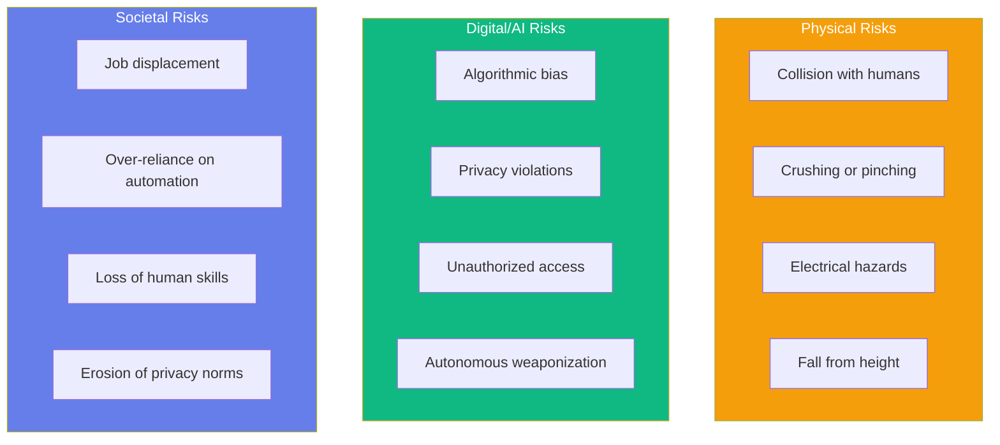
</InteractiveDiagram>

### The Safety-Critical Nature of Robotics

Physical AI systems are inherently safety-critical because:

| Aspect | Implication |
|--------|-------------|
| **Physical Presence** | Robots can cause injury, not just inconvenience |
| **Autonomous Decision-Making** | AI decisions may be unpredictable |
| **Real-World Interaction** | Environment is unpredictable and dynamic |
| **Human Proximity** | Humans often work alongside robots |
| **System Complexity** | More components = more failure modes |

### Stakeholder Considerations

<InteractiveDiagram
  title="Robot Safety Stakeholders"
  description="Multiple stakeholders with different concerns"
  diagramId="safety-stakeholders"
>
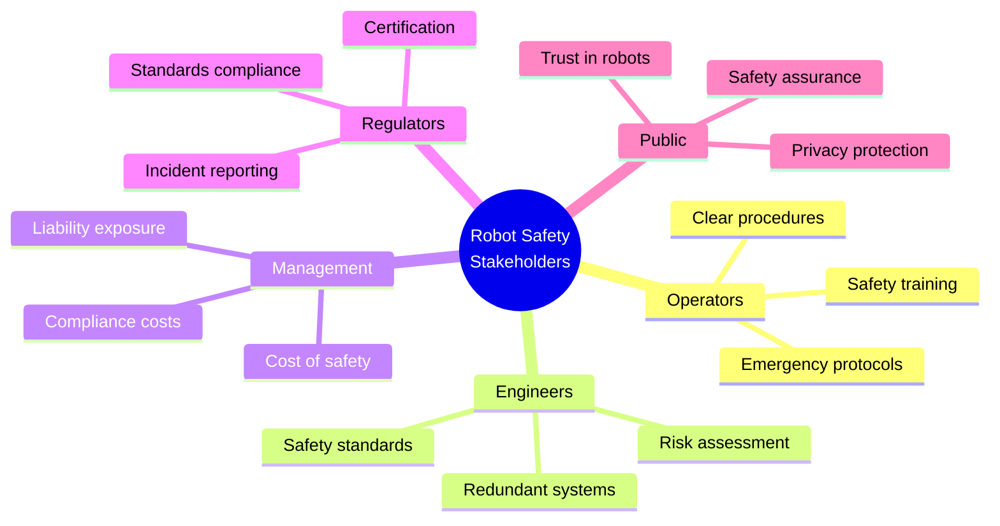
</InteractiveDiagram>

---

## 2. Robot Safety Standards

### Key International Standards

| Standard | Scope | Key Requirements |
|----------|-------|------------------|
| **ISO 10218-1/2** | Industrial robots | Safety requirements, integration |
| **ISO 45001** | Occupational health | Management systems for safety |
| **ISO 13849** | Safety-related control | Performance levels (PL) |
| **IEC 62061** | Functional safety | Safety integrity levels (SIL) |
| **ANSI/RIA R15.06** | North American robots | Similar to ISO 10218 |
| **ISO 8373** | Vocabulary | Standard terminology |

### ISO 10218 Industrial Robot Safety

<InteractiveDiagram
  title="ISO 10218 Safety Categories"
  description="Stop categories defined in ISO 10218"
  diagramId="iso-stop-categories"
>
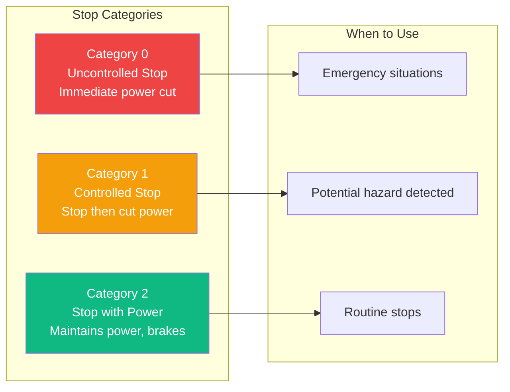
</InteractiveDiagram>

### Safety Performance Levels (ISO 13849)

| PL | Average Probability of Dangerous Failure per Hour | Description |
|----|---------------------------------------------------|-------------|
| **PL a** | 10⁻⁵ to 10⁻⁴ | Low safety performance |
| **PL b** | 3×10⁻⁶ to 10⁻⁵ | Low to medium |
| **PL c** | 10⁻⁶ to 3×10⁻⁶ | Medium |
| **PL d** | 10⁻⁷ to 10⁻⁶ | Medium to high |
| **PL e** | 10⁻⁸ to 10⁻⁷ | High safety performance |

### CE Marking Requirements

<InteractiveDiagram
  title="CE Marking Process for Robots"
  description="Steps to achieve CE compliance"
  diagramId="ce-marking"
>
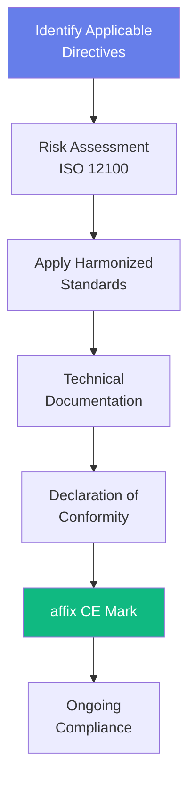
</InteractiveDiagram>

---

## 3. Risk Assessment

### Risk Assessment Methodology

<InteractiveDiagram
  title="Risk Assessment Process"
  description="Systematic risk assessment workflow"
  diagramId="risk-assessment-process"
>
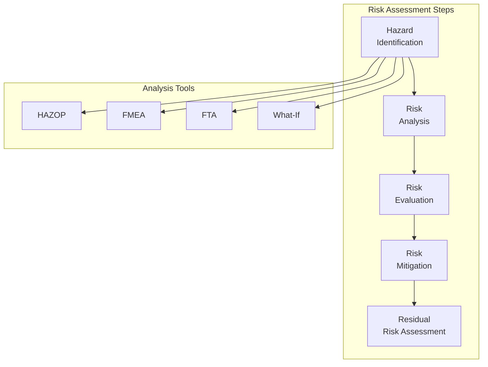
</InteractiveDiagram>

### Risk Matrix

| Severity \ Probability | A (Very Unlikely) | B (Unlikely) | C (Possible) | D (Likely) | E (Very Likely) |
|------------------------|-------------------|--------------|--------------|------------|-----------------|
| **5 - Catastrophic** | 5 | 10 | 15 | 20 | 25 |
| **4 - Critical** | 4 | 8 | 12 | 16 | 20 |
| **3 - Serious** | 3 | 6 | 9 | 12 | 15 |
| **2 - Minor** | 2 | 4 | 6 | 8 | 10 |
| **1 - Negligible** | 1 | 2 | 3 | 4 | 5 |

**Risk Priority Number (RPN) = Severity × Probability × Detectability**

<CollapsibleCode
  title="Risk Assessment Framework"
  language="python"
>
```python
#!/usr/bin/env python3
"""
Risk Assessment Framework for Robot Systems.
Implements ISO 13849 risk assessment methodology.
"""

from dataclasses import dataclass, field
from typing import List, Dict, Optional
from enum import Enum
import json


class Severity(Enum):
    """Severity of potential harm."""
    NEGLIGIBLE = 1
    MINOR = 2
    SERIOUS = 3
    CRITICAL = 4
    CATASTROPHIC = 5


class Probability(Enum):
    """Probability of hazard occurrence."""
    VERY_UNLIKELY = 'A'  # 10⁻⁶ or less
    UNLIKELY = 'B'       # 10⁻⁴ to 10⁻⁶
    POSSIBLE = 'C'       # 10⁻² to 10⁻⁴
    LIKELY = 'D'         # 10⁰ to 10⁻²
    VERY_LIKELY = 'E'    # Almost certain


class Detectability(Enum):
    """Ability to detect hazard before harm occurs."""
    VERY_HIGH = 5    # Certain to detect
    HIGH = 4         # Likely to detect
    MEDIUM = 3       # May detect
    LOW = 2          # Unlikely to detect
    VERY_LOW = 1     # Cannot detect


@dataclass
class Hazard:
    """Represents a identified hazard."""
    hazard_id: str
    description: str
    severity: Severity
    probability: Probability
    detectability: Detectability
    affected_systems: List[str] = field(default_factory=list)
    existing_controls: List[str] = field(default_factory=list)

    def calculate_rpn(self) -> int:
        """Calculate Risk Priority Number."""
        return (self.severity.value *
                self._prob_to_int() *
                self.detectability.value)

    def _prob_to_int(self) -> int:
        """Convert probability enum to int."""
        prob_map = {'A': 1, 'B': 2, 'C': 3, 'D': 4, 'E': 5}
        return prob_map[self.probability.value]

    def get_risk_level(self) -> str:
        """Get risk level based on RPN."""
        rpn = self.calculate_rpn()
        if rpn >= 15:
            return "HIGH - Immediate action required"
        elif rpn >= 8:
            return "MEDIUM - Action required"
        else:
            return "LOW - Monitor and review"


@dataclass
class RiskAssessment:
    """Complete risk assessment for a robot system."""
    system_name: str
    assessor: str
    date: str
    version: str = "1.0"

    hazards: List[Hazard] = field(default_factory=list)
    mitigations: List[Dict] = field(default_factory=list)

    def add_hazard(self, hazard: Hazard):
        """Add a hazard to the assessment."""
        self.hazards.append(hazard)

    def add_mitigation(self, hazard_id: str, mitigation: str,
                       effectiveness: str, residual_rpn: int):
        """Add a mitigation strategy."""
        self.mitigations.append({
            "hazard_id": hazard_id,
            "mitigation": mitigation,
            "effectiveness": effectiveness,
            "residual_rpn": residual_rpn
        })

    def generate_report(self) -> str:
        """Generate markdown report."""
        report = f"# Risk Assessment Report\n\n"
        report += f"**System:** {self.system_name}\n"
        report += f"**Assessor:** {self.assessor}\n"
        report += f"**Date:** {self.date}\n\n"

        report += "## Hazard Summary\n\n"
        report += "| ID | Description | Severity | Probability | Detectability | RPN | Risk Level |\n"
        report += "|----|-------------|----------|-------------|---------------|-----|------------|\n"

        for h in sorted(self.hazards, key=lambda x: -x.calculate_rpn()):
            report += f"| {h.hazard_id} | {h.description[:40]}... | "
            report += f"{h.severity.name} | {h.probability.value} | "
            report += f"{h.detectability.name} | {h.calculate_rpn()} | "
            report += f"{h.get_risk_level()} |\n"

        report += "\n## Mitigations\n\n"
        for m in self.mitigations:
            report += f"- **HAZ-{m['hazard_id']}**: {m['mitigation']} "
            report += f"(Residual RPN: {m['residual_rpn']})\n"

        return report

    def export_json(self) -> str:
        """Export as JSON."""
        data = {
            "system_name": self.system_name,
            "assessor": self.assessor,
            "date": self.date,
            "hazards": [
                {
                    "hazard_id": h.hazard_id,
                    "description": h.description,
                    "severity": h.severity.name,
                    "probability": h.probability.value,
                    "detectability": h.detectability.name,
                    "rpn": h.calculate_rpn(),
                    "risk_level": h.get_risk_level()
                }
                for h in self.hazards
            ]
        }
        return json.dumps(data, indent=2)


# Example usage
if __name__ == "__main__":
    print("Robot Risk Assessment Framework")
    print("=" * 50)

    # Create risk assessment
    assessment = RiskAssessment(
        system_name="Industrial Pick-and-Place Robot",
        assessor="Safety Engineer",
        date="2025-01-05"
    )

    # Add hazards
    assessment.add_hazard(Hazard(
        hazard_id="001",
        description="Robot arm collides with operator during operation",
        severity=Severity.CRITICAL,
        probability=Probability.POSSIBLE,
        detectability=Detectability.LOW,
        affected_systems=["Robot arm", "Operator workspace"],
        existing_controls=["Safety fencing"]
    ))

    assessment.add_hazard(Hazard(
        hazard_id="002",
        description="Unexpected movement due to control system failure",
        severity=Severity.CATASTROPHIC,
        probability=Probability.UNLIKELY,
        detectability=Detectability.MEDIUM,
        affected_systems=["Control system", "Drive system"],
        existing_controls=["Watchdog timer"]
    ))

    assessment.add_hazard(Hazard(
        hazard_id="003",
        description="Electrical shock from damaged cabling",
        severity=Severity.SERIOUS,
        probability=Probability.UNLIKELY,
        detectability=Detectability.HIGH,
        affected_systems=["Electrical system"],
        existing_controls=["Insulation", "Grounding"]
    ))

    # Generate report
    print("\nRisk Assessment Report")
    print("-" * 40)
    for hazard in assessment.hazards:
        print(f"\n{hazard.hazard_id}: {hazard.description[:35]}...")
        print(f"  RPN: {hazard.calculate_rpn()} - {hazard.get_risk_level()}")

    print("\n" + assessment.generate_report())
```
</CollapsibleCode>

### SIL vs PL Concepts

| Concept | Full Name | Application | Levels |
|---------|-----------|-------------|--------|
| **SIL** | Safety Integrity Level | Process safety | SIL 1-4 |
| **PL** | Performance Level | Machinery safety | PL a-e |
| **MTTFₙ** | Mean Time To Failure (dangerous) | Reliability metric | High/Med/Low |
| **DC** | Diagnostic Coverage | Fault detection | Low/Med/High |

---

## 4. Safety System Design

### Safety Layer Architecture

<InteractiveDiagram
  title="Robot Safety Layers"
  description="Defense-in-depth safety architecture"
  diagramId="safety-layers"
>
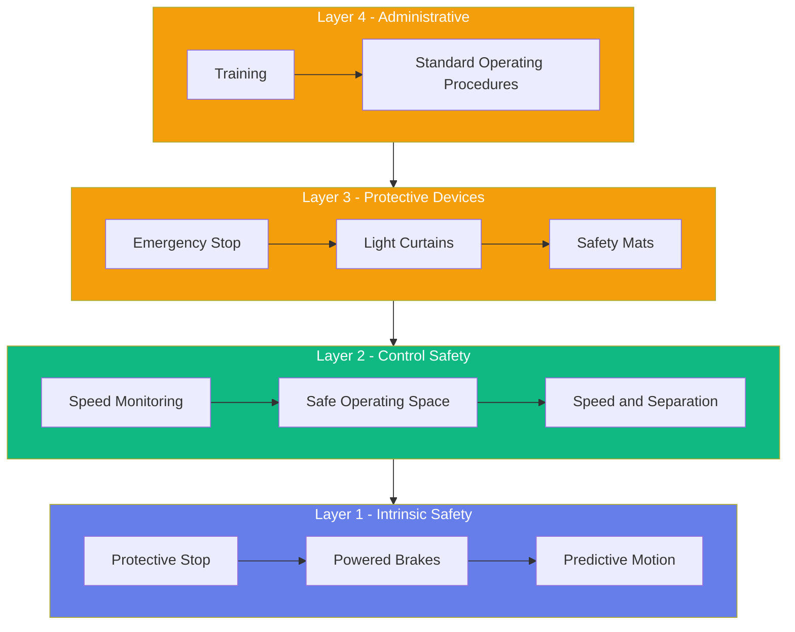
</InteractiveDiagram>

### Emergency Stop Systems

<CollapsibleCode
  title="Emergency Stop System Implementation"
  language="python"
>
```python
#!/usr/bin/env python3
"""
Emergency Stop System for Robot Safety.
Implements safety-rated E-stop with monitoring.
"""

import time
import threading
from dataclasses import dataclass
from typing import Callable, Optional, List
from enum import Enum


class EStopState(Enum):
    """Emergency stop system states."""
    RUNNING = "running"
    E_STOP_TRIGGERED = "e_stop"
    PROTECTIVE_STOP = "protective_stop"
    SYSTEM_FAULT = "fault"


@dataclass
class EStopEvent:
    """E-stop event data."""
    timestamp: float
    trigger_type: str
    triggered_by: str
    acknowledged: bool = False
    acknowledged_at: Optional[float] = None


class EmergencyStopSystem:
    """Safety-rated emergency stop system."""

    def __init__(self, e_stop_pin: int, reset_pin: Optional[int] = None,
                 watchdog_timeout: float = 0.1,
                 hardware_wired: bool = True):
        """
        Initialize E-stop system.

        Args:
            e_stop_pin: GPIO pin for E-stop input
            reset_pin: GPIO pin for reset button
            watchdog_timeout: Safety watchdog timeout in seconds
            hardware_wired: Whether E-stop is hardwired (true) or software (false)
        """
        self.e_stop_pin = e_stop_pin
        self.reset_pin = reset_pin
        self.watchdog_timeout = watchdog_timeout
        self.hardware_wired = hardware_wired

        # State management
        self._state = EStopState.RUNNING
        self._last_wdog_reset = time.time()
        self._event_history: List[EStopEvent] = []

        # Callbacks
        self._on_stop: Optional[Callable[[str], None]] = None
        self._on_resume: Optional[Callable[[], None]] = None

        # Thread safety
        self._lock = threading.Lock()

        # Import GPIO if available
        self._gpio_available = False
        try:
            import RPi.GPIO as GPIO
            self.GPIO = GPIO
            self._gpio_available = True
            self._setup_gpio()
        except ImportError:
            print("GPIO not available - using simulated inputs")

    def _setup_gpio(self):
        """Setup GPIO pins."""
        self.GPIO.setmode(self.GPIO.BCM)
        self.GPIO.setup(self.e_stop_pin, self.GPIO.IN,
                       pull_up_down=self.GPIO.PUD_UP)

        if self.reset_pin:
            self.GPIO.setup(self.reset_pin, self.GPIO.IN,
                           pull_up_down=self.GPIO.PUD_UP)

    def register_stop_callback(self, callback: Callable[[str], None]):
        """Register callback when stop is triggered."""
        self._on_stop = callback

    def register_resume_callback(self, callback: Callable[[], None]):
        """Register callback when system resumes."""
        self._on_resume = callback

    def trigger(self, trigger_type: str = "software", triggered_by: str = "system"):
        """
        Manually trigger emergency stop.

        Args:
            trigger_type: Type of trigger
            triggered_by: What triggered the stop
        """
        with self._lock:
            if self._state == EStopState.E_STOP_TRIGGERED:
                return  # Already triggered

            self._state = EStopState.E_STOP_TRIGGERED

            # Record event
            event = EStopEvent(
                timestamp=time.time(),
                trigger_type=trigger_type,
                triggered_by=triggered_by
            )
            self._event_history.append(event)

            # Execute callback
            if self._on_stop:
                self._on_stop(triggered_by)

            print(f"E-STOP TRIGGERED: {triggered_by}")

    def protective_stop(self, reason: str = "protective"):
        """
        Trigger protective stop (controlled stop).

        Args:
            reason: Reason for protective stop
        """
        with self._lock:
            if self._state != EStopState.RUNNING:
                return

            self._state = EStopState.PROTECTIVE_STOP

            event = EStopEvent(
                timestamp=time.time(),
                trigger_type="protective",
                triggered_by=reason
            )
            self._event_history.append(event)

            if self._on_stop:
                self._on_stop(reason)

            print(f"PROTECTIVE STOP: {reason}")

    def acknowledge(self) -> bool:
        """
        Acknowledge E-stop and reset system.

        Returns:
            True if successful, False if E-stop still active
        """
        with self._lock:
            # Check if E-stop is still triggered (for hardware E-stops)
            if self.hardware_wired and self._gpio_available:
                if self.GPIO.input(self.e_stop_pin) == self.GPIO.LOW:
                    print("Cannot acknowledge - E-stop still pressed")
                    return False

            # Update state
            if self._state == EStopState.E_STOP_TRIGGERED:
                # Update last event
                if self._event_history:
                    self._event_history[-1].acknowledged = True
                    self._event_history[-1].acknowledged_at = time.time()

            self._state = EStopState.RUNNING
            self._last_wdog_reset = time.time()

            if self._on_resume:
                self._on_resume()

            print("E-stop acknowledged - system resuming")
            return True

    def watchdog_check(self) -> bool:
        """
        Check safety watchdog.

        Returns:
            False if watchdog timeout indicates fault
        """
        with self._lock:
            time_since_reset = time.time() - self._last_wdog_reset

            if time_since_reset > self.watchdog_timeout * 2:
                self._state = EStopState.SYSTEM_FAULT
                return False

            return True

    def reset_watchdog(self):
        """Reset safety watchdog timer."""
        with self._lock:
            self._last_wdog_reset = time.time()

    def get_state(self) -> EStopState:
        """Get current E-stop state."""
        with self._lock:
            return self._state

    def get_status(self) -> dict:
        """Get detailed status."""
        with self._lock:
            return {
                "state": self._state.value,
                "events_today": len([
                    e for e in self._event_history
                    if time.gmtime(e.timestamp).tm_yday ==
                       time.gmtime().tm_yday
                ]),
                "last_event": self._event_history[-1].timestamp if self._event_history else None,
                "watchdog_ok": self.watchdog_check()
            }

    def cleanup(self):
        """Cleanup GPIO resources."""
        if self._gpio_available:
            self.GPIO.cleanup([self.e_stop_pin])
            if self.reset_pin:
                self.GPIO.cleanup([self.reset_pin])


class SafetyMonitor:
    """General safety monitoring system."""

    def __init__(self, e_stop_system: EmergencyStopSystem):
        """
        Initialize safety monitor.

        Args:
            e_stop_system: E-stop system to trigger
        """
        self.e_stop = e_stop_system
        self.safety_parameters: Dict[str, dict] = {}

        # Add default limits
        self.add_parameter("max_velocity", 1.0, "m/s", 1.5)
        self.add_parameter("min_proximity", 0.5, "m", 0.3)
        self.add_parameter("max_force", 50, "N", 100)
        self.add_parameter("max_temperature", 60, "C", 80)

    def add_parameter(self, name: str, nominal: float, unit: str, limit: float):
        """Add safety parameter to monitor."""
        self.safety_parameters[name] = {
            "nominal": nominal,
            "limit": limit,
            "unit": unit
        }

    def check(self, velocity: float = 0, proximity: float = float('inf'),
              force: float = 0, temperature: float = 25) -> tuple:
        """
        Check all safety parameters.

        Args:
            velocity: Current velocity
            proximity: Distance to nearest object
            force: Current force
            temperature: Current temperature

        Returns:
            (is_safe, violations)
        """
        violations = []

        if velocity > self.safety_parameters["max_velocity"]["limit"]:
            violations.append(f"Velocity {velocity} exceeds limit "
                             f"{self.safety_parameters['max_velocity']['limit']}")

        if proximity < self.safety_parameters["min_proximity"]["limit"]:
            violations.append(f"Proximity {proximity} below limit "
                             f"{self.safety_parameters['min_proximity']['limit']}")

        if force > self.safety_parameters["max_force"]["limit"]:
            violations.append(f"Force {force} exceeds limit "
                             f"{self.safety_parameters['max_force']['limit']}")

        if temperature > self.safety_parameters["max_temperature"]["limit"]:
            violations.append(f"Temperature {temperature} exceeds limit "
                             f"{self.safety_parameters['max_temperature']['limit']}")

        is_safe = len(violations) == 0

        if not is_safe:
            self.e_stop.protective_stop(violations[0])

        return is_safe, violations


if __name__ == "__main__":
    print("Emergency Stop System")
    print("=" * 50)

    # Example
    # e_stop = EmergencyStopSystem(e_stop_pin=17, reset_pin=27)
    #
    # def on_stop(reason):
    #     print(f"Robot stopped: {reason}")
    #
    # def on_resume():
    #     print("Robot resuming operation")
    #
    # e_stop.register_stop_callback(on_stop)
    # e_stop.register_resume_callback(on_resume)
    #
    # # Simulate monitoring
    # monitor = SafetyMonitor(e_stop)
    #
    # for i in range(10):
    #     velocity = 0.5 + i * 0.2
    #     safe, violations = monitor.check(velocity=velocity, proximity=1.0)
    #     print(f"Check {i+1}: Velocity={velocity:.1f}m/s, Safe={safe}")
    #     time.sleep(0.1)
    #
    # if not e_stop.get_state() == EStopState.RUNNING:
    #     e_stop.acknowledge()
    #
    # e_stop.cleanup()

    print("\nSafety system classes ready")
```
</CollapsibleCode>

---

## 5. Fail-Safe Design Principles

### Fail-Safe vs Fail-Operational

<InteractiveDiagram
  title="Fail-Safe Design Patterns"
  description="Different failure response strategies"
  diagramId="fail-safe-patterns"
>
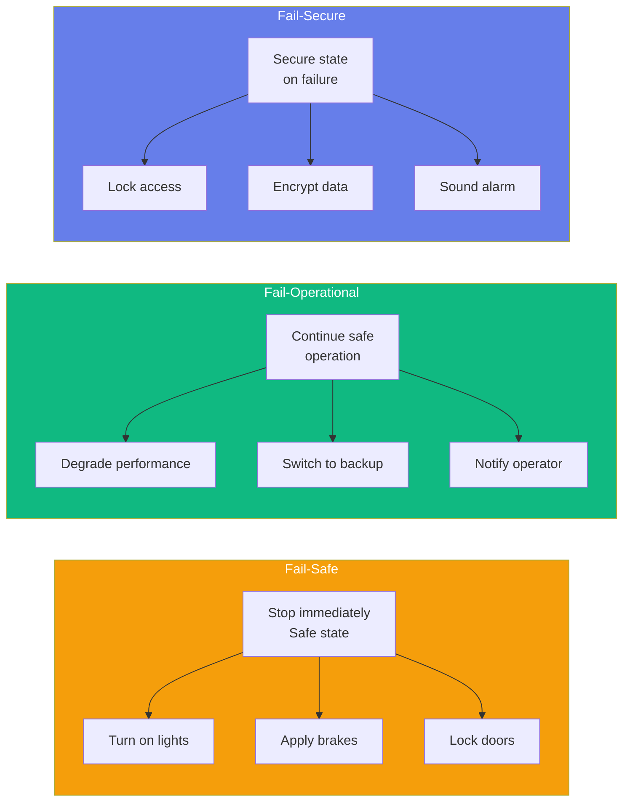
</InteractiveDiagram>

| Design Pattern | Response | Best For |
|----------------|----------|----------|
| **Fail-Safe** | Enter safe state | Industrial machinery, presses |
| **Fail-Operational** | Maintain operation | Medical devices, aircraft |
| **Fail-Secure** | Lock down | Security systems, access control |

### Redundant Architectures

<CollapsibleCode
  title="Redundant Safety System"
  language="python"
>
```python
#!/usr/bin/env python3
"""
Redundant Safety System with Voting Architecture.
Implements 2oo3 and 1oo2D voting systems.
"""

from dataclasses import dataclass
from typing import List, Optional, Callable
import time
import threading


@dataclass
class SensorReading:
    """Sensor reading with timestamp."""
    value: float
    timestamp: float
    sensor_id: str
    is_valid: bool = True


class RedundantSensorArray:
    """Array of redundant sensors with voting."""

    def __init__(self, sensor_count: int = 3,
                 voting_mode: str = "2oo3",
                 tolerance: float = 0.01):
        """
        Initialize redundant sensor array.

        Args:
            sensor_count: Number of sensors
            voting_mode: "2oo3" (2-of-3) or "1oo2D" (1-of-2 dual)
            tolerance: Tolerance for agreement
        """
        self.sensor_count = sensor_count
        self.voting_mode = voting_mode
        self.tolerance = tolerance

        self._readings: List[Optional[SensorReading]] = [None] * sensor_count
        self._lock = threading.Lock()

        # Fault tracking
        self._fault_count = 0
        self._total_cycles = 0

    def add_reading(self, sensor_id: int, value: float,
                    is_valid: bool = True):
        """Add a sensor reading."""
        with self._lock:
            if 0 <= sensor_id < self.sensor_count:
                self._readings[sensor_id] = SensorReading(
                    value=value,
                    timestamp=time.time(),
                    sensor_id=f"sensor_{sensor_id}",
                    is_valid=is_valid
                )

    def _are_agreeing(self, values: List[float]) -> bool:
        """Check if values are within tolerance."""
        if len(values) < 2:
            return True

        min_val = min(values)
        max_val = max(values)

        return (max_val - min_val) <= self.tolerance

    def get_consensus(self) -> tuple:
        """
        Get consensus reading from sensors.

        Returns:
            (consensus_value, agreement_reached, faulty_sensors)
        """
        with self._lock:
            self._total_cycles += 1

            # Filter valid readings
            valid_readings = [
                r for r in self._readings
                if r is not None and r.is_valid
            ]

            if len(valid_readings) == 0:
                return 0.0, False, list(range(self.sensor_count))

            values = [r.value for r in valid_readings]

            if self.voting_mode == "2oo3":
                return self._voting_2oo3(values, valid_readings)
            elif self.voting_mode == "1oo2D":
                return self._voting_1oo2d(values, valid_readings)
            else:
                # Simple averaging
                return sum(values) / len(values), True, []

    def _voting_2oo3(self, values: List[float],
                    readings: List[SensorReading]) -> tuple:
        """2-out-of-3 voting."""
        if len(values) < 2:
            return 0.0, False, []

        # Check if at least 2 agree
        for i in range(len(values)):
            agreement_count = 0
            agreeing_indices = []

            for j in range(len(values)):
                if abs(values[i] - values[j]) <= self.tolerance:
                    agreement_count += 1
                    agreeing_indices.append(j)

            if agreement_count >= 2:
                # Consensus found
                consensus_value = sum(
                    values[k] for k in agreeing_indices
                ) / len(agreeing_indices)

                # Identify faulty sensors
                faulty = [
                    readings[k].sensor_id for k in range(len(readings))
                    if k not in agreeing_indices
                ]

                return consensus_value, True, faulty

        # No consensus - use median
        sorted_values = sorted(values)
        median = sorted_values[len(values) // 2]

        faulty = [r.sensor_id for r in readings]

        return median, False, faulty

    def _voting_1oo2d(self, values: List[float],
                    readings: List[SensorReading]) -> tuple:
        """1-out-of-2 with dual channel."""
        if len(values) < 2:
            return 0.0, False, []

        # Check if sensors agree
        if abs(values[0] - values[1]) <= self.tolerance:
            return sum(values) / 2, True, []

        # Disagreement - both could be wrong
        # In safety systems, this triggers safe state
        self._fault_count += 1
        return sum(values) / 2, False, [r.sensor_id for r in readings]

    def get_health(self) -> dict:
        """Get system health metrics."""
        with self._lock:
            return {
                "total_cycles": self._total_cycles,
                "fault_cycles": self._fault_count,
                "fault_rate": self._fault_count / max(1, self._total_cycles),
                "sensors_active": sum(
                    1 for r in self._readings if r is not None
                )
            }


class WatchdogTimer:
    """Safety watchdog timer for system monitoring."""

    def __init__(self, timeout: float = 0.1,
                 callback: Optional[Callable[[], None]] = None):
        """
        Initialize watchdog timer.

        Args:
            timeout: Timeout in seconds
            callback: Function to call on timeout
        """
        self.timeout = timeout
        self._last_reset = time.time()
        self._callback = callback
        self._running = True
        self._thread = threading.Thread(target=self._watchdog_loop,
                                        daemon=True)
        self._thread.start()

    def reset(self):
        """Reset watchdog timer."""
        self._last_reset = time.time()

    def _watchdog_loop(self):
        """Background watchdog check loop."""
        while self._running:
            time_since_reset = time.time() - self._last_reset

            if time_since_reset > self.timeout:
                if self._callback:
                    self._callback()
                else:
                    print(f"WATCHDOG TIMEOUT: {time_since_reset:.3f}s")

            time.sleep(self.timeout / 10)

    def stop(self):
        """Stop watchdog."""
        self._running = False
        self._thread.join(timeout=1.0)


if __name__ == "__main__":
    print("Redundant Safety System")
    print("=" * 50)

    # Create 2oo3 voting system
    sensors = RedundantSensorArray(sensor_count=3, voting_mode="2oo3")

    # Simulate readings
    print("\nSimulating sensor readings...")

    # Normal operation
    for i in range(10):
        # Add slightly noisy readings
        sensors.add_reading(0, 10.0 + i * 0.001)
        sensors.add_reading(1, 10.0 + i * 0.002)
        sensors.add_reading(2, 10.0 + i * 0.001)

        value, agreed, faulty = sensors.get_consensus()
        print(f"  Cycle {i+1}: Value={value:.4f}, Agree={agreed}")

    print("\nSimulating sensor fault...")

    # Sensor 2 fails
    sensors.add_reading(0, 15.0)
    sensors.add_reading(1, 15.0)
    sensors.add_reading(2, 5.0)  # Faulty reading

    value, agreed, faulty = sensors.get_consensus()
    print(f"  Value={value:.4f}, Agree={agreed}, Faulty={faulty}")

    print("\nHealth metrics:", sensors.get_health())
```
</CollapsibleCode>

---

## 6. AI Ethics in Robotics

### Core Ethical Principles

<InteractiveDiagram
  title="AI Ethics Framework for Robotics"
  description="Core principles of ethical AI"
  diagramId="ethics-framework"
>
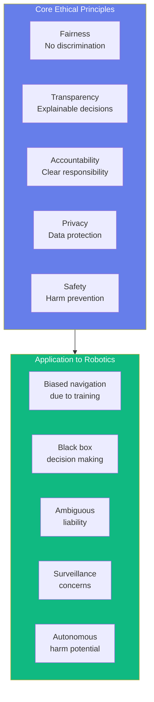
</InteractiveDiagram>

### Bias and Fairness

<CollapsibleCode
  title="Bias Audit Framework"
  language="python"
>
```python
#!/usr/bin/env python3
"""
AI Ethics Bias Audit Framework for Robotics.
Tools for identifying and mitigating bias in robot systems.
"""

from dataclasses import dataclass, field
from typing import List, Dict, Optional
from enum import Enum
import json


class BiasCategory(Enum):
    """Categories of potential bias."""
    DEMOGRAPHIC = "demographic"
    GEOGRAPHIC = "geographic"
    SOCIOECONOMIC = "socioeconomic"
    TEMPORAL = "temporal"
    ENVIRONMENTAL = "environmental"


@dataclass
class DemographicGroup:
    """Represents a demographic group for testing."""
    name: str
    attributes: Dict[str, any]
    sample_size: int


@dataclass
class BiasFinding:
    """Represents a detected bias."""
    category: BiasCategory
    description: str
    affected_groups: List[str]
    severity: str  # "high", "medium", "low"
    metric: float
    threshold: float
    recommendation: str


class BiasAudit:
    """Bias audit framework for robot AI systems."""

    def __init__(self, system_name: str):
        """
        Initialize bias audit.

        Args:
            system_name: Name of system being audited
        """
        self.system_name = system_name
        self.findings: List[BiasFinding] = []
        self.test_results: List[Dict] = []

    def add_demographic_group(self, name: str, attributes: Dict,
                              sample_size: int = 100) -> DemographicGroup:
        """Add a demographic group for testing."""
        return DemographicGroup(name, attributes, sample_size)

    def test_decision_equity(self, group_a: DemographicGroup,
                            group_b: DemographicGroup,
                            test_scenario: str,
                            decision_metric: str = "success_rate") -> Dict:
        """
        Test if decisions are equitable across groups.

        Args:
            group_a: First demographic group
            group_b: Second demographic group
            test_scenario: Description of test
            decision_metric: Metric to compare

        Returns:
            Test results with disparity analysis
        """
        # Simulated test results
        result_a = {
            "group": group_a.name,
            "metric_value": 0.92,  # 92% success
            "sample_size": group_a.sample_size
        }

        result_b = {
            "group": group_b.name,
            "metric_value": 0.87,  # 87% success
            "sample_size": group_b.sample_size
        }

        # Calculate disparity
        disparity = abs(result_a["metric_value"] - result_b["metric_value"])

        test_result = {
            "scenario": test_scenario,
            "metric": decision_metric,
            "result_a": result_a,
            "result_b": result_b,
            "disparity": disparity,
            "passes": disparity < 0.05  # 5% threshold
        }

        self.test_results.append(test_result)

        # Add finding if disparity is significant
        if disparity >= 0.05:
            self.findings.append(BiasFinding(
                category=BiasCategory.DEMOGRAPHIC,
                description=f"Disparity in {test_scenario}",
                affected_groups=[group_a.name, group_b.name],
                severity="high" if disparity > 0.1 else "medium",
                metric=disparity,
                threshold=0.05,
                recommendation="Retrain model with balanced dataset"
            ))

        return test_result

    def test_navigation_fairness(self, environments: List[Dict],
                                 robot_model: str) -> Dict:
        """
        Test navigation performance across different environments.

        Args:
            environments: List of environment descriptors
            robot_model: Robot model being tested

        Returns:
            Navigation fairness analysis
        """
        results = {}

        for env in environments:
            env_name = env.get("name", "unknown")
            success_rate = env.get("success_rate", 0.95)

            results[env_name] = {
                "success_rate": success_rate,
                "environment_type": env.get("type", "unknown")
            }

        # Check for significant variations
        rates = [r["success_rate"] for r in results.values()]
        avg_rate = sum(rates) / len(rates)
        variance = sum((r - avg_rate)**2 for r in rates) / len(rates)

        return {
            "robot_model": robot_model,
            "average_success_rate": avg_rate,
            "variance": variance,
            "per_environment": results
        }

    def test_safety_consistency(self, test_scenarios: List[Dict]) -> Dict:
        """
        Test safety response consistency across scenarios.

        Args:
            test_scenarios: List of test scenarios

        Returns:
            Safety consistency report
        """
        results = []

        for scenario in test_scenarios:
            results.append({
                "scenario": scenario.get("description"),
                "response_time": scenario.get("response_time", 0.1),
                "safe_outcome": scenario.get("safe_outcome", True),
                "false_positive": scenario.get("false_positive", False)
            })

        # Analyze consistency
        safe_outcomes = sum(1 for r in results if r["safe_outcome"])
        false_positives = sum(1 for r in results if r["false_positive"])

        return {
            "total_scenarios": len(results),
            "safe_outcomes": safe_outcomes,
            "safety_rate": safe_outcomes / len(results) if results else 1.0,
            "false_positives": false_positives,
            "false_positive_rate": false_positives / len(results) if results else 0,
            "details": results
        }

    def generate_audit_report(self) -> str:
        """Generate comprehensive bias audit report."""
        report = f"# AI Bias Audit Report\n\n"
        report += f"**System:** {self.system_name}\n"
        report += f"**Date:** {self._get_timestamp()}\n\n"

        report += "## Executive Summary\n\n"
        report += f"- **Total Findings:** {len(self.findings)}\n"
        report += f"- **High Severity:** {sum(1 for f in self.findings if f.severity == 'high')}\n"
        report += f"- **Medium Severity:** {sum(1 for f in self.findings if f.severity == 'medium')}\n"
        report += f"- **Low Severity:** {sum(1 for f in self.findings if f.severity == 'low')}\n\n"

        report += "## Findings\n\n"
        for i, finding in enumerate(self.findings, 1):
            report += f"### Finding {i}: {finding.category.value}\n\n"
            report += f"**Description:** {finding.description}\n\n"
            report += f"**Severity:** {finding.severity.upper()}\n\n"
            report += f"**Affected Groups:** {', '.join(finding.affected_groups)}\n\n"
            report += f"**Disparity:** {finding.metric:.2%} (threshold: {finding.threshold:.2%})\n\n"
            report += f"**Recommendation:** {finding.recommendation}\n\n"

        report += "## Test Results Summary\n\n"
        for result in self.test_results:
            report += f"- {result['scenario']}: "
            report += f"Disparity={result['disparity']:.2%}, "
            report += f"Pass={'Yes' if result['passes'] else 'No'}\n"

        return report

    def _get_timestamp(self) -> str:
        """Get current timestamp."""
        from datetime import datetime
        return datetime.now().strftime("%Y-%m-%d %H:%M:%S")


if __name__ == "__main__":
    print("AI Ethics Bias Audit Framework")
    print("=" * 50)

    # Create audit
    audit = BiasAudit("Service Robot v2.0")

    # Test demographic fairness
    group_a = audit.add_demographic_group(
        "Urban Users",
        {"location": "urban", "income": "high"},
        sample_size=200
    )

    group_b = audit.add_demographic_group(
        "Rural Users",
        {"location": "rural", "income": "low"},
        sample_size=150
    )

    result = audit.test_decision_equity(
        group_a, group_b,
        "Command Recognition Accuracy",
        "accuracy"
    )

    print("\nDemographic Fairness Test:")
    print(f"  Group A ({group_a.name}): {result['result_a']['metric_value']:.1%}")
    print(f"  Group B ({group_b.name}): {result['result_b']['metric_value']:.1%}")
    print(f"  Disparity: {result['disparity']:.1%}")
    print(f"  Pass: {'Yes' if result['passes'] else 'No'}")

    # Test navigation fairness
    nav_result = audit.test_navigation_fairness(
        [
            {"name": "Modern Office", "type": "indoor", "success_rate": 0.98},
            {"name": "Warehouse", "type": "industrial", "success_rate": 0.96},
            {"name": "Outdoor Park", "type": "outdoor", "success_rate": 0.89},
            {"name": "Home Environment", "type": "indoor", "success_rate": 0.94}
        ],
        "Robot Model X"
    )

    print("\nNavigation Fairness:")
    print(f"  Average Success Rate: {nav_result['average_success_rate']:.1%}")

    # Generate report
    print("\n" + audit.generate_audit_report())
```
</CollapsibleCode>

### Transparency and Explainability

| Aspect | Description | Implementation |
|--------|-------------|----------------|
| **Decision Logging** | Record all significant decisions | Timestamped decision records |
| **Action Explanation** | Provide rationale for actions | Natural language descriptions |
| **User Notifications** | Inform users of robot behavior | Visual/audible indicators |
| **Audit Trails** | Enable post-hoc analysis | Comprehensive logging |

---

## 7. Privacy Considerations

### Data Collection Ethics

<InteractiveDiagram
  title="Privacy by Design Framework"
  description="Privacy principles applied to robot systems"
  diagramId="privacy-framework"
>
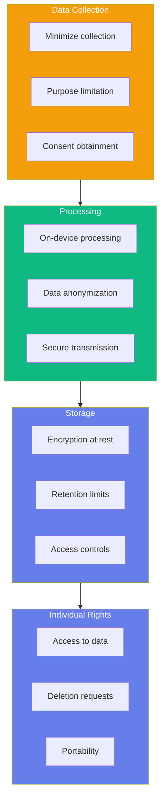
</InteractiveDiagram>

<CollapsibleCode
  title="Privacy Impact Assessment"
  language="python"
>
```python
#!/usr/bin/env python3
"""
Privacy Impact Assessment for Robot Systems.
GDPR-compliant data handling framework.
"""

from dataclasses import dataclass, field
from typing import List, Dict, Optional
from enum import Enum
from datetime import datetime, timedelta


class DataCategory(Enum):
    """Categories of personal data."""
    IDENTIFIABLE = "personally_identifiable"
    SENSITIVE = "sensitive"
    LOCATION = "location"
    BIOMETRIC = "biometric"
    BEHAVIORAL = "behavioral"


class ProcessingPurpose(Enum):
    """Legitimate processing purposes."""
    OPERATION = "robot_operation"
    MAINTENANCE = "maintenance"
    IMPROVEMENT = "ai_improvement"
    ANALYTICS = "analytics"
    MARKETING = "marketing"


@dataclass
class DataFlow:
    """Represents a data flow in the system."""
    name: str
    data_types: List[DataCategory]
    source: str
    destination: str
    retention_days: int
    is_encrypted: bool
    purpose: ProcessingPurpose


@dataclass
class PrivacyFinding:
    """Privacy concern or finding."""
    severity: str  # "high", "medium", "low"
    description: str
    recommendation: str
    regulation_reference: str


class PrivacyImpactAssessment:
    """Framework for assessing privacy impact."""

    def __init__(self, system_name: str, organization: str):
        """
        Initialize PIA.

        Args:
            system_name: Name of robot system
            organization: Organization name
        """
        self.system_name = system_name
        self.organization = organization
        self.data_flows: List[DataFlow] = []
        self.findings: List[PrivacyFinding] = []

    def add_data_flow(self, data_flow: DataFlow):
        """Add a data flow to the assessment."""
        self.data_flows.append(data_flow)

    def assess_data_minimization(self) -> Dict:
        """Assess if data collection is minimized."""
        assessment = {
            "compliant": True,
            "issues": [],
            "recommendations": []
        }

        for flow in self.data_flows:
            # Check if sensitive data is truly needed
            if DataCategory.BIOMETRIC in flow.data_types:
                assessment["issues"].append(
                    f"Flow '{flow.name}' collects biometric data"
                )
                assessment["recommendations"].append(
                    "Consider if biometric is necessary or if "
                    "pseudonymous identifiers suffice"
                )

        assessment["compliant"] = len(assessment["issues"]) == 0
        return assessment

    def assess_retention(self) -> Dict:
        """Assess data retention policies."""
        assessment = {
            "compliant": True,
            "issues": [],
            "policies": []
        }

        for flow in self.data_flows:
            # GDPR suggests 2-year typical retention for operational data
            if flow.retention_days > 730:
                assessment["issues"].append(
                    f"Flow '{flow.name}' retains data for {flow.retention_days} days"
                )
                assessment["recommendations"].append(
                    "Consider reducing retention period or implementing "
                    "automated deletion"
                )

            assessment["policies"].append({
                "flow": flow.name,
                "retention_days": flow.retention_days,
                "compliant": flow.retention_days <= 730
            })

        assessment["compliant"] = len(assessment["issues"]) == 0
        return assessment

    def assess_security(self) -> Dict:
        """Assess data security measures."""
        assessment = {
            "compliant": True,
            "issues": [],
            "measures": []
        }

        for flow in self.data_flows:
            assessment["measures"].append({
                "flow": flow.name,
                "encrypted": flow.is_encrypted,
                "purpose": flow.purpose.value
            })

            if not flow.is_encrypted:
                assessment["issues"].append(
                    f"Flow '{flow.name}' transmits data without encryption"
                )
                assessment["compliant"] = False

        return assessment

    def assess_consent(self) -> Dict:
        """Assess consent mechanisms."""
        assessment = {
            "mechanisms_present": False,
            "issues": [],
            "recommendations": []
        }

        # Check if marketing or analytics flows exist
        marketing_flows = [
            f for f in self.data_flows
            if f.purpose in [ProcessingPurpose.MARKETING,
                            ProcessingPurpose.ANALYTICS]
        ]

        if marketing_flows:
            assessment["mechanisms_present"] = True
            assessment["recommendations"].append(
                "Ensure explicit consent for marketing/analytics data"
            )
        else:
            assessment["mechanisms_present"] = True
            assessment["recommendations"].append(
                "Document legitimate interest for operational data"
            )

        return assessment

    def generate_report(self) -> str:
        """Generate PIA report."""
        report = f"# Privacy Impact Assessment\n\n"
        report += f"**System:** {self.system_name}\n"
        report += f"**Organization:** {self.organization}\n"
        report += f"**Date:** {datetime.now().strftime('%Y-%m-%d')}\n\n"

        report += "## Data Flows Summary\n\n"
        report += "| Flow | Data Types | Retention | Encrypted |\n"
        report += "|------|------------|-----------|-----------|\n"
        for flow in self.data_flows:
            report += f"| {flow.name} | {', '.join(t.value for t in flow.data_types)}"
            report += f" | {flow.retention_days}d | {'Yes' if flow.is_encrypted else 'No'} |\n"

        report += "\n## Assessment Results\n\n"

        # Data minimization
        dm = self.assess_data_minimization()
        report += "### Data Minimization\n\n"
        report += f"Compliant: {'Yes' if dm['compliant'] else 'No'}\n\n"
        for issue in dm.get("issues", []):
            report += f"- {issue}\n"

        # Retention
        ret = self.assess_retention()
        report += "\n### Data Retention\n\n"
        report += f"Compliant: {'Yes' if ret['compliant'] else 'No'}\n\n"
        for issue in ret.get("issues", []):
            report += f"- {issue}\n"

        # Security
        sec = self.assess_security()
        report += "\n### Data Security\n\n"
        report += f"Compliant: {'Yes' if sec['compliant'] else 'No'}\n\n"
        for issue in sec.get("issues", []):
            report += f"- {issue}\n"

        report += "\n## Recommendations\n\n"
        all_recs = set()
        for assessment in [dm, ret, sec, self.assess_consent()]:
            for rec in assessment.get("recommendations", []):
                all_recs.add(rec)

        for rec in all_recs:
            report += f"- {rec}\n"

        return report


# Example usage
if __name__ == "__main__":
    print("Privacy Impact Assessment Framework")
    print("=" * 50)

    # Create PIA
    pia = PrivacyImpactAssessment(
        "Service Robot Alpha",
        "Acme Robotics Inc."
    )

    # Add data flows
    pia.add_data_flow(DataFlow(
        name="Camera Feed Processing",
        data_types=[DataCategory.BEHAVIORAL, DataCategory.LOCATION],
        source="Camera",
        destination="On-board processor",
        retention_days=7,
        is_encrypted=True,
        purpose=ProcessingPurpose.OPERATION
    ))

    pia.add_data_flow(DataFlow(
        name="Voice Command Storage",
        data_types=[DataCategory.IDENTIFIABLE, DataCategory.BEHAVIORAL],
        source="Microphone",
        destination="Cloud API",
        retention_days=365,
        is_encrypted=True,
        purpose=ProcessingPurpose.IMPROVEMENT
    ))

    pia.add_data_flow(DataFlow(
        name="User Analytics",
        data_types=[DataCategory.BEHAVIORAL],
        source="User interactions",
        destination="Analytics server",
        retention_days=730,
        is_encrypted=True,
        purpose=ProcessingPurpose.ANALYTICS
    ))

    # Generate report
    print("\n" + pia.generate_report())
```
</CollapsibleCode>

### GDPR Compliance Checklist

| Requirement | Description | Implementation |
|-------------|-------------|----------------|
| **Lawful Basis** | Have legitimate reason to process | Consent or legitimate interest |
| **Purpose Limitation** | Use data only for stated purposes | Clear documentation |
| **Data Minimization** | Collect only necessary data | Regular data audits |
| **Storage Limitation** | Delete when no longer needed | Automated retention policies |
| **Integrity & Confidentiality** | Protect against unauthorized access | Encryption, access controls |
| **Accountability** | Demonstrate compliance | Documentation, audits |

---

## 8. Human-Robot Interaction Ethics

### Trust Calibration

<InteractiveDiagram
  title="Trust Dynamics in HRI"
  description="How trust develops and can be calibrated"
  diagramId="trust-dynamics"
>
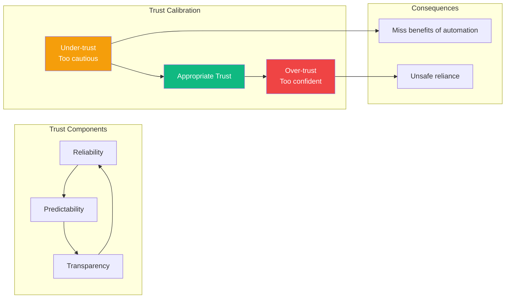
</InteractiveDiagram>

### Human Oversight Requirements

| System Type | Oversight Level | Human Role |
|-------------|-----------------|------------|
| **Fully Autonomous** | Minimal | Exception handling |
| **Supervisory** | Regular checks | Intervention capability |
| **Telerobotic** | Continuous | Direct control |
| **Collaborative** | Constant | Safety monitoring |

### Job Displacement Considerations

<InteractiveDiagram
  title="Automation Impact Assessment"
  description="Framework for assessing automation's workforce impact"
  diagramId="automation-impact"
>
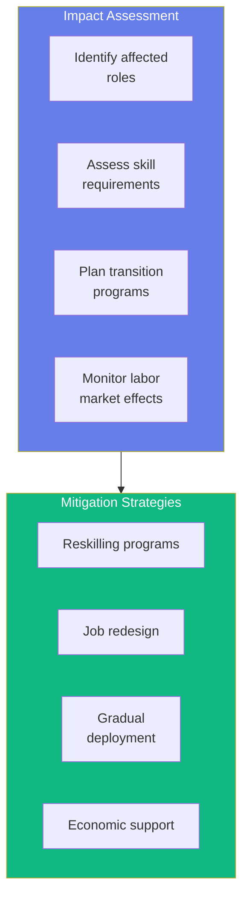
</InteractiveDiagram>

---

## 9. Responsible AI Development

### Ethics Review Process

<CollapsibleCode
  title="Ethics Review Checklist"
  language="python"
>
```python
#!/usr/bin/env python3
"""
Ethics Review Process Framework.
Systematic evaluation of ethical compliance.
"""

from dataclasses import dataclass
from typing import List, Dict, Optional
from enum import Enum
from datetime import datetime


class ReviewStatus(Enum):
    """Status of ethics review."""
    PENDING = "pending"
    IN_REVIEW = "in_review"
    APPROVED = "approved"
    REQUIRES_CHANGES = "requires_changes"
    REJECTED = "rejected"


class RiskLevel(Enum):
    """Risk level of the project."""
    LOW = "low"
    MEDIUM = "medium"
    HIGH = "high"


@dataclass
class ReviewCriterion:
    """A single review criterion."""
    name: str
    description: str
    weight: float  # Importance weight
    score: float = 0.0  # Score (0-1)
    notes: str = ""


@dataclass
class EthicsReview:
    """Complete ethics review."""
    project_name: str
    reviewer: str
    submission_date: datetime
    status: ReviewStatus = ReviewStatus.PENDING
    risk_level: RiskLevel = RiskLevel.MEDIUM

    criteria: List[ReviewCriterion] = None

    def __post_init__(self):
        if self.criteria is None:
            self.criteria = []

    def add_criterion(self, criterion: ReviewCriterion):
        """Add a review criterion."""
        self.criteria.append(criterion)

    def calculate_score(self) -> float:
        """Calculate weighted overall score."""
        total_weight = sum(c.weight for c in self.criteria)
        if total_weight == 0:
            return 0.0

        weighted_sum = sum(c.score * c.weight for c in self.criteria)
        return weighted_sum / total_weight

    def get_recommendation(self) -> str:
        """Get recommendation based on review."""
        score = self.calculate_score()

        if score >= 0.8:
            return "APPROVE"
        elif score >= 0.6:
            return "APPROVE WITH CONDITIONS"
        elif score >= 0.4:
            return "REQUIRES CHANGES"
        else:
            return "REJECT - SIGNIFICANT CONCERNS"


class EthicsReviewManager:
    """Manage ethics review process."""

    def __init__(self):
        self.reviews: List[EthicsReview] = []
        self._default_criteria = self._create_default_criteria()

    def _create_default_criteria(self) -> List[ReviewCriterion]:
        """Create default review criteria."""
        return [
            ReviewCriterion(
                name="Safety",
                description="System has adequate safety measures",
                weight=2.0
            ),
            ReviewCriterion(
                name="Privacy",
                description="Privacy requirements are addressed",
                weight=1.5
            ),
            ReviewCriterion(
                name="Fairness",
                description="System does not exhibit bias",
                weight=1.5
            ),
            ReviewCriterion(
                name="Transparency",
                description="System decisions are explainable",
                weight=1.0
            ),
            ReviewCriterion(
                name="Accountability",
                description="Clear responsibility assignment",
                weight=1.0
            ),
            ReviewCriterion(
                name="Human Oversight",
                description="Appropriate human control preserved",
                weight=1.5
            ),
            ReviewCriterion(
                name="Societal Impact",
                description="Consideration of broader effects",
                weight=1.0
            ),
        ]

    def submit_project(self, project_name: str, submitter: str,
                       description: str = "") -> EthicsReview:
        """Submit a project for ethics review."""
        review = EthicsReview(
            project_name=project_name,
            reviewer=submitter,
            submission_date=datetime.now(),
            description=description
        )

        # Add default criteria
        for criterion in self._create_default_criteria():
            review.add_criterion(criterion)

        self.reviews.append(review)
        return review

    def evaluate_project(self, project_name: str, scores: Dict[str, float]) -> EthicsReview:
        """Evaluate a project with given scores."""
        for review in self.reviews:
            if review.project_name == project_name:
                for criterion in review.criteria:
                    if criterion.name in scores:
                        criterion.score = scores[criterion.name]

                review.status = ReviewStatus.IN_REVIEW
                return review

        return None

    def get_pending_reviews(self) -> List[EthicsReview]:
        """Get all pending reviews."""
        return [r for r in self.reviews
                if r.status in [ReviewStatus.PENDING, ReviewStatus.IN_REVIEW]]

    def generate_report(self) -> str:
        """Generate review summary report."""
        report = "# Ethics Review Summary\n\n"

        approved = [r for r in self.reviews if r.status == ReviewStatus.APPROVED]
        pending = [r for r in self.reviews if r.status == ReviewStatus.PENDING]
        rejected = [r for r in self.reviews if r.status == ReviewStatus.REJECTED]

        report += f"**Total Reviews:** {len(self.reviews)}\n"
        report += f"**Approved:** {len(approved)}\n"
        report += f"**Pending:** {len(pending)}\n"
        report += f"**Rejected:** {len(rejected)}\n\n"

        report += "## Approved Projects\n\n"
        for review in approved:
            report += f"- {review.project_name} (Score: {review.calculate_score():.2f})\n"

        return report


if __name__ == "__main__":
    print("Ethics Review Process Framework")
    print("=" * 50)

    # Create review manager
    manager = EthicsReviewManager()

    # Submit project
    review = manager.submit_project(
        "Warehouse Robot v2.0",
        "Engineering Team",
        "Autonomous picking and packing robot"
    )

    # Evaluate
    scores = {
        "Safety": 0.9,
        "Privacy": 0.85,
        "Fairness": 0.8,
        "Transparency": 0.75,
        "Accountability": 0.9,
        "Human Oversight": 0.85,
        "Societal Impact": 0.7
    }

    manager.evaluate_project("Warehouse Robot v2.0", scores)

    print(f"Project: {review.project_name}")
    print(f"Overall Score: {review.calculate_score():.2f}")
    print(f"Recommendation: {review.get_recommendation()}")

    print("\n" + manager.generate_report())
```
</CollapsibleCode>

### Stakeholder Engagement

| Stakeholder | Engagement Method | Frequency |
|-------------|-------------------|-----------|
| **Users** | Surveys, focus groups | Quarterly |
| **Operators** | Interviews, observation | During deployment |
| **Community** | Public meetings | Before launch |
| **Regulators** | Pre-submission meetings | As needed |
| **Ethics Board** | Formal review | Per project milestone |

---

## 10. Hands-on Project: Safety Compliance Checklist

<CollapsibleCode
  title="Complete Safety and Ethics Checklist"
  language="python"
>
```python
#!/usr/bin/env python3
"""
Comprehensive Safety and Ethics Compliance Checklist.
System for tracking safety and ethics requirements.
"""

from dataclasses import dataclass, field
from typing import List, Dict, Optional
from enum import Enum
from datetime import datetime


class Category(Enum):
    """Checklist categories."""
    SAFETY_STANDARDS = "Safety Standards"
    RISK_ASSESSMENT = "Risk Assessment"
    HARDWARE_SAFETY = "Hardware Safety"
    SOFTWARE_SAFETY = "Software Safety"
    PRIVACY = "Privacy"
    ETHICS = "Ethics"
    DOCUMENTATION = "Documentation"


class Status(Enum):
    """Item status."""
    NOT_STARTED = "not_started"
    IN_PROGRESS = "in_progress"
    COMPLETE = "complete"
    NOT_APPLICABLE = "na"


@dataclass
class ChecklistItem:
    """A single checklist item."""
    item_id: str
    category: Category
    description: str
    requirement: str  # Standard or regulation reference
    status: Status = Status.NOT_STARTED
    notes: str = ""
    completed_date: Optional[datetime] = None
    assigned_to: Optional[str] = None


@dataclass
class ComplianceChecklist:
    """Complete compliance checklist."""

    def __init__(self, project_name: str):
        self.project_name = project_name
        self.items: List[ChecklistItem] = []
        self.created_date = datetime.now()

    def add_item(self, item: ChecklistItem):
        """Add checklist item."""
        self.items.append(item)

    def get_items_by_category(self, category: Category) -> List[ChecklistItem]:
        """Get all items in a category."""
        return [i for i in self.items if i.category == category]

    def get_items_by_status(self, status: Status) -> List[ChecklistItem]:
        """Get all items with a specific status."""
        return [i for i in self.items if i.status == status]

    def complete_item(self, item_id: str, notes: str = "") -> bool:
        """Mark an item as complete."""
        for item in self.items:
            if item.item_id == item_id:
                item.status = Status.COMPLETE
                item.completed_date = datetime.now()
                item.notes = notes
                return True
        return False

    def get_completion_percentage(self) -> float:
        """Get overall completion percentage."""
        applicable = [i for i in self.items if i.status != Status.NOT_APPLICABLE]
        if not applicable:
            return 100.0

        complete = [i for i in applicable if i.status == Status.COMPLETE]
        return (len(complete) / len(applicable)) * 100

    def get_completion_by_category(self) -> Dict[str, float]:
        """Get completion percentage by category."""
        results = {}
        for category in Category:
            items = self.get_items_by_category(category)
            applicable = [i for i in items if i.status != Status.NOT_APPLICABLE]

            if applicable:
                complete = [i for i in applicable if i.status == Status.COMPLETE]
                results[category.value] = (len(complete) / len(applicable)) * 100
            else:
                results[category.value] = 100.0

        return results

    def generate_report(self) -> str:
        """Generate compliance report."""
        report = f"# Safety & Ethics Compliance Report\n\n"
        report += f"**Project:** {self.project_name}\n"
        report += f"**Generated:** {datetime.now().strftime('%Y-%m-%d %H:%M')}\n\n"

        # Overall completion
        overall = self.get_completion_percentage()
        report += f"## Overall Completion: {overall:.1f}%\n\n"

        # Progress bar
        bar_length = 30
        filled = int(bar_length * overall / 100)
        bar = "█" * filled + "░" * (bar_length - filled)
        report += f"`{bar}`\n\n"

        # By category
        report += "## Completion by Category\n\n"
        for category, percentage in self.get_completion_by_category().items():
            report += f"- **{category}:** {percentage:.1f}%\n"

        # Outstanding items
        incomplete = self.get_items_by_status(Status.IN_PROGRESS) + \
                    self.get_items_by_status(Status.NOT_STARTED)

        if incomplete:
            report += "\n## Outstanding Items\n\n"
            report += "| ID | Category | Description | Status |\n"
            report += "|----|----------|-------------|--------|\n"

            for item in incomplete[:20]:  # Limit to 20
                report += f"| {item.item_id} | {item.category.value} | "
                report += f"{item.description[:40]}... | {item.status.value} |\n"

        return report


# Create default safety checklist
def create_safety_checklist(project_name: str) -> ComplianceChecklist:
    """Create a comprehensive safety checklist for a robot project."""

    checklist = ComplianceChecklist(project_name)

    # Safety Standards
    safety_items = [
        ("S-001", Category.SAFETY_STANDARDS,
         "Review ISO 10218 requirements", "ISO 10218-1"),
        ("S-002", Category.SAFETY_STANDARDS,
         "Review ISO 13849 requirements", "ISO 13849"),
        ("S-003", Category.SAFETY_STANDARDS,
         "Review ANSI/RIA R15.06 requirements", "ANSI/RIA R15.06"),
        ("S-004", Category.SAFETY_STANDARDS,
         "Identify applicable CE directives", "EU Directives"),
    ]

    # Risk Assessment
    risk_items = [
        ("R-001", Category.RISK_ASSESSMENT,
         "Complete hazard identification", "ISO 12100"),
        ("R-002", Category.RISK_ASSESSMENT,
         "Perform risk analysis for each hazard", "ISO 12100"),
        ("R-003", Category.RISK_ASSESSMENT,
         "Calculate Risk Priority Numbers", "ISO 12100"),
        ("R-004", Category.RISK_ASSESSMENT,
         "Document risk mitigation measures", "ISO 12100"),
        ("R-005", Category.RISK_ASSESSMENT,
         "Verify residual risk is acceptable", "ISO 12100"),
    ]

    # Hardware Safety
    hw_items = [
        ("H-001", Category.HARDWARE_SAFETY,
         "Implement emergency stop system", "ISO 10218"),
        ("H-002", Category.HARDWARE_SAFETY,
         "Install safety-rated sensors", "ISO 13849"),
        ("H-003", Category.HARDWARE_SAFETY,
         "Verify protective device placement", "ISO 10218"),
        ("H-004", Category.HARDWARE_SAFETY,
         "Test fail-safe mechanisms", "ISO 10218"),
    ]

    # Software Safety
    sw_items = [
        ("W-001", Category.SOFTWARE_SAFETY,
         "Implement safety monitoring functions", "IEC 61508"),
        ("W-002", Category.SOFTWARE_SAFETY,
         "Add watchdog timer with proper timeout", "IEC 61508"),
        ("W-003", Category.SOFTWARE_SAFETY,
         "Implement safe stop functions", "ISO 10218"),
        ("W-004", Category.SOFTWARE_SAFETY,
         "Verify software does not bypass safety", "IEC 61508"),
    ]

    # Privacy
    p_items = [
        ("P-001", Category.PRIVACY,
         "Complete privacy impact assessment", "GDPR Art. 35"),
        ("P-002", Category.PRIVACY,
         "Document data collection practices", "GDPR Art. 13/14"),
        ("P-003", Category.PRIVACY,
         "Implement data minimization measures", "GDPR Art. 5(1)(c)"),
        ("P-004", Category.PRIVACY,
         "Define data retention policies", "GDPR Art. 5(1)(e)"),
    ]

    # Ethics
    e_items = [
        ("E-001", Category.ETHICS,
         "Complete bias audit for AI components", "AI Act"),
        ("E-002", Category.ETHICS,
         "Document decision explainability measures", "AI Act"),
        ("E-003", Category.ETHICS,
         "Review human oversight mechanisms", "ISO/IEC 42001"),
        ("E-004", Category.ETHICS,
         "Assess societal impact", "AI Act"),
    ]

    # Documentation
    d_items = [
        ("D-001", Category.DOCUMENTATION,
         "Prepare technical file", "ISO 10218"),
        ("D-002", Category.DOCUMENTATION,
         "Create risk assessment documentation", "ISO 12100"),
        ("D-003", Category.DOCUMENTATION,
         "Write user safety instructions", "ISO 10218"),
        ("D-004", Category.DOCUMENTATION,
         "Prepare declaration of conformity", "EU Directives"),
    ]

    all_items = (safety_items + risk_items + hw_items + sw_items +
                p_items + e_items + d_items)

    for item_id, category, description, requirement in all_items:
        checklist.add_item(ChecklistItem(
            item_id=item_id,
            category=category,
            description=description,
            requirement=requirement
        ))

    return checklist


if __name__ == "__main__":
    print("Safety and Ethics Compliance Checklist")
    print("=" * 50)

    # Create checklist
    checklist = create_safety_checklist("Autonomous Mobile Robot")

    # Complete some items
    checklist.complete_item("S-001", "Reviewed and documented requirements")
    checklist.complete_item("S-002", "PL d targeting for safety functions")
    checklist.complete_item("R-001", "HAZOP session completed")
    checklist.complete_item("H-001", "E-stop installed and tested")
    checklist.complete_item("P-001", "PIA completed with no critical findings")

    # Generate report
    print("\n" + checklist.generate_report())

    # Show outstanding items
    print("\nOutstanding Items:")
    incomplete = checklist.get_items_by_status(Status.NOT_STARTED)[:5]
    for item in incomplete:
        print(f"  - {item.item_id}: {item.description}")
```
</CollapsibleCode>

---

## 11. Glossary

| Term | Definition |
|------|------------|
| **Risk Assessment** | Systematic process of identifying and evaluating risks |
| **ISO 10218** | International standard for industrial robot safety |
| **SIL** | Safety Integrity Level - measure of safety system reliability |
| **PL** | Performance Level - ISO 13849 safety performance metric |
| **E-Stop** | Emergency stop - immediate shutdown mechanism |
| **Fail-Safe** | System enters safe state on failure |
| **Fail-Operational** | System maintains operation despite failures |
| **Redundancy** | Duplicate components for reliability |
| **Voting System** | Multiple sensors vote on same measurement |
| **Privacy by Design** | Privacy incorporated into system design |
| **GDPR** | General Data Protection Regulation |
| **Bias Audit** | Systematic testing for discriminatory outcomes |
| **Transparency** | Ability to explain system decisions |
| **Accountability** | Clear responsibility for system outcomes |

---

## 12. Self-Assessment Questions

<SelfAssessment
  title="Chapter 9 Knowledge Check"
  questions={[
    {
      id: 'q1',
      text: 'What is the primary purpose of ISO 10218 in robot safety?',
      options: [
        'Define electrical safety standards',
        'Specify industrial robot safety requirements',
        'Set software development guidelines',
        'Establish market requirements'
      ],
      correctAnswer: 1,
      explanation: 'ISO 10218 is the international standard specifically for industrial robot safety, defining requirements for robots and robot systems.'
    },
    {
      id: 'q2',
      text: 'What does RPN stand for in risk assessment?',
      options: [
        'Robot Performance Number',
        'Risk Priority Number',
        'Rated Power Notation',
        'Relative Probability Normalized'
      ],
      correctAnswer: 1,
      explanation: 'RPN (Risk Priority Number) is calculated as Severity × Probability × Detectability to prioritize hazards for mitigation.'
    },
    {
      id: 'q3',
      text: 'What is the difference between fail-safe and fail-operational?',
      options: [
        'Fail-safe is for software, fail-operational is for hardware',
        'Fail-safe enters a safe state, fail-operational maintains operation',
        'Fail-safe requires manual restart, fail-operational auto-restarts',
        'There is no difference'
      ],
      correctAnswer: 1,
      explanation: 'Fail-safe systems enter a predetermined safe state on failure, while fail-operational systems continue to operate (possibly at reduced capability).'
    },
    {
      id: 'q4',
      text: 'What is the purpose of a 2oo3 voting system?',
      options: [
        'Reduce cost by using fewer sensors',
        'Detect and tolerate single sensor faults',
        'Increase sensor sampling rate',
        'Enable wireless communication'
      ],
      correctAnswer: 1,
      explanation: 'A 2-out-of-3 voting system uses three sensors and continues correct operation if any two agree, providing fault tolerance.'
    },
    {
      id: 'q5',
      text: 'What is the primary goal of Privacy by Design?',
      options: [
        'Minimize data collection',
        'Maximize advertising revenue',
        'Increase system performance',
        'Reduce development costs'
      ],
      correctAnswer: 0,
      explanation: 'Privacy by Design focuses on incorporating privacy principles into system design, with data minimization being a key principle.'
    },
    {
      id: 'q6',
      text: 'What does PL e represent in ISO 13849?',
      options: [
        'Lowest safety performance level',
        'Medium safety performance level',
        'High safety performance level',
        'Not a valid performance level'
      ],
      correctAnswer: 2,
      explanation: 'PL e is the highest performance level in ISO 13849, representing high safety performance with the lowest probability of dangerous failure.'
    },
    {
      id: 'q7',
      text: 'Why is human oversight important in autonomous systems?',
      options: [
        'It increases system cost',
        'It ensures appropriate human control and intervention capability',
        'It makes the system slower',
        'It is only needed for low-risk systems'
      ],
      correctAnswer: 1,
      explanation: 'Human oversight ensures that humans can intervene when needed, maintaining appropriate control over autonomous systems while allowing automation benefits.'
    }
  ]}
/>

---

## 13. Further Reading

- [ISO 10218-1:2011 - Robot Safety](https://www.iso.org/standard/51330.html)
- [ISO 13849-1:2015 - Safety-Related Control Parts](https://www.iso.org/standard/69726.html)
- [ISO/IEC 42001:2022 - AI Management Systems](https://www.iso.org/standard/81230.html)
- [EU AI Act - Official Text](https://digital-strategy.ec.europa.eu/en/policies/european-approach-artificial-intelligence)
- [NIST AI Risk Management Framework](https://www.nist.gov/ai-risk-management-framework)
- [GDPR Official Text](https://gdpr.eu/)

---

## 14. Chapter Summary

In this chapter, you learned:

1. **Ethics and Safety Fundamentals**: Why physical AI requires special ethical and safety consideration
2. **Robot Safety Standards**: ISO 10218, ISO 13849, ANSI/RIA R15.06, and CE marking
3. **Risk Assessment**: Systematic hazard identification and risk prioritization
4. **Safety System Design**: Emergency stops, protective devices, and layered safety
5. **Fail-Safe Principles**: Redundant architectures, voting systems, and watchdog timers
6. **AI Ethics**: Bias auditing, transparency, and accountability
7. **Privacy**: GDPR compliance and Privacy by Design
8. **Human-Robot Interaction Ethics**: Trust calibration and human oversight
9. **Responsible Development**: Ethics review processes and stakeholder engagement

You now have the foundation to design safe, ethical, and responsible physical AI systems!

---

*This chapter is part of the "Physical AI & Humanoid Robotics" book. Next: Chapter 10 - Integration and Future Directions*
