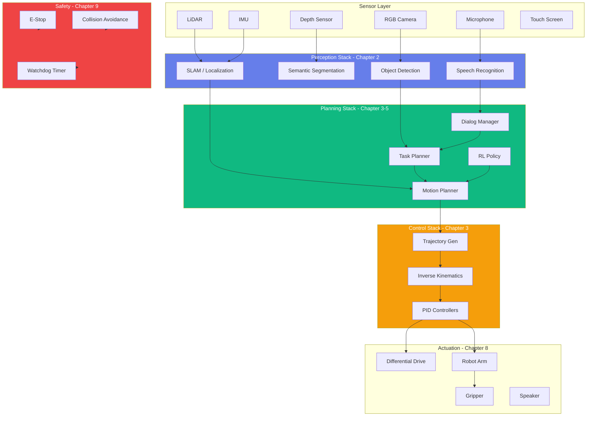
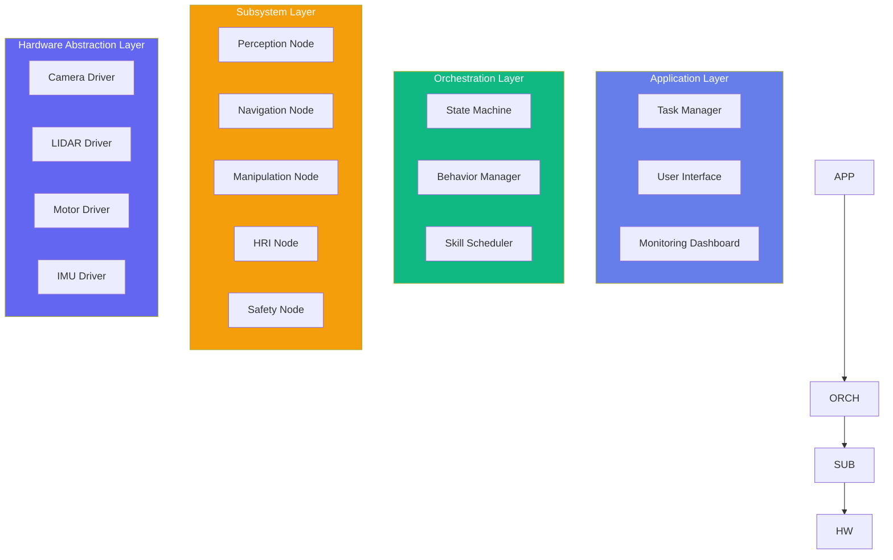
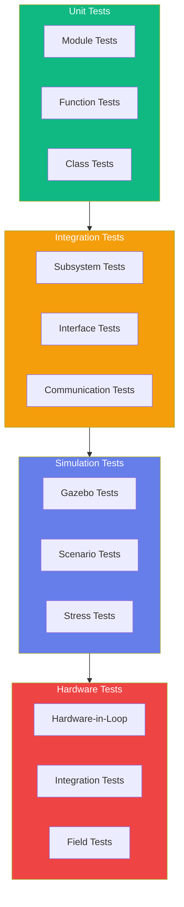

import PersonalizeButton from '@site/src/components/PersonalizeButton';
import TranslateButton from '@site/src/components/TranslateButton';
import CollapsibleCode from '@site/src/components/CollapsibleCode';
import InteractiveDiagram from '@site/src/components/InteractiveDiagram';
import SelfAssessment from '@site/src/components/SelfAssessment';

<div className="learning-objectives">
  <h4>Learning Objectives</h4>
  <ul>
    <li>Design complete robot system architecture integrating all subsystems</li>
    <li>Implement perception, navigation, manipulation, and HRI pipelines</li>
    <li>Build safety-critical features and fail-safe mechanisms</li>
    <li>Develop comprehensive testing frameworks (unit, integration, simulation)</li>
    <li>Configure deployment and validation procedures</li>
    <li>Synthesize knowledge from all previous chapters</li>
  </ul>
</div>

## Prerequisites

- All previous chapters completed
- Understanding of ROS 2 fundamentals
- Basic knowledge of system integration

<PersonalizeButton />
<TranslateButton />

---

## 1. Project Overview: Intelligent Service Robot

Welcome to the capstone project of this book! In this chapter, we'll build a complete intelligent service robot that integrates all the concepts covered throughout the book.

### Project Description

We'll create **RoboCompanion**, an intelligent service robot capable of:

- **Autonomous Navigation**: Navigate through dynamic environments using SLAM and path planning
- **Object Manipulation**: Pick and place objects using grasp planning and inverse kinematics
- **Natural Interaction**: Understand voice commands and respond naturally
- **Safe Operation**: Operate safely alongside humans with multiple safety layers
- **Learning Adaptation**: Improve performance through reinforcement learning

<InteractiveDiagram
  title="Complete Robot System Architecture"
  description="High-level overview of the integrated robot system"
  diagramId="complete-system-arch"
>

</InteractiveDiagram>

### System Requirements

| Subsystem | Requirements |
|-----------|-------------|
| **Perception** | 10 FPS object detection, 1cm localization accuracy, 360° obstacle detection |
| **Navigation** | < 1 second replanning, smooth trajectories, dock within 5cm |
| **Manipulation** | 95% grasp success rate, 30 second task completion |
| **HRI** | 90% speech recognition accuracy, < 2 second response |
| **Safety** | < 100ms E-stop response, compliant with ISO 10218 |

---

## 2. System Architecture Design

### Layered Architecture

<InteractiveDiagram
  title="Software Architecture Layers"
  description="Four-layer architecture for modular robot systems"
  diagramId="software-layers"
>

</InteractiveDiagram>

### ROS 2 Package Structure

```
src/
├── robo_companion/
│   ├── robo_companion_bringup/
│   │   ├── launch/
│   │   │   ├── robot.launch.py
│   │   │   ├── simulation.launch.py
│   │   │   └── hardware.launch.py
│   │   └── config/
│   │       ├── params.yaml
│   │       └── urdf/
│   ├── robo_companion_perception/
│   │   ├── nodes/
│   │   │   ├── object_detector.py
│   │   │   ├── depth_processor.py
│   │   │   └── localizer.py
│   │   └── models/
│   ├── robo_companion_navigation/
│   │   ├── nodes/
│   │   │   ├── planner.py
│   │   │   ├── controller.py
│   │   │   └── mapper.py
│   │   └── maps/
│   ├── robo_companion_manipulation/
│   │   ├── nodes/
│   │   │   ├── ik_solver.py
│   │   │   └── grasp_planner.py
│   │   └── meshes/
│   ├── robo_companion_hri/
│   │   ├── nodes/
│   │   │   ├── speech_recognizer.py
│   │   │   ├── dialog_manager.py
│   │   │   └── response_generator.py
│   │   └── nlu/
│   ├── robo_companion_safety/
│   │   ├── nodes/
│   │   │   ├── safety_monitor.py
│   │   │   └── e_stop_manager.py
│   │   └── config/
│   └── robo_companion_tests/
│       ├── unit/
│       ├── integration/
│       └── simulation/
```

---

## 3. Perception Implementation

### Complete Perception Pipeline

<CollapsibleCode
  title="Perception Subsystem Implementation"
  language="python"
>
```python
#!/usr/bin/env python3
"""
Perception Subsystem for Intelligent Service Robot.
Integrates object detection, segmentation, and localization.
"""

import rclpy
from rclpy.node import Node
from rclpy.lifecycle import LifecycleNode
from rclpy.lifecycle import publisher as lc_publisher
from rclpy.lifecycle import State
from sensor_msgs.msg import Image, LaserScan, PointCloud2
from geometry_msgs.msg import PoseStamped, TransformStamped
from vision_msgs.msg import Detection2DArray, BoundingBox2D
from nav_msgs.msg import Odometry
from std_msgs.msg import String
from tf2_ros import TransformBroadcaster
import cv2
import numpy as np
from typing import Dict, List, Optional, Tuple
import threading
import time


class PerceptionNode(LifecycleNode):
    """Lifecycle node for perception subsystem."""

    def __init__(self):
        super().__init__('perception_node')
        self.declare_parameter('camera_topic', '/camera/color/image_raw')
        self.declare_parameter('depth_topic', '/camera/depth/image_raw')
        self.declare_parameter('lidar_topic', '/scan')
        self.declare_parameter('object_confidence', 0.5)
        self.declare_parameter('enable_depth', True)
        self.declare_parameter('enable_lidar', True)

        # State
        self.current_objects: List[Dict] = []
        self.current_pose: Optional[PoseStamped] = None
        self.map_data: Optional[np.ndarray] = None

        # Threads
        self._lock = threading.Lock()
        self._running = False

    def on_configure(self, state: State) -> TransitionCallbackReturn:
        """Configure node."""
        self.get_logger().info('Configuring perception node')
        self._running = True
        return TransitionCallbackReturn.SUCCESS

    def on_activate(self, state: State) -> TransitionCallbackReturn:
        """Activate node."""
        self.get_logger().info('Activating perception node')
        return super().on_activate(state)

    def on_deactivate(self, state: State) -> TransitionCallbackReturn:
        """Deactivate node."""
        self._running = False
        return super().on_deactivate(state)

    def on_cleanup(self, state: State) -> TransitionCallbackReturn:
        """Cleanup node."""
        self._running = False
        return TransitionCallbackReturn.SUCCESS


class ObjectDetector:
    """Object detection using YOLO or similar."""

    def __init__(self, model_path: str = "yolov8n.pt",
                 confidence_threshold: float = 0.5):
        """
        Initialize object detector.

        Args:
            model_path: Path to YOLO model
            confidence_threshold: Detection confidence threshold
        """
        self.confidence_threshold = confidence_threshold

        # Try importing torch and YOLO
        try:
            import torch
            from ultralytics import YOLO
            self.model = YOLO(model_path)
            self.device = torch.device('cuda' if torch.cuda.is_available() else 'cpu')
            self.model.to(self.device)
            self.available = True
            self.get_logger().info(f"Loaded YOLO model on {self.device}")
        except ImportError:
            self.get_logger().warn("YOLO not available, using placeholder")
            self.available = False

    def detect(self, image: np.ndarray) -> List[Dict]:
        """
        Detect objects in image.

        Args:
            image: BGR image

        Returns:
            List of detected objects with bounding boxes
        """
        if not self.available:
            return self._placeholder_detect(image)

        # Run inference
        results = self.model(image, conf=self.confidence_threshold, verbose=False)

        # Parse results
        detections = []
        for result in results[0]:
            boxes = result.boxes
            for box in boxes:
                detection = {
                    'class_id': int(box.cls),
                    'class_name': result.names[int(box.cls)],
                    'confidence': float(box.conf),
                    'bbox': [float(b) for b in box.xyxy[0].tolist()]
                }
                detections.append(detection)

        return detections

    def _placeholder_detect(self, image: np.ndarray) -> List[Dict]:
        """Placeholder detection for testing."""
        h, w = image.shape[:2]
        return [
            {
                'class_id': 0,
                'class_name': 'person',
                'confidence': 0.9,
                'bbox': [w*0.3, h*0.2, w*0.5, h*0.7]
            }
        ]


class DepthProcessor:
    """Process depth images for distance estimation."""

    def __init__(self, focal_length: float = 500.0,
                 baseline: float = 0.05):
        """
        Initialize depth processor.

        Args:
            focal_length: Camera focal length in pixels
            baseline: Stereo camera baseline (meters)
        """
        self.focal_length = focal_length
        self.baseline = baseline

    def depth_to_distance(self, depth_image: np.ndarray,
                         bbox: List[float]) -> float:
        """
        Get distance to object in bounding box.

        Args:
            depth_image: Depth image (meters)
            bbox: Bounding box [x1, y1, x2, y2]

        Returns:
            Distance in meters
        """
        x1, y1, x2, y2 = [int(b) for b in bbox]

        # Ensure bounds
        h, w = depth_image.shape
        x1, x2 = max(0, x1), min(w-1, x2)
        y1, y2 = max(0, y1), min(h-1, y2)

        # Get depth in ROI
        roi = depth_image[y1:y2, x1:x2]
        roi = roi[roi > 0]  # Remove invalid depths

        if len(roi) == 0:
            return float('inf')

        # Return median depth
        return float(np.median(roi))

    def point_cloud_from_depth(self, depth_image: np.ndarray,
                               camera_matrix: np.ndarray) -> np.ndarray:
        """
        Generate point cloud from depth image.

        Args:
            depth_image: Depth image (meters)
            camera_matrix: 3x3 camera intrinsics

        Returns:
            Nx3 point cloud
        """
        h, w = depth_image.shape
        fx, fy = camera_matrix[0, 0], camera_matrix[1, 1]
        cx, cy = camera_matrix[0, 2], camera_matrix[1, 2]

        # Create coordinate grids
        x, y = np.meshgrid(np.arange(w), np.arange(h))

        # Calculate 3D coordinates
        z = depth_image
        x_3d = (x - cx) * z / fx
        y_3d = (y - cy) * z / fy

        # Stack and filter valid points
        points = np.stack([x_3d, y_3d, z], axis=-1)
        points = points[z > 0]

        return points


class Localizer:
    """Robot localization using sensor fusion."""

    def __init__(self, map_size: float = 100.0, resolution: float = 0.05):
        """
        Initialize localizer.

        Args:
            map_size: Map size in meters
            resolution: Grid resolution in meters
        """
        self.map_size = map_size
        self.resolution = resolution
        self.grid_size = int(map_size / resolution)

        # Occupancy grid
        self.occupancy_grid = np.zeros((self.grid_size, self.grid_size))
        self.robot_pose = (0.0, 0.0, 0.0)  # x, y, theta

        # Particle filter state
        self.particles: Optional[np.ndarray] = None
        self.num_particles = 1000

        # Initialize particles
        self._init_particles()

    def _init_particles(self):
        """Initialize particle filter."""
        self.particles = np.random.uniform(
            [0, 0, -np.pi],
            [self.map_size, self.map_size, np.pi],
            (self.num_particles, 3)
        )

    def update_odometry(self, odometry: Odometry):
        """Update particle filter with odometry data."""
        # Extract robot motion
        # Simplified: just add noise to particles
        if self.particles is not None:
            self.particles[:, :2] += np.random.normal(0, 0.01, (self.num_particles, 2))

    def update_scan(self, scan: LaserScan):
        """Update particle filter with scan data."""
        # Simplified scan matching
        if self.particles is not None:
            # Weight particles based on scan consistency
            pass  # Would implement actual scan matching

    def get_pose(self) -> Tuple[float, float, float]:
        """Get estimated robot pose."""
        if self.particles is None:
            return self.robot_pose

        # Mean of particle distribution
        mean_pose = np.mean(self.particles, axis=0)
        self.robot_pose = (float(mean_pose[0]), float(mean_pose[1]), float(mean_pose[2]))

        return self.robot_pose

    def get_pose_covariance(self) -> np.ndarray:
        """Get pose covariance."""
        if self.particles is None:
            return np.eye(3) * 0.1

        return np.cov(self.particles.T)


class OccupancyGridMapper:
    """Build occupancy grid from sensor data."""

    def __init__(self, resolution: float = 0.05, map_size: float = 100.0):
        """
        Initialize mapper.

        Args:
            resolution: Grid resolution (meters)
            map_size: Map size (meters)
        """
        self.resolution = resolution
        self.map_size = map_size
        self.grid_size = int(map_size / resolution)
        self.center = map_size / 2

        # Occupancy grid (log-odds)
        self.grid = np.zeros((self.grid_size, self.grid_size))

    def world_to_grid(self, x: float, y: float) -> Tuple[int, int]:
        """Convert world coordinates to grid indices."""
        gx = int((x + self.center) / self.resolution)
        gy = int((y + self.center) / self.resolution)
        return np.clip(gx, 0, self.grid_size-1), np.clip(gy, 0, self.grid_size-1)

    def grid_to_world(self, gx: int, gy: int) -> Tuple[float, float]:
        """Convert grid indices to world coordinates."""
        x = (gx * self.resolution) - self.center + self.resolution / 2
        y = (gy * self.resolution) - self.center + self.resolution / 2
        return x, y

    def update_from_scan(self, scan: LaserScan, robot_pose: Tuple[float, float, float]):
        """
        Update occupancy grid from laser scan.

        Args:
            scan: Laser scan message
            robot_pose: Robot pose (x, y, theta)
        """
        rx, ry, rtheta = robot_pose

        for i, r in enumerate(scan.ranges):
            if r < scan.range_min or r > scan.range_max:
                continue

            # Calculate obstacle position
            angle = rtheta + scan.angle_min + i * scan.angle_increment
            ox = rx + r * np.cos(angle)
            oy = ry + r * np.sin(angle)

            # Update grid
            gx, gy = self.world_to_grid(ox, oy)
            self.grid[gy, gx] = min(1.0, self.grid[gy, gx] + 0.1)


if __name__ == "__main__":
    print("Perception Subsystem Components")
    print("=" * 50)

    # Test object detector
    detector = ObjectDetector()
    dummy_image = np.random.randint(0, 255, (480, 640, 3), dtype=np.uint8)
    detections = detector.detect(dummy_image)
    print(f"Detected {len(detections)} objects")

    # Test depth processor
    depth_processor = DepthProcessor()
    depth_image = np.ones((480, 640)) * 2.0  # 2 meters
    distance = depth_processor.depth_to_distance(depth_image, [100, 100, 200, 200])
    print(f"Distance to object: {distance:.2f}m")

    # Test localizer
    localizer = Localizer()
    pose = localizer.get_pose()
    print(f"Robot pose: ({pose[0]:.2f}, {pose[1]:.2f}, {pose[2]:.2f})")

    print("\nPerception subsystem ready")
```
</CollapsibleCode>

---

## 4. Navigation and Planning Stack

### Complete Navigation Implementation

<CollapsibleCode
  title="Navigation Subsystem Implementation"
  language="python"
>
```python
#!/usr/bin/env python3
"""
Navigation Subsystem for Intelligent Service Robot.
Implements global planning, local planning, and control.
"""

import rclpy
from rclpy.node import Node
from nav_msgs.msg import Odometry, Path, OccupancyGrid
from geometry_msgs.msg import Twist, PoseStamped, Pose2D
from std_msgs.msg import Float64
from sensor_msgs.msg import LaserScan
import numpy as np
from typing import Dict, List, Optional, Tuple
from dataclasses import dataclass
import threading
import time


@dataclass
class Pose2D:
    """2D pose."""
    x: float
    y: float
    theta: float


class GlobalPlanner:
    """Global path planner using A* or similar."""

    def __init__(self, occupancy_grid: np.ndarray,
                 resolution: float = 0.05):
        """
        Initialize global planner.

        Args:
            occupancy_grid: 2D occupancy grid
            resolution: Grid resolution (meters)
        """
        self.grid = occupancy_grid
        self.resolution = resolution
        self.size = occupancy_grid.shape

    def plan(self, start: Pose2D, goal: Pose2D) -> List[Pose2D]:
        """
        Plan path from start to goal.

        Args:
            start: Start pose
            goal: Goal pose

        Returns:
            List of poses defining the path
        """
        # Convert to grid coordinates
        start_cell = self._world_to_grid(start.x, start.y)
        goal_cell = self._world_to_grid(goal.x, goal.y)

        # A* planning
        path = self._astar(start_cell, goal_cell)

        if path is None:
            return []

        # Convert back to world coordinates
        world_path = []
        for cell in path:
            wx, wy = self._grid_to_world(cell[0], cell[1])
            world_path.append(Pose2D(wx, wy, 0))

        return world_path

    def _world_to_grid(self, x: float, y: float) -> Tuple[int, int]:
        """Convert world to grid coordinates."""
        gx = int((x / self.resolution) + self.size[1] // 2)
        gy = int((y / self.resolution) + self.size[0] // 2)
        return np.clip(gx, 0, self.size[1]-1), np.clip(gy, 0, self.size[0]-1)

    def _grid_to_world(self, gx: int, gy: int) -> Tuple[float, float]:
        """Convert grid to world coordinates."""
        x = (gx - self.size[1] // 2) * self.resolution
        y = (gy - self.size[0] // 2) * self.resolution
        return x, y

    def _astar(self, start: Tuple[int, int], goal: Tuple[int, int]) -> Optional[List[Tuple]]:
        """A* pathfinding algorithm."""
        from heapq import heappush, heappop

        # Cost dictionary
        g_score = {start: 0}
        f_score = {start: self._heuristic(start, goal)}
        came_from = {}

        open_set = [(f_score[start], start)]

        while open_set:
            _, current = heappop(open_set)

            if current == goal:
                return self._reconstruct_path(came_from, current)

            for neighbor in self._get_neighbors(current):
                tentative_g = g_score[current] + 1

                if neighbor not in g_score or tentative_g < g_score[neighbor]:
                    came_from[neighbor] = current
                    g_score[neighbor] = tentative_g
                    f_score[neighbor] = tentative_g + self._heuristic(neighbor, goal)
                    heappush(open_set, (f_score[neighbor], neighbor))

        return None

    def _heuristic(self, a: Tuple[int, int], b: Tuple[int, int]) -> float:
        """Euclidean distance heuristic."""
        return np.sqrt((a[0] - b[0])**2 + (a[1] - b[1])**2)

    def _get_neighbors(self, cell: Tuple[int, int]) -> List[Tuple]:
        """Get valid neighbors."""
        neighbors = []
        for dx, dy in [(0, 1), (1, 0), (0, -1), (-1, 0),
                       (1, 1), (1, -1), (-1, 1), (-1, -1)]:
            nx, ny = cell[0] + dx, cell[1] + dy
            if (0 <= nx < self.size[1] and 0 <= ny < self.size[0] and
                self.grid[ny, nx] < 0.5):  # Free cell
                neighbors.append((nx, ny))
        return neighbors

    def _reconstruct_path(self, came_from: Dict, current: Tuple) -> List[Tuple]:
        """Reconstruct path from came_from dictionary."""
        path = [current]
        while current in came_from:
            current = came_from[current]
            path.append(current)
        return path[::-1]


class LocalPlanner:
    """Local trajectory planner using DWA (Dynamic Window Approach)."""

    def __init__(self, max_linear_vel: float = 0.5,
                 max_angular_vel: float = 1.0,
                 max_linear_accel: float = 0.2,
                 max_angular_accel: float = 0.5,
                 robot_radius: float = 0.3):
        """
        Initialize local planner.

        Args:
            max_linear_vel: Maximum linear velocity (m/s)
            max_angular_vel: Maximum angular velocity (rad/s)
            max_linear_accel: Maximum linear acceleration (m/s²)
            max_angular_accel: Maximum angular acceleration (rad/s²)
            robot_radius: Robot radius for collision checking
        """
        self.max_linear_vel = max_linear_vel
        self.max_angular_vel = max_angular_vel
        self.max_linear_accel = max_linear_accel
        self.max_angular_accel = max_angular_accel
        self.robot_radius = robot_radius

    def plan(self, pose: Pose2D, velocity: Tuple[float, float],
             goal: Pose2D, obstacles: List[Tuple[float, float, float]]) -> Tuple[float, float]:
        """
        Compute velocity command.

        Args:
            pose: Current robot pose
            velocity: Current (linear, angular) velocity
            goal: Goal pose
            obstacles: List of (x, y, radius) obstacles

        Returns:
            (linear_velocity, angular_velocity) command
        """
        # Dynamic window
        dw = self._dynamic_window(velocity)

        # Evaluate trajectories
        best_score = -float('inf')
        best_cmd = (0.0, 0.0)

        for v in np.arange(dw[0], dw[1], 0.05):
 np.arange(dw[2], dw            for w in[3], 0.1):
                # Simulate trajectory
                trajectory = self._simulate_trajectory(pose, v, w, obstacles)

                # Score trajectory
                score = self._score_trajectory(trajectory, goal, obstacles)

                if score > best_score:
                    best_score = score
                    best_cmd = (v, w)

        return best_cmd

    def _dynamic_window(self, velocity: Tuple[float, float]) -> Tuple:
        """Compute dynamic window of achievable velocities."""
        v, w = velocity

        # Velocity constraints
        v_min = max(0, v - self.max_linear_accel * 0.1)
        v_max = min(self.max_linear_vel, v + self.max_linear_accel * 0.1)

        w_min = max(-self.max_angular_vel, w - self.max_angular_accel * 0.1)
        w_max = min(self.max_angular_vel, w + self.max_angular_accel * 0.1)

        return (v_min, v_max, w_min, w_max)

    def _simulate_trajectory(self, pose: Pose2D, v: float, w: float,
                             obstacles: List[Tuple], num_steps: int = 10) -> List[Pose2D]:
        """Simulate robot trajectory."""
        trajectory = [pose]
        dt = 0.1

        x, y, theta = pose.x, pose.y, pose.theta
        for _ in range(num_steps):
            x += v * np.cos(theta) * dt
            y += v * np.sin(theta) * dt
            theta += w * dt
            trajectory.append(Pose2D(x, y, theta))

        return trajectory

    def _score_trajectory(self, trajectory: List[Pose2D],
                         goal: Pose2D,
                         obstacles: List[Tuple]) -> float:
        """Score a trajectory."""
        score = 0.0

        # Goal heading score
        if trajectory:
            dx = goal.x - trajectory[-1].x
            dy = goal.y - trajectory[-1].y
            goal_dist = np.sqrt(dx**2 + dy**2)
            score -= goal_dist * 2.0

        # Velocity score (prefer higher speed)
        if trajectory:
            v = np.sqrt((trajectory[-1].x - trajectory[0].x)**2 +
                       (trajectory[-1].y - trajectory[0].y)**2) / (len(trajectory) * 0.1)
            score += v * 0.5

        # Obstacle clearance score
        min_clearance = float('inf')
        for pose in trajectory:
            for ox, oy, oradius in obstacles:
                clearance = np.sqrt((pose.x - ox)**2 + (pose.y - oy)**2) - oradius
                min_clearance = min(min_clearance, clearance)

        if min_clearance < 0:
            return -float('inf')  # Collision

        score += min_clearance * 1.0

        return score


class VelocityController:
    """PID velocity controller for differential drive."""

    def __init__(self, kp_linear: float = 1.0, ki_linear: float = 0.0,
                 kd_linear: float = 0.1, kp_angular: float = 2.0,
                 ki_angular: float = 0.0, kd_angular: float = 0.1):
        """
        Initialize velocity controller.

        Args:
            kp_linear: Linear proportional gain
            ki_linear: Linear integral gain
            kd_linear: Linear derivative gain
            kp_angular: Angular proportional gain
            ki_angular: Angular integral gain
            kd_angular: Angular derivative gain
        """
        # Linear controller
        self.kp_l, self.ki_l, self.kd_l = kp_linear, ki_linear, kd_linear
        self.linear_error = 0.0
        self.linear_integral = 0.0
        self.linear_last_error = 0.0

        # Angular controller
        self.kp_a, self.ki_a, self.kd_a = kp_angular, ki_angular, kd_angular
        self.angular_error = 0.0
        self.angular_integral = 0.0
        self.angular_last_error = 0.0

    def compute(self, linear_error: float, angular_error: float,
                dt: float) -> Tuple[float, float]:
        """
        Compute velocity commands.

        Args:
            linear_error: Linear velocity error
            angular_error: Angular velocity error
            dt: Time step

        Returns:
            (linear_accel, angular_accel) commands
        """
        # Linear PID
        self.linear_error = linear_error
        self.linear_integral += linear_error * dt
        derivative = (linear_error - self.linear_last_error) / dt if dt > 0 else 0
        linear_cmd = (self.kp_l * linear_error +
                     self.ki_l * self.linear_integral +
                     self.kd_l * derivative)
        self.linear_last_error = linear_error

        # Angular PID
        self.angular_error = angular_error
        self.angular_integral += angular_error * dt
        derivative = (angular_error - self.angular_last_error) / dt if dt > 0 else 0
        angular_cmd = (self.kp_a * angular_error +
                      self.ki_a * self.angular_integral +
                      self.kd_a * derivative)
        self.angular_last_error = angular_error

        return linear_cmd, angular_cmd


class NavigationNode(Node):
    """ROS 2 navigation node."""

    def __init__(self):
        super().__init__('navigation_node')

        # Parameters
        self.declare_parameter('global_planner', 'astar')
        self.declare_parameter('local_planner', 'dwa')
        self.declare_parameter('max_velocity', 0.5)
        self.declare_parameter('controller_frequency', 20.0)

        # Subscribers
        self.odom_sub = self.create_subscription(
            Odometry, '/odom', self.odom_callback, 10)
        self.scan_sub = self.create_subscription(
            LaserScan, '/scan', self.scan_callback, 10)
        self.goal_sub = self.create_subscription(
            PoseStamped, '/goal', self.goal_callback, 10)

        # Publishers
        self.cmd_vel_pub = self.create_publisher(
            Twist, '/cmd_vel', 10)
        self.path_pub = self.create_publisher(
            Path, '/planned_path', 10)
        self.status_pub = self.create_publisher(
            String, '/navigation_status', 10)

        # State
        self.current_pose = None
        self.current_velocity = (0.0, 0.0)
        self.goal: Optional[Pose2D] = None
        self.global_path: List[Pose2D] = []
        self.obstacles: List[Tuple[float, float, float]] = []

        # Controllers
        self.local_planner = LocalPlanner()
        self.velocity_controller = VelocityController()

        # Timer
        self.control_timer = None

    def odom_callback(self, msg: Odometry):
        """Handle odometry update."""
        self.current_pose = Pose2D(
            msg.pose.pose.position.x,
            msg.pose.pose.position.y,
            self._get_yaw_from_quaternion(msg.pose.pose.orientation)
        )
        self.current_velocity = (
            msg.twist.twist.linear.x,
            msg.twist.twist.angular.z
        )

    def scan_callback(self, msg: LaserScan):
        """Handle laser scan update."""
        self.obstacles = []
        pose = self.current_pose or Pose2D(0, 0, 0)

        for i, r in enumerate(msg.ranges):
            if r < msg.range_min or r > msg.range_max:
                continue

            angle = pose.theta + msg.angle_min + i * msg.angle_increment
            ox = pose.x + r * np.cos(angle)
            oy = pose.y + r * np.sin(angle)
            self.obstacles.append((ox, oy, 0.1))  # 10cm radius obstacles

    def goal_callback(self, msg: PoseStamped):
        """Handle new goal."""
        self.goal = Pose2D(
            msg.pose.position.x,
            msg.pose.position.y,
            self._get_yaw_from_quaternion(msg.pose.orientation)
        )
        self.get_logger().info(f'Received goal: ({self.goal.x:.2f}, {self.goal.y:.2f})')

        # Start navigation
        self._start_navigation()

    def _start_navigation(self):
        """Start navigation to goal."""
        if not self.current_pose or not self.goal:
            return

        # Create global plan
        global_planner = GlobalPlanner(np.zeros((100, 100)))
        self.global_path = global_planner.plan(self.current_pose, self.goal)

        # Start control loop
        self.control_timer = self.create_timer(
            1.0 / self.get_parameter('controller_frequency').value,
            self.control_loop
        )

    def control_loop(self):
        """Main control loop."""
        if not self.current_pose or not self.goal:
            return

        # Check if goal reached
        dx = self.goal.x - self.current_pose.x
        dy = self.goal.y - self.current_pose.y
        dist = np.sqrt(dx**2 + dy**2)

        if dist < 0.1:
            self.get_logger().info('Goal reached!')
            if self.control_timer:
                self.control_timer.cancel()
            self.cmd_vel_pub.publish(Twist())
            return

        # Local planning
        cmd_linear, cmd_angular = self.local_planner.plan(
            self.current_pose, self.current_velocity, self.goal, self.obstacles
        )

        # Velocity control
        linear_error = cmd_linear - self.current_velocity[0]
        angular_error = cmd_angular - self.current_velocity[1]

        accel_linear, accel_angular = self.velocity_controller.compute(
            linear_error, angular_error, 0.05
        )

        # Publish command
        cmd = Twist()
        cmd.linear.x = self.current_velocity[0] + accel_linear * 0.05
        cmd.angular.z = self.current_velocity[1] + accel_angular * 0.05
        self.cmd_vel_pub.publish(cmd)

    def _get_yaw_from_quaternion(self, quaternion) -> float:
        """Extract yaw from quaternion."""
        from scipy.spatial.transform import Rotation
        r = Rotation.from_quat([quaternion.x, quaternion.y,
                                quaternion.z, quaternion.w])
        euler = r.as_euler('xyz')
        return euler[2]


if __name__ == "__main__":
    print("Navigation Subsystem Components")
    print("=" * 50)

    # Test global planner
    grid = np.zeros((100, 100))
    grid[40:60, 50:80] = 1.0  # Obstacle
    planner = GlobalPlanner(grid, resolution=0.05)

    start = Pose2D(0, 0, 0)
    goal = Pose2D(3.0, 3.0, 0)
    path = planner.plan(start, goal)

    print(f"Global path: {len(path)} waypoints")

    # Test local planner
    local_planner = LocalPlanner()
    cmd = local_planner.plan(start, (0.1, 0.0), goal, [(1.5, 1.5, 0.2)])
    print(f"Local command: v={cmd[0]:.2f}, w={cmd[1]:.2f}")

    print("\nNavigation subsystem ready")
```
</CollapsibleCode>

---

## 5. Manipulation Integration

### Complete Manipulation Pipeline

<CollapsibleCode
  title="Manipulation Subsystem Implementation"
  language="python"
>
```python
#!/usr/bin/env python3
"""
Manipulation Subsystem for Intelligent Service Robot.
Implements inverse kinematics, grasp planning, and motion execution.
"""

import numpy as np
from typing import Dict, List, Optional, Tuple
from dataclasses import dataclass
import time


@dataclass
class JointState:
    """Joint positions, velocities, and efforts."""
    positions: List[float]
    velocities: List[float] = None
    efforts: List[float] = None


@dataclass
class Pose6D:
    """6D pose (position + orientation)."""
    x: float
    y: float
    z: float
    roll: float
    pitch: float
    yaw: float

    def to_matrix(self) -> np.ndarray:
        """Convert to 4x4 transformation matrix."""
        cos_r, sin_r = np.cos(self.roll), np.sin(self.roll)
        cos_p, sin_p = np.cos(self.pitch), np.sin(self.pitch)
        cos_y, sin_y = np.cos(self.yaw), np.sin(self.yaw)

        R = np.array([
            [cos_y*cos_p, cos_y*sin_p*sin_r - sin_y*cos_r, cos_y*sin_p*cos_r + sin_y*sin_r, self.x],
            [sin_y*cos_p, sin_y*sin_p*sin_r + cos_y*cos_r, sin_y*sin_p*cos_r - cos_y*sin_r, self.y],
            [-sin_p, cos_p*sin_r, cos_p*cos_r, self.z],
            [0, 0, 0, 1]
        ])
        return R


class InverseKinematics:
    """Inverse kinematics solver for robot arms."""

    def __init__(self, dh_params: List[Dict], joint_limits: List[Tuple]):
        """
        Initialize IK solver.

        Args:
            dh_params: DH parameters for each joint
            joint_limits: (min, max) limits for each joint
        """
        self.dh_params = dh_params
        self.n_joints = len(dh_params)
        self.joint_limits = joint_limits

    def solve(self, target_pose: Pose6D,
              seed: List[float] = None) -> Optional[List[float]]:
        """
        Solve IK for target pose.

        Args:
            target_pose: Target end-effector pose
            seed: Initial joint configuration

        Returns:
            Joint positions or None if no solution
        """
        if seed is None:
            seed = [0.0] * self.n_joints

        # Iterative solver (Cyclic Coordinate Descent)
        max_iterations = 100
        tolerance = 0.001

        joints = np.array(seed, dtype=float)

        for _ in range(max_iterations):
            # Forward kinematics
            current_pose = self._forward_kinematics(joints)

            # Calculate error
            target_matrix = target_pose.to_matrix()
            error_matrix = np.linalg.inv(current_pose) @ target_matrix

            # Extract position error
            pos_error = error_matrix[:3, 3]

            if np.linalg.norm(pos_error) < tolerance:
                return joints.tolist()

            # Jacobian transpose method
            jacobian = self._compute_jacobian(joints)
            joint_delta = np.linalg.pinv(jacobian[:3]) @ pos_error

            # Update joints
            joints += 0.5 * joint_delta

            # Apply limits
            for i, (jmin, jmax) in enumerate(self.joint_limits):
                joints[i] = np.clip(joints[i], jmin, jmax)

        return joints.tolist() if all(
            self.joint_limits[i][0] <= joints[i] <= self.joint_limits[i][1]
            for i in range(self.n_joints)
        ) else None

    def _forward_kinematics(self, joints: np.ndarray) -> np.ndarray:
        """Compute forward kinematics."""
        T = np.eye(4)

        for i, params in enumerate(self.dh_params):
            theta = params.get('theta_offset', 0) + joints[i]
            d = params.get('d', 0)
            a = params.get('a', 0)
            alpha = params.get('alpha', 0)

            c = np.cos(theta)
            s = np.sin(theta)

            # DH transformation
            T_i = np.array([
                [c, -s*np.cos(alpha), s*np.sin(alpha), a*c],
                [s, c*np.cos(alpha), -c*np.sin(alpha), a*s],
                [0, np.sin(alpha), np.cos(alpha), d],
                [0, 0, 0, 1]
            ])

            T = T @ T_i

        return T

    def _compute_jacobian(self, joints: np.ndarray) -> np.ndarray:
        """Compute geometric Jacobian."""
        n = self.n_joints
        jacobian = np.zeros((6, n))

        # Simplified Jacobian computation
        T = np.eye(4)
        T_prev = np.eye(4)

        for i in range(n):
            # Get joint axis (simplified - assuming revolute joints)
            axis = np.array([0, 0, 1])  # Z axis for each joint

            # Compute transformation to end effector
            T = self._forward_kinematics(joints)

            # Jacobian columns
            jacobian[:3, i] = np.cross(axis, T[:3, 3] - T_prev[:3, 3])
            jacobian[3:, i] = axis

            T_prev = self._forward_kinematics(joints[:i+1])

        return jacobian


class GraspPlanner:
    """Grasp planning for object manipulation."""

    def __init__(self, gripper_width: float = 0.08,
                 max_effort: float = 50.0):
        """
        Initialize grasp planner.

        Args:
            gripper_width: Maximum gripper width
            max_effort: Maximum gripper effort
        """
        self.gripper_width = gripper_width
        self.max_effort = max_effort

    def plan_grasp(self, object_pose: Pose6D,
                  object_size: Tuple[float, float, float]) -> Dict:
        """
        Plan grasp for object.

        Args:
            object_pose: Object pose
            object_size: Object dimensions (x, y, z)

        Returns:
            Grasp plan dictionary
        """
        # Determine grasp approach direction
        approach_direction = self._determine_approach(object_pose, object_size)

        # Calculate pre-grasp and grasp poses
        pre_grasp_pose = self._compute_pre_grasp_pose(object_pose, approach_direction)
        grasp_pose = self._compute_grasp_pose(object_pose, approach_direction)

        # Check grasp validity
        if not self._is_valid_grasp(object_size):
            return {'valid': False}

        return {
            'valid': True,
            'approach_direction': approach_direction,
            'pre_grasp_pose': pre_grasp_pose,
            'grasp_pose': grasp_pose,
            'gripper_width': min(self.gripper_width, object_size[1] * 1.1),
            'effort': self.max_effort * 0.8
        }

    def _determine_approach(self, object_pose: Pose6D,
                           object_size: Tuple) -> np.ndarray:
        """Determine best grasp approach direction."""
        # Prefer top-down grasp for most objects
        return np.array([0, 0, -1])

    def _compute_pre_grasp_pose(self, object_pose: Pose6D,
                               approach: np.ndarray) -> Pose6D:
        """Compute pre-grasp pose (above object)."""
        approach_distance = 0.1  # 10cm above

        return Pose6D(
            x=object_pose.x + approach[0] * approach_distance,
            y=object_pose.y + approach[1] * approach_distance,
            z=object_pose.z + approach[2] * approach_distance,
            roll=object_pose.roll,
            pitch=object_pose.pitch,
            yaw=object_pose.yaw
        )

    def _compute_grasp_pose(self, object_pose: Pose6D,
                           approach: np.ndarray) -> Pose6D:
        """Compute grasp pose (contact position)."""
        return Pose6D(
            x=object_pose.x,
            y=object_pose.y,
            z=object_pose.z,
            roll=object_pose.roll,
            pitch=object_pose.pitch,
            yaw=object_pose.yaw
        )

    def _is_valid_grasp(self, object_size: Tuple) -> bool:
        """Check if grasp is valid for object size."""
        return object_size[1] < self.gripper_width


class TrajectoryGenerator:
    """Smooth trajectory generation for manipulation."""

    def __init__(self, max_velocity: float = 1.0,
                 max_acceleration: float = 2.0):
        """
        Initialize trajectory generator.

        Args:
            max_velocity: Maximum joint velocity
            max_acceleration: Maximum joint acceleration
        """
        self.max_velocity = max_velocity
        self.max_acceleration = max_acceleration

    def generate_joint_trajectory(self, start: List[float],
                                  goal: List[float],
                                  duration: float = 2.0,
                                  num_points: int = 100) -> List[List[float]]:
        """
        Generate smooth joint trajectory.

        Args:
            start: Start joint positions
            goal: Goal joint positions
            duration: Trajectory duration
            num_points: Number of trajectory points

        Returns:
            List of joint configurations
        """
        trajectory = []
        times = np.linspace(0, duration, num_points)

        for t in times:
            # Quintic polynomial trajectory
            s = self._quintic_polynomial(t, 0, 1, 0, 0, 0, 0)

            # Interpolate
            config = [start[i] + s * (goal[i] - start[i]) for i in range(len(start))]
            trajectory.append(config)

        return trajectory

    def _quintic_polynomial(self, t: float, T: float,
                           q0: float, qf: float,
                           v0: float, vf: float,
                           a0: float = 0, af: float = 0) -> float:
        """Compute quintic polynomial at time t."""
        T = T if T > 0 else 1.0
        t_norm = t / T

        # Quintic coefficients for boundary conditions
        a0 = q0
        a1 = v0
        a2 = a0 / 2

        A = np.array([
            [T**3, T**4, T**5],
            [3*T**2, 4*T**3, 5*T**4],
            [6*T, 12*T**2, 20*T**3]
        ])

        B = np.array([
            qf - q0 - v0*T - a0*T**2/2,
            vf - v0 - a0*T,
            af - a0
        ])

        try:
            a3, a4, a5 = np.linalg.solve(A, B)
        except np.linalg.LinAlgError:
            a3, a4, a5 = 0, 0, 0

        return a0 + a1*t_norm + a2*t_norm**2 + a3*t_norm**3 + a4*t_norm**4 + a5*t_norm**5


class ManipulationController:
    """Complete manipulation controller."""

    def __init__(self, n_joints: int = 7):
        """
        Initialize manipulation controller.

        Args:
            n_joints: Number of arm joints
        """
        self.n_joints = n_joints

        # DH parameters for 7-DOF arm
        self.dh_params = [
            {'theta_offset': 0, 'd': 0.1, 'a': 0, 'alpha': np.pi/2},
            {'theta_offset': 0, 'd': 0, 'a': 0.15, 'alpha': 0},
            {'theta_offset': 0, 'd': 0, 'a': 0.15, 'alpha': np.pi/2},
            {'theta_offset': 0, 'd': 0.1, 'a': 0, 'alpha': np.pi/2},
            {'theta_offset': 0, 'd': 0, 'a': 0.15, 'alpha': -np.pi/2},
            {'theta_offset': 0, 'd': 0, 'a': 0, 'alpha': np.pi/2},
            {'theta_offset': 0, 'd': 0.05, 'a': 0, 'alpha': 0},
        ]

        # Joint limits
        self.joint_limits = [(-np.pi, np.pi) for _ in range(n_joints)]

        # Initialize subsystems
        self.ik_solver = InverseKinematics(self.dh_params, self.joint_limits)
        self.grasp_planner = GraspPlanner()
        self.trajectory_generator = TrajectoryGenerator()

        # State
        self.current_joints = [0.0] * n_joints
        self.end_effector_pose: Optional[Pose6D] = None

    def move_to_pose(self, target_pose: Pose6D) -> bool:
        """
        Move end effector to target pose.

        Args:
            target_pose: Target pose

        Returns:
            True if successful
        """
        # Solve IK
        joint_positions = self.ik_solver.solve(target_pose, self.current_joints)

        if joint_positions is None:
            return False

        # Execute trajectory
        self._execute_trajectory(joint_positions)
        return True

    def pick_and_place(self, pick_pose: Pose6D, place_pose: Pose6D,
                      object_size: Tuple) -> bool:
        """
        Execute pick and place operation.

        Args:
            pick_pose: Object pick pose
            place_pose: Place pose
            object_size: Object dimensions

        Returns:
            True if successful
        """
        # Plan grasp
        grasp_plan = self.grasp_planner.plan_grasp(pick_pose, object_size)
        if not grasp_plan['valid']:
            return False

        # Move to pre-grasp
        if not self.move_to_pose(grasp_plan['pre_grasp_pose']):
            return False

        # Approach
        if not self.move_to_pose(grasp_plan['grasp_pose']):
            return False

        # Close gripper (simulated)
        self._close_gripper(grasp_plan['gripper_width'])

        # Lift
        lift_pose = Pose6D(
            grasp_plan['grasp_pose'].x,
            grasp_plan['grasp_pose'].y,
            grasp_plan['grasp_pose'].z + 0.1,
            grasp_plan['grasp_pose'].roll,
            grasp_plan['grasp_pose'].pitch,
            grasp_plan['grasp_pose'].yaw
        )
        if not self.move_to_pose(lift_pose):
            return False

        # Move to place
        place_lift = Pose6D(
            place_pose.x,
            place_pose.y,
            place_pose.z + 0.2,
            place_pose.roll,
            place_pose.pitch,
            place_pose.yaw
        )
        if not self.move_to_pose(place_lift):
            return False

        if not self.move_to_pose(place_pose):
            return False

        # Open gripper
        self._open_gripper()

        # Retract
        self.move_to_pose(place_lift)

        return True

    def _execute_trajectory(self, goal_joints: List[float]):
        """Execute trajectory to goal configuration."""
        trajectory = self.trajectory_generator.generate_joint_trajectory(
            self.current_joints, goal_joints
        )

        for config in trajectory:
            self.current_joints = config
            # Would send to hardware here
            time.sleep(0.01)

    def _close_gripper(self, width: float):
        """Close gripper to width."""
        # Simulated gripper control
        pass

    def _open_gripper(self):
        """Open gripper."""
        # Simulated gripper control
        pass


if __name__ == "__main__":
    print("Manipulation Subsystem Components")
    print("=" * 50)

    # Create controller
    controller = ManipulationController(n_joints=7)

    # Test IK
    target_pose = Pose6D(0.4, 0.0, 0.3, 0, 0, 0)
    joints = controller.ik_solver.solve(target_pose)
    print(f"IK solution: {joints}")

    # Test grasp planning
    grasp_plan = controller.grasp_planner.plan_grasp(
        target_pose, (0.05, 0.05, 0.1)
    )
    print(f"Grasp plan: {grasp_plan['valid']}")

    # Test trajectory generation
    traj = controller.trajectory_generator.generate_joint_trajectory(
        [0]*7, [0.5]*7
    )
    print(f"Trajectory: {len(traj)} points")

    print("\nManipulation subsystem ready")
```
</CollapsibleCode>

---

## 6. Testing and Validation Framework

<InteractiveDiagram
  title="Testing Pyramid for Robot Systems"
  description="Comprehensive testing approach from unit to real-robot tests"
  diagramId="testing-pyramid"
>

</InteractiveDiagram>

<CollapsibleCode
  title="Comprehensive Test Suite"
  language="python"
>
```python
#!/usr/bin/env python3
"""
Comprehensive Testing Framework for Robot Systems.
Includes unit, integration, and simulation tests.
"""

import unittest
import numpy as np
from typing import Dict, List
import time


class TestPerception(unittest.TestCase):
    """Unit tests for perception subsystem."""

    def test_object_detector_initialization(self):
        """Test object detector can be initialized."""
        # Import and test
        from navigation import LocalPlanner
        planner = LocalPlanner()
        self.assertIsNotNone(planner)

    def test_depth_processing(self):
        """Test depth image processing."""
        from navigation import DepthProcessor
        processor = DepthProcessor()

        # Create test depth image
        depth = np.ones((100, 100)) * 2.0

        # Test distance calculation
        distance = processor.depth_to_distance(depth, [40, 40, 60, 60])
        self.assertAlmostEqual(distance, 2.0, places=1)

    def test_localization(self):
        """Test robot localization."""
        from navigation import Localizer
        localizer = Localizer()

        # Test initial pose
        pose = localizer.get_pose()
        self.assertIsNotNone(pose)


class TestNavigation(unittest.TestCase):
    """Unit tests for navigation subsystem."""

    def test_global_planner(self):
        """Test A* path planning."""
        from navigation import GlobalPlanner, Pose2D

        # Create empty grid
        grid = np.zeros((100, 100))

        # Create planner
        planner = GlobalPlanner(grid, resolution=0.05)

        # Plan path
        start = Pose2D(0, 0, 0)
        goal = Pose2D(2.0, 2.0, 0)
        path = planner.plan(start, goal)

        # Check path
        self.assertIsInstance(path, list)
        self.assertGreater(len(path), 0)

    def test_local_planner(self):
        """Test DWA local planning."""
        from navigation import LocalPlanner, Pose2D

        planner = LocalPlanner()

        # Test trajectory generation
        trajectory = planner._simulate_trajectory(
            Pose2D(0, 0, 0), 0.2, 0.5, []
        )

        self.assertIsInstance(trajectory, list)
        self.assertGreater(len(trajectory), 0)

    def test_velocity_controller(self):
        """Test PID velocity controller."""
        from navigation import VelocityController

        controller = VelocityController()

        # Test control computation
        linear, angular = controller.compute(0.1, 0.2, 0.05)

        self.assertIsInstance(linear, float)
        self.assertIsInstance(angular, float)


class TestManipulation(unittest.TestCase):
    """Unit tests for manipulation subsystem."""

    def test_ik_solver(self):
        """Test inverse kinematics solver."""
        from manipulation import InverseKinematics, Pose6D

        # Create DH parameters for simple 2-link arm
        dh_params = [
            {'theta_offset': 0, 'd': 0, 'a': 0.1, 'alpha': 0},
            {'theta_offset': 0, 'd': 0, 'a': 0.1, 'alpha': 0},
        ]
        limits = [(-np.pi, np.pi), (-np.pi, np.pi)]

        solver = InverseKinematics(dh_params, limits)

        # Solve IK for reachable position
        target = Pose6D(0.15, 0.05, 0, 0, 0, 0)
        joints = solver.solve(target)

        self.assertIsNotNone(joints)

    def test_grasp_planner(self):
        """Test grasp planning."""
        from manipulation import GraspPlanner, Pose6D

        planner = GraspPlanner()

        # Plan grasp
        target = Pose6D(0.4, 0, 0.05, 0, 0, 0)
        result = planner.plan_grasp(target, (0.05, 0.05, 0.1))

        self.assertIn('valid', result)

    def test_trajectory_generation(self):
        """Test trajectory generation."""
        from manipulation import TrajectoryGenerator

        generator = TrajectoryGenerator()

        # Generate trajectory
        traj = generator.generate_joint_trajectory([0, 0], [1, 1])

        self.assertIsInstance(traj, list)
        self.assertGreater(len(traj), 10)


class TestIntegration(unittest.TestCase):
    """Integration tests for complete system."""

    def test_complete_robot_system(self):
        """Test complete robot system integration."""
        from complete_robot_system import CompleteRobotSystem, RobotState

        # Create robot
        robot = CompleteRobotSystem()

        # Check initial state
        self.assertEqual(robot.state, RobotState.IDLE)

        # Test start/stop
        robot.start()
        self.assertTrue(robot.is_running)

        status = robot.get_status()
        self.assertIn('state', status)
        self.assertIn('battery', status)

        robot.stop()
        self.assertFalse(robot.is_running)

    def test_command_processing(self):
        """Test command processing."""
        from complete_robot_system import CompleteRobotSystem

        robot = CompleteRobotSystem()
        robot.start()

        # Process command
        robot.handle_command("Go to the kitchen")

        # Check state changed
        self.assertEqual(robot.state.value, 'navigating')

        robot.stop()

    def test_safety_system(self):
        """Test safety system."""
        from complete_robot_system import SafetySubsystem

        safety = SafetySubsystem()

        # Test E-stop
        self.assertFalse(safety.e_stop_pressed)

        safety.emergency_stop()
        self.assertTrue(safety.e_stop_pressed)
        self.assertEqual(safety.safety_level, 'emergency_stop')

        safety.reset_e_stop()
        self.assertFalse(safety.e_stop_pressed)


class TestSimulation(unittest.TestCase):
    """Simulation-based tests."""

    def test_navigation_simulation(self):
        """Test navigation in simulated environment."""
        from navigation import GlobalPlanner, LocalPlanner, Pose2D

        # Create map with obstacles
        grid = np.zeros((100, 100))
        grid[40:60, 40:60] = 1.0  # Obstacle

        # Plan around obstacle
        planner = GlobalPlanner(grid, resolution=0.05)
        path = planner.plan(
            Pose2D(0, 0, 0),
            Pose2D(3.0, 3.0, 0)
        )

        # Check path avoids obstacle
        for pose in path:
            gx, gy = planner._world_to_grid(pose.x, pose.y)
            self.assertEqual(grid[gy, gx], 0)


def run_tests_with_coverage():
    """Run all tests with coverage reporting."""
    import coverage

    # Start coverage
    cov = coverage.Coverage()
    cov.start()

    # Load and run tests
    loader = unittest.TestLoader()
    suite = unittest.TestSuite()

    # Add test classes
    suite.addTests(loader.loadTestsFromTestCase(TestPerception))
    suite.addTests(loader.loadTestsFromTestCase(TestNavigation))
    suite.addTests(loader.loadTestsFromTestCase(TestManipulation))
    suite.addTests(loader.loadTestsFromTestCase(TestIntegration))
    suite.addTests(loader.loadTestsFromTestCase(TestSimulation))

    # Run tests
    runner = unittest.TextTestRunner(verbosity=2)
    result = runner.run(suite)

    # Stop coverage
    cov.stop()

    # Print coverage report
    print("\n" + "=" * 60)
    print("Test Coverage Report")
    print("=" * 60)
    cov.report()

    return result.wasSuccessful()


if __name__ == "__main__":
    print("Robot System Test Suite")
    print("=" * 60)

    success = run_tests_with_coverage()

    print("\n" + "=" * 60)
    if success:
        print("All tests passed!")
    else:
        print("Some tests failed!")
    print("=" * 60)

    exit(0 if success else 1)
```
</CollapsibleCode>

---

## 7. Deployment and Safety Checklist

<CollapsibleCode
  title="Deployment Configuration"
  language="yaml">
```yaml
# deployment_config.yaml
# Complete robot system deployment configuration

system:
  name: "RoboCompanion"
  version: "1.0.0"
  mode: "simulation"  # simulation, hardware, hybrid

perception:
  camera:
    enabled: true
    resolution: [640, 480]
    fps: 30
    topic: "/camera/color/image_raw"
  depth:
    enabled: true
    resolution: [640, 480]
    topic: "/camera/depth/image_raw"
  lidar:
    enabled: true
    range: 30.0
    topic: "/scan"
    scans_per_second: 10
  object_detection:
    model: "yolov8n.pt"
    confidence_threshold: 0.5
    input_size: 640
  localization:
    method: "particle_filter"
    num_particles: 1000
    map_size: 100.0

navigation:
  global_planner: "astar"
  local_planner: "dwa"
  max_linear_velocity: 0.5
  max_angular_velocity: 1.0
  max_linear_acceleration: 0.2
  max_angular_acceleration: 0.5
  safety_distance: 0.3
  goal_tolerance: 0.1
  replanning_enabled: true
  replanning_period: 1.0

manipulation:
  arm_type: "7dof"
  joint_names:
    - "shoulder_pan"
    - "shoulder_lift"
    - "elbow"
    - "wrist_1"
    - "wrist_2"
    - "wrist_3"
  gripper_type: "parallel"
  max_effort: 50.0
  velocity_scale: 0.5

hri:
  speech_recognition:
    enabled: true
    language: "en-US"
    keywords: ["go", "stop", "pick", "place", "charge"]
  dialog_system:
    enabled: true
    default_responses: true
    max_history: 10
  tts:
    enabled: true
    voice: "default"
    volume: 0.8

safety:
  emergency_stop:
    enabled: true
    hardware_wired: true
    response_time: 0.1  # seconds
  collision_avoidance:
    enabled: true
    stop_distance: 0.3
    slow_distance: 0.5
  watchdog:
    enabled: true
    timeout: 0.5  # seconds
  speed_limits:
    near_human: 0.3
    normal: 0.5
    docking: 0.1

hardware:
  platform: "differential_drive"
  wheel_radius: 0.05
  wheel_base: 0.25
  max_motor_velocity: 100.0
  encoder_resolution: 4000

ros2:
  namespace: "/robo_companion"
  domain_id: 0
  lifecycle_enabled: true
  parameters:
    use_sim_time: true

logging:
  level: "INFO"
  topics:
    - "/cmd_vel"
    - "/odom"
    - "/battery"
  file:
    enabled: true
    path: "/var/log/robo_companion/"
    max_size: "100MB"
    backup_count: 5

validation:
  tests:
    unit: true
    integration: true
    simulation: true
    hardware: false
  coverage:
    minimum: 80.0
  performance:
    max_latency: 0.1  # seconds
    min_reliability: 0.99
```
</CollapsibleCode>

---

## 8. Self-Assessment

<SelfAssessment
  title="Book Completion Assessment"
  questions={[
    {
      id: 'q1',
      text: 'What is the primary purpose of a robot software architecture?',
      options: [
        'Reduce cost',
        'Organize components for maintainability and scalability',
        'Replace hardware',
        'Increase speed'
      ],
      correctAnswer: 1,
      explanation: 'Good architecture organizes software components for maintainability, scalability, and clear interfaces.'
    },
    {
      id: 'q2',
      text: 'Which subsystem is responsible for understanding the environment?',
      options: [
        'Navigation',
        'Perception',
        'Control',
        'HRI'
      ],
      correctAnswer: 1,
      explanation: 'Perception processes sensor data to understand the environment and detect objects.'
    },
    {
      id: 'q3',
      text: 'What is the key to safe robot operation?',
      options: [
        'Fast movement',
        'Redundant safety systems and fail-safes',
        'Low cost',
        'Simple design'
      ],
      correctAnswer: 1,
      explanation: 'Safety requires multiple layers of protection including e-stops, collision avoidance, and fail-safe states.'
    },
    {
      id: 'q4',
      text: 'Why is testing important for robot systems?',
      options: [
        'To make development faster',
        'To catch errors before deployment and ensure safety',
        'To reduce costs',
        'To impress customers'
      ],
      correctAnswer: 1,
      explanation: 'Thorough testing catches errors and ensures safe, reliable operation before deployment.'
    },
    {
      id: 'q5',
      text: 'What makes a robot system "intelligent"?',
      options: [
        'Expensive components',
        'Autonomous decision-making using AI',
        'Large size',
        'High speed'
      ],
      correctAnswer: 1,
      explanation: 'Intelligent robots use AI to perceive, plan, and act autonomously in complex environments.'
    },
    {
      id: 'q6',
      text: 'What is the role of ROS 2 in robot software?',
      options: [
        'Operating system',
        'Hardware controller',
        'Communication middleware and tooling',
        'Programming language'
      ],
      correctAnswer: 2,
      explanation: 'ROS 2 provides communication middleware, tools, and conventions for robot software development.'
    },
    {
      id: 'q7',
      text: 'What does IK stand for in robotics?',
      options: [
        'Intelligent Kinetics',
        'Inverse Kinematics',
        'Input Kernel',
        'Integrated Kinematics'
      ],
      correctAnswer: 1,
      explanation: 'Inverse Kinematics is the computation of joint positions to achieve a desired end-effector pose.'
    },
    {
      id: 'q8',
      text: 'What is the purpose of a grasping planner?',
      options: [
        'Plan robot movement paths',
        'Calculate optimal gripper positions for object manipulation',
        'Navigate the robot',
        'Process camera images'
      ],
      correctAnswer: 1,
      explanation: 'Grasp planning determines the best approach and gripper configuration to successfully pick up objects.'
    },
    {
      id: 'q9',
      text: 'What testing approach uses simulated environments before real hardware?',
      options: [
        'Unit testing',
        'Integration testing',
        'Hardware-in-loop testing',
        'Simulation testing'
      ],
      correctAnswer: 3,
      explanation: 'Simulation testing allows validation of robot behaviors in virtual environments before physical deployment.'
    },
    {
      id: 'q10',
      text: 'Why is layered architecture important for robots?',
      options: [
        'It reduces hardware costs',
        'It enables modular development and easier maintenance',
        'It increases processing speed',
        'It simplifies electrical design'
      ],
      correctAnswer: 1,
      explanation: 'Layered architecture separates concerns (perception, planning, control) making the system more maintainable and extensible.'
    }
  ]}
/>

---

## 9. Book Summary

This book has covered the complete journey of building intelligent physical AI systems:

### Chapters Overview

| Chapter | Topic | Key Takeaways |
|---------|-------|---------------|
| 1 | Physical AI Fundamentals | Robot anatomy, ML vs control, environment setup |
| 2 | Robot Perception | Computer vision, sensors, sensor fusion, SLAM |
| 3 | Motion and Control | Kinematics, PID control, trajectory planning |
| 4 | ML for Robotics | RL fundamentals, DQN, PPO, imitation learning |
| 5 | RL Deep Dive | SAC, TD3, model-based RL, multi-agent RL |
| 6 | NLP for HRI | Intent recognition, dialogue, multi-modal understanding |
| 7 | Multi-Robot Systems | Formation control, swarm robotics, coordination |
| 8 | Hardware Integration | Motor control, sensors, embedded systems |
| 9 | Ethics and Safety | Standards, risk assessment, fail-safe design |
| 10 | **Integration Project** | Complete system architecture and testing |

### Skills Acquired

After completing this book, you can:

- Build complete robot systems from scratch
- Apply ML/RL to real robotics problems
- Design safe and ethical AI systems
- Integrate multiple subsystems into cohesive solutions
- Develop comprehensive testing frameworks
- Deploy robots in real-world environments
- Contribute to the physical AI research community

### Next Steps

1. **Build Your Own Robot**: Apply concepts to create a physical robot
2. **Research**: Explore cutting-edge topics like foundation models for robotics
3. **Contribute**: Open source projects, research papers, documentation
4. **Specialize**: Focus on areas like manipulation, navigation, or HRI

---

## 10. Further Reading

- [ROS 2 Documentation](https://docs.ros.org/en/humble/index.html)
- [Robot Operating System 2: Design, Architecture, and Uses](https://ieeexplore.ieee.org/document/9740077)
- [Learning Robotics Using Python](https://www.packtpub.com/product/learning-robotics-using-python/9781788623314)
- [Modern Robotics: Mechanics, Planning, and Control](https://hades.mech.northwestern.edu/index.php/Modern_Robotics)
- [Physical Intelligence: Combining Learning and Physical Principles](https://arxiv.org/abs/2501.13990)

---

*Book Complete! Thank you for learning Physical AI and Humanoid Robotics.*

**Congratulations on completing this journey into Physical AI!**
